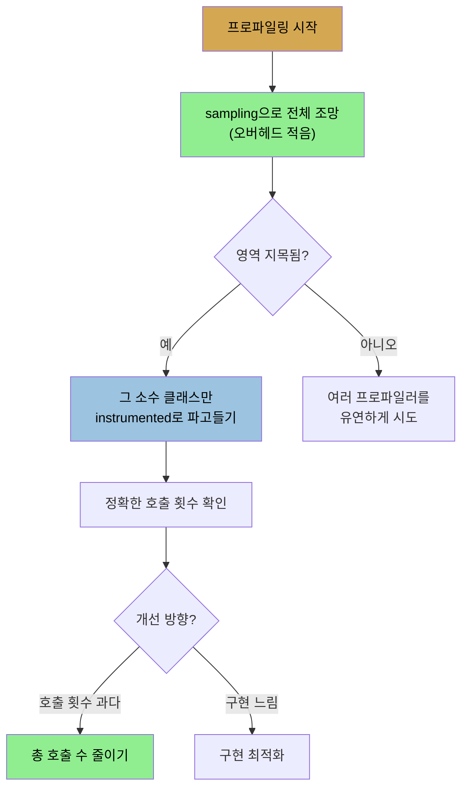

# 프로파일러 — sampling·instrumented·native
> 프로파일러는 가장 중요한 도구지만 추정일 뿐이며, 프로파일의 top 메서드가 아니라 그것이 가리키는 영역을 최적화해야 합니다

[앞 편](./03-02.JDK%20기본%20도구와%20VM%20정보·튜닝%20플래그.md)이 JVM 기본 정보 도구였다면, 이 편은 성능 분석가 도구함에서 가장 중요한 프로파일러입니다. Java용 프로파일러는 많고 각각 장단점이 있습니다. 프로파일링은 서로 다른 도구를 쓰는 게 합리적인 영역입니다. 특히 sampling 프로파일러는 이슈를 다르게 보여 줘, 어떤 애플리케이션에서는 한 도구가 다른 도구보다 문제를 더 잘 짚습니다.

많은 Java 프로파일링 도구가 그 자체로 Java로 작성되어, 프로파일할 애플리케이션에 소켓이나 JVM Tool Interface(JVMTI)로 "붙어" 동작합니다. 그래서 프로파일링 도구도 다른 Java 애플리케이션처럼 튜닝해야 합니다. 특히 대상 애플리케이션이 크면 많은 데이터를 도구로 보내므로 도구의 힙이 충분히 커야 하고, 시점 안 맞는 full GC가 데이터 버퍼를 넘치게 할 수 있어 concurrent GC로 돌리는 게 좋습니다.

## 1. sampling 프로파일러와 sampling 오차
> 타이머가 주기 발화해 실행 중 메서드를 기록하며, 번갈아 실행되는 메서드는 한쪽만 잡히는 오차가 있습니다

프로파일링은 sampling 모드와 instrumented 모드 둘 중 하나입니다. **sampling 모드가 기본이고 오버헤드가 가장 적습니다.** 이게 중요한 이유는, 측정을 도입하는 것 자체가 애플리케이션의 성능 특성을 바꾸기 때문입니다. 프로파일링 영향을 제한하면 평소 거동에 더 가까운 결과를 얻습니다.

다만 sampling 프로파일러는 온갖 오차를 겪습니다. sampling 프로파일러는 타이머가 주기적으로 발화할 때 각 스레드가 어느 메서드를 실행 중인지 보고, 그 메서드가 타이머가 직전 발화한 이래 실행돼 온 것으로 청구합니다. **가장 흔한 오차**는 이렇습니다. 한 스레드가 `methodA`와 `methodB`를 번갈아 실행하는데, 타이머가 우연히 `methodB`에 있을 때만 발화하면 프로파일은 모든 시간을 `methodB`에 쓴 것으로 보고합니다. 실제로는 `methodA`에 더 많은 시간을 썼는데도 말입니다. 이 오차를 줄이는 방법은 더 긴 기간 동안 프로파일하고 샘플 간격을 줄이는 것이지만, 간격을 줄이면 프로파일링 영향 최소화 목표와 어긋납니다. 여기 균형이 있고, 프로파일링 도구마다 이 균형을 다르게 풀어 한 도구가 다른 도구와 꽤 다른 데이터를 보고하기도 합니다.

## 2. safepoint bias와 async profiler
> Java 프로파일러는 스레드가 safepoint에 있을 때만 스택을 잡아 편향이 생기며, async profiler가 이를 우회합니다

이런 오차는 모든 sampling 프로파일러에 내재하지만, **많은 Java 프로파일러(특히 오래된 것)에서는 더 나쁩니다. safepoint bias 때문입니다.** Java의 흔한 프로파일러 인터페이스에서, 프로파일러는 스레드가 safepoint에 있을 때만 스택 트레이스를 얻을 수 있습니다. 스레드는 다음일 때 자동으로 safepoint에 들어갑니다.

1. synchronized 락에 블록
2. I/O 대기로 블록
3. monitor 대기로 블록
4. park 상태
5. JNI 코드 실행 (GC locking 기능을 수행하지 않는 한)

또 JVM은 스레드에 safepoint로 가라고 요청하는 플래그를 세울 수 있고, 이를 확인하는 코드가 특정 메모리 할당이나 컴파일된 코드의 루프·메서드 전환 같은 핵심 위치에 삽입됩니다. 언제 safepoint 확인이 일어나는지는 명세가 없고 릴리스마다 다릅니다. 이 safepoint bias가 sampling 프로파일러에 주는 영향은 깊습니다. 스택을 safepoint에서만 샘플링할 수 있어, `methodA`가 결코 safepoint에 안 가면 모든 일이 `methodB`에 청구되는 시나리오가 쉽게 보입니다.

**Java 8은 도구가 스택 트레이스를 모으는 다른 방법을 제공합니다.** `AsyncGetCallTrace` 인터페이스입니다. 이를 쓰는 프로파일러를 async profiler라 부릅니다. 여기서 async는 JVM이 스택 정보를 제공하는 방식을 가리키지 도구 동작과는 무관합니다. JVM이 스레드가 (동기) safepoint에 오기를 기다리지 않고 어느 시점에든 스택을 줄 수 있어 async입니다. 이 인터페이스를 쓰면 다른 sampling 프로파일러보다 sampling artifact가 적습니다(여전히 앞의 번갈아 실행 오차는 겪습니다). 이 인터페이스는 Java 8에서 공개됐지만 그 전부터 private 인터페이스로 존재했습니다.

저자의 sampling 프로파일 예는 2장의 REST 서버(주식 객체의 압축·직렬화 형태를 바이트 스트림으로 반환)를 잰 것입니다. Oracle Developer Studio 프로파일러(async 인터페이스 사용)로 보면, CPU 사이클을 가장 많이 쓴 메서드가 보입니다. 여럿이 객체 직렬화(`ObjectOutputStream.writeObject0()`)와 데이터 계산(`Math.pow()`)에 관련됩니다.

## 3. top 메서드가 아니라 영역을 최적화하라
> writeObject0 자체는 JDK라 못 고치고, 그것이 가리키는 직렬화 영역을 개선해야 합니다

저자가 강조하는 핵심 원칙입니다. 위 예에서 개선해야 할 것은 **직렬화의 성능이지 `writeObject0()` 메서드 자체의 성능이 아닙니다.** 프로파일을 볼 때 흔한 가정은 프로파일 top 메서드를 최적화해야 한다는 것이지만, 그 접근은 너무 제한적입니다. `writeObject0()`은 JDK의 일부라 JVM을 다시 쓰지 않는 한 성능을 못 올립니다. 그러나 프로파일에서 직렬화 경로가 병목임을 압니다. **그래서 프로파일의 top 메서드는 최적화를 찾을 영역을 가리키는 지도로 써야 합니다.** 성능 엔지니어는 JVM 메서드를 빠르게 만들려 하지 않고, 객체 직렬화 전반을 빠르게 할 방법을 찾습니다.

sampling 출력은 두 가지로 더 시각화할 수 있고, 둘 다 콜 스택을 시각적으로 보여 줍니다. 새로운 접근은 **flame graph**로, 애플리케이션 안 콜 스택의 인터랙티브 다이어그램입니다. flame graph는 CPU를 가장 많이 쓰는 메서드의 상향식 다이어그램입니다. 예를 들어 `getStockObject()` 메서드가 모든 시간을 쓰고, 그중 약 60%가 `writeObject()` 호출, 40%가 `StockPriceHistoryImpl` 생성자에 쓰입니다. 각 메서드의 스택을 위로 읽어 병목을 찾습니다. 더 오래됐지만 여전히 유용한 접근은 **call tree**로, 하향식입니다. 100% 시간 중 44%를 `Errors.process()`와 그 자손이 썼다는 식으로 시작해, 부모로 드릴다운하며 자식이 어디에 시간을 쓰는지 봅니다(예: `getStockObject()`에 쓴 17% 중 10%가 `writeObject0`, 7%가 생성자).

요약하면, sampling 기반 프로파일러가 가장 흔하고, 성능 영향이 적어 측정 artifact가 적으며, 비동기 스택 수집을 쓰는 sampling 프로파일러는 artifact가 더 적습니다. 서로 다른 sampling 프로파일러는 다르게 거동해, 각각 특정 애플리케이션에 더 나을 수 있습니다.

## 4. instrumented 프로파일러 — 정확한 호출 횟수
> 바이트코드를 바꿔 호출 횟수를 정확히 세지만 침습적이라, 소수 클래스에만 2차 분석으로 씁니다

**instrumented 프로파일러는 sampling보다 훨씬 침습적이지만, 프로그램 내부에서 일어나는 일에 대해 더 유익한 정보를 줍니다.** instrumented 프로파일러는 클래스가 로드될 때 바이트코드 시퀀스를 바꿔(호출을 세는 코드 삽입 등) 동작합니다. sampling보다 성능 차이를 도입할 가능성이 훨씬 큽니다. 예를 들어 JVM은 작은 메서드를 인라인(4장)해 호출이 필요 없게 하는데, 코드를 어떻게 instrument하느냐에 따라 더는 인라인 대상이 안 될 수 있습니다. 그러면 instrumented 프로파일러가 특정 메서드의 기여를 과대평가합니다. 인라인은 컴파일러가 코드 레이아웃에 따라 내리는 결정의 한 예일 뿐이고, 코드를 많이 instrument할수록 실행 프로파일이 바뀔 가능성이 큽니다.

이 때문에 **instrumentation은 소수 클래스에 한정하는 게 좋습니다.** 즉 2차 분석에 적합합니다. sampling 프로파일러가 패키지나 코드 영역을 가리키면, 그 코드를 instrumented 프로파일러로 파고듭니다. 저자가 같은 REST 서버를 instrumented 프로파일러로 본 예에서 몇 가지가 다릅니다. 첫째, 지배 시간이 `writeObject()`에 청구됩니다(private 메서드 `writeObject0()`은 instrumentation에서 걸러짐). 둘째, sampling에서는 생성자에 인라인돼 안 보이던 엔티티 매니저 메서드가 새로 나타납니다.

그러나 더 중요한 것은 **호출 횟수**입니다. 그 엔티티 매니저 메서드를 무려 3,300만 번, 난수 계산을 1억 6,600만 번 호출했습니다. **구현을 빠르게 하기보다 이 메서드들의 총 호출 수를 줄이는 게 훨씬 큰 성능 영향**을 주는데, instrumentation 카운트 없이는 그걸 알 수 없습니다. 이게 sampling보다 나은 프로파일일까요? 상황에 따라 다릅니다. instrumented 프로파일의 호출 횟수는 분명히 정확하고, 그 추가 정보가 어디에 시간을 더 쓰는지·무엇을 최적화하는 게 유익한지 정하는 데 흔히 도움이 됩니다. 이 예에서는 둘 다 같은 영역(객체 직렬화)을 가리켰지만, 실무에서는 서로 다른 프로파일러가 완전히 다른 코드 영역을 가리킬 수 있습니다. **프로파일러는 좋은 추정기지만 추정일 뿐이라, 일부는 가끔 틀립니다.**

## 5. blocking 메서드·thread timeline·native 프로파일러
> blocking 메서드는 CPU를 안 써 대개 미보고되며, native 프로파일러는 GC·컴파일러 시간까지 보여 줍니다

`jvisualvm` 내장 프로파일러로 REST 서버를 보면 실행 시간이 `select()` 메서드에 지배됩니다. 그러나 이런 blocking 메서드는 CPU를 쓰지 않아 전체 CPU 사용에 기여하지 않고, 최적화할 수도 없습니다. 스레드는 `select()`에서 673초를 **실행**한 게 아니라 selection 이벤트를 **기다린** 것입니다. 그래서 대부분 프로파일러는 블록된 메서드를 보고하지 않고 그 스레드를 idle로 표시합니다. 이 예에서는 그게 좋습니다. 데이터가 서버로 안 흘러 `select()`에서 기다리는 정상 상태이기 때문입니다.

다른 경우엔 blocking 호출 시간을 보고 싶습니다. 스레드가 `wait()`에서 다른 스레드 notify를 기다리는 시간은 많은 애플리케이션의 전체 실행 시간을 좌우합니다. 대부분 Java 프로파일러는 이런 blocking 호출을 표시·숨기는 필터를 가집니다. 다만 blocking 메서드에 청구된 시간보다 **스레드의 실행 패턴을 보는 게 더 유익**합니다. thread timeline은 각 스레드를 가로 영역으로, 메서드 실행을 색 막대로, 비실행을 빈 영역으로 보여 줍니다. 빈 영역은 그 스레드가 다른 스레드를 기다리거나 blocking `read()`를 실행 중일 수 있음을 뜻합니다.

**native 프로파일러**(async-profiler·Oracle Developer Studio)는 Java 코드에 더해 native 코드도 프로파일합니다. 두 이점이 있습니다. 첫째, native 라이브러리·native 메모리 할당 같은 중요한 연산이 native 코드에서 일어납니다(8장에서 native 메모리 할당 이슈를 native 프로파일러로 추적). 둘째, 보통 애플리케이션 코드 병목을 찾으려 프로파일하지만 가끔 native 코드가 뜻밖에 성능을 지배합니다. native를 이해하는 프로파일러는 GC에 시간을 너무 쓰는지(6장은 GC 로그로 확인), 컴파일 스레드(4장)가 CPU를 너무 쓰는지 빠르게 보여 줍니다. 전체 flame graph 바닥에는 애플리케이션 스레드·Java 코드에 더해 GC와 컴파일러가 별도 컴포넌트로 보입니다.

**native 판독 원칙**이 중요합니다. native 프로파일러가 GC가 CPU를 지배한다고 보이면 컬렉터 튜닝이 옳습니다. 그러나 **컴파일 스레드에 상당 시간을 쓴다고 보이면, 그건 보통 애플리케이션 성능에 영향을 주지 않습니다.**

## 자주 받는 오해
> 프로파일의 top 메서드를 최적화해야 한다고 생각하기 쉽지만, 그것이 가리키는 영역을 봐야 합니다

1. "프로파일 top 메서드를 빠르게 만들면 된다"고 생각하기 쉽지만, top 메서드가 JDK의 `writeObject0()`처럼 못 고치는 것일 수 있습니다. top 메서드는 최적화할 영역(직렬화)을 가리키는 지도이고, leaf 메서드만 봐선 안 됩니다.
2. "sampling 프로파일은 정확하다"고 생각하기 쉽지만, 번갈아 실행되는 메서드 중 한쪽만 잡히는 오차와, Java 특유의 safepoint bias가 있습니다. `AsyncGetCallTrace`를 쓰는 async profiler가 safepoint 편향을 줄입니다.
3. "blocking 메서드(select·wait)에 시간이 많이 잡히면 최적화 대상"이라고 생각하기 쉽지만, blocking은 CPU를 안 쓰고 정상 대기인 경우가 많습니다. 메서드에 청구된 시간보다 스레드 실행 패턴(timeline)을 봐야 합니다.
4. "프로파일러가 컴파일 스레드 시간을 크게 보이면 문제"라고 생각하기 쉽지만, 컴파일 스레드 시간은 보통 애플리케이션 성능에 영향을 주지 않습니다. 반면 GC가 CPU를 지배하면 컬렉터 튜닝이 옳습니다.

## 면접에서 받을 만한 질문
1. **sampling 프로파일러와 instrumented 프로파일러의 차이는?** → sampling은 타이머가 주기 발화해 실행 중 메서드를 기록하는 방식으로 오버헤드가 적어 측정 왜곡이 적지만, 번갈아 실행되는 메서드를 놓치는 오차가 있습니다. instrumented는 클래스 로드 시 바이트코드를 바꿔 정확한 호출 횟수를 세지만 침습적이라 인라인 같은 컴파일러 결정을 바꿔 프로파일을 왜곡할 수 있습니다. 그래서 sampling으로 영역을 지목한 뒤 소수 클래스만 instrumented로 파고드는 2차 분석이 권장됩니다.
2. **safepoint bias가 무엇이고 어떻게 해결합니까?** → Java 프로파일러는 보통 스레드가 safepoint(락 블록·I/O·park·JNI 등)에 있을 때만 스택을 샘플링합니다. 그래서 어떤 메서드가 safepoint에 안 가면 그 시간이 다른 메서드에 잘못 청구되는 편향이 생깁니다. Java 8의 `AsyncGetCallTrace` 인터페이스를 쓰는 async profiler는 스레드가 safepoint에 오기를 기다리지 않고 어느 시점에든 스택을 얻어 이 편향을 줄입니다.
3. **프로파일에서 top 메서드가 JDK 내부 메서드면 어떻게 합니까?** → top 메서드 자체(예: `writeObject0()`)는 JDK라 JVM을 다시 쓰지 않는 한 못 고칩니다. 대신 그 메서드가 가리키는 영역(객체 직렬화)이 병목임을 읽고, 그 영역 전반을 빠르게 할 방법을 찾습니다. 프로파일의 top 메서드는 최적화 대상이 아니라 최적화할 영역을 가리키는 지도입니다.
4. **instrumented 프로파일의 호출 횟수가 왜 유용합니까?** → 예를 들어 엔티티 매니저 메서드 3,300만 호출, 난수 계산 1억 6,600만 호출 같은 정확한 카운트를 줍니다. 이런 경우 각 구현을 빠르게 하기보다 총 호출 수를 줄이는 것이 훨씬 큰 성능 개선을 주는데, sampling만으로는 호출 횟수를 알 수 없습니다. 다만 instrumentation은 침습적이라 소수 클래스에만 적용해야 합니다.

## 관련 문서
- [JDK 기본 도구와 VM 정보·튜닝 플래그](./03-02.JDK%20기본%20도구와%20VM%20정보·튜닝%20플래그.md) — JVM 프로파일링 영역의 기본 도구
- [Java Flight Recorder와 JMC](./03-04.Java%20Flight%20Recorder와%20JMC.md) — JVM 내장 경량 분석 도구
- [완전한 성능 이야기 — JVM 밖의 일곱 원칙](./01-02.완전한%20성능%20이야기%20—%20JVM%20밖의%20일곱%20원칙.md) — "흔한 경우 최적화"에서 프로파일 해석 원칙과 이어짐
- [이 책 인덱스 (Java Performance MOC)](./README.md) — 장별 정독 노트 진척
