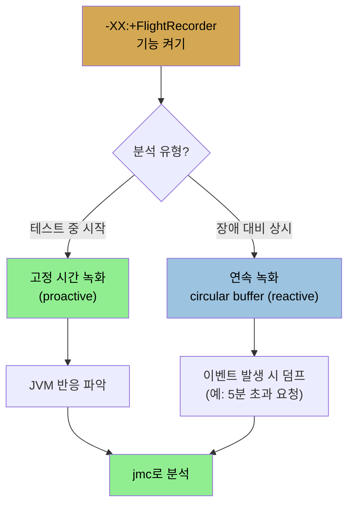

# Java Flight Recorder와 JMC
> JFR은 JVM에 내장돼 다른 도구가 못 주는 가시성을 1% 미만 오버헤드로 주며, Java Mission Control로 그 이벤트를 분석합니다

[앞 편](./03-03.프로파일러%20—%20sampling·instrumented·native.md)이 외부 프로파일러였다면, 이 편은 JVM에 내장된 Java Flight Recorder(JFR)입니다. JFR은 실행 중 애플리케이션의 경량 성능 분석을 수행하는 JVM 기능입니다. 이름이 시사하듯, JFR 데이터는 JVM 안 이벤트의 이력이라 JVM의 과거 성능과 동작을 진단하는 데 씁니다.

## 1. JFR 개요 — 이벤트, circular buffer, 가용성
> 선택된 이벤트를 circular buffer에 저장해 최근 이벤트만 남기며, JDK 11부터 오픈소스 JVM에서도 쓸 수 있습니다

JFR은 원래 BEA Systems의 JRockit JVM 기능이었고, 결국 Oracle HotSpot JVM으로 들어왔습니다. **JDK 8에서는 Oracle JVM만 JFR을 지원하고(Oracle 고객만 라이선스), JDK 11에서는 AdoptOpenJDK를 포함한 오픈소스 JVM에서도 쓸 수 있습니다.** JDK 11에서 오픈소스라, JDK 8로 백포트될 여지도 있습니다(적어도 8u232까지는 아님).

기본 동작은 이렇습니다. 이벤트 집합이 활성화되고(예: 스레드가 락 대기로 블록된 이벤트), 선택된 이벤트가 발생할 때마다 그 데이터가 (메모리나 파일에) 저장됩니다. **데이터 스트림은 circular buffer에 담겨 가장 최근 이벤트만 남습니다.** 그다음 도구로 그 이벤트를 표시하고(라이브 JVM이나 저장 파일에서) 성능 이슈를 진단합니다. 이벤트 종류·버퍼 크기·저장 위치 등은 JVM 인자나 도구(실행 중 `jcmd` 명령 포함)로 제어합니다. **기본 설정에서 JFR은 프로그램 성능의 1% 미만이라는 낮은 오버헤드를 갖습니다.** 더 많은 이벤트를 켜고 보고 임계값을 낮추면 오버헤드가 바뀝니다.

## 2. Java Mission Control과 뷰
> jmc로 JFR 기록을 분석하며, Memory·Code·Event 뷰가 GC·프로파일·이벤트 가시성을 줍니다

JFR 기록을 보는 통상 도구는 **Java Mission Control(jmc)**이고, 다른 도구나 직접 만든 분석 도구도 가능합니다. 풀 오픈소스 JVM으로 가면서 jmc는 OpenJDK 소스에서 별도 프로젝트로 분리됐습니다. JDK 8에는 jmc 5가 Oracle JVM에 번들되고, JDK 11은 jmc 7을 쓸 수 있습니다(지금은 바이너리를 OpenJDK 프로젝트 페이지에서 받아야 함). jmc는 머신의 JVM 프로세스를 표시하고 하나 이상을 골라 모니터하게 합니다. JMX 콘솔을 통해 **선택한 JVM만이 아니라 시스템 전체를 모니터**할 수 있습니다(머신 전체 CPU·메모리·swapping 등). 예를 들어 JVM은 CPU의 38%를 쓰지만 머신 전체 프로세스는 60%를 쓴다는 식으로 둘 다 보입니다.

JFR 기록을 jmc에 로드하면 기본 모니터링 개요가 먼저 보이고, 왼쪽 아이콘들이 애플리케이션 동작 가시성을 줍니다.

1. **Memory 뷰** — young generation이 비워지며 메모리가 규칙적으로 오르내리는 것(예: 힙이 340MB에서 2GB로 증가)과, 기록 중 일어난 모든 GC(지속 시간·종류)를 보여 줍니다. 한 이벤트를 고르면 그 컬렉션의 모든 단계와 각 소요 시간을 분해해 보여 줍니다. reference 객체가 얼마나 지워졌는지, concurrent 컬렉터의 promotion/evacuation 실패 여부, GC 알고리즘 구성(세대 크기·survivor space), 할당된 객체 종류까지 줍니다. G1이 왜 full GC로 빠졌는지(promotion failure?), tenuring threshold를 어떻게 조정했는지 등 GC가 그렇게 동작한 이유를 알려 줍니다(5·6장).
2. **Code 뷰** — 기록의 기본 프로파일링 정보를 보여 줍니다. 첫 탭은 **패키지명 단위 집계**라는, 많은 프로파일러에 없는 흥미로운 기능을 줍니다. hot 메서드·call tree 같은 전통적 프로파일 뷰와, 예외 처리(12장)·컴파일러 동작·code cache(4장) 뷰도 있습니다. 다만 JFR 프로파일 sampling은 (기본 구성에서) 오버헤드를 낮추려 꽤 낮아, 더 침습적인 sampling보다 프로파일이 정확하지 않습니다.
3. **Event 뷰** — 이벤트를 보는 가장 강력한 방법입니다. 왼쪽에서 애플리케이션·JVM 레벨 이벤트를 필터링합니다(이건 후처리 필터링이고, 기록 시점에 어떤 이벤트를 포함할지는 별도). 예를 들어 34초 구간에 JVM 878개·JDK 라이브러리 32개 이벤트가 나오고, 소켓 read가 34초인 게 보이면(10ms 초과 시에만 나타남) Event Log 탭에서 더 봅니다. 알고 보니 여러 스레드가 주기적 관리 요청을 blocking I/O로 읽느라 `read()`에서 오래 블록된 것이라, read 시간이 수용 가능했습니다. 프로파일러처럼 I/O 블록 스레드가 많은 게 정상인지 이슈인지는 직접 판단해야 합니다.

## 3. JFR 이벤트 — JVM이 직접 주는 가시성
> Java 11에 약 131개 이벤트 타입이 있으며, 특정 락에 블록된 스레드나 특정 객체 할당 스택처럼 외부 도구로는 얻기 어려운 정보를 줍니다

JFR 이벤트가 JVM에서 직접 오기에, **다른 어떤 도구도 못 주는 수준의 가시성**을 줍니다. Java 11에서 약 131개 이벤트 타입을 모니터할 수 있습니다. 각 이벤트는 jconsole·jcmd 같은 다른 도구로도 모을 수 있는 기본 정보와, JFR 밖에서는 얻기 어려운 정보를 함께 줍니다.

| 이벤트 타입 | 기본 정보 | JFR만의 정보 |
|-------------|-----------|--------------|
| classloading | 로드·언로드된 클래스 수 | 어느 classloader가 로드, 개별 클래스 로드 시간 |
| thread statistics | 생성·소멸 스레드 수, 스레드 덤프 | 어느 스레드가 어느 락에 블록됐는지 |
| throwables | 사용된 throwable 클래스 | 예외·에러 수와 생성 스택 트레이스 |
| TLAB allocation | 힙 할당 수, TLAB 크기 | 어느 객체가 어디에 할당됐는지(스택) |
| file/socket I/O | I/O 수행 시간 | read/write 호출당 시간, 어느 파일/소켓이 느린지 |
| monitor blocked | monitor 대기 스레드 | 어느 스레드가 어느 monitor에 얼마나 블록됐는지 |
| code cache | code cache 크기·내용량 | 제거된 메서드, code cache 구성 |
| code compilation | 컴파일된 메서드, OSR 컴파일(4장), 컴파일 시간 | JFR 특유는 없으나 여러 소스 정보를 통합 |
| garbage collection | GC 시간(단계별), 세대 크기 | JFR 특유는 없으나 여러 도구 정보를 통합 |
| profiling | instrumenting·sampling 프로파일 | 진짜 프로파일러만큼은 아니나 좋은 고수준 개요 |

JFR은 확장 가능해 애플리케이션이 자체 이벤트를 정의합니다(WebLogic의 JDBC·HTTP 이벤트 등). monitor-blocked 예가 인상적입니다. 9장에서 보듯 락 경합은 두 단계(spin 후 lock inflation)를 거치는데, 표준 프로파일러는 spin 시간만 CPU에 청구하고 native 프로파일러도 inflation 정보가 hit-or-miss입니다. **JVM은 이 데이터를 모두 JFR에 직접 줍니다.**

## 4. JFR 활성화 — 플래그·JMC·jcmd
> -XX:+FlightRecorder로 기능을 켜고, 고정 시간 녹화는 proactive, 연속 녹화는 reactive 분석에 씁니다

JFR은 처음에 비활성화돼 있습니다. **`-XX:+FlightRecorder` 플래그**를 애플리케이션 명령행에 더해 기능을 켜지만, 녹화 과정 자체가 활성화돼야 기록이 만들어집니다(GUI나 명령행으로). Oracle JDK 8에서는 `-XX:+UnlockCommercialFeatures`(기본 false)를 `FlightRecorder` 플래그 앞에 함께 지정해야 합니다. 잊었으면 `jinfo`로 값을 바꿔 켤 수 있고, jmc로 녹화를 시작하면 필요 시 대상 JVM에서 자동으로 바꿉니다.

녹화는 두 모드입니다.

1. **고정 시간 → proactive 분석** — 녹화를 시작하고 작업을 일으키거나, JVM warm-up 후 부하 테스트 중 시작합니다. 테스트 동안 JVM이 어떻게 반응했는지 잘 보여 줍니다.
2. **연속(circular buffer) → reactive 분석** — JVM이 최근 이벤트를 유지하다 이벤트에 반응해 기록을 덤프합니다. 예를 들어 WebLogic은 5분 초과 요청 같은 비정상 이벤트에 기록 덤프를 트리거합니다.

명령행 제어로는 `jcmd`가 가장 유연합니다.

| 명령 | 역할 |
|------|------|
| `jcmd process_id JFR.start [options]` | 녹화 시작 (옵션은 `-XX:+FlightRecorderOptions`와 동일) |
| `jcmd process_id JFR.dump [options]` | 연속 녹화의 circular buffer를 파일로 덤프 (`name`·`filename`) |
| `jcmd process_id JFR.check [verbose]` | 활성 녹화 목록 (이름으로 식별) |
| `jcmd process_id JFR.stop [options]` | 녹화 중단 (`name`·`discard`·`filename`) |

JDK 8은 `-XX:+FlightRecorderOptions=string`으로 기본 녹화 파라미터를(reactive에 유용), JDK 8·11 모두 `-XX:+StartFlightRecording=string`으로 시작 시 녹화를 제어합니다. 옵션에는 `name`·`defaultrecording`·`settings`·`delay`·`duration`·`filename`·`compress`·`maxage`·`maxsize`가 있습니다. 자동화 성능 테스트에서 이 명령으로 기록을 만들면 회귀 검사에 유용합니다.

## 5. 이벤트 선택과 템플릿 — default vs profile
> 이벤트는 템플릿으로 정의하며, default 템플릿은 오버헤드 1% 미만, profile 템플릿은 약 2%입니다

JFR은 많은 이벤트를 지원하고, 흔히 주기적이거나(수 ms마다, 예: 프로파일링) 지속 시간이 임계값을 넘을 때만 트리거됩니다(예: `read()`가 지정 시간 초과). 이벤트 수집에는 오버헤드가 따르고, 임계값(이벤트 수를 늘리므로)도 오버헤드에 영향을 줍니다. **기본 녹화는 모든 이벤트를 모으지 않고(가장 비싼 6개 이벤트 미활성), 시간 기반 이벤트 임계값이 다소 높아 오버헤드를 1% 미만으로 유지합니다.** 때로 추가 오버헤드가 가치 있습니다. TLAB 이벤트를 보면 객체가 old generation에 직접 할당되는지 알 수 있지만 기본 녹화에는 없고, 프로파일링 이벤트는 기본 녹화에 있지만 20ms마다라 sampling 오차가 생길 수 있습니다(앞서 본 JFR 프로파일이 더 침습적 프로파일과 안 맞은 이유).

이벤트와 임계값은 **템플릿**으로 정의합니다(명령행 `settings` 옵션으로 선택). JFR은 두 템플릿을 제공합니다.

1. **default 템플릿** — 이벤트를 제한해 오버헤드 1% 미만
2. **profile 템플릿** — 임계값 기반 이벤트 대부분을 10ms마다 트리거, 추정 오버헤드 약 2%

템플릿은 jmc 템플릿 관리자가 관리하고 두 위치(`$HOME/.jmc/<release>` 사용자 로컬, `$JAVA_HOME/jre/lib/jfr` JVM 전역)에 저장됩니다. 템플릿은 단순 XML 파일이라, 어떤 이벤트가 켜졌는지·임계값·스택 트레이스 구성을 알려면 XML을 읽는 게 가장 좋습니다. 예를 들어 File Read 이벤트를 15ms 임계값으로 켜고 스택 트레이스 생성을 구성할 수 있는데, **스택 트레이스 수집은 오버헤드를 키워 선택 옵션**입니다. XML이라 한 머신에서 로컬 템플릿을 정의해 팀의 전역 템플릿 디렉토리로 복사할 수 있습니다.

요약하면, JFR은 JVM에 내장돼 가능한 최고의 가시성을 주고, 낮은 오버헤드로 상당한 정보를 모으며, 성능 분석만이 아니라 **프로덕션에서 켜 두면 장애로 이어진 이벤트를 살피는 데도 유용**합니다.

## 자주 받는 오해
> JFR 프로파일이 다른 프로파일러와 같다고 생각하기 쉽지만, 낮은 오버헤드를 위해 sampling이 덜 정밀합니다

1. "JFR 프로파일이 일반 프로파일러만큼 정확하다"고 생각하기 쉽지만, JFR은 오버헤드를 낮추려 기본 sampling 간격이 20ms로 꽤 커서 더 침습적인 프로파일러보다 정확도가 떨어집니다. 좋은 고수준 개요를 주지만 정밀 프로파일은 별도 도구가 낫습니다.
2. "JFR은 켜기만 하면 바로 기록된다"고 생각하기 쉽지만, `-XX:+FlightRecorder`는 기능을 켤 뿐이고 녹화 과정을 따로 시작해야(jmc·jcmd·StartFlightRecording) 기록이 만들어집니다. Oracle JDK 8은 `-XX:+UnlockCommercialFeatures`도 필요합니다.
3. "이벤트를 많이 켤수록 좋다"고 생각하기 쉽지만, 이벤트 수집과 임계값은 오버헤드를 키웁니다. default 템플릿은 비싼 6개 이벤트를 빼 1% 미만이고, profile 템플릿은 약 2%입니다. 스택 트레이스 수집도 오버헤드를 늘리는 선택 옵션입니다.

## 면접에서 받을 만한 질문
1. **JFR이 다른 프로파일러보다 깊은 가시성을 주는 이유는?** → JFR은 JVM에 내장돼 이벤트가 JVM에서 직접 옵니다. 그래서 어느 스레드가 어느 락에 얼마나 블록됐는지, 어느 객체가 어디에 할당됐는지, 어느 파일/소켓이 느린지처럼 외부 도구로는 얻기 어려운 정보를 줍니다. 예를 들어 락 경합의 spin 후 inflation 단계 데이터를 표준·native 프로파일러는 부분적으로만 주지만, JVM은 이를 JFR에 직접 제공합니다.
2. **JFR의 proactive 분석과 reactive 분석은?** → proactive는 고정 시간 녹화로, 부하 테스트 중 시작해 그 동안 JVM 반응을 파악합니다. reactive는 연속(circular buffer) 녹화로, JVM이 최근 이벤트를 유지하다 비정상 이벤트(예: 5분 초과 요청) 발생 시 기록을 덤프합니다. 프로덕션 장애 분석에는 reactive가, 성능 실험에는 proactive가 적합합니다.
3. **JFR의 오버헤드를 어떻게 관리합니까?** → 이벤트와 임계값을 템플릿으로 정의합니다. default 템플릿은 가장 비싼 6개 이벤트를 빼고 시간 기반 이벤트 임계값을 높여 오버헤드 1% 미만이고, profile 템플릿은 대부분 이벤트를 10ms마다 트리거해 약 2%입니다. 스택 트레이스 수집은 오버헤드를 더 키우는 선택 옵션이라 필요할 때만 켭니다.
4. **JDK 8과 JDK 11에서 JFR 가용성은 어떻게 다릅니까?** → JFR은 JRockit에서 HotSpot으로 들어왔고, JDK 8에서는 Oracle JVM만 지원하며 Oracle 고객 라이선스가 필요합니다. JDK 11에서는 AdoptOpenJDK를 포함한 오픈소스 JVM에서도 쓸 수 있습니다. jmc도 분리돼 JDK 8은 jmc 5, JDK 11은 jmc 7을 씁니다.

## 관련 문서
- [프로파일러 — sampling·instrumented·native](./03-03.프로파일러%20—%20sampling·instrumented·native.md) — 외부 프로파일러, JFR과 보완 관계
- [OS 레벨 도구 — CPU·디스크·네트워크](./03-01.OS%20레벨%20도구%20—%20CPU·디스크·네트워크.md) — 이 장의 시작, 시스템 레벨 가시성
- [이 책 인덱스 (Java Performance MOC)](./README.md) — 장별 정독 노트 진척
