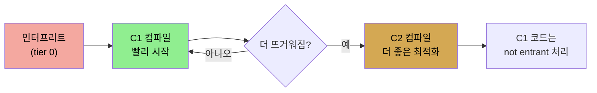

# JIT 기초와 tiered compilation
> JIT는 바이트코드를 실행 중에 플랫폼 바이너리로 컴파일해 이식성과 네이티브 성능을 모두 얻으며, tiered compilation은 C1로 시작해 뜨거워지면 C2를 씁니다

저자는 JIT(just-in-time) 컴파일러가 JVM의 심장이라고 말합니다. 애플리케이션 성능을 JIT 컴파일러보다 더 좌우하는 것은 없습니다. 이 노트는 JIT가 어떻게 동작하는지, 장단점은 무엇인지, 그리고 C1·C2 두 컴파일러와 tiered compilation을 다룹니다. 코드 cache 튜닝·컴파일 관찰·deoptimization은 [다음 편](./04-02.code%20cache와%20컴파일%20관찰%20—%20PrintCompilation·deoptimization.md)으로 이어집니다.


## 1. 컴파일·인터프리트·JIT — 세 가지 방식
> Java는 소스를 바이트코드로 컴파일하고 실행 중에 플랫폼 바이너리로 컴파일해, 인터프리트의 이식성과 컴파일의 성능을 함께 얻습니다

CPU는 machine code라는 비교적 적고 특정한 명령만 실행할 수 있어, 모든 프로그램은 그 명령으로 번역돼야 합니다. 언어는 이 번역을 언제 하느냐로 나뉩니다.

1. **컴파일 언어(C++·Fortran)** — 프로그램을 바이너리(컴파일된) 코드로 배포합니다. static 컴파일러가 특정 CPU를 겨냥한 어셈블리 코드를 만듭니다. 보완적 CPU(AMD·Intel)는 같은 바이너리를 실행할 수 있고, 신 버전 CPU는 거의 항상 구 버전 명령을 실행할 수 있지만 그 역은 아닙니다(신 CPU의 새 명령은 구 CPU에서 못 돕니다).
2. **인터프리트 언어(PHP·Perl)** — 같은 소스를 올바른 인터프리터(php·perl)만 있으면 어느 CPU에서나 돌립니다. 인터프리터가 각 줄을 실행될 때 바이너리로 번역합니다.

각 방식은 장단점이 있습니다. 인터프리트 코드는 이식성이 있어 적절한 인터프리터가 있는 어느 머신에든 같은 코드를 떨어뜨리면 돕니다. 그러나 느릴 수 있습니다. 루프를 생각하면, 인터프리터는 루프에서 실행될 때마다 각 줄을 다시 번역하지만 컴파일된 코드는 그 번역을 반복할 필요가 없습니다. 좋은 컴파일러는 바이너리를 만들 때 여러 요인을 고려합니다. 예를 들어 어셈블리 명령마다 실행 시간이 다른데, 두 레지스터 값을 더하는 명령은 한 사이클이지만 메인 메모리에서 더할 값을 가져오는 건 여러 사이클입니다. 좋은 컴파일러는 데이터 로드 명령을 실행하고, 다른 명령을 실행한 뒤, 데이터가 준비되면 덧셈을 실행하는 바이너리를 만듭니다. 한 줄만 보는 인터프리터는 그런 코드를 만들 정보가 없어, 메모리에서 데이터를 요청하고 기다린 뒤 덧셈을 실행합니다. 그래서 **인터프리트 코드는 거의 항상 컴파일된 코드보다 측정 가능하게 느립니다.** 컴파일러는 인터프리터가 못 하는 최적화를 제공할 충분한 정보를 갖기 때문입니다.

다만 컴파일된 코드의 이식성 문제도 있습니다. ARM용 바이너리는 Intel에서 못 돌고, Intel Sandy Bridge의 최신 AVX 명령을 쓰는 바이너리는 구 Intel에서도 못 돕니다. 그래서 상용 소프트웨어는 보통 꽤 오래된 프로세서 버전으로 컴파일해 최신 명령을 활용하지 못합니다.

**Java는 여기서 중간을 찾습니다.** Java 애플리케이션은 컴파일되지만, 특정 CPU의 특정 바이너리가 아니라 중간 저수준 언어(Java 바이트코드)로 컴파일됩니다. 이 언어는 java 바이너리가 실행합니다(인터프리트 PHP 스크립트를 php 바이너리가 돌리듯). 이것이 인터프리트 언어의 플랫폼 독립성을 줍니다. 이상화된 바이너리 코드를 실행하므로, java 프로그램은 코드가 실행될 때 플랫폼 바이너리로 컴파일할 수 있습니다. **이 컴파일이 프로그램이 실행될 때 일어나 "just in time"입니다.** 단 이 컴파일도 플랫폼 의존성을 받습니다. JDK 8은 Intel Skylake의 최신 명령 세트를 못 만들지만 JDK 11은 만듭니다.


## 2. HotSpot — 처음부터 컴파일하지 않는 이유
> 전형적 프로그램은 작은 hot spot만 자주 실행하며, 한 번 실행될 코드는 컴파일이 낭비이고 여러 번 실행하며 정보를 모아 최적화하기 위해 컴파일을 미룹니다

이 책이 다루는 Oracle HotSpot JVM의 이름은 코드 컴파일 접근에서 왔습니다. 전형적 프로그램은 작은 코드 일부만 자주 실행되고, 애플리케이션 성능은 주로 그 부분이 얼마나 빨리 실행되느냐에 달렸습니다. 이 핵심 부분이 애플리케이션의 **hot spot**이고, 더 많이 실행될수록 더 뜨겁다고 합니다.

그래서 JVM은 코드를 실행할 때 즉시 컴파일을 시작하지 않습니다. 두 가지 기본 이유가 있습니다.

1. **한 번만 실행될 코드라면 컴파일은 본질적으로 낭비**입니다. 바이트코드를 인터프리트하는 것이 컴파일해서 (한 번만) 실행하는 것보다 빠릅니다. 자주 호출되는 메서드나 여러 번 도는 루프라면 컴파일이 가치 있습니다. 컴파일에 드는 사이클이 더 빠른 컴파일 코드의 다중 실행으로 상쇄됩니다. 그래서 컴파일러가 인터프리트 코드를 먼저 실행하는데, 어느 메서드가 컴파일을 정당화할 만큼 자주 호출되는지 알아내기 위해서입니다.
2. **최적화** — JVM이 특정 메서드·루프를 더 많이 실행할수록 그 코드에 대한 정보가 많아집니다. 예를 들어 `equals()` 메서드는 모든 Java 객체에 있고(Object에서 상속) 자주 오버라이드됩니다. 인터프리터가 `b = obj1.equals(obj2)`를 만나면, 어느 `equals()`를 실행할지 알려고 `obj1`의 타입을 조회해야 합니다. 이 동적 조회는 다소 시간이 듭니다. JVM이 이 문장이 실행될 때마다 `obj1`이 `java.lang.String` 타입임을 알아채면, `String.equals()`를 직접 호출하는 컴파일 코드를 만들 수 있습니다. 이제 코드는 컴파일됐기 때문만이 아니라 어느 메서드를 호출할지 조회를 건너뛸 수 있어 더 빠릅니다.

물론 그렇게 단순하지 않습니다. 다음번에 `obj1`이 String이 아닐 수 있고, JVM은 그 가능성을 다루는 컴파일 코드를 만드는데 이는 deoptimize 후 reoptimize를 수반합니다. 그래도 전체 컴파일 코드는 (적어도 `obj1`이 계속 String을 가리키는 한) 메서드 조회를 건너뛰어 더 빠릅니다. **이런 최적화는 코드를 한동안 실행하며 무엇을 하는지 관찰한 뒤에야 가능합니다.** 이것이 JIT 컴파일러가 코드 컴파일을 미루는 둘째 이유입니다.


## 3. 레지스터와 메인 메모리
> 컴파일러는 변수를 메인 메모리 대신 레지스터에 두어 최적화하며, 그래서 스레드 동기화의 의미가 중요해집니다

컴파일러가 하는 가장 중요한 최적화의 하나는 언제 메인 메모리 값을 쓰고 언제 레지스터에 저장할지입니다. 다음 코드를 봅니다.

```java
public class RegisterTest {
    private int sum;

    public void calculateSum(int n) {
        for (int i = 0; i < n; i++) {
        sum += i;
    }
    }
}
```

어느 시점에 `sum` 인스턴스 변수는 메인 메모리에 있어야 하지만, 메인 메모리에서 값을 가져오는 건 여러 사이클이 드는 비싼 연산입니다. 루프의 매 반복마다 `sum`을 메인 메모리에서 가져오고 저장하면 성능이 끔찍합니다. 대신 컴파일러는 `sum`의 초기값을 레지스터에 로드하고, 그 레지스터 값으로 루프를 수행한 뒤, (불특정 시점에) 최종 결과를 레지스터에서 메인 메모리로 저장합니다.

이 최적화는 효과적이지만, **스레드 동기화(9장)의 의미가 애플리케이션 거동에 핵심**임을 뜻합니다. 한 스레드는 다른 스레드가 쓰는 레지스터에 저장된 변수 값을 볼 수 없습니다. 동기화는 레지스터가 언제 메인 메모리에 저장되어 다른 스레드가 쓸 수 있는지를 정확히 알게 해 줍니다. 레지스터 사용은 컴파일러의 일반 최적화이고, 보통 JIT는 레지스터를 적극적으로 씁니다(escape analysis는 04-03에서 더 다룹니다).

요약하면, Java는 스크립트 언어의 플랫폼 독립성과 컴파일 언어의 네이티브 성능을 함께 취하도록 설계됐고, Java 클래스 파일은 중간 언어(바이트코드)로 컴파일된 뒤 JVM에 의해 어셈블리로 더 컴파일되며, 이 어셈블리 컴파일이 성능을 크게 높이는 최적화를 수행합니다.


## 4. C1과 C2 컴파일러, 그리고 tiered compilation
> C1은 빨리 시작해 초반에 빠르고 C2는 정보를 더 모아 더 좋은 코드를 만들며, tiered compilation은 C1로 시작해 뜨거워지면 C2로 넘깁니다

한때 JIT 컴파일러는 두 종류였고, 어느 것을 쓸지에 따라 다른 JDK를 설치해야 했습니다. **client 컴파일러와 server 컴파일러**입니다. 1996년엔 중요한 구분이었지만 2020년엔 그렇지 않습니다. 오늘날 모든 JVM은 두 컴파일러를 다 포함합니다(흔히 server JVM이라 불립니다). 옛 버전에서는 `-client`(client)·`-server`/`-d64`(server) 플래그로 골랐는데, **JDK 8부터 이 플래그들은 아무 일도 하지 않습니다.** 단 옛 `-d64`는 JDK 11에서 제거돼 에러를 냅니다(JDK 8에서는 no-op).

JVM 개발자들은 두 컴파일러를 **C1(compiler 1, client)·C2(compiler 2, server)**로 부르기도 했고, client·server 구분이 사라진 지금은 이 이름이 더 적절합니다. 두 컴파일러의 주된 차이는 **컴파일 적극성**입니다.

1. **C1**은 C2보다 일찍 컴파일을 시작합니다. 그래서 코드 실행 초반에는 C1이 더 빠릅니다. 더 많은 코드를 컴파일했기 때문입니다.
2. **C2**는 기다리며 정보를 더 모으고, 그 지식으로 더 좋은 최적화를 합니다. 결국 C2가 만든 코드가 C1 코드보다 빠릅니다.

사용자 관점에서 이 트레이드오프의 이득은 프로그램이 얼마나 오래 도느냐와 시작 시간이 얼마나 중요하냐에 달렸습니다. 두 컴파일러가 분리됐을 때 당연한 질문은 "C1로 시작해 코드가 뜨거워지면 C2를 쓰면 안 되나"였습니다. **그 기법이 tiered compilation이고, 지금 모든 JVM이 씁니다.** `-XX:-TieredCompilation` 플래그(기본 true)로 명시적으로 끌 수 있습니다(끄는 영향은 04-03에서).




## 자주 받는 오해
> 인터프리트 언어라 Java가 느리다고 생각하기 쉽지만, JIT가 실행 중 네이티브 코드로 컴파일합니다

1. "Java는 인터프리트 언어라 느리다"고 생각하기 쉽지만, Java는 바이트코드를 실행 중에 플랫폼 바이너리로 JIT 컴파일해 컴파일 언어의 네이티브 성능에 다가갑니다. 이식성(바이트코드)과 성능(JIT)을 함께 얻는 중간 지대입니다.
2. "JVM은 코드를 보자마자 컴파일한다"고 생각하기 쉽지만, 한 번만 실행될 코드는 컴파일이 낭비라 인터프리트가 빠릅니다. JVM은 코드를 한동안 실행하며 어느 것이 hot spot인지, 어떤 최적화가 가능한지 정보를 모은 뒤 컴파일합니다.
3. "`-server`/`-client` 플래그로 컴파일러를 고른다"고 생각하기 쉽지만, JDK 8부터 이 플래그들은 아무 일도 하지 않습니다. 모든 JVM이 두 컴파일러를 내장하고 tiered compilation으로 함께 씁니다.


## 면접에서 받을 만한 질문
1. **Java가 컴파일과 인터프리트의 중간이라는 게 무슨 뜻입니까?** → Java는 소스를 특정 CPU 바이너리가 아니라 중간 언어인 바이트코드로 컴파일합니다. 이 바이트코드는 어느 플랫폼에서나 java 바이너리로 돌 수 있어 인터프리트 언어의 이식성을 얻습니다. 동시에 java 바이너리가 실행 중에 바이트코드를 플랫폼 네이티브 코드로 JIT 컴파일해 컴파일 언어의 성능을 얻습니다. 그래서 둘의 중간 지대입니다.
2. **HotSpot이 코드를 즉시 컴파일하지 않는 두 이유는?** → 첫째, 한 번만 실행될 코드는 컴파일 비용이 인터프리트보다 비싸 낭비입니다. 자주 실행되는 코드만 컴파일해야 그 비용이 다중 실행으로 상쇄됩니다. 둘째, 코드를 한동안 실행하며 정보를 모아야 최적화가 가능합니다. 예를 들어 `obj1.equals()`에서 `obj1`이 늘 String임을 관찰하면 동적 타입 조회를 건너뛰는 코드를 만들 수 있는데, 이는 실행을 관찰한 뒤에야 가능합니다.
3. **C1과 C2 컴파일러의 차이는?** → C1(client)은 더 일찍 컴파일을 시작해 실행 초반에 빠르고 시작 시간이 중요한 앱에 유리합니다. C2(server)는 기다리며 코드 사용 정보를 더 모아 더 좋은 최적화를 하므로 최종 코드가 더 빠르고 오래 도는 프로그램에 유리합니다. tiered compilation은 C1로 빨리 시작하고 코드가 뜨거워지면 C2로 넘겨 둘의 장점을 모두 취합니다.
4. **컴파일러가 변수를 레지스터에 두는 최적화가 동기화와 무슨 관계입니까?** → 컴파일러는 루프 변수 같은 값을 비싼 메인 메모리 접근 대신 레지스터에 두고 작업한 뒤 불특정 시점에 메인 메모리로 저장합니다. 그런데 한 스레드는 다른 스레드의 레지스터에 있는 값을 볼 수 없으므로, 동기화가 레지스터 값이 언제 메인 메모리에 반영되어 다른 스레드가 볼 수 있는지를 정확히 보장해 줍니다. 그래서 이 최적화 때문에 스레드 동기화 의미가 중요해집니다.


## 관련 문서
- [code cache와 컴파일 관찰 — PrintCompilation·deoptimization](./04-02.code%20cache와%20컴파일%20관찰%20—%20PrintCompilation·deoptimization.md) — tiered 5레벨과 deopt 상세
- [Java Flight Recorder와 JMC](./03-04.Java%20Flight%20Recorder와%20JMC.md) — 컴파일 이벤트(code cache·code compilation) 가시성
- [성능 — art와 science, 그리고 플랫폼·환경](./01-01.성능%20—%20art와%20science,%20그리고%20플랫폼·환경.md) — JVM 플래그 문법, HotSpot 한정성
- [이 책 인덱스 (Java Performance MOC)](./README.md) — 장별 정독 노트 진척
