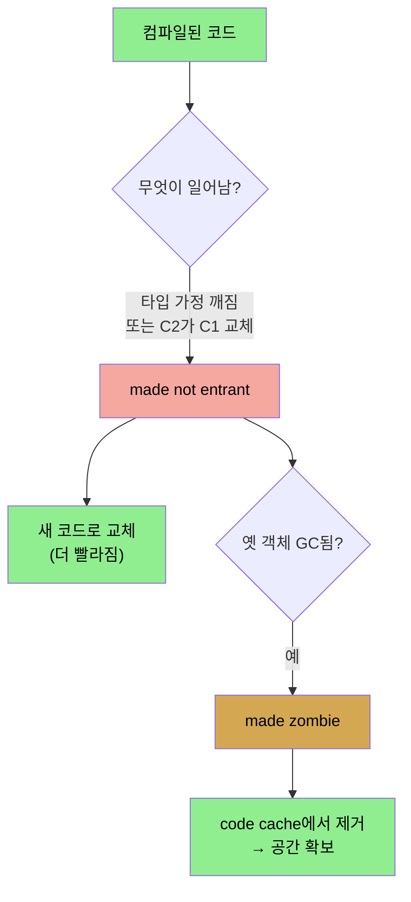

# code cache와 컴파일 관찰 — PrintCompilation·deoptimization
> 컴파일된 코드는 고정 크기 code cache에 담기며, PrintCompilation 로그로 컴파일 과정을, tiered 5레벨과 deoptimization으로 코드 교체를 이해합니다

[앞 편](./04-01.JIT%20기초와%20tiered%20compilation.md)이 JIT의 원리와 C1·C2였다면, 이 편은 컴파일된 코드가 어디 담기는지(code cache)와 컴파일 과정을 어떻게 들여다보는지(PrintCompilation)를 다룹니다. 그리고 tiered compilation의 5레벨과 코드를 되돌리는 deoptimization을 봅니다.


## 1. code cache 튜닝
> 컴파일된 코드가 담기는 고정 크기 영역으로, 가득 차면 컴파일이 멈춰 느린 인터프리트로 돌므로 큰 앱은 크기를 늘려야 합니다

JVM이 코드를 컴파일하면 어셈블리 명령 집합을 **code cache**에 담습니다. code cache는 고정 크기라, 가득 차면 JVM이 추가 코드를 컴파일하지 못합니다. code cache가 너무 작으면 문제가 분명합니다. 일부 hot 메서드만 컴파일되고 나머지는 안 돼, 애플리케이션이 느린 인터프리트 코드를 많이 돌립니다. 가득 차면 JVM이 경고를 냅니다.

```
Java HotSpot(TM) 64-Bit Server VM warning: CodeCache is full.
         Compiler has been disabled.
Java HotSpot(TM) 64-Bit Server VM warning: Try increasing the
         code cache size using -XX:ReservedCodeCacheSize=
```

특정 애플리케이션이 얼마나 많은 code cache가 필요한지 알아내는 좋은 방법은 없어, 늘려야 할 때는 기본값을 두세 배 하는 게 보통입니다. 최대 크기는 `-XX:ReservedCodeCacheSize=N`으로, 초기 크기는 `-XX:InitialCodeCacheSize=N`으로 정합니다. **초기 크기는 2,496KB, 기본 최대는 240MB**입니다. cache 리사이즈는 백그라운드에서 일어나 성능에 영향이 없으니 보통 `ReservedCodeCacheSize`(최대)만 정하면 됩니다.

최대를 아주 크게 잡아 절대 안 차게 하면 단점이 있을까요? 타깃 머신 자원에 달렸습니다. 1GB를 지정하면 JVM이 native 메모리 1GB를 예약합니다. 그 메모리는 필요할 때까지 할당되진 않지만 예약되므로, 충분한 가상 메모리가 있어야 합니다. (32비트 JVM이면 전체 프로세스 크기가 4GB를 못 넘으니 주의해야 합니다.) **64비트 머신에 충분한 메모리가 있으면 값을 너무 높게 잡아도 실용적 영향이 거의 없습니다.**

Java 11은 code cache를 셋으로 나눕니다. **nonmethod·profiled·nonprofiled** 코드입니다. 기본은 같은 방식(최대 240MB)이고 `ReservedCodeCacheSize`로 전체를 조정합니다. 개별 세그먼트는 `-XX:NonNMethodCodeHeapSize`·`-XX:ProfiledCodeHeapSize`·`-XX:NonProfiledCodeHeapSize`로 거의 튜닝할 일이 없습니다. cache 크기는 `jconsole`의 Memory Pool Code Cache 차트로 실시간 모니터할 수 있습니다.


## 2. PrintCompilation — 컴파일 로그 읽기
> 로그 한 줄은 timestamp·id·attributes(OSR·synchronized 등)·tier·method·size로 구성되며, 컴파일이 기대대로 진행되는지 확인하는 데 씁니다

`-XX:+PrintCompilation` 플래그(기본 false)는 튜닝이 아니라 컴파일러 동작 가시성을 줍니다. 켜면 메서드(나 루프)가 컴파일될 때마다 한 줄이 출력됩니다. 형식은 다음과 같습니다.

```
timestamp compilation_id attributes (tiered_level) method_name size deopt
```

1. **timestamp** — 컴파일이 끝난 시각(JVM 시작이 0)
2. **compilation_id** — 내부 작업 ID. 보통 단조 증가하지만, 다중 컴파일 스레드에서 순서가 어긋나기도 합니다(스레드 스케줄링 탓이지 특정 컴파일이 느린 게 아닙니다)
3. **attributes** — 5자 문자열로 컴파일 중 코드 상태를 나타냅니다(해당 안 되면 공백)

| 문자 | 의미 |
|------|------|
| `%` | OSR(on-stack replacement) 컴파일 |
| `s` | synchronized 메서드 |
| `!` | 예외 핸들러를 가짐 |
| `b` | 블로킹 모드 컴파일(현재 기본은 출력 안 됨) |
| `n` | native 메서드 래퍼 컴파일 |

**OSR**이 중요합니다. JIT 컴파일은 비동기라, JVM이 메서드를 컴파일하기로 정하면 큐에 넣고 인터프리트를 계속하다 다음 호출 때 컴파일 버전을 실행합니다. 그런데 오래 도는 루프는 루프와 메서드가 끝날 때까지(끝나지 않을 수도) 기다리는 게 비효율적입니다. 그래서 루프 코드 컴파일이 끝나면 JVM이 스택의 코드를 교체하고, 다음 반복부터 훨씬 빠른 컴파일 버전을 실행합니다. 이것이 OSR입니다.

4. **tiered_level** — tiered가 꺼지면 빈칸, 켜지면 완료된 tier 번호
5. **method_name** — `ClassName::method` 형식
6. **size** — 컴파일되는 코드의 바이트 크기. **Java 바이트코드 크기이지 컴파일된 코드 크기가 아니라서, code cache 크기 예측에는 못 씁니다.**
7. **deopt** — 일부 경우 끝에 `made not entrant`·`made zombie` 메시지

PrintCompilation 없이 시작했으면 `jstat`로 제한된 가시성을 얻습니다. `jstat -compiler`는 컴파일된 메서드 수 요약(실패 수·마지막 실패 메서드 포함)을, `jstat -printcompilation`은 최근 컴파일된 메서드를 줍니다(반복 인자로 시간에 따른 추이도 봄). 로그에 `COMPILE SKIPPED: reason`이 나오면 컴파일에 문제가 생긴 것인데, 두 경우는 예상된 것입니다. **Code cache filled**(`ReservedCodeCache`를 늘려야 함)와 **Concurrent classloading**(컴파일 중 클래스가 수정돼 나중에 재컴파일됨)입니다.

저자가 stock REST 애플리케이션에서 뽑은 로그를 보면, 첫 stock 메서드가 서버 시작 28초 후에야 컴파일되고 그 전에 849개가 컴파일됐습니다(대부분 서버·JDK 메서드). 서버 시작에 2초, 나머지 26초는 요청을 기다리는 사실상 idle 시간이었습니다. `process()`는 synchronized라 `s`가, `processRequest()`는 예외 핸들러라 `!`가 붙습니다. `StockPriceHistoryImpl` 생성자는 큰 루프를 담아 OSR 컴파일 대상이고, 컴파일 ID가 25인데 900번대 메서드들이 컴파일될 때야 나타납니다(stack replacement는 설정이 더 어려워 그 사이 다른 컴파일이 진행됨). OSR 줄을 `25%`로 읽고 나머지 75%를 궁금해하기 쉽지만, 숫자는 컴파일 ID이고 `%`는 OSR을 뜻할 뿐입니다.


## 3. tiered compilation 5레벨
> 두 컴파일러에 다섯 레벨(0 인터프리트~4 C2)이 있으며, 전형적 경로는 0→3→4이고 C1은 세 레벨을 가집니다

tiered compilation 로그는 각 메서드가 컴파일된 tier 레벨을 출력합니다. C1 컴파일러가 세 레벨을 가져 총 다섯 레벨이 있습니다.

| 레벨 | 의미 |
|------|------|
| 0 | 인터프리트 코드 |
| 1 | 단순 C1 컴파일 코드 |
| 2 | 제한된 C1 컴파일 코드 |
| 3 | 풀 C1 컴파일 코드 |
| 4 | C2 컴파일 코드 |

대부분 메서드는 먼저 **레벨 3(풀 C1)**에서 컴파일됩니다(모든 메서드는 레벨 0에서 시작하지만 로그엔 안 나옴). 충분히 자주 돌면 레벨 4로 컴파일되고 레벨 3 코드는 not entrant가 됩니다. 이것이 가장 흔한 경로입니다. C1이 최적화에 쓸 코드 사용 정보를 모을 때까지 기다리기 때문입니다.

다른 경로도 있습니다. C2 큐가 가득 차면 메서드를 C2 큐에서 빼 **레벨 2**(C1이 invocation·back-edge counter는 쓰되 profile feedback은 불필요)로 빨리 컴파일하고, 나중에 C1이 profile 정보를 모으면 레벨 3으로, C2 큐가 한가해지면 레벨 4로 갑니다. 반대로 C1 큐가 가득 차면 레벨 3 대기 중인 메서드가 레벨 4 자격이 되어, 빨리 레벨 2로 컴파일됐다 레벨 4로 전이됩니다. 사소한(trivial) 메서드는 레벨 2·3에서 시작했다 trivial한 본질 때문에 레벨 1로 가고, C2가 어떤 이유로 컴파일 못 하면 레벨 1로 가며, deopt되면 레벨 0으로 갑니다.

**최선의 성능은 메서드가 0 → 3 → 4로 컴파일될 때**입니다. 메서드가 자주 레벨 2로 컴파일되고 여분 CPU가 있으면 컴파일러 스레드 수를 늘려 C2 큐를 줄이는 걸 고려합니다. 여분 CPU가 없으면 애플리케이션 크기를 줄이는 수밖에 없습니다.


## 4. deoptimization — not entrant와 zombie
> deopt는 이전 컴파일을 되돌리는 것으로, 타입 가정이 깨지거나 C2가 C1을 교체할 때 not entrant가 되며 성능을 거의 해치지 않습니다

**deoptimization은 컴파일러가 이전 컴파일을 "되돌리는" 것**입니다. 효과는 (재컴파일 전까지) 성능이 줄어드는 것입니다. deopt는 두 경우에 일어납니다. 코드가 **not entrant**가 될 때와 **zombie**가 될 때입니다.

**not entrant를 만드는 두 원인**이 있습니다. 하나는 클래스·인터페이스가 동작하는 방식이고, 하나는 tiered compilation의 구현 디테일입니다. 첫째를 봅니다. stock 앱의 `StockPriceHistory` 인터페이스는 두 구현(기본 `StockPriceHistoryImpl`, 로깅 추가 `StockPriceHistoryLogger`)을 갖고, URL의 log 파라미터로 선택됩니다.

```java
StockPriceHistory sph;
String log = request.getParameter("log");
if (log != null && log.equals("true")) {
    sph = new StockPriceHistoryLogger(...);
}
else {
    sph = new StockPriceHistoryImpl(...);
}
sph.getHighPrice();
```

log 없이 호출이 쏟아지면 컴파일러는 `sph`의 실제 타입이 `StockPriceHistoryImpl`임을 보고 그 가정으로 인라인·최적화합니다. 나중에 `?log=true` 호출이 오면 그 가정이 틀려져 이전 최적화가 무효가 됩니다. 이것이 **deoptimization trap**을 만들고 이전 최적화가 버려집니다. 로깅 호출이 많아지면 JVM이 그 코드를 빠르게 컴파일해 새 최적화를 합니다. 로그엔 `made not entrant`가 나오고, 나중에 `made zombie`가 됩니다.

deopt는 성능 면에서 나빠 보이지만 꼭 그렇지 않습니다. 저자의 측정입니다.

| 시나리오 | OPS |
|----------|-----|
| 표준 구현 | 24.4 |
| deopt 후 표준 구현 | 24.4 |
| 로깅 구현 | 24.1 |
| 혼합 구현 | 24.3 |

표준 구현이 24.4 OPS인데, 로깅 경로를 트리거해 deopt를 일으킨 뒤 표준 경로를 다시 돌리면 (또 한 번 warm-up 후) 여전히 24.4 OPS입니다. 호출이 뒤섞여 컴파일러가 경로를 가정 못 할 때도, 로깅 경로 24.1과 표준의 평균쯤인 24.3 OPS가 나옵니다. **trap 처리 순간을 빼면 deopt는 성능에 유의미한 영향을 주지 않습니다.**

둘째 원인은 tiered compilation입니다. C2가 코드를 컴파일하면 JVM은 이미 C1이 컴파일한 코드를 교체해야 하는데, 옛 코드를 not entrant로 표시하고 같은 deopt 메커니즘으로 더 효율적인 새 코드로 바꿉니다. **그래서 tiered로 돌면 로그에 not entrant 메서드가 쏟아지는데, 당황하지 마십시오. 이 "deopt"는 사실 코드를 더 빠르게 만드는 중입니다.** 구분하려면 tier 레벨을 봅니다. 생성자가 레벨 3 OSR로 컴파일됐다 레벨 4 자격이 되면 레벨 4로 컴파일되고 레벨 3 OSR이 not entrant가 됩니다.

**zombie**는 not entrant가 된 코드를 회수하는 것입니다. 위 예에서 로깅 테스트 후 `StockPriceHistoryImpl` 코드가 not entrant가 됐지만 그 객체들은 남아 있었습니다. 결국 GC가 그 객체들을 회수하면, 컴파일러는 그 클래스 메서드가 zombie로 표시될 자격이 됨을 알아챕니다. **성능에는 좋은 일입니다.** 컴파일 코드는 고정 크기 code cache에 담기는데, zombie 메서드가 식별되면 그 코드를 cache에서 제거해 다른 클래스 컴파일 공간을 냅니다. 단점은 그 코드가 나중에 재로드돼 다시 많이 쓰이면 재컴파일·재최적화가 필요한 것이지만, 대부분 앱에서 측정 가능한 영향은 없습니다.




## 자주 받는 오해
> 로그의 not entrant·deopt가 성능 저하 신호라고 생각하기 쉽지만, 대개 C2가 C1을 교체하며 빨라지는 과정입니다

1. "로그에 not entrant가 쏟아지면 성능이 나빠지는 신호"라고 생각하기 쉽지만, tiered에서 C2가 C1 코드를 교체할 때 같은 메커니즘을 써서 그렇습니다. 이는 코드를 더 빠르게 만드는 정상 과정입니다. tier 레벨을 보면 레벨 3 코드가 레벨 4로 교체되며 not entrant가 됨을 확인할 수 있습니다.
2. "PrintCompilation의 size로 code cache 크기를 예측할 수 있다"고 생각하기 쉽지만, 그 size는 Java 바이트코드 크기이지 컴파일된 코드 크기가 아니라 예측에 못 씁니다.
3. "deoptimization은 성능을 크게 떨어뜨린다"고 생각하기 쉽지만, 측정상 표준 24.4 OPS, deopt 후에도 24.4, 혼합 24.3 OPS로 trap 처리 순간 외엔 유의미한 영향이 없습니다.
4. "OSR 로그의 `25%`는 25% 진행을 뜻한다"고 생각하기 쉽지만, 25는 컴파일 ID이고 `%`는 OSR 컴파일을 뜻하는 별개 표시입니다.


## 면접에서 받을 만한 질문
1. **code cache가 가득 차면 어떻게 됩니까?** → JVM이 추가 코드를 컴파일하지 못해 일부 hot 메서드만 컴파일되고 나머지는 느린 인터프리트로 돕니다. `CodeCache is full` 경고가 나오고, `-XX:ReservedCodeCacheSize`로 최대 크기를 늘려야 합니다(기본 최대 240MB, 초기 2,496KB). 큰 애플리케이션은 기본값을 두세 배 늘리는 게 보통이고, 64비트에 메모리가 충분하면 값을 크게 잡아도 실용적 영향이 거의 없습니다.
2. **OSR(on-stack replacement)이 무엇입니까?** → 오래 도는 루프는 루프와 메서드가 끝날 때까지 기다려 컴파일 버전으로 바꾸면 비효율적입니다(끝나지 않을 수도 있음). OSR은 루프 코드 컴파일이 끝나면 실행 중인 스택의 코드를 교체해, 다음 반복부터 빠른 컴파일 버전을 실행하게 합니다. PrintCompilation 로그에서 `%` 속성으로 표시됩니다.
3. **tiered compilation의 전형적 컴파일 경로는?** → 0(인터프리트) → 3(풀 C1) → 4(C2)입니다. 대부분 메서드는 레벨 3에서 시작해 충분히 자주 돌면 레벨 4로 가고 레벨 3 코드는 not entrant가 됩니다. C2 큐가 가득 차면 레벨 2(profile 없는 제한 C1)로 빨리 컴파일했다 나중에 3·4로 가는 우회 경로도 있습니다. 최선은 0→3→4 경로입니다.
4. **deoptimization의 not entrant와 zombie는 어떻게 다릅니까?** → not entrant는 타입 가정이 깨지거나(인터페이스 구현이 바뀌어 인라인 가정이 무효) C2가 C1 코드를 교체할 때 표시됩니다. zombie는 not entrant 코드를 실제로 회수하는 단계로, 관련 객체가 모두 GC된 뒤 code cache에서 제거해 공간을 냅니다. 둘 다 성능에 거의 해롭지 않고, 특히 C2가 C1을 교체하는 not entrant는 코드를 더 빠르게 만드는 과정입니다.


## 관련 문서
- [JIT 기초와 tiered compilation](./04-01.JIT%20기초와%20tiered%20compilation.md) — C1·C2와 tiered의 원리
- [고급 컴파일러 플래그 — threshold·threads·inlining·escape analysis](./04-03.고급%20컴파일러%20플래그%20—%20threshold·threads·inlining·escape%20analysis.md) — 컴파일 트리거와 스레드
- [JDK 기본 도구와 VM 정보·튜닝 플래그](./03-02.JDK%20기본%20도구와%20VM%20정보·튜닝%20플래그.md) — jstat·PrintFlagsFinal
- [이 책 인덱스 (Java Performance MOC)](./README.md) — 장별 정독 노트 진척
