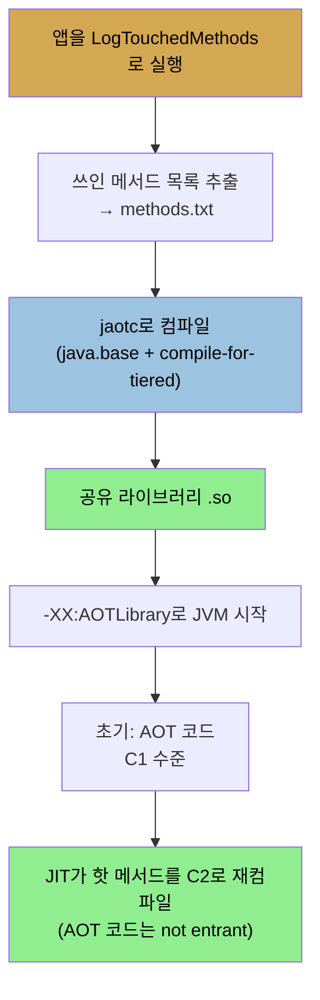

# GraalVM과 precompilation — AOT·native image
> GraalVM은 Java로 쓴 새 컴파일러와 네이티브 빌드를 제공하며, AOT와 native image는 워밍업이 부담인 환경을 위한 미리 컴파일 기법입니다

[앞 편](./04-03.고급%20컴파일러%20플래그%20—%20threshold·threads·inlining·escape%20analysis.md)까지가 전통 JIT 컴파일러의 동작과 플래그였다면, 이 편은 그 한계를 넘는 미래 기술입니다. JIT는 장점이 있지만 코드가 실행되기 전 워밍업 기간을 거쳐야 합니다. 임베디드 시스템처럼 JIT가 요구하는 여분 메모리가 없거나, 워밍업할 기회 전에 끝나는 프로그램이라면 전통적 컴파일 모델이 나을 수 있습니다. 이 편은 그 시나리오를 다루는 GraalVM, AOT 컴파일, native image를 봅니다.


## 1. GraalVM — 새 가상 머신과 두 기여
> 여러 언어를 돌리는 범용 VM으로, 네이티브 바이너리 생성과 Java로 쓴 새 C2 컴파일러 구현을 제공합니다

GraalVM은 새 가상 머신입니다. Java 코드는 물론 JavaScript·Python·Ruby·R, 그리고 Java를 비롯해 JVM 바이트코드로 컴파일되는 언어(Scala·Kotlin 등)의 바이트코드를 모두 돌리는 범용 VM입니다. Community Edition(CE, 오픈소스)과 Enterprise Edition(EE, 상용) 두 에디션이 있고, 각각 Java 8·11 바이너리를 지원합니다.

GraalVM은 JVM 성능에 두 기여를 합니다.

1. **fully native 바이너리 생성** — add-on 기술로 완전 네이티브 바이너리를 만듭니다(이 편 §3).
2. **Java로 쓴 새 C2 컴파일러** — 일반 JVM 모드로 돌되, C++로 쓴 전통 C2와 달리 Java로 쓴 새 C2 구현을 담습니다.

전통 JVM도 빌드 시점에 따라 GraalVM JIT 버전을 담습니다. 단 그 JIT는 CE 버전에서 와 EE보다 느리고, 직접 받는 GraalVM보다 보통 구버전입니다. JVM 안에서 GraalVM 컴파일러를 쓰는 건 실험적이라, `-XX:+UnlockExperimentalVMOptions`·`-XX:+EnableJVMCI`·`-XX:+UseJVMCICompiler` 플래그가 필요합니다(모두 기본 false). 저자의 측정에서 Graal 컴파일러의 진전이 보입니다. JDK 11은 이른 Graal 버전으로 빌드돼 C2보다 느렸지만(JDK 11 표준 C2 20.558 OPS vs Graal JIT 14.733), 2019년 말 Graal 19.2.1은 26.7 OPS로 훨씬 빨라졌고, JDK 13의 Graal JIT는 26.4로 C2(21.9)를 앞섭니다.


## 2. AOT(ahead-of-time) 컴파일
> 앱 일부를 미리 컴파일해 공유 라이브러리로 만들고 JVM이 시작 시 로드하며, 시작이 긴 서버에 유리합니다

**AOT 컴파일**은 JDK 9에서 Linux 전용으로 처음 나왔고 JDK 11에서 모든 플랫폼에 제공됩니다(성능 면에선 진행 중 작업). AOT는 애플리케이션의 일부(또는 전부)를 실행 전에 미리 컴파일합니다. 이 컴파일된 코드는 JVM이 시작 시 쓰는 공유 라이브러리가 됩니다. 이론상 JIT가 (적어도 시작에서) 개입할 필요가 없어, 코드가 처음부터 C1 수준으로 돕니다.

실제로는 조금 다릅니다. **시작 시간이 공유 라이브러리 크기에 크게 좌우**됩니다(JVM에 로드하는 시간 때문). 그래서 "Hello, world" 같은 작은 앱은 AOT로 빨라지지 않고 되레 느려질 수 있습니다. **AOT는 시작 시간이 비교적 긴 REST 서버 같은 대상에 맞습니다.** 라이브러리 로드 시간이 긴 시작 시간으로 상쇄돼 이득이 납니다. AOT는 `jaotc` 도구로 만듭니다.

```
$ jaotc --compile-commands=/tmp/methods.txt \
    --output JavaBaseFilteredMethods.so \
    --compile-for-tiered \
    --module java.base
```

이 명령은 compile commands 집합으로 `java.base` 모듈의 컴파일 버전을 출력 파일에 만듭니다. 모듈이나 클래스 집합을 AOT 컴파일할 수 있습니다. **전부 미리 컴파일하고 싶어도, 일부만 신중히 미리 컴파일해야 성능이 더 낫습니다**(그래서 `java.base`만 권장). compile commands 파일은 컴파일할 데이터를 제한합니다. `compileOnly java.net.URI.getHost()Ljava/lang/String;` 같은 줄이 `java.net.URI` 클래스를 컴파일할 때 `getHost()`만 포함하라고 지시합니다. 이 목록은 애플리케이션이 실제로 쓰는 모든 메서드여야 하므로, 다음처럼 앱을 돌려 만듭니다.

```
$ java -XX:+UnlockDiagnosticVMOptions -XX:+LogTouchedMethods \
      -XX:+PrintTouchedMethodsAtExit <other arguments>
```

프로그램 종료 시 쓰인 메서드가 출력되고, 그 줄에 `compileOnly` 지시어를 붙이고 메서드 인자 앞 콜론을 제거해 *methods.txt*를 만듭니다.



`jaotc`가 미리 컴파일한 클래스는 C1 형태를 쓰므로, 오래 도는 프로그램에서는 최적이 아닙니다. 그래서 **`--compile-for-tiered`** 옵션이 필요합니다. 이 옵션은 공유 라이브러리의 메서드가 여전히 C2 컴파일 자격을 갖게 합니다. 짧게 사는 프로그램이면 빼도 되지만, 대상이 서버이므로 빼면 warm 성능이 가능한 최선보다 느립니다. tiered가 켜진 라이브러리로 돌리고 `-XX:+PrintCompilation`을 쓰면, 앞서 본 코드 교체 기법이 보입니다. AOT 컴파일이 출력에 또 하나의 tier로 나타나고, AOT 메서드가 not entrant가 되며 JIT가 교체합니다.

만든 라이브러리는 `-XX:AOTLibrary=/path/to/JavaBaseFilteredMethods.so`로 씁니다. 쓰이는지 확인하려면 `-XX:+PrintAOT`(기본 false)를 넣습니다. 미리 컴파일된 메서드가 JVM에 쓰일 때마다 출력이 나옵니다(예: `373 105 aot[ 1] java.util.HashSet.<init>(I)V` — 프로그램 시작 373ms 후 HashSet 생성자가 라이브러리에서 로드돼 실행 시작). 자동화 성능 테스트에서 이 도구로 기록을 만들면 회귀 검사에 유용합니다.


## 3. GraalVM native image
> JVM 없이 도는 완전 네이티브 실행 파일로 짧게 사는 프로그램에 이상적이지만, 오래 돌면 C2가 이기고 동적 기능에 제약이 있습니다

AOT는 비교적 큰 프로그램에 이로웠지만 작고 빨리 끝나는 프로그램엔 도움이 안 되고 오히려 방해됐습니다. 실험 기능이고 JVM이 공유 라이브러리를 로드하는 구조이기 때문입니다. 반면 **GraalVM은 JVM 없이 도는 완전 네이티브 실행 파일을 만듭니다.** 이 실행 파일은 짧게 사는 프로그램에 이상적입니다(AOT 컴파일도 GraalVM을 기반으로 씁니다). 이는 GraalVM의 Early Adopter 기능으로, 적절한 라이선스로 프로덕션에 쓸 수 있지만 보증 대상은 아닙니다.

GraalVM native 바이너리는 JVM에서 도는 프로그램에 비해 시작이 꽤 빠릅니다. 그러나 이 모드의 GraalVM은 C2만큼 적극적으로 최적화하지 않아, **충분히 오래 도는 애플리케이션이면 전통 JVM이 결국 이깁니다.** AOT 컴파일과 달리 native 바이너리는 실행 중 C2로 클래스를 컴파일하지 않습니다. 메모리 발자국도 전통 JVM보다 작게 시작하지만, 프로그램이 돌며 힙을 확장하면 이 이점이 사라집니다.

native 코드로 컴파일된 프로그램에는 쓸 수 있는 Java 기능에 제약이 있습니다.

1. 동적 클래스 로딩(`Class.forName()` 호출 등)
2. Finalizer
3. Java Security Manager
4. JMX와 JVMTI(JVMTI 프로파일링 포함)
5. 리플렉션 사용은 흔히 특별한 코딩·설정이 필요
6. 동적 프록시 사용은 흔히 특별한 설정이 필요
7. JNI 사용은 특별한 코딩·설정이 필요

디렉토리의 파일을 재귀적으로 세는 GraalVM 데모로 이를 볼 수 있습니다. 파일이 적으면 native 프로그램이 작고 빠르지만, 일이 많아져 JIT가 작동하면 전통 JVM 컴파일러가 더 좋은 최적화를 내 빨라집니다.

| 파일 수 | Java 11.0.5 | Native 애플리케이션 |
|---------|-------------|---------------------|
| 7 | 217 ms (36K) | 4 ms (3K) |
| 271 | 279 ms (37K) | 20 ms (6K) |
| 169,000 | 2.3 s (171K) | 2.1 s (249K) |
| 1.3 million | 19.2 s (212K) | 25.4 s (269K) |

(괄호는 실행 완료 시점 측정한 전체 발자국.) 파일이 적을 때는 native가 압도적으로 빠르지만, 130만 개에서는 JVM(19.2초)이 native(25.4초)를 앞섭니다. 물론 GraalVM 자체가 빠르게 진화 중이라 native 최적화도 나아질 것입니다.


## 자주 받는 오해
> AOT나 native image가 늘 빠르다고 생각하기 쉽지만, 작은 앱이나 오래 도는 앱에서는 전통 JVM이 낫습니다

1. "AOT 컴파일은 모든 앱의 시작을 빠르게 한다"고 생각하기 쉽지만, 시작 시간이 공유 라이브러리 크기에 좌우돼 "Hello, world" 같은 작은 앱은 되레 느려질 수 있습니다. 라이브러리 로드 시간이 긴 시작 시간으로 상쇄되는 REST 서버 같은 대상에 맞습니다.
2. "native image는 JVM보다 항상 빠르다"고 생각하기 쉽지만, native 모드는 C2만큼 적극 최적화하지 않고 실행 중 C2 컴파일도 안 합니다. 충분히 오래 도는 앱은 전통 JVM이 결국 이깁니다(파일 130만 개: native 25.4초 vs JVM 19.2초).
3. "native image로 어떤 Java 코드든 빌드할 수 있다"고 생각하기 쉽지만, 동적 클래스 로딩·finalizer·리플렉션·JNI·JMX 등에 제약이 있어 특별한 코딩·설정이 필요합니다.


## 면접에서 받을 만한 질문
1. **GraalVM이 JVM 성능에 기여하는 두 가지는?** → 첫째, add-on 기술로 JVM 없이 도는 완전 네이티브 바이너리(native image)를 만들 수 있습니다. 둘째, 일반 JVM 모드로 돌되 C++로 쓴 전통 C2와 달리 Java로 쓴 새 C2 컴파일러 구현을 담습니다. 이 Graal 컴파일러는 실험적이라 JVMCI 관련 플래그로 켜며, 최신 버전(19.2.1)은 표준 C2를 앞서기도 합니다.
2. **AOT 컴파일은 어떤 애플리케이션에 적합합니까?** → 시작 시간이 비교적 긴 REST 서버 같은 대상입니다. AOT는 앱 일부를 미리 컴파일해 공유 라이브러리로 만들고 JVM이 시작 시 로드하는데, 시작 시간이 라이브러리 크기에 좌우됩니다. "Hello, world" 같은 작은 앱은 로드 시간 탓에 되레 느려지지만, 시작이 긴 서버는 그 시간으로 로드가 상쇄돼 이득이 납니다. `--compile-for-tiered`로 AOT 메서드도 C2 재컴파일 자격을 유지해야 warm 성능이 좋습니다.
3. **AOT 컴파일과 GraalVM native image의 차이는?** → AOT는 JVM이 공유 라이브러리를 로드하는 구조라 실행 중 C2로 재컴파일이 가능하고, 시작이 긴 큰 프로그램에 맞습니다. native image는 JVM 없이 도는 완전 네이티브 실행 파일이라 짧게 사는 프로그램에 이상적이고 시작이 빠르지만, 실행 중 C2 컴파일을 안 해 오래 도는 앱에선 전통 JVM이 이깁니다. native image는 동적 클래스 로딩·리플렉션 등에 제약이 있습니다.
4. **native image가 짧은 프로그램엔 빠른데 긴 프로그램엔 느린 이유는?** → native image는 시작이 빠르고 메모리가 작게 시작하지만, C2만큼 적극적으로 최적화하지 않고 실행 중 C2 컴파일도 하지 않습니다. 그래서 일이 적으면 빠른 시작이 이기지만, 일이 많아 JIT가 충분히 워밍업할 시간이 생기면 전통 JVM의 C2 최적화가 더 나은 코드를 만들어 앞섭니다. 파일 카운트 벤치마크에서 7개는 native가 압도적이지만 130만 개는 JVM이 빠릅니다.


## 관련 문서
- [고급 컴파일러 플래그 — threshold·threads·inlining·escape analysis](./04-03.고급%20컴파일러%20플래그%20—%20threshold·threads·inlining·escape%20analysis.md) — 전통 JIT 튜닝 플래그
- [JIT 기초와 tiered compilation](./04-01.JIT%20기초와%20tiered%20compilation.md) — JIT의 워밍업 기간이 AOT·native의 동기
- [이 책 인덱스 (Java Performance MOC)](./README.md) — 장별 정독 노트 진척
