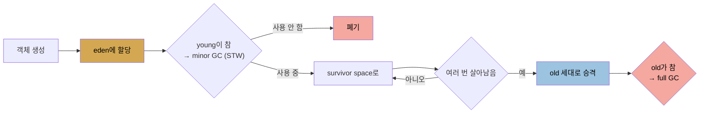

# GC 기초와 세대별 컬렉터
> GC는 GC root에서 도달 가능한 객체를 live로 보고 나머지를 회수하며, 힙을 young·old 세대로 나눠 짧게 사는 객체를 효율적으로 처리합니다

저자는 코드 재작성을 빼면 **GC 튜닝이 Java 애플리케이션 성능 개선에서 가장 중요한 일**이라고 말합니다. 이 노트는 GC의 기본 원리와 세대별 컬렉터를 다룹니다. 구체적 알고리즘 선택과 튜닝은 [다음 편](./05-02.GC%20알고리즘%20선택%20—%20serial·throughput·G1·CMS.md)부터 이어집니다.

Java에서 가장 매력적인 특징의 하나는 개발자가 객체의 생애주기를 명시적으로 관리할 필요가 없다는 점입니다. 객체는 필요할 때 생성되고, 더는 쓰이지 않으면 JVM이 자동으로 해제합니다. 저자는 다른 언어에서 null 포인터·dangling 포인터를 추적하던 어려움을 떠올리며, **GC 튜닝이 포인터 버그 추적보다 훨씬 쉽고 시간이 덜 든다**고 강하게 주장합니다.


## 1. GC 원리 — GC root에서 reachable 추적
> 참조 카운팅은 순환 참조 때문에 불충분하므로, JVM은 GC root에서 도달 가능한 객체를 live로, 나머지를 garbage로 봅니다

기본적으로 GC는 사용 중인 객체를 찾고 나머지(사용 안 하는) 객체의 메모리를 해제하는 것입니다. 이를 "참조가 더는 없는 객체 찾기"로 설명하기도 하는데, 이는 참조를 카운트로 추적한다는 뜻을 함축합니다. 그러나 **참조 카운팅은 불충분**합니다.

1. 연결 리스트에서 head를 뺀 각 객체는 다른 객체가 가리키지만, **head를 아무도 안 가리키면 리스트 전체가 사용 안 됨**이라 해제할 수 있습니다.
2. 리스트가 순환(tail이 head를 가리킴)이면 모든 객체가 참조를 갖지만, 리스트 자체를 아무도 참조하지 않으면 어느 객체도 실제로 못 쓰입니다.

그래서 참조는 카운트로 동적 추적할 수 없고, **JVM은 주기적으로 힙에서 사용 안 하는 객체를 찾습니다.** 힙 밖에서 접근 가능한 객체인 **GC root**(주로 스레드 스택과 시스템 클래스)에서 시작해, root를 통해 도달 가능한 모든 객체를 스캔합니다. GC root로 도달 가능하면 **live** 객체이고, 도달 불가능한 나머지는 **garbage**입니다(live 객체나 서로를 참조해도 마찬가지).

사용 안 하는 객체를 찾으면 JVM은 그 메모리를 해제해 추가 객체 할당에 씁니다. 그러나 보통 그 free 메모리를 추적해 미래 할당에 쓰는 것만으로는 부족합니다. 어느 시점에 **메모리 단편화를 막으려 compaction**해야 합니다. 1,000바이트 배열과 24바이트 배열을 번갈아 할당하는 프로그램이 힙을 채운 뒤, 24바이트 배열이 모두 사용 안 됨이 되면 힙에 free 영역이 생기지만 24바이트보다 큰 건 할당 못 합니다. 1,000바이트 배열을 모두 옮겨 연속되게 하면, free 메모리가 한 영역에 모여 필요할 때 할당됩니다. **GC 성능은 사용 안 하는 객체 찾기, 메모리 회수, compaction이라는 기본 연산에 좌우**되고, 특히 compaction 방식이 알고리즘마다 달라(어떤 건 절대 필요할 때까지 미루고, 어떤 건 한 번에 큰 영역을, 어떤 건 조금씩 재배치) 성능 특성이 갈립니다.


## 2. stop-the-world pause
> GC가 객체를 옮길 때 애플리케이션 스레드를 모두 멈추는 것을 STW pause라 하며, 이를 최소화하는 것이 튜닝의 핵심입니다

이 연산들은 GC가 도는 동안 애플리케이션 스레드가 안 돌면 더 단순합니다. Java 프로그램은 보통 멀티스레드이고 GC 자체도 여러 스레드를 돕니다. 두 논리적 스레드 그룹을 봅니다. 애플리케이션 로직을 수행하는 **mutator 스레드**(로직의 일부로 객체를 mutate해서)와 GC를 수행하는 스레드입니다. GC 스레드가 객체 참조를 추적하거나 객체를 메모리에서 옮길 때, 애플리케이션 스레드가 그 객체를 쓰지 않게 해야 합니다. 특히 객체를 옮길 때는 객체의 메모리 위치가 바뀌므로 어떤 애플리케이션 스레드도 그 객체에 접근하면 안 됩니다.

**모든 애플리케이션 스레드가 멈추는 pause를 stop-the-world(STW) pause**라 합니다. 이 pause가 보통 애플리케이션 성능에 가장 큰 영향을 주고, **이를 최소화하는 것이 GC 튜닝의 중요한 고려사항**입니다.


## 3. 세대별 구조 — young과 old, eden과 survivor
> 많은 객체가 짧게 쓰이므로 힙을 young·old로 나누고, young은 다시 eden과 survivor space로 나눕니다

세부는 조금씩 다르지만 대부분 GC는 힙을 세대로 나눠 동작합니다. **old(또는 tenured) 세대와 young 세대**입니다. young은 다시 **eden과 survivor space**로 나뉩니다(eden을 young 전체로 잘못 부르기도 합니다). 별도 세대를 두는 이유는 **많은 객체가 아주 짧게 쓰이기** 때문입니다. 표준편차 계산의 루프를 봅니다.

```java
sum = new BigDecimal(0);
for (StockPrice sp : prices.values()) {
    BigDecimal diff = sp.getClosingPrice().subtract(averagePrice);
    diff = diff.multiply(diff);
    sum = sum.add(diff);
}
```

`BigDecimal`은 immutable이라, 산술을 하면 새 객체가 생기고 이전 값의 객체는 폐기됩니다. **1년치 주가(약 250회 반복)에 이 루프만으로 중간값 저장용 `BigDecimal` 객체 750개가 생성·폐기**됩니다. `add()` 등 JDK 라이브러리 코드는 더 많은 중간 객체를 만듭니다. 이렇게 작은 코드에서 많은 객체가 빠르게 생성·폐기됩니다.

이런 연산이 Java에서 흔해, GC는 많은(때로 대부분) 객체가 일시적으로만 쓰인다는 사실을 활용하게 설계됐습니다. 객체는 먼저 **eden**(young의 대부분)에 할당됩니다.




## 4. minor GC와 full GC, 그리고 concurrent collector
> young을 비우는 minor GC는 STW이지만 빠르고, old를 처리하는 full GC는 길며, concurrent collector는 스레드를 안 멈추고 스캔해 pause를 줄입니다

young이 차면 GC가 모든 애플리케이션 스레드를 멈추고 young을 비웁니다. 사용 안 하는 객체는 폐기하고 사용 중 객체는 다른 곳으로 옮깁니다. 이를 **minor GC(young GC)**라 합니다. 두 성능 이점이 있습니다.

1. **young은 힙의 일부라 처리가 전체보다 빠릅니다.** 애플리케이션 스레드가 훨씬 짧게 멈춥니다. 트레이드오프는 전체 힙이 찰 때까지 기다리는 것보다 더 자주 멈춘다는 점이지만, **잦더라도 짧은 pause가 거의 항상 큰 이점**입니다.
2. **eden 객체는 collection 시 모두 이동/폐기**됩니다. 사용 안 하는 건 폐기, 사용 중인 건 survivor나 old로 옮겨집니다. 살아남은 객체가 모두 옮겨지므로 **young은 collection 시 자동 compaction**됩니다. 끝나면 eden과 한 survivor가 비고, 남은 객체는 다른 survivor에 compaction됩니다.

흔한 GC 알고리즘은 young collection 동안 STW pause를 갖습니다. 객체가 old로 옮겨지며 old도 결국 차고, JVM은 old에서 사용 안 하는 객체를 찾아 폐기해야 합니다. **여기서 알고리즘 간 차이가 가장 큽니다.** 단순한 알고리즘은 모든 스레드를 멈추고 사용 안 하는 객체를 찾아 메모리를 해제한 뒤 compaction합니다. 이를 **full GC**라 하고, 보통 비교적 긴 pause를 일으킵니다.

반면 계산적으로 더 복잡하지만, **애플리케이션 스레드가 도는 동안 사용 안 하는 객체를 찾는 것도 가능**합니다. 스캔 단계를 스레드를 안 멈추고 할 수 있어 **concurrent collector**라 부릅니다. 모든 스레드를 멈출 필요를 최소화해 **low-pause collector**(때로 부정확하게 pauseless)라고도 합니다. concurrent collector를 쓰면 pause가 더 적고 짧지만, **가장 큰 트레이드오프는 전체 CPU를 더 쓴다는 것**입니다. 최선의 성능을 위해 튜닝하기도 더 어려울 수 있습니다(JDK 11에서 G1 GC는 이전보다 훨씬 쉬워졌습니다).

어느 컬렉터가 적절한지는 전체 성능 목표에 달렸습니다. 개별 요청 응답 시간을 재는 REST 서버라면, pause(특히 full GC의 긴 pause)가 개별 요청에 영향을 주므로 pause 영향 최소화가 목표면 concurrent가 적절합니다. 평균 응답 시간이 outlier(90th%)보다 중요하면 nonconcurrent가 더 나을 수 있습니다. concurrent의 긴 pause 회피는 여분 CPU를 대가로 하므로, 머신에 여분 CPU가 없으면 nonconcurrent가 낫습니다. 배치 앱도 비슷합니다. CPU가 충분하면 concurrent로 full GC pause를 피해 더 빨리 끝내고, CPU가 제한되면 concurrent의 추가 CPU 소비가 배치를 더 느리게 합니다.


## 자주 받는 오해
> 참조 카운팅으로 garbage를 찾는다고 생각하기 쉽지만, 순환 참조 때문에 GC root 도달성으로 판단합니다

1. "GC는 참조 카운트가 0인 객체를 회수한다"고 생각하기 쉽지만, 순환 리스트는 모든 객체가 참조를 가져도 리스트 자체를 아무도 안 가리키면 전부 garbage입니다. 그래서 JVM은 GC root에서 도달 가능한지로 live/garbage를 판단합니다.
2. "메모리를 해제하면 GC가 끝난다"고 생각하기 쉽지만, 단편화를 막으려면 compaction이 필요합니다. 24바이트 배열을 해제해도 흩어진 free 공간으로는 큰 객체를 할당 못 하므로, 살아있는 객체를 모아야 합니다.
3. "concurrent collector는 pause가 없어 항상 낫다"고 생각하기 쉽지만, 전체 CPU를 더 쓰는 트레이드오프가 있습니다. CPU가 부족하면 nonconcurrent가 낫고, 평균 응답이 중요하면 nonconcurrent가 더 나을 수 있습니다.


## 면접에서 받을 만한 질문
1. **GC가 참조 카운팅 대신 GC root 도달성을 쓰는 이유는?** → 참조 카운팅은 순환 참조를 처리하지 못합니다. 순환 리스트는 모든 객체가 서로를 가리켜 참조 카운트가 0이 아니지만, 리스트 자체를 외부에서 아무도 참조하지 않으면 실제로는 못 쓰는 garbage입니다. 그래서 JVM은 스레드 스택·시스템 클래스 같은 GC root에서 시작해 도달 가능한 객체를 live로, 나머지를 garbage로 판단합니다.
2. **세대를 young과 old로 나누는 이유는?** → 많은(때로 대부분) 객체가 아주 짧게 쓰이기 때문입니다. 예를 들어 immutable한 `BigDecimal`은 산술마다 새 객체를 만들어, 1년치 주가 루프(250회)에 중간 객체 750개가 생성·폐기됩니다. 이런 단명 객체를 young 세대에 모아 자주·빠르게 수집하면, 힙 전체를 처리하는 것보다 STW pause가 훨씬 짧아집니다.
3. **minor GC가 young 세대를 자동으로 compaction하는 원리는?** → 객체는 eden에 할당되고, minor GC 시 eden의 모든 객체가 이동(survivor나 old로)되거나 폐기됩니다. 살아남은 객체가 전부 옮겨지므로, collection이 끝나면 eden과 한 survivor가 비고 남은 객체는 다른 survivor에 모입니다. 별도 compaction 단계 없이 이동 자체로 compaction이 됩니다.
4. **concurrent collector의 트레이드오프는?** → concurrent collector는 애플리케이션 스레드가 도는 동안 사용 안 하는 객체를 스캔해 STW pause를 줄입니다. 대가는 전체 CPU를 더 쓰는 것이고, 튜닝도 더 어려울 수 있습니다. 그래서 응답 시간 outlier(90th%)가 중요하면 적합하지만, 평균 응답이 중요하거나 머신에 여분 CPU가 없으면 nonconcurrent collector가 더 나을 수 있습니다.


## 관련 문서
- [GC 알고리즘 선택 — serial·throughput·G1·CMS](./05-02.GC%20알고리즘%20선택%20—%20serial·throughput·G1·CMS.md) — 구체적 컬렉터와 선택 기준
- [GraalVM과 precompilation — AOT·native image](./04-04.GraalVM과%20precompilation%20—%20AOT·native%20image.md) — native image가 GC를 어떻게 다루는지
- [이 책 인덱스 (Java Performance MOC)](./README.md) — 장별 정독 노트 진척
