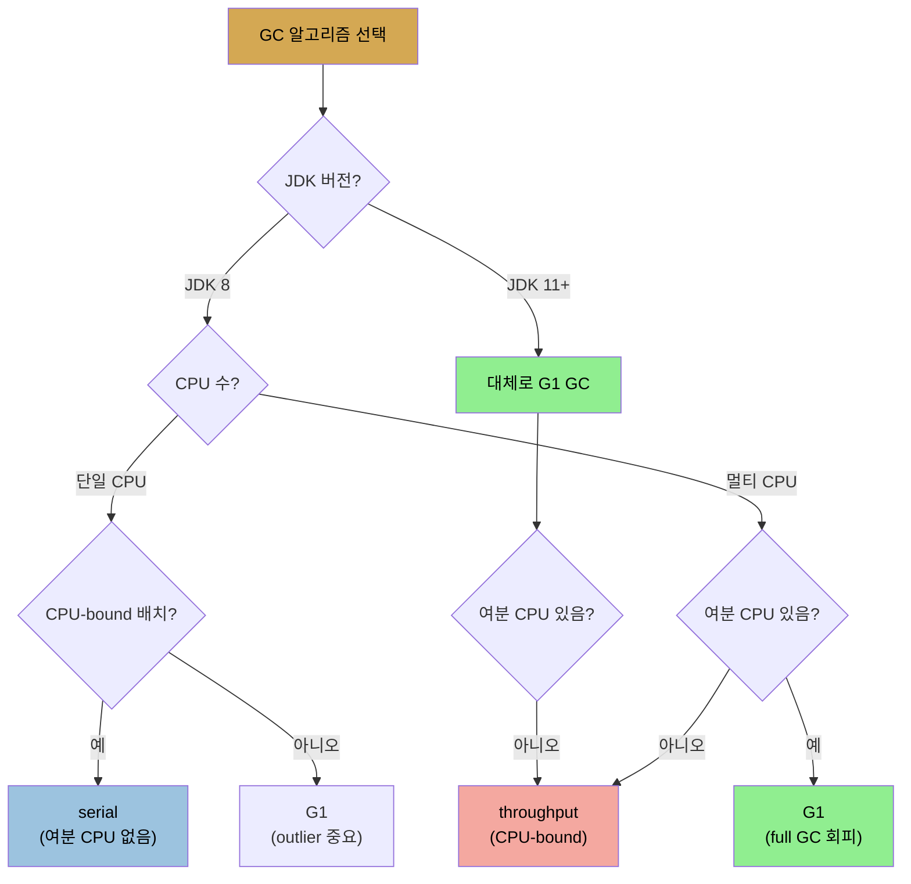

# GC 알고리즘 선택 — serial·throughput·G1·CMS
> JDK 11은 대체로 G1 GC가 낫고, 단일 CPU CPU-bound는 serial, 멀티 CPU CPU-bound는 throughput이 유리하며, G1은 여분 CPU가 있어야 합니다

[앞 편](./05-01.GC%20기초와%20세대별%20컬렉터.md)이 GC 원리였다면, 이 편은 OpenJDK의 구체적 GC 알고리즘과 어느 것을 고를지입니다. Java 성능이 GC에 크게 의존해 컬렉터가 여럿입니다. OpenJDK에는 프로덕션용 셋, JDK 11에서 deprecated지만 JDK 8에서 인기 있는 하나, 실험적인 것들이 있습니다.

## 1. 네 컬렉터 — serial·throughput·G1·CMS
> serial은 단일 스레드, throughput은 멀티 스레드로 빠른 minor GC, G1은 concurrent로 최소 pause, CMS는 첫 concurrent지만 deprecated입니다

OpenJDK의 알고리즘 지원 현황입니다(S: 완전 지원, D: deprecated, E: 실험).

| 알고리즘 | JDK 8 | JDK 11 | JDK 12 |
|----------|-------|--------|--------|
| Serial GC | S | S | S |
| Throughput(Parallel) GC | S | S | S |
| G1 GC | S | S | S |
| CMS | S | D | D |
| ZGC | - | E | E |
| Shenandoah | E2 | E2 | E2 |
| Epsilon GC | - | E | E |

1. **serial GC** — 가장 단순한 컬렉터입니다. client-class 머신(Windows 32비트 JVM)이나 단일 프로세서 머신의 기본입니다. 한때 사라질 것 같았지만, 코어 1개(하이퍼스레딩으로 2 CPU처럼 보여도) VM·Docker가 다시 관련성을 줬습니다. **단일 스레드로 힙을 처리**하고 minor·full GC 모두 모든 스레드를 멈추며 full GC에 old를 완전 compaction합니다. `-XX:+UseSerialGC`로 켭니다(대부분 기본일 때 씁니다). 주의: 다른 플래그와 달리 마이너스로 바꿔(`-XX:-UseSerialGC`) 끌 수 없고, 다른 알고리즘을 지정해 끕니다.
2. **throughput(parallel) GC** — JDK 8에서 2+ CPU의 64비트 머신 기본입니다. **여러 스레드로 young을 수집**해 minor GC가 serial보다 훨씬 빠르고, old도 멀티 스레드로 처리합니다. 멀티 스레드를 써 흔히 parallel collector라 불립니다. minor·full 모두 STW이고 full에 old 완전 compaction. `-XX:+UseParallelGC`로 켭니다(옛 `-XX:+UseParallelOldGC`는 obsolete).
3. **G1 GC(garbage first)** — concurrent 전략으로 최소 pause로 힙을 수집합니다. **JDK 11+ 2+ CPU 64비트 JVM의 기본**입니다. 힙을 **region**으로 나누되 여전히 두 세대로 봅니다. 일부 region이 young이고, young은 모든 스레드를 멈추고 살아있는 객체를 old·survivor로 옮겨 수집합니다(멀티 스레드). **old는 애플리케이션을 안 멈추는 백그라운드 스레드가 처리**하고, region 간 복사로 (최소한 부분적으로) 정상 처리 중 compaction해 힙 단편화를 막습니다. 트레이드오프는 백그라운드 스레드의 CPU입니다. `-XX:+UseG1GC`로 켭니다. JDK 8에서도 동작하지만(특히 후기 빌드), 한 주요 성능 기능이 빠져 있어 그 릴리스에 부적합할 수 있습니다.
4. **CMS** — 첫 concurrent collector였습니다. minor GC에 모든 스레드를 멈추고 멀티 스레드로 수행합니다. **JDK 11에서 공식 deprecated**이고 JDK 8에서도 권장 안 됩니다. **치명적 결함은 백그라운드 처리 중 힙을 compaction할 방법이 없다는 것**입니다. 힙이 단편화되면(언젠가 일어남) 모든 스레드를 멈추고 compaction해야 해 concurrent의 목적을 무력화합니다. G1 등장과 맞물려 더는 권장되지 않습니다. `-XX:+UseConcMarkSweepGC`로 켭니다.

GC는 계속 JVM 엔지니어의 활발한 분야로, 최신 Java에는 세 실험 알고리즘(ZGC·Shenandoah·Epsilon)이 있습니다(6장 상세).

## 2. 명시적 GC — System.gc()와 DisableExplicitGC
> System.gc()는 항상 full GC를 일으켜 거의 항상 나쁜 생각이며, 서드파티의 잘못된 호출은 DisableExplicitGC로 막습니다

GC는 보통 JVM이 필요하다고 판단할 때 일어납니다. young이 차면 minor GC, old가 차면 full GC, 힙이 차기 시작하면 concurrent GC입니다. Java는 GC를 강제하는 `System.gc()`를 제공하는데, **호출은 거의 항상 나쁜 생각**입니다. 이 호출은 (G1·CMS로 돌아도) **항상 full GC를 일으켜** 스레드가 비교적 오래 멈추고, 애플리케이션을 더 효율적으로 만들지도 않습니다(GC를 더 일찍 일으킬 뿐 성능 영향을 옮기는 것).

예외는 있습니다. 작은 벤치마크에서 JVM warm-up 후 측정 사이클 전에 GC를 강제하면 의미 있을 수 있습니다(jmh가 선택적으로 함). 힙 분석 시 힙 덤프 전 full GC 강제도 좋습니다(`jcmd <pid> GC.run`이나 jconsole의 Perform GC 버튼). 또 RMI는 분산 GC의 일부로 1시간마다 `System.gc()`를 호출하는데, `-Dsun.rmi.dgc.server.gcInterval=N`·`-Dsun.rmi.dgc.client.gcInterval=N`(ms, 기본 3600000)으로 조정합니다. **서드파티 코드가 `System.gc()`를 잘못 호출하면 `-XX:+DisableExplicitGC`(기본 false)로 막습니다.** Java EE 서버는 RMI GC 호출 간섭을 막으려 이 인자를 흔히 포함합니다.

## 3. 알고리즘 선택 — 단일 CPU·하이퍼스레딩·멀티 CPU
> G1이 기본 선택이지만 여분 CPU가 있어야 하며, 단일 CPU CPU-bound 배치는 serial이, 멀티 CPU CPU-bound는 throughput이 유리합니다

선택은 하드웨어·애플리케이션·성능 목표에 달렸습니다. **"G1 GC가 대체로 낫다"를 기본 규칙**으로 시작하되, GC에서 예외는 애플리케이션이 가용 하드웨어 대비 필요로 하는 CPU와 G1 백그라운드 스레드가 할 처리량입니다.

**단일 CPU** — JVM은 단일 CPU에서 serial을 기본으로 씁니다(CPU 1개 VM·Docker 포함). 단 JDK 8 초기 버전은 단일 CPU Docker에서도 throughput을 기본으로 써, 그 환경에서는 serial을 (수동 설정해도) 시도해야 합니다. CPU-intensive 배치 작업(CPU가 오래 100%)에서 serial이 뚜렷한 이점을 보입니다. 단일 CPU에서 10만 종목 3년치를 계산한 측정입니다.

| 알고리즘 | 경과 시간 | GC pause 시간 |
|----------|-----------|---------------|
| Serial | 434초 | 79초 |
| Throughput | 503초 | 144초 |
| G1 GC | 501초 | 97초 |

실제 계산 시간(경과 − pause)은 serial·throughput 모두 약 355초로 같지만, **serial이 GC pause에 훨씬 적게 써 이깁니다**(full GC 평균 serial 505ms vs throughput 1,392ms — throughput 알고리즘의 오버헤드는 2+ 스레드일 때 가치 있지만 단일 스레드엔 방해). serial과 G1을 비교하면, G1은 pause를 빼도 404초로 기대치 355초보다 49초 더 걸립니다. **계산 스레드가 모든 CPU를 쓰는데 G1 백그라운드 스레드도 CPU가 필요해, CPU를 나눠 쓰느라 계산 스레드가 49초 못 도는 것**입니다. 이것이 "G1을 고르면 백그라운드 스레드용 CPU가 충분해야 한다"의 뜻입니다.

반대로 단일 CPU에서 ~11 req/s(~50% CPU)를 처리하는 마이크로서비스 응답 시간입니다.

| 알고리즘 | 평균 | 90th% | 99th% | CPU |
|----------|------|-------|-------|-----|
| Serial | 0.10초 | 0.18초 | 0.69초 | 53% |
| Throughput | 0.16초 | 0.18초 | 1.40초 | 49% |
| G1 GC | 0.13초 | 0.28초 | 0.40초 | 48% |

serial이 평균은 30% 더 빠릅니다(minor GC가 빨라 평균 요청이 덜 지연). 그러나 일부 운 나쁜 요청이 full GC(평균 592ms, 최대 730ms)에 걸려 1%가 700ms 가까이 걸립니다. throughput은 full GC가 더 느려(평균 1,192ms) 99th%가 serial의 두 배입니다. **G1은 중간**입니다. 평균은 serial보다 나쁘지만(minor GC가 serial 86ms vs G1 141ms), **99th%는 serial보다 훨씬 낮습니다**(full GC를 피해서). 평균 30ms 차이보다 99th% 300ms 차이가 더 중요하다고 보면 G1이 낫습니다. 단 full GC가 없게 튜닝하면 serial과 G1이 비등해집니다.

**하이퍼스레딩 단일 CPU** — JVM은 2 CPU로 보여 serial을 기본으로 안 쓰지만(JDK 8 throughput, JDK 11 G1), 이 하드웨어에서도 serial이 흔히 유리합니다. 배치 측정에서 throughput은 2 스레드를 돌려도 pause가 절반이 아니라 ~20%만 줄고, G1은 여전히 백그라운드 CPU를 못 얻습니다. **즉 잦은 GC의 긴 배치에서는 "2 CPU"가 있어도 JVM의 기본 선택이 틀리고 serial이 낫습니다.** (실제 2 코어면 throughput이 72초로 serial보다 빨라 serial의 유용성이 사라집니다.) 또 아주 작은 힙(~100MB)은 코어 수와 무관하게 serial이 나을 수 있습니다.

**멀티 CPU** — G1과 throughput의 트레이드오프는 같습니다. 4 코어에서 2/4 애플리케이션 스레드 측정에서 G1이 throughput보다 빠릅니다(2 스레드: G1 410초 vs throughput 446초 — throughput이 full GC에 35초 멈춤). **throughput이 유리한 경우**는 ① full GC가 없거나 적을 때, ② old가 대체로 꽉 차 G1 백그라운드 스레드가 더 일할 때, ③ G1 스레드가 CPU를 굶을 때입니다. old를 65% 채워 둔 테스트(4 CPU)에서는 throughput이 15초만 멈춰(old 수집 1.5초) G1(30초)보다 빨랐고, CPU가 부족한 테스트에서도 throughput이 G1을 앞섰습니다.

## 4. 평균 CPU의 함정 — sawtooth 패턴
> 평균 CPU만 보면 GC 사이클을 놓치며, throughput은 GC 시 100%로, G1은 백그라운드 스레드로 CPU가 톱니처럼 튑니다

테스트 중 평균 CPU만 보면 GC 사이클의 그림을 놓칩니다. **throughput collector는 도는 동안 (기본) 머신 CPU를 100% 소비**합니다. 2 애플리케이션 스레드 테스트에서 대부분은 앱 스레드만 50%를 쓰다, GC가 끼면 100%로 튑니다. 그래서 실제 CPU는 **sawtooth(톱니) 패턴**인데, 평균은 직선으로 보고됩니다.

concurrent collector는 다릅니다. 앱 스레드가 50%로 시작하다 garbage가 쌓이면 G1 백그라운드 스레드가 끼어 CPU 1개를 더 점유해 75%로 오르고, 끝나면 50%로 떨어집니다. (G1 young collection 중 아주 짧은 100% 스파이크가 있지만 무시할 만합니다.) 여러 백그라운드 스레드가 있으면 효과가 비슷하게 장기 CPU 평균을 끌어올립니다. **CPU 사용 규칙으로 트리거되는 모니터링 시스템이 있으면, full GC의 100% 스파이크나 백그라운드 처리의 더 길고 낮은 스파이크가 CPU 알림을 오발하지 않게 주의**해야 합니다. 이는 Java 프로그램의 정상 현상입니다.

## 자주 받는 오해
> G1이 항상 최선이라고 생각하기 쉽지만, 여분 CPU가 없으면 serial·throughput이 더 나을 수 있습니다

1. "G1 GC가 항상 최선이다"라고 생각하기 쉽지만, G1은 백그라운드 스레드가 쓸 여분 CPU가 있어야 합니다. CPU-bound 배치가 단일 CPU(하이퍼스레딩 포함)를 다 쓰면 G1 백그라운드가 CPU를 못 얻어 계산이 49초 더 걸리는 식으로 serial보다 느립니다.
2. "System.gc()를 호출하면 메모리가 정리돼 효율적이다"라고 생각하기 쉽지만, 항상 full GC를 일으켜 스레드를 오래 멈추고 성능 영향을 앞당길 뿐입니다. 벤치마크 warm-up 후나 힙 덤프 전 같은 예외만 정당하고, 서드파티의 잘못된 호출은 `DisableExplicitGC`로 막습니다.
3. "평균 CPU가 낮으면 GC 부하가 작다"라고 생각하기 쉽지만, 실제 CPU는 GC 시 100%로 튀는 sawtooth라 평균이 가립니다. 모니터링 CPU 알림이 이 정상 스파이크를 오발하지 않게 해야 합니다.

## 면접에서 받을 만한 질문
1. **serial·throughput·G1 GC의 차이와 기본 환경은?** → serial은 단일 스레드로 힙을 처리하고 단일 CPU·client 머신의 기본입니다. throughput(parallel)은 여러 스레드로 young·old를 수집해 minor GC가 빠르고 JDK 8 멀티 CPU의 기본입니다. 둘 다 minor·full 모두 STW입니다. G1은 concurrent 전략으로 old를 백그라운드 스레드가 애플리케이션을 안 멈추고 처리해 full GC를 피하고, JDK 11+ 멀티 CPU의 기본이며, 대가로 백그라운드 CPU가 필요합니다.
2. **CMS가 deprecated된 이유는?** → CMS는 첫 concurrent collector였지만, 백그라운드 처리 중 힙을 compaction할 방법이 없는 치명적 결함이 있습니다. 힙이 단편화되면(언젠가 일어남) 모든 애플리케이션 스레드를 멈추고 compaction해야 해 concurrent collector의 목적을 무력화합니다. G1은 region 간 복사로 정상 처리 중 부분 compaction을 해 이를 피하므로, CMS는 JDK 11에서 deprecated되고 G1으로 대체됐습니다.
3. **단일 CPU CPU-bound 배치에서 serial이 G1보다 빠른 이유는?** → 계산 스레드가 단일 CPU를 다 쓰는데 G1 백그라운드 스레드도 CPU가 필요합니다. CPU가 부족해 둘이 CPU를 나눠 쓰느라 계산 스레드가 일정 시간(측정 예에서 49초) 못 돌아 더 느려집니다. serial은 백그라운드 스레드가 없어 이 경쟁이 없고, 단일 스레드 알고리즘이라 throughput의 오버헤드도 없어 가장 빠릅니다.
4. **throughput collector가 G1보다 유리한 경우는?** → 애플리케이션 스레드를 멈추는 시간이 G1보다 적을 때입니다. 구체적으로 ① full GC가 없거나 적을 때(full GC pause가 없으면 throughput이 불리하지 않음), ② old가 대체로 꽉 차 G1 백그라운드 스레드가 더 일해야 할 때, ③ G1 스레드가 CPU를 굶을 때입니다. 이 경우 throughput의 단순한 알고리즘과 적은 백그라운드 부담이 이깁니다.

## 관련 문서
- [GC 기초와 세대별 컬렉터](./05-01.GC%20기초와%20세대별%20컬렉터.md) — minor/full GC와 concurrent collector 원리
- [기본 튜닝 (1) — 힙과 세대 크기](./05-03.기본%20튜닝%20(1)%20—%20힙과%20세대%20크기.md) — 컬렉터 공통 튜닝
- [OS 레벨 도구 — CPU·디스크·네트워크](./03-01.OS%20레벨%20도구%20—%20CPU·디스크·네트워크.md) — sawtooth CPU 패턴과 모니터링
- [이 책 인덱스 (Java Performance MOC)](./README.md) — 장별 정독 노트 진척
