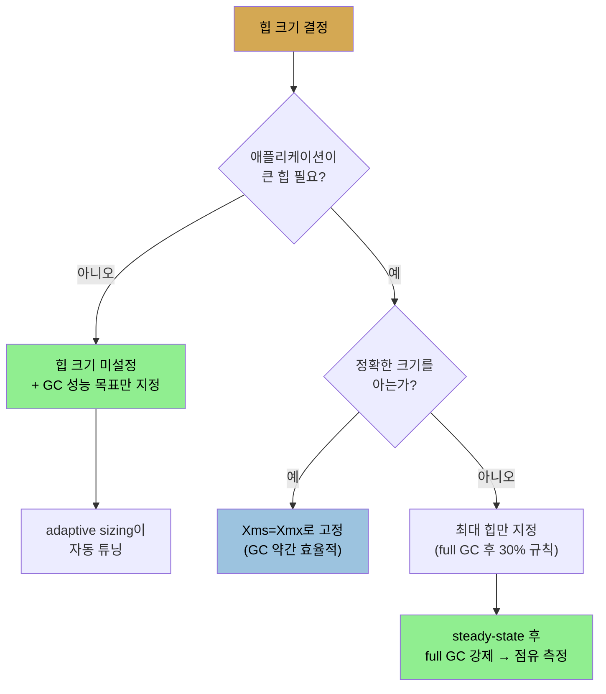

# 기본 튜닝 (1) — 힙과 세대 크기
> 힙은 물리 메모리보다 크게 잡지 않고 full GC 후 30% 점유되게 사이징하며, 세대 크기는 young에 얼마를 주느냐로 정하고 adaptive sizing이 자동 조정합니다

[앞 편](./05-02.GC%20알고리즘%20선택%20—%20serial·throughput·G1·CMS.md)이 알고리즘 선택이었다면, 이 편은 모든 컬렉터가 공유하는 기본 튜닝입니다. GC 알고리즘은 힙 처리 방식이 달라도 기본 설정 파라미터를 공유하고, 많은 경우 이 기본 설정만으로 애플리케이션을 돌릴 수 있습니다. 이 편은 힙 크기와 세대 크기를, [다음 편](./05-04.기본%20튜닝%20(2)%20—%20metaspace·병렬·GC%20도구.md)이 metaspace·병렬·도구를 다룹니다.


## 1. 힙 사이징 — 균형과 swapping 위험
> 힙이 작으면 GC 과다, 크면 pause가 길어지며, 물리 메모리보다 큰 힙은 full GC 때 swapping으로 pause가 10배 이상 길어집니다

힙 크기 선택은 균형의 문제입니다. **힙이 너무 작으면** GC에 시간을 너무 쓰고 애플리케이션 로직에 시간이 부족합니다. 그러나 **아주 큰 힙도 답이 아닙니다.** GC pause 시간이 힙 크기에 의존해, 힙이 커지면 pause 지속 시간도 길어집니다. pause는 덜 자주 일어나지만 그 길이가 전체 성능을 끌어내립니다.

두 번째 위험은 **swapping**입니다. OS는 가상 메모리로 물리 메모리를 관리합니다. 8GB RAM 머신을 16GB처럼 보이게 할 수 있고, 안 쓰는 부분을 디스크로 옮겼다(swapping/paging) 필요할 때 디스크에서 RAM으로 복사합니다. 여러 앱을 도는 시스템엔 잘 맞지만(대부분 동시에 활성이 아니므로), **Java 앱엔 잘 안 맞습니다.** 12GB 힙 Java 프로그램을 8GB RAM 시스템에서 돌리면 OS가 힙 8GB는 RAM, 4GB는 디스크에 두는데, JVM은 이를 모르고 12GB를 다 채웁니다. **OS가 디스크-RAM swap을 하느라 심한 성능 저하**가 생깁니다. 더 나쁘게, **swapping이 보장되는 한 순간이 full GC**입니다. JVM이 전체 힙에 접근해야 하기 때문입니다. full GC 중 swapping하면 pause가 평소보다 **한 자릿수(10배 이상) 길어집니다.** G1 백그라운드 스레드도 디스크-메모리 복사 대기로 뒤처져 비싼 concurrent mode failure가 납니다.

그래서 **첫 규칙은 힙을 물리 메모리보다 크게 잡지 않는 것**입니다. 여러 JVM이면 힙 합에 적용되고, JVM의 native 메모리와 다른 앱을 위해 여유(보통 OS 프로파일에 최소 1GB)를 남깁니다.


## 2. Xms·Xmx와 기본 힙 크기
> 힙은 초기값 Xms와 최대값 Xmx로 정하며, JVM은 GC가 많으면 최대까지 힙을 늘리고, full GC 후 30% 점유가 좋은 규칙입니다

힙 크기는 두 값으로 제어합니다. 초기값(`-XmsN`)과 최대값(`-XmxN`)입니다. 기본값은 OS·시스템 RAM·JVM에 따라 다르고, 다른 플래그에도 영향받는 핵심 ergonomic 튜닝입니다. JVM의 목표는 **시스템 자원 기반으로 "합리적" 초기값을 찾고, 애플리케이션이 더 필요로 할 때만(GC에 쓰는 시간 기준) "합리적" 최대까지 늘리는 것**입니다.

| OS·JVM | 초기 힙(Xms) | 최대 힙(Xmx) |
|--------|--------------|--------------|
| Linux | min(512MB, 물리의 1/64) | min(32GB, 물리의 1/4) |
| macOS | 64MB | min(1GB, 물리의 1/4) |
| Windows 32비트 client | 16MB | 256MB |
| Windows 64비트 server | 64MB | min(1GB, 물리의 1/4) |

(물리 메모리 192MB 미만이면 최대 힙은 물리의 절반입니다.) **JDK 8 u192 이전 Docker(메모리 한도 지정)는 이 값이 틀립니다.** JVM이 머신 전체 메모리로 기본 크기를 계산하기 때문입니다(이후 버전·JDK 11은 컨테이너 한도 사용). 초기·최대값이 있어 JVM은 워크로드에 따라 동작을 조정합니다. 초기 힙으로 GC를 너무 많이 하면 "올바른" 양의 GC를 할 때까지(또는 최대에 닿을 때까지) 힙을 계속 늘립니다.



큰 힙이 필요 없으면 **힙 크기를 아예 안 정해도 됩니다.** 대신 GC 알고리즘의 성능 목표(견딜 pause 시간, GC에 쓸 시간 비율 등)를 지정합니다(6장). 다만 **컨테이너 환경에서는 보통 최대 힙을 지정해야 합니다.** VM에서 단일 JVM을 주로 돌리면 기본 초기 힙이 VM 메모리의 1/4뿐이고, 메모리 한도가 있는 JDK 11 Docker에서는 힙이 그 메모리 대부분을 쓰길 원합니다(여유는 남기고). 기본값은 컨테이너 전용보다 여러 앱을 섞어 돌리는 시스템에 맞춰져 있습니다.

**최대 힙의 확고한 규칙은 없지만(머신이 감당 못 할 크기만 피하면), 좋은 규칙은 full GC 후 30% 점유되게 사이징하는 것**입니다. 계산하려면 애플리케이션을 steady-state(캐시 로드·최대 클라이언트 연결 등 완료)까지 돌린 뒤, jconsole로 붙어 full GC를 강제하고 완료 시 사용 메모리를 봅니다. 이 방식이면 컨테이너에 JVM 비힙 용도로 0.5~1GB를 더 둡니다. 최대를 명시해도 힙은 기본 초기 크기에서 시작해 GC 목표를 맞추려 자라므로, 필요보다 큰 힙을 지정해도 메모리 페널티가 꼭 있는 건 아닙니다(목표 맞출 만큼만 자람). 정확한 크기를 알면 **`-Xms4096m -Xmx4096m`처럼 초기·최대를 같게** 두면 됩니다(리사이즈 여부를 따질 필요가 없어 GC가 약간 효율적).


## 3. 세대 사이징 — NewRatio·NewSize·Xmn
> 세대 크기는 young에 얼마를 주느냐로 정하며(old는 나머지), NewRatio 기본 2이면 young은 초기 힙의 33%입니다

힙 크기가 정해지면 JVM은 얼마를 young에, 얼마를 old에 줄지 정합니다. 보통 자동으로 하고 young/old 최적 비율을 잘 찾습니다. 성능 함의는 분명합니다. **young이 상대적으로 크면 young GC pause가 길지만, young이 덜 자주 수집되고 old 승격이 적습니다. 반면 old가 상대적으로 작아 더 자주 차 full GC를 더 합니다.** 균형이 핵심입니다.

세대 크기 플래그는 모두 young 크기를 조정하고, old는 나머지를 받습니다.

| 플래그 | 역할 |
|--------|------|
| `-XX:NewRatio=N` | young/old 비율 설정 |
| `-XX:NewSize=N` | young 초기 크기 |
| `-XX:MaxNewSize=N` | young 최대 크기 |
| `-XmnN` | NewSize·MaxNewSize를 같은 값으로(단축) |

young은 먼저 **NewRatio(기본 2)**로 사이징됩니다. 공식은 다음과 같습니다.

```
초기 young 크기 = 초기 힙 크기 / (1 + NewRatio)
```

기본적으로 young은 초기 힙의 **33%**로 시작합니다. `NewSize`로 명시하면 NewRatio 계산값보다 우선합니다(NewSize 기본값은 없음 — 기본은 NewRatio로 계산). 힙이 커지면 young도 `MaxNewSize`까지 커집니다(이 최대도 기본은 NewRatio로, 단 최대 힙 기준). young을 최소·최대 범위로 튜닝하기는 꽤 어려워서, **힙이 고정(Xms=Xmx)이면 `-Xmn`으로 young도 고정**하는 게 보통 낫고, 동적 힙에 더 큰(작은) young이 필요하면 `NewRatio`를 정합니다.


## 4. adaptive sizing
> 과거 GC를 보고 세대 비율을 자동 조정하며, 작은 앱은 힙 과지정이, 많은 앱은 튜닝 자체가 불필요해집니다

힙·세대·survivor 크기는 JVM이 정책·튜닝에 따라 최적 성능을 찾으려 실행 중 변할 수 있습니다. 이는 best-effort이고 과거 성능에 의존합니다. **미래 GC 사이클이 최근과 비슷하리라는 가정**인데, 많은 워크로드에 합리적이고 할당률이 갑자기 바뀌어도 JVM이 새 정보로 재조정합니다.

adaptive sizing은 두 이점을 줍니다.

1. **작은 앱은 힙을 과지정할 걱정이 없습니다.** Java NoSQL 서버의 관리 명령행 프로그램처럼 짧게 살고 메모리를 거의 안 쓰는 앱은, 기본 힙이 1GB까지 자랄 수 있어도 64(또는 16)MB만 씁니다. 플랫폼 기본값이 큰 메모리를 안 쓰게 보장합니다.
2. **많은 앱은 힙 크기를 아예 튜닝할 필요가 없습니다.** 플랫폼 기본보다 큰 힙이 필요하면 그 큰 힙만 지정하고 나머지 디테일은 잊으면 됩니다. JVM이 GC 성능 목표에 맞춰 힙·세대 크기를 자동 튜닝합니다.

다만 크기 조정에 작은 시간이 들고(대부분 GC pause 중), GC 파라미터와 힙 크기를 정밀 튜닝했다면 adaptive sizing을 끌 수 있습니다. 뚜렷이 다른 단계를 거치는 앱에서 한 단계에 맞춰 튜닝하려 할 때도 유용합니다. 전역으로 **`-XX:-UseAdaptiveSizePolicy`(기본 true)로 끕니다.** survivor space를 빼면, 최소·최대 힙을 같게 하고 young 초기·최대를 같게 해도 사실상 adaptive sizing이 꺼집니다. JVM이 공간을 어떻게 리사이즈하는지 보려면 `-XX:+PrintAdaptiveSizePolicy`를 켭니다. **adaptive sizing은 GC 알고리즘이 pause-time 목표를 맞추는 방식이므로 일반적으로 켜 두고**, 정밀 튜닝한 힙에만 작은 성능 이득을 위해 끕니다.


## 자주 받는 오해
> 힙을 크게 잡을수록 좋다고 생각하기 쉽지만, pause가 길어지고 물리 메모리를 넘으면 swapping으로 치명적입니다

1. "힙은 클수록 GC가 적게 일어나 좋다"고 생각하기 쉽지만, 힙이 크면 pause 지속 시간이 길어지고, 물리 메모리를 넘으면 full GC 때 swapping이 보장돼 pause가 10배 이상 길어집니다. 힙은 물리 메모리보다 작게, full GC 후 30% 점유되게 잡습니다.
2. "큰 힙을 지정하면 그만큼 메모리를 바로 쓴다"고 생각하기 쉽지만, 힙은 기본 초기 크기에서 시작해 GC 목표를 맞출 만큼만 자랍니다. 필요보다 큰 최대를 지정해도 꼭 메모리 페널티가 있는 건 아닙니다.
3. "세대 크기는 직접 튜닝해야 한다"고 생각하기 쉽지만, adaptive sizing이 과거 GC를 보고 young/old 비율을 자동 조정합니다. 보통 켜 두는 게 낫고, 정밀 튜닝한 힙에만 끕니다.


## 면접에서 받을 만한 질문
1. **힙을 물리 메모리보다 크게 잡으면 안 되는 이유는?** → 물리 메모리를 넘으면 OS가 힙 일부를 디스크로 swap하는데, JVM은 이를 모르고 힙을 다 채웁니다. 특히 full GC는 전체 힙에 접근하므로 swapping이 보장되고, 그 순간 디스크-RAM 복사로 pause가 평소보다 10배 이상 길어집니다. G1 백그라운드 스레드도 복사 대기로 뒤처져 concurrent mode failure가 납니다. 그래서 힙은 물리 메모리보다 작게, 여러 JVM이면 합이 작게 잡습니다.
2. **최대 힙 크기를 어떻게 정합니까?** → 좋은 규칙은 full GC 후 힙이 30% 점유되게 사이징하는 것입니다. 애플리케이션을 steady-state(캐시·연결 로드 완료)까지 돌린 뒤 jconsole로 붙어 full GC를 강제하고 완료 시 사용 메모리를 측정해, 그 값의 약 3배를 최대 힙으로 잡습니다. 컨테이너면 JVM 비힙 용도로 0.5~1GB를 더 둡니다.
3. **NewRatio가 무엇이고 young 세대 크기에 어떻게 작용합니까?** → 세대 크기 플래그는 young 크기를 정하고 old는 나머지를 받습니다. NewRatio(기본 2)는 `초기 young = 초기 힙 / (1 + NewRatio)` 공식으로, 기본적으로 young을 초기 힙의 33%로 만듭니다. young이 크면 young GC pause가 길지만 덜 자주 일어나고 old 승격이 적으며, 반대로 old가 작아 더 자주 차 full GC를 더 합니다. 힙이 고정이면 `-Xmn`으로 young을 고정하는 게 보통 낫습니다.
4. **adaptive sizing은 무엇이고 왜 보통 켜 둡니까?** → JVM이 과거 GC 사이클을 보고 힙·세대·survivor 크기를 자동 조정하는 기능입니다(기본 켜짐). 작은 앱은 힙을 과지정하지 않아도 되고(64MB만 씀), 많은 앱은 큰 힙만 지정하면 나머지를 자동 튜닝해 줍니다. GC 알고리즘이 pause-time 목표를 맞추는 방식이기도 해서 일반적으로 켜 두고, 정밀 튜닝한 힙에만 작은 성능 이득을 위해 끕니다.


## 관련 문서
- [GC 알고리즘 선택 — serial·throughput·G1·CMS](./05-02.GC%20알고리즘%20선택%20—%20serial·throughput·G1·CMS.md) — 알고리즘별 힙 처리
- [기본 튜닝 (2) — metaspace·병렬·GC 도구](./05-04.기본%20튜닝%20(2)%20—%20metaspace·병렬·GC%20도구.md) — metaspace와 GC 스레드
- [성능 — art와 science, 그리고 플랫폼·환경](./01-01.성능%20—%20art와%20science,%20그리고%20플랫폼·환경.md) — Docker ergonomics와 JDK 8 u192 경계
- [이 책 인덱스 (Java Performance MOC)](./README.md) — 장별 정독 노트 진척
