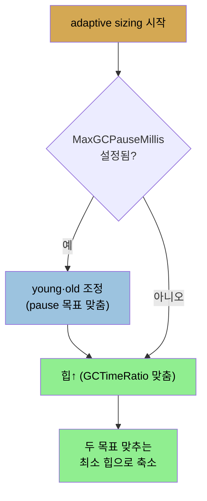

# throughput collector 이해와 튜닝
> throughput collector는 찾기·해제·compaction을 한 사이클에 하며, MaxGCPauseMillis와 GCTimeRatio로 pause 시간과 힙 크기의 균형을 잡습니다

5장이 모든 GC에 공통인 동작과 기본 튜닝을 다뤘다면, 6장은 각 컬렉터의 구체적 동작과 튜닝을 다룹니다. 개별 컬렉터를 튜닝하는 데 필요한 핵심 정보는 그 컬렉터를 켰을 때의 **GC 로그**라, 이 장은 로그 출력 관점에서 각 알고리즘을 봅니다. 이 노트는 throughput collector로 시작합니다. G1 GC가 대체로 선호되지만, throughput의 디테일이 더 쉬워 동작 이해의 토대가 됩니다.


## 1. minor collection과 full GC
> minor collection은 eden을 비워 survivor·old로 옮기고, full GC는 old를 청소하고 완전 compaction합니다

throughput collector는 세 기본 연산(사용 안 하는 객체 찾기·메모리 해제·힙 compaction)을 같은 GC 사이클에서 합니다. 이 연산들을 합쳐 **collection**이라 하고, 한 연산에서 young 또는 old를 수집합니다.

**minor collection**은 eden이 차면 일어납니다. eden의 모든 객체를 옮깁니다. 일부는 survivor space로, 일부는 old로 가고, 더는 참조 안 되는 많은 객체는 폐기됩니다. eden이 비므로 compaction된 셈입니다. JDK 8 PrintGCDetails 로그입니다.

```
17.806: [GC (Allocation Failure) [PSYoungGen: 227983K->14463K(264128K)]
             280122K->66610K(613696K), 0.0169320 secs]
         [Times: user=0.05 sys=0.00, real=0.02 secs]
```

프로그램 시작 17.806초 후의 GC입니다. young 객체가 227MB에서 14MB(survivor)로 줄었고, young 전체 크기는 264MB입니다. 힙 전체 점유는 280MB에서 66MB로 줄었고, 힙 크기는 613MB입니다. 연산은 0.02초 미만이 걸렸고, **멀티 스레드(4개)로 해서 CPU time(user)이 real time보다 많습니다.** JDK 11 로그는 같은 정보를 다른 형식(여러 줄)으로 주고 metaspace 크기도 출력하지만, metaspace는 minor collection 중 안 변합니다.

**full GC**는 old를 청소하고 살아있는 객체를 compaction합니다. old에는 활성 참조가 있는 객체만 남고, 모두 compaction돼 old 앞쪽이 채워지고 나머지가 free가 됩니다.

```
64.546: [Full GC (Ergonomics) [PSYoungGen: 15808K->0K(339456K)]
          [ParOldGen: 457753K->392528K(554432K)] 473561K->392528K(893888K)
      [Metaspace: 56728K->56728K(115392K)], 1.3367080 secs]
      [Times: user=4.44 sys=0.01, real=1.34 secs]
```

young이 0이 됐고(survivor 포함 비움), old가 457MB에서 392MB로 줄었습니다. metaspace 크기는 안 변합니다(대부분 full GC에서 metaspace는 수집 안 됨 — 단 metaspace가 차면 JVM이 full GC로 수집). 일이 훨씬 많아 real 1.3초, CPU 4.4초(4 스레드)가 걸렸습니다. JDK 11 로그는 phase별(Marking·Summary·Adjust Roots·Compaction·Post Compact)로 시간을 나눠 보여 줍니다. GC 로그의 타이밍은 이 컬렉터를 쓰는 애플리케이션에 GC가 미치는 전체 영향을 빠르게 파악하는 방법입니다.


## 2. 튜닝의 두 트레이드오프
> 큰 힙은 throughput을 높이지만 어느 지점 후 GC 사이클이 길어져 오히려 떨어집니다

throughput collector 튜닝은 전적으로 pause 시간과, 전체 힙·old·young 크기의 균형입니다. 두 트레이드오프가 있습니다.

1. **time vs space** — 큰 힙은 머신 메모리를 더 쓰지만, (어느 정도까지는) 애플리케이션 throughput이 높아집니다.
2. **GC 시간** — full GC pause 수는 힙을 키워 줄일 수 있지만, GC 시간이 길어져 평균 응답이 오히려 나빠질 수 있습니다. full GC pause는 old보다 young에 힙을 더 줘 줄일 수 있지만, 그러면 old collection 빈도가 늘어납니다.

저자의 그래프는 이를 보여 줍니다. 256MB 작은 힙은 GC에 36%를 써 throughput이 제한됩니다. 힙을 키우면 1,500MB까지 throughput이 급증하다(이때 GC 6%) 완만해집니다(수확 체감). **4,500MB 후에는 throughput이 약간 감소**합니다. 추가 메모리가 GC 사이클을 훨씬 길게 만들어, 덜 자주여도 전체 throughput을 줄이기 때문입니다(둘째 트레이드오프 지점).


## 3. adaptive sizing — MaxGCPauseMillis와 GCTimeRatio
> MaxGCPauseMillis는 견딜 최대 pause, GCTimeRatio는 GC에 쓸 시간 비율이며, 기본 99는 GC에 1%만 쓰는 목표입니다

throughput collector의 adaptive sizing은 pause-time 목표를 맞추려 힙·세대를 리사이즈합니다. 두 플래그로 설정합니다.

1. **`-XX:MaxGCPauseMillis=N`** — 애플리케이션이 견딜 최대 pause 시간입니다. 0이나 50ms로 두고 싶지만, **이 목표는 minor·full GC 둘 다에 적용**됩니다. 아주 작으면 old가 아주 작아져(50ms에 청소되게) full GC가 빈번해지고 성능이 끔찍해집니다. 현실적으로 달성 가능한 값을 줍니다. 기본 미설정입니다.
2. **`-XX:GCTimeRatio=N`** — GC에 쓸 시간 양(애플리케이션 스레드 실행 시간 대비)입니다. 비율이라 N 값에 생각이 필요합니다. 애플리케이션 스레드가 이상적으로 돌 시간 비율은 `GCTimeRatio / (1 + GCTimeRatio)`로 정해집니다. **기본 99는 0.99**, 즉 99%를 작업에, 1%만 GC에 쓰는 목표입니다. 다만 기본값의 깔끔함에 속으면 안 됩니다. **GCTimeRatio 95는 GC를 5%까지가 아니라 1.94%까지** 쓰라는 뜻입니다. 작업 시간 비율로 역산이 쉽습니다. 작업 95%(0.95) 목표면 `GCTimeRatio = 0.95/(1-0.95) = 19`입니다.

JVM은 두 플래그로 Xms~Xmx 경계 안에서 힙을 정합니다. **MaxGCPauseMillis가 우선**입니다. 설정되면 young·old 크기를 pause 목표가 맞을 때까지 조정하고, 그다음 time-ratio 목표가 맞을 때까지 힙을 키우며, 두 목표가 맞으면 최소 힙으로 줄입니다.



pause-time 목표가 기본 미설정이라, **자동 힙 사이징의 보통 효과는 GCTimeRatio 목표가 맞을 때까지 힙·세대가 커지는 것**입니다. 다만 기본 1%는 낙관적입니다. 저자 경험상 GC에 3~6%를 쓰고도 잘 동작하는 앱이 많고, 메모리가 심하게 제약된 환경은 10~15%를 쓰면서도 목표를 달성합니다. **별 목표가 없으면 time ratio 19(GC에 5%)에서 시작**합니다.


## 4. 동적 튜닝 측정 — "더 많은 게 늘 좋진 않다"
> GC가 병목이 아니면 힙을 키워도 throughput이 안 오르며, 비현실적 pause 목표는 오히려 성능을 떨어뜨립니다

작은 힙·적은 GC 앱(장수 객체가 적은 stock REST 서버)의 동적 튜닝 효과입니다.

| GC 설정 | 끝 힙 크기 | GC 시간 % | OPS |
|---------|-----------|-----------|-----|
| 기본 | 649MB | 0.9% | 9.2 |
| MaxGCPauseMillis=50ms | 560MB | 1.0% | 9.2 |
| Xms=Xmx=2048m | 2GB | 0.04% | 9.2 |

기본은 GCTimeRatio가 기대대로 동작해 힙이 649MB로 리사이즈되고 GC에 1%를 씁니다. MaxGCPauseMillis를 설정하면 그 목표를 맞추려 힙을 줄이는데, GC 일이 적어 여전히 1%·9.2 OPS를 유지합니다. **2GB 힙은 GC 시간을 줄이지만 GC가 지배 요인이 아니라 throughput이 안 오릅니다.** 엉뚱한 영역을 최적화한 셈입니다.

같은 앱을 사용자당 직전 50요청을 전역 캐시에 저장(JPA 캐시처럼)하게 바꾸면 GC가 더 일합니다.

| GC 설정 | 끝 힙 크기 | GC 시간 % | OPS |
|---------|-----------|-----------|-----|
| 기본 | 1.7GB | 9.3% | 8.4 |
| MaxGCPauseMillis=50ms | 588MB | 15.1% | 7.9 |
| Xms=Xmx=2048m | 2GB | 5.1% | 9.0 |
| Xmx=3560M; MaxGCRatio=19 | 2.1GB | 8.8% | 9.0 |

GC 시간이 큰 테스트라 동작이 다릅니다. JVM은 1% 목표를 못 맞추고 기본 목표에 최선을 다해 1.7GB를 씁니다. **비현실적 50ms 목표를 주면 588MB로 유지되지만 GC가 과도하게 빈번해져 throughput이 크게 떨어집니다(7.9 OPS).** 이 시나리오는 초기·최대를 2GB로 둬 전체 힙을 쓰게 하는 게 낫습니다. 마지막 줄은 적절히 사이징하고 현실적 5% time-ratio를 줬을 때입니다. JVM이 약 2GB를 최적 힙으로 정해 손튜닝과 같은 throughput을 냅니다. **동적 힙 튜닝이 좋은 첫 단계**이고, 많은 앱에 그것으로 충분하며 JVM 메모리 사용을 최소화합니다.


## 자주 받는 오해
> 힙을 키울수록 throughput이 오른다고 생각하기 쉽지만, GC가 병목이 아니면 안 오르고 어느 지점 후 오히려 떨어집니다

1. "힙을 키우면 throughput이 계속 오른다"고 생각하기 쉽지만, 어느 지점(예: 4,500MB) 후에는 GC 사이클이 길어져 오히려 떨어집니다. 또 GC가 병목이 아니면(stock REST 서버) 2GB로 키워도 9.2 OPS 그대로입니다.
2. "GCTimeRatio 95는 GC를 5%까지 쓴다는 뜻이다"라고 생각하기 쉽지만, `GCTimeRatio/(1+GCTimeRatio)` 공식상 작업 95%·GC 1.94%를 뜻합니다. 작업 95% 목표는 GCTimeRatio 19입니다.
3. "MaxGCPauseMillis를 작게 잡으면 pause가 짧아져 좋다"고 생각하기 쉽지만, 이 목표는 full GC에도 적용돼 old가 작아지고 full GC가 빈번해져 throughput이 떨어집니다. 달성 가능한 현실적 값을 줘야 합니다.


## 면접에서 받을 만한 질문
1. **throughput collector의 minor collection과 full GC는 무엇을 합니까?** → minor collection은 eden이 차면 일어나 eden 객체를 survivor·old로 옮기고 나머지를 폐기하며, 이동 자체로 young을 compaction합니다. full GC는 old를 청소하고 살아있는 객체를 앞쪽으로 완전 compaction합니다. 둘 다 모든 애플리케이션 스레드를 멈추고 멀티 스레드로 수행해, CPU time이 real time보다 많게 나옵니다.
2. **MaxGCPauseMillis와 GCTimeRatio의 차이와 우선순위는?** → MaxGCPauseMillis는 minor·full GC 둘 다에 적용되는 견딜 최대 pause 시간이고, GCTimeRatio는 GC에 쓸 시간 비율입니다. JVM은 MaxGCPauseMillis를 먼저 맞추려 young·old를 조정하고, 그다음 GCTimeRatio를 맞추려 힙을 키운 뒤, 두 목표를 맞추는 최소 힙으로 줄입니다. 기본은 MaxGCPauseMillis 미설정, GCTimeRatio 99(GC 1%)입니다.
3. **GCTimeRatio 값을 어떻게 계산합니까?** → 작업 시간 비율은 `GCTimeRatio/(1+GCTimeRatio)`입니다. 작업 95%(GC 5%)를 원하면 `0.95/(1-0.95)=19`로 GCTimeRatio 19를 씁니다. 기본 99는 작업 99%·GC 1%입니다. 다만 95는 GC 5%가 아니라 1.94%이므로 비율 해석에 주의해야 합니다.
4. **힙을 키워도 throughput이 안 오를 수 있는 이유는?** → GC가 성능 병목이 아닐 때입니다. 장수 객체가 적은 앱은 기본 649MB에서 GC에 1%만 쓰는데, 2GB로 키워도 GC 시간만 줄 뿐 throughput은 9.2 OPS 그대로입니다. 엉뚱한 영역을 최적화한 것입니다. 반대로 큰 힙은 GC 사이클을 길게 만들어 어느 지점 후 throughput을 떨어뜨리기도 합니다.


## 관련 문서
- [G1 GC 동작 — 4 연산과 5가지 full GC 실패](./06-02.G1%20GC%20동작%20—%204%20연산과%205가지%20full%20GC%20실패.md) — 다음 컬렉터, region 기반 동작
- [기본 튜닝 (2) — metaspace·병렬·GC 도구](./05-04.기본%20튜닝%20(2)%20—%20metaspace·병렬·GC%20도구.md) — GC 로그 읽기 기반
- [이 책 인덱스 (Java Performance MOC)](./README.md) — 장별 정독 노트 진척
