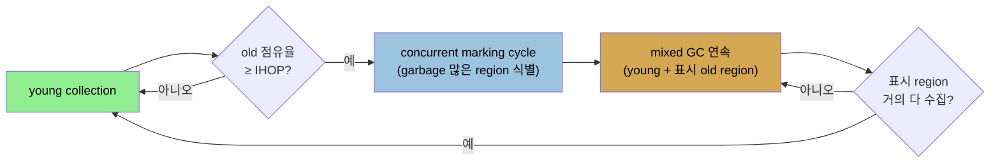

# G1 GC 동작 — 4 연산과 5가지 full GC 실패
> G1 GC는 힙을 region으로 나눠 garbage 많은 곳을 먼저 비우며, young·concurrent marking·mixed 세 연산이 정상이고 다섯 가지 실패가 full GC를 부릅니다

[앞 편](./06-01.throughput%20collector%20이해와%20튜닝.md)이 throughput collector였다면, 이 편은 JDK 11의 기본인 G1 GC의 동작입니다. G1 GC는 힙 안의 **discrete region**에서 동작합니다. 각 region(기본 약 2,048개)은 old나 young에 속하고 연속일 필요가 없습니다. **백그라운드 스레드가 garbage 많은 region을 찾아 먼저 비우는 것이 garbage first라는 이름의 유래**입니다.


## 1. region과 4 논리 연산
> region은 old/young에 속하고 연속일 필요가 없으며, G1은 young·concurrent marking·mixed·full GC 네 연산을 합니다

old의 region을 두는 아이디어는, 백그라운드 스레드가 미참조 객체를 찾을 때 어떤 region이 다른 region보다 garbage가 많다는 것입니다. region 수집은 여전히 스레드를 멈춰야 하지만, **G1은 거의 garbage인 region에 집중해 그것만 잠깐 비웁니다.** young region은 다릅니다. young GC 동안 young 전체가 해제되거나 (survivor·old로) 승격됩니다. 그래도 young을 region으로 정의하는 건 세대 리사이즈를 쉽게 하기 때문입니다.

G1 GC가 concurrent collector인 이유는 old의 free 객체 **marking이 애플리케이션 스레드와 동시에** 일어나기 때문입니다. 단 완전 concurrent는 아닙니다. young의 marking·compaction은 스레드를 멈춰야 하고, old compaction도 스레드가 멈춘 동안 일어납니다. G1 GC의 네 논리 연산은 ① young collection, ② 백그라운드 concurrent marking cycle, ③ mixed collection, ④ 필요 시 full GC입니다.

**young collection**은 eden이 차면(이 예에서 region 4개를 채운 후) 트리거됩니다. 끝나면 eden이 비고(region은 할당됨), 최소 한 region이 survivor에 배정되며, 일부가 old로 갑니다. JDK 8 로그입니다.

```
23.430: [GC pause (young), 0.23094400 secs]
   [Eden: 1286M(1286M)->0B(1212M)
       Survivors: 78M->152M Heap: 1454M(4096M)->242M(4096M)]
   [Times: user=0.85 sys=0.05, real=0.23 secs]
```

young collection이 real 0.23초(CPU 0.85초)가 걸렸고, eden에서 1,286MB가 빠져(1,212MB로 리사이즈) 74MB가 survivor로(78MB→152MB), 나머지가 해제됐습니다. JDK 11 로그는 **크기를 MB가 아니라 region 수**로 보여 주고(이 예 region 크기 1MB), **humongous region**이라는 새 영역을 언급합니다(old의 일부, 06-04).


## 2. concurrent marking cycle — 단계와 root region scan
> initial-mark는 young collection과 함께 STW이고, root region scan은 young collection에 막힐 수 있으며, concurrent mark는 백그라운드입니다

concurrent cycle 동안 세 가지가 보입니다. ① cycle 중 young collection이 일어나 eden region이 비고 새로 할당됩니다. ② 일부 region이 X로 표시됩니다(marking cycle이 거의 garbage라고 판정한 old region, 데이터는 아직 있음). ③ **old가 cycle 후 오히려 더 점유됩니다.** cycle 중 young collection이 데이터를 old로 승격했고, **cycle은 old 데이터를 실제로 해제하지 않고 거의 garbage인 region을 식별만** 하기 때문입니다.

concurrent cycle의 단계입니다(일부만 STW).

1. **initial-mark(JDK 8) / concurrent start(JDK 11)** — 모든 스레드를 멈춥니다. young collection도 함께 실행하고 다음 단계를 설정하기 때문입니다. 백그라운드 cycle 시작을 알립니다. initial mark도 스레드를 멈춰야 해서, G1은 young GC 사이클을 이용해 그 일을 합니다.
2. **root region scan** — root region을 스캔합니다(0.58초). 스레드를 안 멈추고 백그라운드 스레드만 쓰지만, **이 단계는 young collection에 의해 중단될 수 없습니다.** young이 root region scanning 중 차면, young collection(모든 스레드 멈춤)이 root scanning 완료를 기다려야 합니다. 즉 평소보다 긴 pause입니다(예에서 약 100ms 더 김). 자주 일어나면 G1 튜닝이 더 필요하다는 신호입니다.
3. **concurrent mark** — 완전 백그라운드입니다(중단 가능, 그래서 이 중 young collection이 일어날 수 있음).
4. **remark + cleanup** — 스레드를 멈추지만 보통 짧습니다. 이후 추가 concurrent cleanup이 동시에 일어납니다.

cycle이 끝나도 **거의 해제된 것이 없습니다.** cleanup에서 약간 회수했지만, G1이 한 일은 거의 garbage인 old region(X 표시)을 식별한 것뿐입니다. 그 데이터는 나중 cycle에서 해제됩니다.


## 3. mixed collection
> mixed collection은 young을 비우며 표시된 old region도 일부 수집하고 region 간 복사로 old를 compaction합니다

이제 G1은 일련의 **mixed GC**를 실행합니다. 정상 young collection을 하면서 백그라운드 스캔에서 표시된 region도 일부 수집해 mixed라 합니다. eden을 비우고 survivor를 조정하며, 추가로 표시된 region 두 개를 수집합니다. 그 region의 live 데이터는 다른 region으로 옮겨집니다(young 데이터가 old region으로 옮겨지듯). **이렇게 객체를 옮기는 것이 G1이 진행하며 old를 compaction하는 방식**입니다.



mixed GC 로그는 보통 `(mixed)`로 나오고, 힙 사용이 eden에서 빠진 양보다 더 줄어듭니다(표시된 old region도 일부 정리하므로). **mixed GC가 충분한 메모리를 정리해 미래 concurrent failure를 막는 게 중요**합니다. mixed GC cycle은 표시된 region이 (거의) 다 수집될 때까지 계속되다, 정상 young GC로 복귀합니다. 결국 G1은 또 다른 concurrent cycle을 시작해 다음에 해제할 region을 정합니다. concurrent cycle이 완전히 비울 수 있는 old region을 찾으면, 그 region은 정상 young evacuation pause 중 회수됩니다(구현상 mixed cycle은 아니지만 논리적으로는 같음).


## 4. full GC를 부르는 5가지 실패
> concurrent mode·promotion·evacuation·humongous·metadata 다섯 실패가 full GC를 부르며, JDK 8 full GC는 단일 스레드라 더 깁니다

잘 풀리면 위 활동만 보입니다. 그러나 로그에 **full GC**가 보이면 더 튜닝(또는 더 많은 힙)이 필요하다는 신호입니다. 주로 다섯 경우입니다.

1. **concurrent mode failure** — G1이 marking cycle을 시작했는데 cycle 완료 전 old가 참. cycle을 abort합니다. **힙을 키우거나, 백그라운드 처리를 더 일찍 시작하거나, cycle을 더 빨리(백그라운드 스레드 추가) 돌려야** 합니다.
2. **promotion failure** — marking cycle을 마치고 mixed GC로 old를 청소하는데, 충분히 비우기 전에 young에서 너무 많이 승격돼 old가 또 참. 로그에 mixed GC 직후 full GC가 옵니다. **mixed collection이 더 빨리 일어나 각 young collection이 더 많은 old region을 처리해야** 합니다.
3. **evacuation failure** — young collection 시 survivor·old에 살아남는 객체를 담을 자리 부족(to-space overflow). **힙이 대체로 꽉 찼거나 단편화**됐다는 신호로, 보통 full GC로 끝납니다. 쉬운 해결은 힙 키우기입니다.
4. **humongous allocation failure** — 아주 큰 객체를 할당하는 앱에서 발생합니다(06-04). JDK 8에서는 특수 로깅 없이 진단 불가하지만, JDK 11은 `Pause Full (G1 Humongous Allocation)`으로 보입니다.
5. **metadata GC threshold** — metaspace가 차면 수집해야 합니다. metaspace는 G1로 수집 안 되지만, **JDK 8에서 수집이 필요하면 G1이 main heap에 full GC(young collection 직후)를 수행**합니다. JDK 11은 full GC 없이 metaspace를 수집·리사이즈합니다.

**JDK 8에서 G1 full GC는 단일 스레드로 실행돼 평소보다 긴 pause**를 만듭니다. JDK 11은 멀티 스레드로 실행돼 더 짧습니다(throughput collector full GC와 비슷). 이것이 G1 GC를 쓴다면 JDK 11로 올리는 게 나은 한 이유입니다. **잘 튜닝된 G1은 young·mixed·concurrent cycle만 겪습니다.**


## 자주 받는 오해
> concurrent marking cycle이 old를 해제한다고 생각하기 쉽지만, garbage 많은 region을 식별만 하고 해제는 mixed GC에서 합니다

1. "concurrent marking cycle이 old의 garbage를 해제한다"고 생각하기 쉽지만, cycle은 거의 garbage인 region을 식별(X 표시)만 하고 거의 해제하지 않습니다. 실제 해제는 이후 mixed GC에서 일어납니다. 오히려 cycle 중 young 승격으로 old 점유가 늘기도 합니다.
2. "G1 로그에 not entrant나 full GC가 보이면 정상"이라고 생각하기 쉽지만, full GC는 더 튜닝(또는 힙)이 필요하다는 신호입니다. 잘 튜닝된 G1은 young·mixed·concurrent만 겪습니다.
3. "root region scan은 백그라운드라 pause가 없다"고 생각하기 쉽지만, 이 단계는 young collection에 중단될 수 없어 young이 그 사이 차면 young collection이 scan 완료를 기다려 평소보다 긴 pause가 생깁니다.


## 면접에서 받을 만한 질문
1. **G1 GC의 네 논리 연산은 무엇입니까?** → young collection(eden이 차면 STW로 비우고 survivor·old로 승격), concurrent marking cycle(백그라운드로 garbage 많은 old region 식별), mixed collection(young을 비우며 표시된 old region도 일부 수집하고 region 간 복사로 compaction), 그리고 필요 시 full GC입니다. 잘 튜닝되면 full GC 없이 앞 셋만 겪습니다.
2. **concurrent marking cycle이 끝난 직후 old 점유가 더 늘 수 있는 이유는?** → cycle 중에도 young collection이 일어나 데이터를 old로 승격하기 때문이고, cycle 자체는 old 데이터를 실제로 해제하지 않고 거의 garbage인 region을 식별(X 표시)만 하기 때문입니다. 그 region의 실제 해제는 이후 mixed GC에서 region 간 복사로 일어납니다.
3. **root region scan이 왜 긴 young pause를 만들 수 있습니까?** → root region scan은 백그라운드로 돌지만 young collection에 의해 중단될 수 없습니다. 그래서 scanning 중 young이 차면, 모든 스레드를 멈추는 young collection이 scanning 완료를 기다려야 해 평소보다 긴 pause(예에서 약 100ms 더)가 생깁니다. 자주 일어나면 G1을 더 튜닝해야 한다는 신호입니다.
4. **G1 full GC를 부르는 실패에는 어떤 것들이 있습니까?** → concurrent mode failure(marking 중 old가 참), promotion failure(mixed로 비우기 전 승격 넘침), evacuation failure(survivor·old 자리 부족, 힙 꽉 참/단편화), humongous allocation failure(region 절반 초과 큰 객체), metadata GC threshold(metaspace가 참, JDK 8만 full GC)입니다. JDK 8 full GC는 단일 스레드라 길고, JDK 11은 멀티 스레드라 짧습니다.


## 관련 문서
- [throughput collector 이해와 튜닝](./06-01.throughput%20collector%20이해와%20튜닝.md) — 더 단순한 컬렉터로 동작 이해
- [G1 GC 튜닝과 CMS](./06-03.G1%20GC%20튜닝과%20CMS.md) — 다섯 실패를 막는 튜닝과 CMS
- [GC 알고리즘 선택 — serial·throughput·G1·CMS](./05-02.GC%20알고리즘%20선택%20—%20serial·throughput·G1·CMS.md) — G1의 region·세대 개요
- [이 책 인덱스 (Java Performance MOC)](./README.md) — 장별 정독 노트 진척
