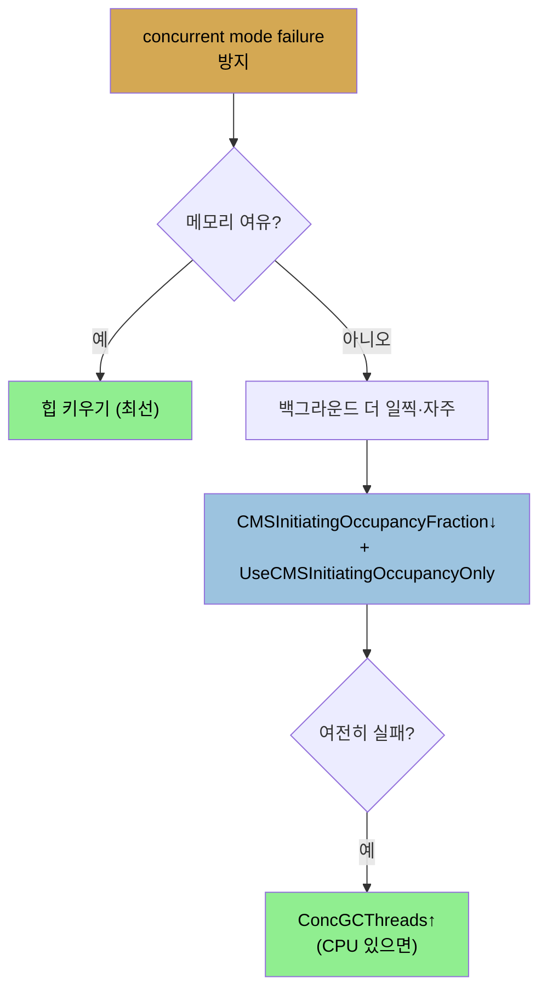

# G1 GC 튜닝과 CMS
> G1은 주로 MaxGCPauseMillis로 튜닝하고 막히면 IHOP·ConcGCThreads·MixedGCCountTarget을 조정하며, CMS는 concurrent mode failure 방지가 핵심입니다

[앞 편](./06-02.G1%20GC%20동작%20—%204%20연산과%205가지%20full%20GC%20실패.md)이 G1 동작과 다섯 실패였다면, 이 편은 그 실패를 막는 G1 튜닝과, deprecated지만 여전히 쓸 수 있는 CMS의 동작·튜닝입니다.

## 1. G1 GC 튜닝 — full GC 방지
> 주로 MaxGCPauseMillis(기본 200ms) 한 플래그로 튜닝하며, 줄이면 mixed에서 처리할 old region이 줄어 concurrent mode failure 위험이 늘어납니다

G1 튜닝의 주 목표는 **concurrent mode나 evacuation failure가 full GC를 부르지 않게** 하는 것입니다. full GC 방지 옵션은 넷입니다. ① old를 키우기(전체 힙↑ 또는 세대 비율 조정), ② 백그라운드 스레드 늘리기(CPU 충분하면), ③ G1 백그라운드를 더 자주, ④ mixed GC 작업량 늘리기입니다.

그러나 G1의 목표 중 하나는 많이 튜닝할 필요가 없다는 것이라, **주로 `-XX:MaxGCPauseMillis=N` 한 플래그**로 튜닝합니다. G1에서는 (throughput과 달리) 이 플래그에 **기본값 200ms**가 있습니다. STW 단계의 pause가 이 값을 넘기 시작하면 G1이 보상합니다. young-to-old 비율·힙 크기 조정, 백그라운드 처리 조기 시작, tenuring threshold 변경, 그리고 (가장 크게) **mixed GC 중 처리하는 old region 수 조절**입니다. 트레이드오프가 있습니다. 값을 줄이면 young이 작아져 young GC가 잦아지고, **mixed에서 수집할 old region 수가 줄어 concurrent mode failure 위험이 늘어납니다.**

## 2. G1 백그라운드 스레드와 빈도, mixed 튜닝
> ConcGCThreads로 백그라운드 스레드를, IHOP로 marking 시작 시점을, G1MixedGCCountTarget으로 mixed 작업량을 조정합니다

pause-time 목표로 full GC가 안 막히면 개별 튜닝합니다.

1. **백그라운드 스레드** — concurrent marking은 애플리케이션 스레드와의 경쟁입니다. old를 애플리케이션이 채우는 것보다 빨리 비워야 합니다. 두 스레드 집합이 있습니다. `-XX:ParallelGCThreads=N`(스레드 멈춘 단계: young·mixed·remark의 STW 부분), `-XX:ConcGCThreads=N`(concurrent remarking)입니다. ConcGCThreads 기본은 `(ParallelGCThreads + 2) / 4`(정수 나눗셈)입니다. 늘리면 concurrent cycle이 짧아져 mixed GC 중 old를 더 쉽게 비웁니다(CPU가 있어야 함, 없으면 애플리케이션에서 CPU를 뺏어 pause를 도입).
2. **빈도** — concurrent marking cycle은 힙이 **`-XX:InitiatingHeapOccupancyPercent=N`(IHOP, 기본 45)** 점유율에 닿으면 시작합니다. **전체 힙 기준**(old만이 아님)이고, G1은 이 값을 pause 목표를 맞추려 바꾸지 않는 상수입니다. **너무 높으면 concurrent 단계가 완료 전에 힙이 차 full GC**가 나고, 너무 낮으면 백그라운드 GC를 필요 이상 합니다. 너무 자주 쓸면 STW 단계 pause가 누적되니, concurrent cycle 후 힙 크기를 보고 IHOP를 그보다 높게 둡니다.
3. **mixed GC 작업량** — concurrent cycle 후, 이전에 표시된 old region이 다 수집될 때까지 새 cycle을 못 시작합니다. mixed GC에서 더 많은 region을 처리하면(mixed cycle 수가 줄어) cycle을 더 일찍 시작할 수 있습니다. mixed 작업량은 세 요인입니다. ① 처음에 거의 garbage로 판정된 region 수(직접 조절 불가, **85% garbage면 mixed 대상**), ② `-XX:G1MixedGCCountTarget=N`(기본 8 — 표시 region을 몇 cycle에 나눠 처리할지, **줄이면 promotion failure를 막지만 pause가 길어짐**), ③ MaxGCPauseMillis(상한 — 여유 있으면 1/8보다 더 수집, 키우면 cycle당 더 많은 old region 수집).

## 3. CMS 동작 — concurrent cycle 단계
> CMS는 young collection·concurrent cycle·필요 시 full GC를 하며, abortable preclean이 remark와 young collection의 등 붙은 pause를 피합니다

CMS는 deprecated지만 현재 JDK 빌드에 여전히 있습니다. 세 기본 연산은 ① young collection(모든 스레드 멈춤), ② old를 청소하는 concurrent cycle, ③ 필요 시 old compaction을 위한 full GC입니다. young collection은 throughput과 비슷합니다. concurrent cycle은 힙 점유에 기반해 시작하고, 여러 단계로 GC 로그에 나타납니다.

1. **initial-mark** — 모든 스레드를 멈춥니다(예 0.08초). 힙의 모든 GC root 객체를 찾습니다.
2. **mark** — 스레드를 안 멈춥니다(0.83초). marking만 하므로 힙 점유는 안 바뀝니다.
3. **preclean** — 동시 실행됩니다.
4. **abortable preclean** — remark가 **non-concurrent(스레드 멈춤)**라, CMS는 young collection 직후 remark가 와서 등 붙은 두 pause가 생기는 걸 피하려 합니다. 그래서 **abortable preclean이 young이 약 50% 찰 때까지 대기**합니다(이론상 young collection 중간). past behavior로 다음 young collection 시점을 계산해 그 사이에 끝냅니다("abort"라 부르지만 정상 종료).
5. **remark** — 스레드를 멈춥니다(예 0.18초). rescan·weak refs 처리 등.
6. **sweep** — 동시 실행됩니다(0.82초). 이 중 young collection이 끼어들 수 있습니다.
7. **reset** — 동시 실행됩니다. cycle 완료, old의 미참조 객체가 해제됩니다.

**CMS는 old를 compaction하지 않습니다.** 그래서 cycle 후 old에 객체 영역과 free 영역이 섞이고, young에서 객체를 old로 옮길 때 그 free 영역을 쓰려 하지만 안 맞는 경우가 많아 high-water mark가 커집니다.

## 4. CMS 실패와 튜닝
> concurrent mode·promotion·metaspace 실패가 비싼 단일 스레드 full GC를 부르며, CMSInitiatingOccupancyFraction으로 백그라운드를 더 일찍 시작합니다

CMS의 비싼 실패 셋입니다.

1. **concurrent mode failure** — young collection 시 승격될 객체를 담을 old 자리가 부족해 CMS가 사실상 full GC를 합니다(단일 스레드, 예 5.6초). **CMS가 deprecated된 주된 이유**입니다. G1도 concurrent mode failure가 있지만 JDK 11에서는 full GC가 parallel입니다. CMS full GC는 단일 스레드라 몇 배 더 걸립니다(힙이 클수록 더 나쁨).
2. **promotion failure** — old에 자리는 있지만 단편화로 승격 실패. young collection 중간에 전체 old를 수집·compaction합니다(예 28초 pause — concurrent mode failure보다 김, 전체 힙을 compaction하므로).
3. **metaspace full** — CMS는 metaspace를 미수집하므로, 차면 미참조 클래스 폐기를 위한 full GC가 필요합니다.

CMS 튜닝의 핵심은 **concurrent mode·promotion failure 방지**입니다. concurrent mode failure는 CMS가 old를 충분히 빨리 못 비워 생깁니다. old가 일정량(기본 70%) 차면 concurrent cycle이 시작되고, CMS는 나머지(30%)가 차기 전에 스캔·해제를 끝내야 하는 경주입니다. 막는 방법은 ① old를 키우기, ② 백그라운드 더 자주, ③ 백그라운드 스레드 늘리기입니다.

메모리가 있으면 **힙 키우기가 최선**입니다. 아니면 백그라운드 동작을 바꿉니다. **백그라운드를 더 일찍 시작**하려면 `-XX:CMSInitiatingOccupancyFraction=N`과 `-XX:+UseCMSInitiatingOccupancyOnly`를 함께 씁니다. 둘 다 설정하면 CMS가 **old 점유율(G1과 달리 전체 힙 아님)만으로** 백그라운드 시작을 정해 이해하기 쉽습니다. UseCMSInitiatingOccupancyOnly는 기본 false라 CMS가 복잡한 알고리즘을 쓰는데, 더 일찍 시작해야 하면 가장 단순하게 true로 둡니다. UseCMSInitiatingOccupancyOnly가 켜지면 CMSInitiatingOccupancyFraction 기본은 70입니다. 더 나은 값은 GC 로그에서 실패한 cycle이 처음 언제 시작됐는지로 찾습니다(CMS-initial-mark가 old 점유율을 보여 줌). **0으로 두면 백그라운드가 늘 도는데**, CPU를 낭비하고(각 CMS 스레드가 CPU 100% 소비) STW pause가 누적돼 권장 안 됩니다. **live 데이터 + 10~20% 이하로 두지 말아야** 합니다. 백그라운드 스레드는 `-XX:ConcGCThreads=N`으로 늘리고, CMS는 `(3 + ParallelGCThreads) / 4`로 G1보다 한 단계 일찍 늘립니다.

CMS adaptive sizing의 차이: **young은 full GC가 일어나야만 리사이즈**됩니다. CMS의 목표는 full GC를 안 하는 것이라, 잘 튜닝된 CMS 앱은 young을 리사이즈하지 않습니다. concurrent mode failure는 프로그램 시작 중 잦을 수 있어(CMS가 힙·metaspace를 adaptive 사이징), 더 큰 초기 힙·metaspace로 시작하면 좋습니다.

## 자주 받는 오해
> CMS가 G1처럼 전체 힙 점유율로 백그라운드를 시작한다고 생각하기 쉽지만, CMS는 old 점유율만 봅니다

1. "G1 IHOP와 CMS의 시작 임계값은 같은 기준이다"라고 생각하기 쉽지만, G1 IHOP는 전체 힙 점유율, CMS CMSInitiatingOccupancyFraction은 old 점유율 기준입니다.
2. "CMSInitiatingOccupancyFraction을 0으로 두면 백그라운드가 늘 돌아 안전하다"고 생각하기 쉽지만, CPU를 낭비하고 STW pause가 누적돼 오히려 전체 성능이 떨어집니다. live 데이터 + 10~20% 이하로 두면 안 됩니다.
3. "CMS full GC도 G1처럼 빠르다"고 생각하기 쉽지만, CMS full GC는 단일 스레드라 몇 배 더 걸립니다(promotion failure는 전체 compaction이라 더 김). 이것이 CMS가 deprecated된 주된 이유입니다.

## 면접에서 받을 만한 질문
1. **G1 GC를 주로 어떤 플래그로 튜닝하고, 줄이면 어떤 위험이 있습니까?** → 주로 `-XX:MaxGCPauseMillis=N`(기본 200ms) 한 플래그로 튜닝합니다. 줄이면 young이 작아져 young GC가 잦아지고, mixed GC에서 수집할 old region 수가 줄어 concurrent mode failure 위험이 늘어납니다. 그래도 full GC가 나면 IHOP(백그라운드 조기 시작)·ConcGCThreads(스레드 추가)·G1MixedGCCountTarget(mixed 작업량) 같은 개별 플래그를 조정합니다.
2. **G1 InitiatingHeapOccupancyPercent(IHOP)는 무엇이고 너무 높거나 낮으면?** → 힙이 그 점유율(기본 45, 전체 힙 기준)에 닿으면 concurrent marking cycle을 시작하는 상수입니다. 너무 높으면 concurrent 단계가 완료되기 전에 힙이 차 full GC가 나고, 너무 낮으면 백그라운드 GC를 필요 이상 자주 해 STW pause가 누적됩니다. concurrent cycle 후 힙 크기보다 높게 두는 것이 좋습니다.
3. **CMS의 abortable preclean 단계는 왜 있습니까?** → remark 단계가 non-concurrent(모든 스레드 멈춤)라, young collection 직후 remark가 오면 등 붙은 두 pause가 생깁니다. abortable preclean은 young이 약 50% 찰 때까지(young collection 중간) 대기해 remark가 young collection과 떨어지게 함으로써, 등 붙은 pause를 피하고 pause 길이를 최소화합니다.
4. **CMS가 deprecated된 주된 이유는?** → concurrent mode failure 때문입니다. CMS가 old를 충분히 빨리 못 비우면 사실상 full GC를 하는데, **단일 스레드**라 몇 배 더 걸리고 힙이 클수록 더 나쁩니다. G1도 concurrent mode failure가 있지만 JDK 11에서 full GC가 parallel로 실행돼 훨씬 짧습니다. 또 CMS는 old를 compaction하지 않아 단편화로 promotion failure(전체 compaction, 더 긴 pause)도 납니다.

## 관련 문서
- [G1 GC 동작 — 4 연산과 5가지 full GC 실패](./06-02.G1%20GC%20동작%20—%204%20연산과%205가지%20full%20GC%20실패.md) — 막으려는 다섯 실패의 정의
- [고급 튜닝 — tenuring·TLAB·humongous·힙 제어](./06-04.고급%20튜닝%20—%20tenuring·TLAB·humongous·힙%20제어.md) — survivor·region 등 저수준 튜닝
- [이 책 인덱스 (Java Performance MOC)](./README.md) — 장별 정독 노트 진척
