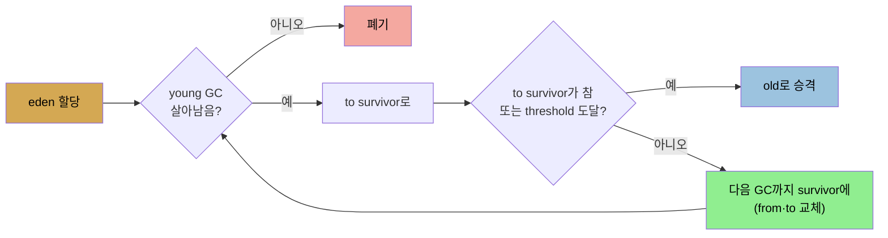

# 고급 튜닝 — tenuring·TLAB·humongous·힙 제어
> survivor space는 단명 객체에 회수 기회를 더 주고, TLAB는 스레드별 빠른 할당을 주며, humongous 객체와 G1 region 크기는 큰 객체 할당에 영향을 줍니다

[앞 편](./06-03.G1%20GC%20튜닝과%20CMS.md)이 G1·CMS 튜닝이었다면, 이 편은 드물지만 알아 둘 저수준 튜닝들입니다. tenuring과 survivor space, TLAB와 큰 객체, humongous와 G1 region 크기, AggressiveHeap, 힙 크기 완전 제어를 다룹니다.


## 1. tenuring과 survivor space
> young을 두 survivor와 eden으로 나눠 단명 객체에 회수 기회를 더 주며, survivor가 차거나 tenuring threshold에 도달하면 old로 승격됩니다

young collection 시 일부 객체는 살아 있습니다. 오래 살 새 객체만이 아니라, 막 생성돼 사용 중인 단명 객체도 포함됩니다(5장 BigDecimal 루프 중간에 GC가 일어나면 운 나쁜 단명 객체가 생김). **young을 두 survivor space와 eden으로 나누는 이유**가 이것입니다. 객체에 old로 승격되기 전 young에서 회수될 추가 기회를 줍니다.

young collection 시 JVM이 살아있는 객체를 찾으면 old가 아니라 survivor로 옮깁니다. 첫 collection에는 eden→survivor 0, 다음엔 survivor 0과 eden→survivor 1로(이때 eden·survivor 0이 빔), 그다음엔 survivor 1과 eden→survivor 0으로 갑니다. **survivor를 to·from이라 하고, 매 collection마다 from에서 to로 옮기며 둘이 교체**됩니다. 객체가 old로 가는 두 경우입니다.

1. **target(to) survivor가 참** — survivor는 꽤 작아, young collection 중 차면 eden의 남은 live 객체가 old로 직접 갑니다.
2. **tenuring threshold 도달** — survivor에 머물 수 있는 GC cycle 수 한계입니다.

survivor 크기는 동적입니다. 초기는 `-XX:InitialSurvivorRatio=N`(기본 8)으로, `survivor 크기 = new_size / (ratio + 2)`라 **각 survivor가 young의 10%**입니다. 최대는 `-XX:MinSurvivorRatio=N`(기본 3)으로 **최대 20%**입니다(ratio 최솟값이 크기 최댓값을 줘 이름이 반직관적). `-XX:TargetSurvivorRatio=N`(기본 50)은 GC 후 survivor가 50% 차게 리사이즈합니다. **tenuring threshold**는 `-XX:InitialTenuringThreshold=N`(throughput·G1 기본 7, CMS 6)에서 시작해 1과 `-XX:MaxTenuringThreshold=N`(throughput·G1 기본 15, CMS 6) 사이를 JVM이 정합니다. `-XX:+AlwaysTenure`(항상 승격)·`-XX:+NeverTenure`(자리 있으면 안 승격)로 양 극단을 강제할 수 있습니다.



**survivor가 너무 작으면** minor GC 중 객체가 eden에서 old로 직접 승격돼, 단명 객체가 old를 채워 full GC가 잦아집니다. tenuring 통계(`-XX:+PrintTenuringDistribution` 또는 JDK 11 `age*=debug/trace`)로 진단합니다. **가장 좋은 해결은 힙(또는 young)을 키우는 것**입니다. survivor를 키우면(survivor ratio↓) eden 메모리를 뺏어 minor GC가 잦아지고, young만 키우면 old가 작아져 full GC가 잦아질 수 있습니다. **힙을 전체적으로 키우면서 survivor ratio를 낮추면** young collection 수는 비슷하되 승격이 줄어 full GC가 줄어듭니다(객체가 몇 cycle 후 사라진다는 전제하에).


## 2. TLAB — thread-local allocation buffer
> 스레드마다 전용 할당 영역을 줘 동기화 없이 빠르게 할당하며, 큰 객체는 TLAB 밖에서 동기화로 할당됩니다

eden 할당이 빠른 한 이유는 **각 스레드가 객체를 할당하는 전용 영역, thread-local allocation buffer(TLAB)**를 갖기 때문입니다. eden 같은 공유 공간에 직접 할당하면 free-space 포인터 관리에 동기화가 필요한데, 스레드마다 전용 영역을 주면 할당 시 동기화가 필요 없습니다. 보통 개발자에게 투명하고 JVM이 크기를 관리합니다. **TLAB는 작아 큰 객체는 담을 수 없어, 큰 객체는 힙에서 직접(동기화) 할당**됩니다.

TLAB가 차면, JVM은 선택합니다. TLAB를 "retire"하고 새 것을 할당하거나(retired TLAB는 다음 young collection에서 청소·재사용), 객체를 힙에 직접 할당하고 기존 TLAB를 유지합니다. TLAB가 100KB이고 75KB가 찼는데 30KB가 필요하면, retire해 25KB를 낭비하거나, 30KB를 힙에 직접 할당하고 남은 25KB에 다음 객체가 맞기를 기대합니다. **TLAB 크기는 스레드 수·eden 크기·스레드 할당률 세 요인 기반**입니다. 두 유형의 앱이 TLAB 튜닝의 이점을 봅니다. 큰 객체를 많이 할당하는 앱과, eden 대비 스레드가 상대적으로 많은 앱입니다. 기본 활성이고 `-XX:-UseTLAB`로 끌 수 있지만 성능 향상이 커서 끄면 안 됩니다.

TLAB 크기 계산이 할당률에 의존해 최적값 예측은 불가하고, 대신 **TLAB 밖 할당이 일어나는지 모니터**합니다. **JFR이 가장 강력**합니다. 5초에 49객체가 TLAB 밖(최대 48바이트)에 할당되고 최소 TLAB가 1.35MB면, 크기 때문이 아니라 할당 시 TLAB가 차서 할당된 것입니다(young GC 직전 전형적). 반면 TLAB 안 952.96MB·밖 568.32MB면 작은 객체를 쓰거나 큰 TLAB로 튜닝할 가치가 있습니다. JFR 밖에서는 `-XX:+PrintTLAB`(JDK 8)·`tlab*=trace`(JDK 11)로 봅니다. **많은 객체가 TLAB 밖이면 리사이즈를 고려**합니다.

TLAB 크기는 eden 기반이라 new size 파라미터 조정이 자동으로 TLAB를 키웁니다. 명시적으로 `-XX:TLABSize=N`(0=동적)로 초기 크기를, `-XX:-ResizeTLAB`로 GC마다 리사이즈 방지를 합니다(탐색에 가장 유용). 새 객체가 현재 TLAB엔 안 맞지만 새 빈 TLAB엔 맞을 때, retire 여부는 **`refill waste` 임계값**으로 정합니다(기본 TLAB 크기의 1%, `-XX:TLABWasteTargetPercent=N`). TLAB 밖 할당마다 `-XX:TLABWasteIncrement=N`(기본 4)만큼 증가해 임계에 계속 머물며 힙 할당하는 걸 막습니다. 최소 TLAB는 `-XX:MinTLABSize=N`(기본 2KB), 최대는 1GB 약간 미만(정수 배열 최대, 변경 불가)입니다. **큰 객체를 많이 쓰면 TLAB 튜닝이 필요할 수 있지만, 보통은 더 작은 객체를 쓰는 게 낫습니다.**


## 3. humongous 객체와 G1 region 크기
> G1에서 region 절반보다 큰 humongous 객체는 old에 직접·연속 할당되며, region 크기는 Xms 기반으로 정해집니다

TLAB 밖 객체도 가능하면 eden에 할당되지만, eden에 안 맞으면 old에 직접 할당돼 정상 GC 생애를 못 거칩니다(단명이면 손해). **G1에서 humongous 객체는 다릅니다.** G1은 **region 절반보다 큰 객체를 humongous로 정의**하고, region보다 크면 old에 할당합니다. G1 region은 고정 크기입니다. 동적이 아니라 시작 시 최소 힙(Xms)으로 정해집니다. 최소 1MB이고, 최소 힙이 2GB 초과면 `region_size = 1 << log(Xms / 2048)` 공식으로, **초기 힙을 나눌 때 약 2,048 region이 되는 2의 최소 거듭제곱**입니다(항상 1MB~32MB).

| 힙 크기 | 기본 G1 region 크기 |
|---------|---------------------|
| 4GB 미만 | 1MB |
| 4~8GB | 2MB |
| 8~16GB | 4MB |
| 16~32GB | 8MB |
| 32~64GB | 16MB |
| 64GB 초과 | 32MB |

`-XX:G1HeapRegionSize=N`(2의 거듭제곱)으로 설정합니다. **힙 범위가 크게 다르면**(예 `-Xms2G -Xmx32G`) region이 1MB라 완전 확장 시 32,000 region이 되는데, G1은 약 2,048 region을 가정하므로 region을 키워야 효율적입니다. **humongous 객체는 연속 region에 할당**돼야 합니다. region 1MB일 때 3.1MB 배열은 region 4개를 찾아야 하고(마지막 region의 0.9MB 낭비), G1의 정상 compaction 방식을 무력화합니다. old에 직접 할당돼 young collection으로 못 비우고, concurrent G1 cycle의 cleanup 단계에서 빨리 해제됩니다(region 안 유일 객체라). **프로그램이 할당할 모든 객체가 한 region에 맞게 region을 키우면(최대 객체×2 + 1바이트) G1이 효율적**입니다. humongous 할당은 과거(JDK 8u60·JDK 11 개선 전) 보통 full GC를 요구해 훨씬 큰 문제였습니다.


## 4. AggressiveHeap과 힙 크기 완전 제어
> AggressiveHeap은 권장 안 되는 레거시 일괄 설정이고, 기본 힙 크기는 MaxRAM·MaxRAMFraction·InitialRAMFraction으로 계산됩니다

**AggressiveHeap**(기본 false)은 메모리 많은 대형 단일 JVM 머신용 인자를 쉽게 설정하려 초기 도입된 레거시입니다. **권장되지 않습니다.** 실제 채택 튜닝을 숨겨 JVM 설정 파악이 어렵고, 일부 값이 이제 더 나은 정보로 ergonomic하게 설정되어 켜면 오히려 성능을 해칠 수 있습니다. (Xmx=전체 메모리 절반, Xms=Xmx, ResizeTLAB=false, UseParallelGC=true 등 + PLAB 크기·컴파일 정책·ScavengeBeforeFullGC·GC 스레드 CPU 바인딩 같은 모호한 플래그를 설정합니다.)

**힙 크기 완전 제어** — 기본 힙 크기는 머신 메모리 기반이고, `-XX:MaxRAM=N`으로 설정합니다. 보통 JVM이 머신 메모리를 조사해 계산하되, **MaxRAM을 32비트 Win 서버는 4GB, 64비트 JVM은 128GB로 제한**합니다. 기본 최대 힙은 다음 공식입니다.

```
기본 Xmx = MaxRAM / MaxRAMFraction (기본 4)
```

그래서 물리 메모리가 MaxRAM보다 작으면 기본 힙은 그것의 1/4이고, 수백 GB여도 기본 최대는 32GB(128GB의 1/4)입니다. `-XX:ErgoHeapSizeLimit=N`(기본 0=무시)을 MaxRAM/MaxRAMFraction보다 작게 두면 그 한도가 쓰입니다. 작은 메모리 머신은 OS 여유를 위해 `-XX:MinRAMFraction=N`(기본 2)으로 192MB 머신에서 최대 96MB로 제한합니다. 초기 힙은 `기본 Xms = MaxRAM / InitialRAMFraction`(기본 64)이고, 그 값이 5MB 미만이면(OldSize 4MB + NewSize 1MB) 그 합이 초기 힙이 됩니다. **보통은 Xms·Xmx 직접 설정이 간단하고, 이 플래그는 여러 JVM에 공통 ergonomic 힙 크기를 적용할 때만** 유용합니다.


## 자주 받는 오해
> survivor가 작으면 young을 키우면 된다고 생각하기 쉽지만, 그러면 old가 작아져 full GC가 잦아질 수 있습니다

1. "survivor가 작으면 young 세대를 키우면 해결된다"고 생각하기 쉽지만, young만 키우면 old가 작아져 full GC가 오히려 잦아질 수 있습니다. 힙을 전체적으로 키우면서 survivor ratio를 낮추는 게 낫습니다.
2. "큰 객체는 무조건 TLAB 밖에 할당돼 느리다"고 생각하기 쉽지만, TLAB 밖이어도 가능하면 eden에 할당됩니다. JFR로 보면 young GC 직전 TLAB가 차서(크기 때문이 아니라) TLAB 밖에 할당되는 게 전형적입니다.
3. "G1 region 크기는 신경 안 써도 된다"고 생각하기 쉽지만, 힙 범위가 크게 다르면(Xms 2G, Xmx 32G) region이 너무 많아지고, region 절반보다 큰 객체를 자주 쓰면 humongous 할당이 G1의 compaction을 무력화합니다.


## 면접에서 받을 만한 질문
1. **survivor space와 tenuring threshold는 무엇입니까?** → survivor space는 young을 eden과 함께 나눈 두 영역으로, 살아남은 객체를 old가 아니라 survivor로 옮겨 단명 객체에 young에서 회수될 추가 기회를 줍니다. 매 GC마다 from에서 to로 옮기며 둘이 교체됩니다. tenuring threshold는 객체가 survivor에 머물 수 있는 GC cycle 수 한계로, InitialTenuringThreshold(기본 7)에서 시작해 1과 MaxTenuringThreshold(기본 15) 사이를 JVM이 정합니다. 이 한계에 도달하거나 to survivor가 차면 old로 승격됩니다.
2. **survivor space가 너무 작으면 어떤 문제가 생기고 어떻게 해결합니까?** → minor GC 중 객체가 eden에서 old로 직접 승격돼, 단명 객체가 old를 채워 full GC가 잦아집니다. 가장 좋은 해결은 힙(또는 young)을 키워 JVM이 survivor를 관리하게 하는 것입니다. survivor만 키우면 eden을 뺏어 minor GC가 잦아지고, young만 키우면 old가 작아져 full GC가 잦아지므로, 힙을 전체적으로 키우면서 survivor ratio를 낮추는 게 균형입니다.
3. **TLAB가 무엇이고 왜 할당을 빠르게 합니까?** → thread-local allocation buffer로, 각 스레드가 객체를 할당하는 eden 안 전용 영역입니다. 공유 공간에 직접 할당하면 free-space 포인터 관리에 동기화가 필요한데, 스레드별 전용 영역을 주면 동기화 없이 할당할 수 있어 빠릅니다. 단 TLAB가 작아 큰 객체는 담지 못하고 힙에서 직접(동기화) 할당됩니다. TLAB 밖 할당이 많은지는 JFR로 모니터합니다.
4. **G1의 humongous 객체는 무엇이고 왜 문제입니까?** → G1은 region 절반보다 큰 객체를 humongous로 정의하고, region보다 크면 old에 연속 region으로 직접 할당합니다. 이는 young collection으로 못 비워 단명 객체면 손해이고, 연속 region을 찾아야 해 G1의 정상 compaction 방식을 무력화합니다. 해결은 모든 객체가 한 region에 맞게 region 크기를 키우는 것(최대 객체×2 + 1바이트)입니다.


## 관련 문서
- [G1 GC 튜닝과 CMS](./06-03.G1%20GC%20튜닝과%20CMS.md) — humongous allocation failure 등의 튜닝 맥락
- [실험 GC — ZGC·Shenandoah·Epsilon과 선택 가이드](./06-05.실험%20GC%20—%20ZGC·Shenandoah·Epsilon과%20선택%20가이드.md) — non-generational 컬렉터와 선택
- [기본 튜닝 (1) — 힙과 세대 크기](./05-03.기본%20튜닝%20(1)%20—%20힙과%20세대%20크기.md) — Xms·Xmx·NewRatio 기본
- [이 책 인덱스 (Java Performance MOC)](./README.md) — 장별 정독 노트 진척
