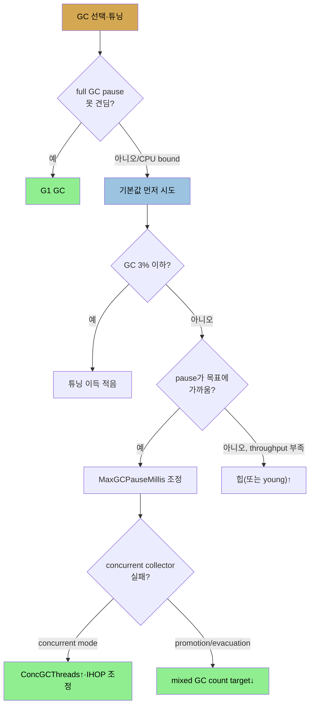

# 실험 GC — ZGC·Shenandoah·Epsilon과 선택 가이드
> ZGC와 Shenandoah는 concurrent compaction으로 pause를 10ms 수준으로 줄이고, Epsilon은 아무것도 안 하며, GC 선택은 일련의 질문으로 정합니다

[앞 편](./06-04.고급%20튜닝%20—%20tenuring·TLAB·humongous·힙%20제어.md)까지가 프로덕션 컬렉터의 동작·튜닝이었다면, 이 편은 차세대 실험 컬렉터와 전체 선택 가이드입니다. 이 컬렉터들은 집필 시점에 완전히 견고하진 않지만, G1이 그랬듯 다음 LTS 즈음 프로덕션급이 될 가능성이 높습니다.

## 1. concurrent compaction — 왜 필요한가
> G1·CMS도 young 수집과 compaction은 STW이며, compaction 중 객체 이동의 참조 갱신을 단순화하려 스레드를 멈추는 것이 pause를 지배합니다

기존 concurrent collector는 완전 concurrent가 아닙니다. **G1·CMS 모두 young 세대 수집은 모든 스레드를 멈춰야** 하고, **둘 다 concurrent compaction을 하지 않습니다.** G1은 mixed GC의 부수 효과로 old를 compaction하고(target region의 살아있는 객체를 빈 region으로), CMS는 old가 너무 단편화되면 compaction합니다. young 수집도 살아남은 객체를 survivor·old로 옮겨 그 부분을 compaction합니다.

**compaction 중 객체는 메모리 위치를 옮깁니다.** 이것이 JVM이 그 연산 동안 모든 스레드를 멈추는 주된 이유입니다. 애플리케이션 스레드가 멈춰 있다고 알면 메모리 참조 갱신 알고리즘이 훨씬 단순하기 때문입니다. 그래서 **애플리케이션의 pause 시간은 객체 이동과 참조 갱신에 쓰는 시간에 지배**됩니다. 두 실험 컬렉터가 이 문제를 다룹니다.

## 2. ZGC와 Shenandoah — concurrent compaction
> 둘 다 객체를 멈추지 않고 옮겨, 힙이 non-generational이 되고 pause가 10ms 수준으로 줄며, barrier로 이동 중 객체 접근을 보호합니다

**ZGC(Z garbage collector)**는 JDK 11에, **Shenandoah**는 JDK 12에 처음 나왔습니다(8·11에 백포트). AdoptOpenJDK 빌드는 둘 다, Oracle 빌드는 ZGC만 담습니다. `-XX:+UnlockExperimentalVMOptions`와 `-XX:+UseZGC`·`-XX:+UseShenandoahGC`로 켭니다. 접근은 다르지만 **둘 다 concurrent compaction(모든 스레드를 멈추지 않고 힙 객체 이동)**을 합니다. 두 주요 효과가 있습니다.

1. **힙이 non-generational이 됩니다.** young 세대의 아이디어는 작은 부분을 수집하는 게 빠르고 그중 다수가 garbage라는 것입니다. 즉 young은 짧은 pause를 위한 것인데, **수집 중 스레드를 안 멈춰도 되면 young의 필요가 사라집니다.** 그래서 이 알고리즘들은 힙을 세대로 나누지 않습니다.
2. **애플리케이션 스레드 연산의 latency가 줄어듭니다.** 보통 200ms인 REST 호출이 G1 young collection(500ms)에 끼면 사용자는 700ms로 봅니다. 대부분은 아니지만 일부가 이런 outlier가 되어 전체 성능에 영향을 줍니다. 스레드를 멈출 필요가 없으면 이 outlier가 사라집니다.

이 컬렉터들도 **아주 짧은 pause(10ms 수준)**는 있습니다(G1의 marking 스레드 pause처럼). 또 **개별 스레드 연산에 latency를 도입**할 수 있습니다. 객체 접근이 **barrier로 보호**되어, 객체가 옮겨지는 중이면 애플리케이션 스레드가 barrier에서 이동 완료까지 대기합니다(반대로 스레드가 접근 중이면 GC 스레드가 대기). 객체 참조에 대한 일종의 locking이지만 실제로는 가볍고, throughput에 작은 영향만 줍니다.

## 3. latency와 throughput 효과
> ZGC·Shenandoah는 outlier를 5ms 수준으로 줄이고, 백그라운드 CPU가 충분하면 G1보다 throughput도 높습니다

500 OPS REST 서버(큰 바이트 배열 할당)의 응답 시간입니다.

| 컬렉터 | 평균 | 90th% | 99th% | 최대 |
|--------|------|-------|-------|------|
| Throughput GC | 13ms | 60ms | 160ms | 265ms |
| G1 GC | 5ms | 10ms | 35ms | 87ms |
| ZGC | 1ms | 5ms | 5ms | 20ms |
| Shenandoah GC | 1ms | 5ms | 5ms | 22ms |

각 컬렉터에서 기대한 대로입니다. throughput은 full GC 시간 탓에 최대 265ms와 50ms 넘는 outlier가 많습니다. G1은 full GC가 사라져 최대 87ms·outlier 10ms입니다. **concurrent 컬렉터는 young pause도 사라져 최대 20ms·outlier 5ms**입니다. 한 가지 주의: **GC pause가 전통적으로 latency outlier의 가장 큰 원인**이었지만, 다른 원인(네트워크 혼잡·OS 스케줄링)도 있습니다. concurrent 컬렉터가 GC를 몇 ms로 줄이면, **그 너머의 outlier는 이 다른 원인들이 지배하기 시작**합니다.

**throughput 효과는 분류가 더 어렵습니다.** G1처럼 백그라운드 스레드로 힙을 스캔하므로, **CPU가 부족하면 같은 concurrent failure로 full GC**를 합니다(G1 백그라운드보다 더 많은 백그라운드 처리를 씀). 반면 **CPU가 충분하면 G1·throughput보다 throughput이 높습니다.** 5장에서 봤듯 G1이 GC 처리를 백그라운드로 떠넘겨 throughput보다 높을 수 있는데, concurrent compaction 컬렉터는 throughput에 대해 같은 이점을, G1에 대해 비슷하지만 작은 이점을 가집니다.

## 4. Epsilon과 선택 가이드
> Epsilon은 아무것도 안 해 짧은 프로그램에 이득이며, GC 선택은 full GC 허용·기본값·pause 목표 같은 질문으로 정합니다

**Epsilon collector**(JDK 11)는 **아무것도 안 합니다.** 객체를 결코 해제하지 않고 힙이 차면 OOM이 납니다. 전통적 프로그램은 못 쓰지만, ① 아주 짧게 사는 프로그램, ② 메모리를 재사용하고 새 할당을 안 하게 신중히 작성한 프로그램에 유용합니다. 4,096개 0.5MB 배열을 할당하는 프로그램에서 Epsilon은 1.6초·2,052MB인데, throughput은 2.3초·3,072MB, G1은 3.24초·4,096MB입니다. **GC를 끄는 게 30% 개선**이고, non-generational이라(객체를 못 비우니 빨리 비울 별도 공간이 불필요) 약 2GB 객체에 2,052MB만 필요합니다. `-XX:+UnlockExperimentalVMOptions`와 `-XX:+UseEpsilonGC`로 켭니다. **프로그램이 준 메모리보다 더 필요하지 않다고 확신할 때만** 안전합니다.

마지막으로 GC 선택·튜닝 의사결정을 묻는 질문들입니다.

1. **애플리케이션이 full GC pause를 견딜 수 있나?** 못 견디면 G1이 선택입니다. 견뎌도 CPU bound가 아니면 G1이 parallel보다 흔히 낫습니다.
2. **기본값으로 필요한 성능이 나오나?** 먼저 기본값을 시도합니다. ergonomic 튜닝이 계속 좋아집니다. GC에 3% 이하를 쓰면 튜닝 이득이 적습니다(outlier 줄이기는 별개).
3. **pause가 목표에 가까운가?** 가까우면 MaxGCPauseMillis 조정으로 충분합니다. pause가 너무 크고 throughput은 OK면 young(full GC pause엔 old)을 줄여 더 많고 짧은 pause로 바꿉니다.
4. **pause는 짧은데 throughput이 부족한가?** 힙(또는 young)을 키웁니다. 단 큰 힙 = 긴 pause입니다.
5. **concurrent collector + concurrent mode failure?** CPU가 있으면 ConcGCThreads를 늘리거나 IHOP로 백그라운드를 더 일찍 시작합니다. G1은 pending mixed GC가 있으면 concurrent cycle을 안 시작하니 mixed GC count target을 줄여 봅니다.
6. **concurrent collector + promotion/evacuation failure?** G1의 evacuation failure(to-space overflow)는 단편화 신호로, 백그라운드 스윕을 더 일찍·mixed GC를 더 빨리 하면 보통 해결됩니다. ConcGCThreads↑·IHOP 조정·mixed GC count target↓를 시도합니다.

## 자주 받는 오해
> concurrent compaction 컬렉터가 pause를 없앤다고 생각하기 쉽지만, 10ms 수준의 짧은 pause는 남고 백그라운드 CPU가 부족하면 full GC가 납니다

1. "ZGC·Shenandoah는 pause가 전혀 없다"고 생각하기 쉽지만, 10ms 수준의 아주 짧은 pause는 남습니다. 또 객체 이동 중 접근은 barrier에서 대기해 개별 연산에 작은 latency를 도입합니다.
2. "concurrent compaction 컬렉터는 항상 throughput이 높다"고 생각하기 쉽지만, 백그라운드 처리를 G1보다 더 써서 CPU가 부족하면 concurrent failure로 full GC가 납니다. CPU가 충분할 때만 G1·throughput보다 높습니다.
3. "Epsilon은 GC를 끄니 어떤 프로그램에도 빠르다"고 생각하기 쉽지만, 객체를 결코 해제하지 않아 힙이 차면 OOM입니다. 아주 짧은 프로그램이나 메모리 재사용 프로그램에만, 준 메모리보다 더 필요하지 않다고 확신할 때만 안전합니다.

## 면접에서 받을 만한 질문
1. **concurrent compaction이 왜 중요하고 ZGC·Shenandoah가 이를 어떻게 다룹니까?** → compaction 중 객체가 메모리 위치를 옮기는데, 참조 갱신을 단순화하려 모든 스레드를 멈춥니다. 그래서 pause가 객체 이동·참조 갱신 시간에 지배됩니다. ZGC·Shenandoah는 스레드를 멈추지 않고 객체를 옮기는 concurrent compaction을 해, pause를 10ms 수준으로 줄입니다. 객체 접근은 barrier로 보호되어 이동 중이면 대기하지만, throughput에 작은 영향만 줍니다.
2. **ZGC·Shenandoah가 힙을 non-generational로 두는 이유는?** → young 세대는 작은 부분을 빨리 수집해 짧은 pause를 얻기 위한 것입니다. 그러나 수집 중 애플리케이션 스레드를 멈추지 않아도 되면, 짧은 pause를 위해 힙을 세대로 나눌 필요가 사라집니다. 그래서 이 컬렉터들은 단일 힙으로 동작합니다.
3. **Epsilon collector는 언제 씁니까?** → 아무것도 하지 않고 객체를 결코 해제하지 않아, 아주 짧게 사는 프로그램이나 메모리를 재사용하고 새 할당을 안 하게 작성한 프로그램에 씁니다. GC를 끄면 측정 예에서 30% 개선과 적은 메모리(2GB 객체에 2,052MB)를 줍니다. 단 준 메모리보다 더 필요하면 OOM이 나므로, 그렇지 않다고 확신할 때만 안전합니다.
4. **concurrent collector에서 concurrent mode failure와 promotion failure는 각각 어떻게 대응합니까?** → concurrent mode failure는 백그라운드가 old를 제때 못 비워 생기므로, CPU가 있으면 ConcGCThreads를 늘리거나 IHOP로 백그라운드를 더 일찍 시작합니다. promotion/evacuation failure는 단편화·승격 넘침이므로 mixed GC count target을 줄여 mixed GC가 각 young collection에서 더 많은 old region을 처리하게 합니다. 둘 다 안 되면 힙을 키웁니다.

## 관련 문서
- [고급 튜닝 — tenuring·TLAB·humongous·힙 제어](./06-04.고급%20튜닝%20—%20tenuring·TLAB·humongous·힙%20제어.md) — 저수준 튜닝
- [GC 알고리즘 선택 — serial·throughput·G1·CMS](./05-02.GC%20알고리즘%20선택%20—%20serial·throughput·G1·CMS.md) — 프로덕션 컬렉터 선택 기준
- [이 책 인덱스 (Java Performance MOC)](./README.md) — 장별 정독 노트 진척
