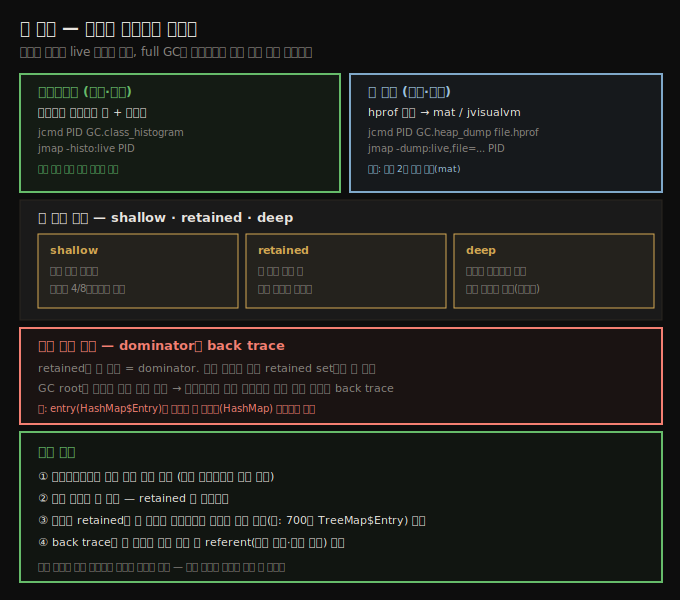

# 힙 분석 — 히스토그램·힙 덤프·retained 메모리
> 어떤 객체가 힙을 차지하는지 히스토그램·덤프로 들여다보고, shallow·retained·deep 크기로 줄일 대상을 찾습니다

5장과 6장이 GC를 튜닝해 프로그램에 미치는 영향을 줄이는 법을 다뤘다면, 7장은 더 나은 프로그래밍 관행으로 성능을 얻는 법을 다룹니다. GC 튜닝도 중요하지만, 종종 코드 쪽 개선이 더 큰 이득을 줍니다. 그리고 그 출발점은 힙 안에서 무슨 일이 일어나는지 아는 것입니다.

GC 로그와 5장의 도구는 GC가 애플리케이션에 주는 영향을 이해하는 데 좋지만, 힙 자체를 보려면 다른 도구가 필요합니다. 이 노트의 도구들은 애플리케이션이 지금 쓰는 객체를 보여 줍니다. 대부분은 **live 객체만** 다룹니다 — 다음 full GC에서 회수될 객체는 출력에 안 들어갑니다. 그러려고 일부 도구는 full GC를 강제하므로, 도구 사용 후 애플리케이션 동작이 바뀔 수 있습니다. 어느 쪽이든 시간과 자원을 쓰므로, 프로그램 실행을 측정하는 중에는 쓰지 않습니다.





## 1. 히스토그램 — 빠르고 작은 첫 진단
> 히스토그램은 full 덤프 없이 클래스별 인스턴스 수와 바이트를 보여 줘, 한두 타입의 과다 생성을 빠르게 잡습니다

메모리를 줄이는 게 목표지만, 대부분의 성능 작업처럼 이득이 큰 곳에 노력을 집중해야 합니다. 뒤에 나올 `Calendar` lazy 초기화 예는 힙에서 640바이트를 아끼는데, 애플리케이션이 늘 그런 객체 하나를 초기화한다면 측정 가능한 차이가 안 납니다. 어떤 종류의 객체가 많은 메모리를 쓰는지 분석해야 압니다.

가장 쉬운 방법이 **heap histogram**입니다. full 힙 덤프 없이 애플리케이션 안 객체 수를 빠르게 봅니다(덤프는 분석에 시간이 걸리고 디스크를 많이 씁니다). 몇몇 특정 객체 타입이 메모리 압박을 만든다면, 히스토그램이 그걸 빠르게 찾아 줍니다.

히스토그램은 `jcmd`로 얻습니다(여기서는 프로세스 ID 8898).

```
% jcmd 8998 GC.class_histogram
8898:

 num     #instances         #bytes  class name
----------------------------------------------
   1:        789087       31563480  java.math.BigDecimal
   2:        172361       14548968  [C
   3:         13224       13857704  [B
   4:        184570        5906240  java.util.HashMap$Node
   5:         14848        4188296  [I
   6:        172720        4145280  java.lang.String
   7:         34217        3127184  [Ljava.util.HashMap$Node;
   8:         38555        2131640  [Ljava.lang.Object;
   9:         41753        2004144  java.util.HashMap
  10:         16213        1816472  java.lang.Class
```

히스토그램에서는 보통 문자 배열(`[C`)과 `String`이 상위에 옵니다 — 가장 흔히 생성되는 Java 객체이기 때문입니다. 바이트 배열(`[B`)과 객체 배열(`[Ljava.lang.Object;`)도 흔합니다(클래스로더가 데이터를 그 구조에 저장합니다). 이 표기법은 JNI 문서에 설명돼 있습니다.

이 예에서 `BigDecimal`이 들어온 건 추적할 만합니다. 샘플 코드가 일시적인 `BigDecimal`을 많이 만드는 건 알지만, 그렇게 많이 힙에 남는 건 기대 밖입니다. `GC.class_histogram` 출력은 보통 full GC를 강제하므로 **live 객체만** 포함합니다. 명령에 `-all` 플래그를 넣으면 full GC를 건너뛰지만, 그러면 히스토그램에 참조 안 되는(garbage) 객체가 섞입니다.

비슷한 출력을 `jmap`으로도 얻습니다.

```
% jmap -histo process_id
```

`jmap` 출력은 수집 대상(dead) 객체를 포함합니다. 히스토그램 전에 full GC를 강제하려면 이렇게 합니다.

```
% jmap -histo:live process_id
```

히스토그램은 작아서 자동화 시스템에서 테스트마다 하나씩 모으면 도움이 됩니다. 다만 얻는 데 몇 초가 걸리고 full GC를 유발하므로, 성능 측정 steady state 중에는 뜨지 않습니다.


## 2. 힙 덤프 — 깊은 분석의 도구
> 덤프는 hprof 파일로 mat·jvisualvm에서 열고, 누수는 시간차 덤프 2개를 비교해 추적합니다

히스토그램은 한두 클래스의 인스턴스를 너무 많이 만드는 문제를 잡는 데 좋지만, 더 깊은 분석에는 **heap dump**가 필요합니다. 많은 도구가 덤프를 보고, 대부분 실행 중인 프로그램에 붙어 덤프를 만들 수 있습니다. 보통은 커맨드라인에서 만드는 편이 쉽습니다.

```
% jcmd process_id GC.heap_dump /path/to/heap_dump.hprof
```

또는

```
% jmap -dump:live,file=/path/to/heap_dump.hprof process_id
```

`jmap`에 `live` 옵션을 넣으면 덤프 전에 full GC가 일어납니다. `jcmd`는 그게 기본이고, dead 객체까지 포함하려면 끝에 `-all`을 줍니다. full GC를 강제하는 방식이면 당연히 긴 pause가 끼고, 강제하지 않아도 힙 덤프를 쓰는 동안 애플리케이션은 멈춥니다.

두 명령 모두 지정 디렉토리에 `heap_dump.hprof` 파일을 만들고, 여러 도구로 엽니다. 가장 흔한 둘입니다.

1. **jvisualvm** — Monitor 탭에서 실행 중 프로그램의 덤프를 뜨거나 기존 덤프를 엽니다. 힙을 탐색하며 가장 큰 retained 객체를 보고 임의 쿼리를 실행합니다.
2. **mat** — 오픈소스 EclipseLink Memory Analyzer입니다. 덤프 하나 이상을 로드해 분석하고, 문제가 있을 곳을 짚는 리포트를 만들며, 힙을 SQL 비슷한 쿼리로 탐색합니다.

누수가 의심되면 몇 분 간격으로 덤프를 연이어 떠서 비교합니다. `mat`은 덤프 2개를 열면 두 힙의 히스토그램 차이를 계산하는 기능을 내장합니다.


## 3. shallow·retained·deep — 세 가지 크기
> shallow는 객체 자신, deep은 참조까지 합산, retained는 그 객체 해제 시 함께 풀리는 메모리입니다

힙 분석의 첫 단계는 보통 **retained memory**입니다. 한 객체의 retained 메모리는 그 객체가 수집 대상이 됐을 때 함께 풀리는 메모리 양입니다. String Trio 객체의 retained 메모리는 자기 자신과 그것이 가진 Sally·David 객체의 메모리를 포함합니다. Michael 객체는 다른 참조가 또 있어 String Trio가 풀려도 수집 대상이 안 되므로 포함하지 않습니다.

여기에 두 용어가 더 있습니다.

1. **shallow size** — 객체 자신의 크기입니다. 다른 객체 참조를 가지면 4 또는 8바이트의 참조는 포함하지만, 대상 객체의 크기는 포함하지 않습니다.
2. **deep size** — 자신이 참조한 객체의 크기까지 포함합니다.

deep과 retained의 차이는 공유 객체에서 갈립니다. Flute Duo 객체의 deep 크기는 Michael이 쓰는 공간을 포함하지만, retained 크기는 포함하지 않습니다(Michael이 공유되기 때문).

세 크기의 관계를 정리하면 이렇습니다.

| 크기 | 포함 범위 | 공유 객체 |
|------|-----------|-----------|
| shallow | 객체 자신만 (참조는 4/8바이트) | 미포함 |
| retained | 이 객체 해제 시 함께 풀리는 것 | 미포함(다른 참조 있으면 안 풀림) |
| deep | 참조한 객체까지 합산 | 포함 |


## 4. dominator와 back trace — 공유 객체 추적
> retained가 큰 dominator부터 보되, 공유로 안 잡히면 히스토그램 집계와 back trace로 진짜 범인을 찾습니다

힙 공간을 많이 retain하는 객체를 힙의 **dominator**라 합니다. 몇 객체가 힙 대부분을 지배하면 일은 쉽습니다 — 덜 만들거나, 짧게 붙들거나, 객체 그래프를 단순화하거나, 작게 만들면 됩니다. 말은 쉽지만 적어도 분석은 단순합니다.

더 흔하게는 프로그램이 객체를 공유하기에 탐정 작업이 필요합니다. Michael 객체처럼 공유 객체는 어느 객체의 retained set에도 안 잡힙니다(개별 객체 하나를 풀어도 공유 객체는 안 풀리므로). 또 가장 큰 retained 크기는 흔히 제어할 수 없는 클래스로더입니다.

극단적 예로, 클라이언트 연결 기반으로 강하게 캐시하고 전역 해시맵에 약하게 캐시하는 stock server 힙을 봅시다. 힙에 1.4GB 객체가 있는데, 단독 참조되는 가장 큰 객체 집합은 6MB뿐이고(클래스로딩 프레임워크의 일부) 직접 retain하는 객체를 봐도 메모리 문제가 안 풀립니다.

이때 **객체 히스토그램**이 유용한 둘째 단계입니다. 같은 타입을 집계하면, 1.4GB를 retain하는 700만 개 `TreeMap$Entry` 객체가 핵심임이 훨씬 분명해집니다. 무슨 일이 벌어지는지 몰라도, 그 객체를 추적해 무엇이 붙들고 있는지 보면 됩니다.

힙 분석 도구는 특정 객체의 **GC root**를 찾는 방법을 줍니다. GC root는 (긴 객체 사슬을 거쳐) 그 객체를 가리키는 static·전역 참조를 가진 시스템 객체입니다 — 보통 시스템/부트스트랩 classpath에 로드된 클래스의 static 변수, `Thread` 클래스와 모든 활성 스레드(thread-local 변수나 target `Runnable`을 통해)입니다.

그런데 GC root로 곧장 가는 건 꼭 도움이 안 됩니다. 객체에 참조가 여럿이면 GC root도 많습니다. 참조는 역방향 트리 구조라, root로 거슬러 가면 분기가 폭증합니다. 대신 객체 그래프에서 대상 객체가 **공유되는 가장 낮은 지점**을 찾는 편이 더 결실 있습니다. 들어오는 참조를 추적해 중복 경로를 식별합니다. 이 예에서 `StockPriceHistoryImpl`에 대한 참조는 두 referent를 가집니다 — 세션 속성 데이터를 가진 `ConcurrentHashMap`과 전역 캐시를 가진 `WeakHashMap`입니다. **back trace**를 펼쳐 두 경로를 끝까지 따라가면 어느 쪽이 세션 데이터인지 분명해집니다.

> **실전 규칙**: 데이터가 `String`·`HashMap` 같은 흔한 타입으로 모델링됐다면, 힙에 비슷한 객체가 수십만·수만 개라 경로 찾기에 인내가 듭니다. entry(예: `HashMap$Entry`)가 아니라 **컬렉션 객체(예: `HashMap`)부터, 가장 큰 컬렉션을 먼저** 봅니다.


## 자주 받는 오해

**"히스토그램과 힙 덤프 모두 garbage까지 다 보여 준다"** — 아닙니다. 대부분 도구는 **live 객체만** 봅니다. `GC.class_histogram`·`jmap -histo:live`·`jcmd GC.heap_dump`·`jmap -dump:live`는 보통 full GC를 강제해 dead 객체를 빼고 보여 줍니다. dead까지 보려면 `-all`(jcmd)이나 `-histo`(live 없이, jmap)를 씁니다.

**"retained가 가장 큰 객체만 보면 누수를 찾는다"** — 객체가 공유되면 retained set 어디에도 안 잡혀 그렇지 않습니다. 1.4GB 누수의 진짜 범인이 직접 retain하는 가장 큰 객체로는 6MB만 보일 수 있습니다. 히스토그램 집계로 타입별로 묶어 봐야 700만 entry 같은 진짜 원인이 드러납니다.

**"GC root로 거슬러 가면 원인이 바로 나온다"** — 참조가 여럿인 객체는 GC root도 여럿이고 역트리라 분기가 폭증합니다. root보다 **공유가 일어나는 가장 낮은 지점**을 back trace로 찾는 편이 빠릅니다.


## 면접에서 받을 만한 질문

**Q. 힙 히스토그램과 힙 덤프는 언제 어느 걸 쓰나요?**
히스토그램은 작고 빨라(몇 초) 한두 타입의 과다 생성을 진단할 때 먼저 씁니다. 자동화 테스트마다 하나씩 모을 수도 있습니다. 깊은 분석(어떤 객체가 무엇을 붙들고 있는지)이 필요하면 힙 덤프를 떠 mat·jvisualvm으로 봅니다. 둘 다 full GC를 유발하므로 측정 steady state 중에는 뜨지 않습니다.

**Q. shallow·retained·deep 크기의 차이는?**
shallow는 객체 자신의 크기(참조는 4/8바이트만)이고, deep은 참조한 객체까지 합산하며, retained는 그 객체가 해제될 때 함께 풀리는 메모리입니다. deep과 retained의 차이는 공유 객체입니다 — deep은 공유 객체도 합산하지만, retained는 다른 참조가 있어 안 풀리는 공유 객체를 빼고 셉니다.

**Q. 1.4GB 힙인데 retained 가장 큰 객체가 6MB뿐입니다. 어떻게 누수를 찾나요?**
객체가 공유돼 retained로 안 잡히는 상황입니다. 히스토그램으로 타입별 집계를 봐 메모리를 지배하는 타입(예: 700만 `TreeMap$Entry`)을 찾고, 그 객체의 back trace를 펼쳐 공유가 일어나는 가장 낮은 지점(세션 캐시·전역 캐시 등)을 식별합니다. 큰 컬렉션부터 봅니다.


## 관련 문서

- [`07-02.OutOfMemoryError 진단 — 네 가지 원인과 자동 덤프`](./07-02.OutOfMemoryError%20진단%20—%20네%20가지%20원인과%20자동%20덤프.md) — 덤프 분석으로 누수 원인 찾기
- [`03-02.JDK 기본 도구와 VM 정보·튜닝 플래그`](./03-02.JDK%20기본%20도구와%20VM%20정보·튜닝%20플래그.md) — jcmd·jmap 등 JDK 도구
- [`06-05.실험 GC — ZGC·Shenandoah·Epsilon과 선택 가이드`](./06-05.실험%20GC%20—%20ZGC·Shenandoah·Epsilon과%20선택%20가이드.md) — 6장 마지막
- [상위 인덱스](./README.md)
