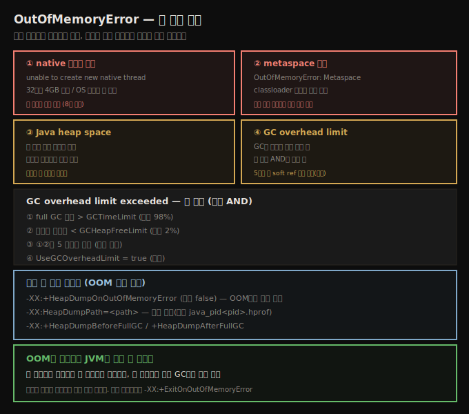

# OutOfMemoryError 진단 — 네 가지 원인과 자동 덤프
> OOM은 네 가지 이유로 던져지므로 힙이 문제라 단정하지 말고, 예외 메시지의 이유부터 읽습니다

`OutOfMemoryError`가 나면 본능적으로 힙을 키우려 합니다. 그러나 OOM은 힙과 무관한 이유로도 던져집니다. JVM이 OOM을 던지는 경우는 네 가지입니다.

1. JVM이 쓸 native 메모리가 없음
2. metaspace가 메모리 부족
3. Java 힙 자체가 부족 — 주어진 힙 크기로 더는 객체를 못 만듦
4. JVM이 GC에 시간을 너무 많이 씀

마지막 둘(힙 자체)이 더 흔하지만, OOM에서 자동으로 힙이 문제라 결론내면 안 됩니다. **왜 OOM이 났는지**를 봐야 하고, 그 이유는 예외 출력의 일부입니다.





## 1. native 메모리 부족 — 힙과 무관
> native 메모리·스레드 수 제한은 힙 튜닝이 답이 아니며, 메시지가 native allocation을 말하면 그쪽을 봅니다

첫째 경우는 힙과 전혀 무관합니다. 32비트 JVM은 프로세스 최대 크기가 4GB(일부 Windows는 3GB, 일부 구버전 Linux는 약 3.5GB)입니다. 아주 큰 힙(예: 3.8GB)을 주면 그 한계에 위험하게 가까워집니다. 64비트 JVM이어도 OS에 JVM이 요청하는 만큼의 가상 메모리가 없을 수 있습니다.

이 주제는 8장에서 더 다룹니다. OOM 메시지가 native 메모리 할당을 말하면 힙 튜닝이 답이 아니라, 메시지의 native 메모리 문제를 봐야 합니다. 예를 들어 다음 메시지는 스레드 스택용 native 메모리가 고갈됐다는 뜻입니다.

```
Exception in thread "main" java.lang.OutOfMemoryError:
unable to create new native thread
```

다만 JVM은 때로 메모리와 무관한 일에도 이 에러를 냅니다. 사용자는 보통 실행 가능한 스레드 수에 제약이 있고, 이는 OS나 컨테이너가 강제합니다. 예를 들어 Linux에서 사용자는 보통 1,024개 프로세스만 만들 수 있습니다(`ulimit -u`로 확인). 1,025번째 스레드를 만들려 하면, 실제로는 OS의 프로세스 수 제한이 원인인데도 native 스레드를 만들 메모리가 부족하다며 같은 OOM을 던집니다.


## 2. metaspace 부족 — classloader 누수
> metaspace OOM은 클래스 과다 또는 classloader 누수이며, 누수 방지를 위해 metaspace 최대 크기 설정을 고려합니다

metaspace OOM도 힙과 무관합니다 — metaspace native 메모리가 찼기 때문입니다. metaspace는 기본적으로 최대 크기가 없으므로, 이 에러는 보통 사용자가 최대 크기를 설정했을 때 납니다.

두 근본 원인이 있습니다. 첫째는 단순히 애플리케이션이 할당한 metaspace에 안 들어갈 만큼 많은 클래스를 쓰는 경우입니다. 둘째는 더 까다로운 **classloader 메모리 누수**로, 클래스를 동적으로 로드하는 서버에서 가장 자주 일어납니다. Java EE 앱 서버가 그런 예입니다. 앱 서버에 배포된 각 애플리케이션은 자기 classloader에서 돕니다(한 앱의 클래스가 다른 앱과 공유·간섭되지 않게 격리). 개발 중에는 앱을 바꿀 때마다 재배포하는데, 새 classloader가 새 클래스를 로드하고 옛 classloader는 scope를 벗어나게 둡니다. classloader가 scope를 벗어나면 클래스 메타데이터가 수집될 수 있습니다.

옛 classloader가 scope를 안 벗어나면 클래스 메타데이터가 안 풀려, 결국 metaspace가 차서 OOM을 던집니다. 이때 metaspace 크기를 키우면 도움은 되지만 결국 에러를 미룰 뿐입니다.

앱 서버 환경이면 벤더에 연락해 누수를 고치게 하는 수밖에 없습니다. 직접 classloader를 많이 만들고 버리는 애플리케이션을 짠다면, classloader 자체가 제대로 버려지는지 확인합니다(특히 어느 스레드도 context classloader를 임시 classloader로 설정하지 않게). 디버깅에는 앞서 본 힙 덤프 분석이 도움됩니다 — 히스토그램에서 `ClassLoader` 인스턴스를 모두 찾아 GC root를 추적해 무엇이 붙들고 있는지 봅니다.

이 상황을 알아채는 열쇠는 역시 OOM의 전체 텍스트입니다. metaspace가 차면 다음처럼 나옵니다.

```
Exception in thread "main" java.lang.OutOfMemoryError: Metaspace
```

classloader 누수가 바로 metaspace 최대 크기 설정을 고려해야 하는 이유입니다. 제한 없이 두면 누수가 있는 시스템은 머신의 모든 메모리를 잠식합니다.


## 3. Java heap space — 부족 또는 누수
> 힙 OOM은 단순 부족이거나 누수이며, 누수는 시간차 덤프 2개를 비교해 추적합니다

힙 자체가 부족하면 메시지가 이렇게 나옵니다.

```
Exception in thread "main" java.lang.OutOfMemoryError: Java heap space
```

흔한 경우는 metaspace 예와 비슷합니다. 애플리케이션이 더 많은 힙이 필요할 수 있습니다 — 붙들고 있는 live 객체 수가 설정된 힙에 안 들어가는 경우입니다. 또는 메모리 누수일 수 있습니다 — 다른 객체를 scope에서 내보내지 않고 계속 추가 객체를 할당하는 경우입니다. 첫째는 힙을 키우면 풀리고, 둘째는 힙을 키워도 에러를 미룰 뿐입니다.

어느 쪽이든 힙 덤프 분석으로 무엇이 메모리를 가장 많이 쓰는지 찾아, 그 객체의 수나 크기를 줄이는 데 집중합니다. 누수가 있으면 몇 분 간격으로 덤프를 연이어 떠 비교합니다. `mat`은 덤프 2개를 열면 두 힙의 히스토그램 차이를 계산하는 기능을 내장합니다.

이런 예외가 던져져도 JVM은 보통 종료하지 않습니다. 예외가 JVM의 한 스레드만 영향을 주기 때문입니다. 계산을 하는 두 스레드를 봅시다. 하나가 OOM을 받으면, 기본 스레드 핸들러가 스택 트레이스를 출력하고 그 스레드는 종료합니다. 그러나 JVM에 다른 활성 스레드가 있어 JVM은 안 끝납니다. 그리고 에러를 만난 스레드가 종료됐으므로, 그 스레드가 참조하던(다른 스레드가 참조 안 한) 객체들은 다음 GC에서 회수될 수 있어, 살아남은 스레드는 보통 작업을 마칠 충분한 메모리를 갖습니다.

스레드 풀로 요청을 처리하는 서버 프레임워크도 본질적으로 같습니다. 보통 에러를 잡아 스레드 종료를 막지만, 요청에 묶인 메모리는 여전히 회수 대상이 됩니다.

그래서 이 에러는 **JVM의 마지막 비데몬 스레드를 종료시킬 때만** 치명적입니다. 서버 프레임워크에서는 결코 그렇지 않고, 멀티 스레드 standalone 프로그램에서도 흔히 그렇지 않습니다. 힙이 부족할 때마다 JVM을 종료시키고 싶으면 `-XX:+ExitOnOutOfMemoryError`(기본 false)를 켭니다.


## 4. GC overhead limit exceeded — 네 조건
> GC 시간 과다는 네 조건이 모두 충족될 때만 던져지며, 5번째 full GC 전 soft reference를 모두 해제해 막기도 합니다

3번의 복구는 스레드가 OOM을 받으면 그 스레드 작업에 묶인 메모리가 회수 대상이 돼 JVM이 회복한다는 가정에 기댑니다. 늘 그렇지는 않고, 그게 마지막 경우로 이어집니다 — JVM이 GC에 시간을 너무 많이 쓴다고 판단할 때입니다.

```
Exception in thread "main" java.lang.OutOfMemoryError: GC overhead limit exceeded
```

이 에러는 다음 조건이 **모두** 충족될 때 던져집니다.

1. full GC에 쓴 시간이 `-XX:GCTimeLimit=N`(기본 98, 즉 98%)을 넘음
2. full GC로 회수한 메모리가 `-XX:GCHeapFreeLimit=N`(기본 2, 즉 힙의 2% 미만이 풀림)보다 적음
3. 위 두 조건이 5 연속 full GC 사이클 동안 참(이 값은 튜닝 불가)
4. `-XX:+UseGCOverheadLimit`이 true(기본)

네 조건이 모두 충족돼야 합니다. OOM을 안 던지는 애플리케이션에서도 5 연속 full GC는 흔합니다. 98% 시간을 full GC에 써도 매 GC에서 힙의 2% 넘게 풀고 있을 수 있기 때문입니다. 이 경우 `GCHeapFreeLimit`을 키우는 걸 고려합니다.

마지막 발악으로, 첫 두 조건이 4 연속 사이클 동안 참이면 5번째 full GC 전에 JVM의 **모든 soft reference가 해제**됩니다. 그러면 5번째 사이클이 힙의 2% 넘게 풀어 에러를 막는 경우가 많습니다(애플리케이션이 soft reference를 쓴다는 전제).


## 5. 자동 힙 덤프 — OOM 시점 포착
> OOM은 예측 불가하므로 HeapDumpOnOutOfMemoryError 등 플래그로 그 시점의 덤프를 자동 생성합니다

OOM은 예측 불가하게 일어나 언제 덤프를 떠야 할지 알기 어렵습니다. 여러 JVM 플래그가 돕습니다.

1. **`-XX:+HeapDumpOnOutOfMemoryError`** — 켜면(기본 false) OOM이 던져질 때마다 JVM이 덤프를 만듭니다.
2. **`-XX:HeapDumpPath=<path>`** — 덤프를 쓸 위치입니다(기본 `java_pid<pid>.hprof`, 현재 작업 디렉토리). 디렉토리(기본 파일명 사용)나 실제 파일명을 줍니다.
3. **`-XX:+HeapDumpAfterFullGC`** — full GC 후 덤프를 만듭니다.
4. **`-XX:+HeapDumpBeforeFullGC`** — full GC 전 덤프를 만듭니다.

여러 덤프가 생기면(예: full GC가 여럿) 덤프 파일명에 순번이 붙습니다.

애플리케이션이 힙 부족으로 예측 불가하게 OOM을 던지고 그 시점 덤프로 원인을 분석해야 하면 이 플래그들을 켭니다. 다만 덤프를 뜨는 동안 힙 데이터를 디스크에 써야 해 pause가 길어집니다.

전형적인 누수 사례는 컬렉션 클래스(예: `HashMap`)가 원인입니다 — 애플리케이션이 컬렉션에 항목을 넣고 안 빼서 시간이 갈수록 커져 힙을 잠식합니다. 두 덤프의 객체 수 차이를 보는 비교 히스토그램(예: 대상 덤프가 baseline보다 `Integer` 객체 19,744개 더 많음)으로 잡습니다. 가장 좋은 해결은 더 필요 없을 때 항목을 능동적으로 비우게 로직을 바꾸는 것입니다. 또는 weak·soft 참조를 쓰는 컬렉션이 자동으로 비울 수 있지만, 그런 컬렉션은 비용이 따릅니다(이 장 뒤에서 다룸).


## 자주 받는 오해

**"OOM이 나면 힙을 키우면 된다"** — OOM은 네 가지 이유로 던져집니다. native 메모리 부족·metaspace 부족은 힙과 무관하고, 힙 부족이어도 누수면 힙을 키워도 에러를 미룰 뿐입니다. 반드시 예외 메시지(`Java heap space`·`Metaspace`·`unable to create new native thread`·`GC overhead limit exceeded`)를 먼저 읽어 원인을 가립니다.

**"`unable to create new native thread`는 항상 메모리 부족이다"** — OS의 프로세스 수 제한(Linux `ulimit -u`, 흔히 1,024) 때문에 1,025번째 스레드 생성이 같은 메시지를 던질 수 있습니다. 실제 원인은 메모리가 아니라 스레드 수 제한입니다.

**"OOM이 나면 JVM이 종료된다"** — 예외는 한 스레드만 영향을 줍니다. 그 스레드가 종료되며 그 객체들이 회수 대상이 돼, 다른 활성 스레드가 있으면 JVM은 살아남습니다. 마지막 비데몬 스레드를 죽일 때만 치명적입니다. 즉시 종료하려면 `-XX:+ExitOnOutOfMemoryError`를 켭니다.


## 면접에서 받을 만한 질문

**Q. OutOfMemoryError의 원인을 어떻게 가리나요?**
예외 메시지를 읽습니다. `Java heap space`는 힙 부족/누수, `Metaspace`는 metaspace 부족(흔히 classloader 누수), `unable to create new native thread`는 native 메모리 또는 OS 스레드 수 제한, `GC overhead limit exceeded`는 GC 시간 과다입니다. 힙이라 단정하지 않고 메시지로 가린 뒤, 힙·metaspace면 누수 가능성을 덤프 분석으로 확인합니다.

**Q. classloader 누수는 왜 생기고 어떻게 찾나요?**
앱 서버가 재배포 때마다 새 classloader를 만드는데, 옛 classloader가 scope를 안 벗어나면(예: 스레드 context classloader가 임시 classloader를 잡고 있으면) 클래스 메타데이터가 안 풀려 metaspace가 찹니다. 힙 덤프 히스토그램에서 `ClassLoader` 인스턴스를 찾아 GC root를 추적해 무엇이 붙들고 있는지 봅니다. metaspace 최대 크기를 설정해 머신 전체 잠식을 막습니다.

**Q. GC overhead limit exceeded는 어떤 조건에서 던져지나요?**
네 조건이 모두 참일 때입니다 — full GC 시간 > `GCTimeLimit`(기본 98%), 회수 메모리 < `GCHeapFreeLimit`(기본 2%), 이 둘이 5 연속 사이클, `UseGCOverheadLimit`이 true. 98% 시간을 GC에 써도 2% 넘게 풀면 안 던져지므로, 그 경우 `GCHeapFreeLimit`을 키웁니다. 4 연속 사이클이면 5번째 전 모든 soft reference를 해제해 막기도 합니다.


## 관련 문서

- [`07-01.힙 분석 — 히스토그램·힙 덤프·retained 메모리`](./07-01.힙%20분석%20—%20히스토그램·힙%20덤프·retained%20메모리.md) — 덤프 분석 도구
- [`07-03.메모리 적게 쓰기 — 객체 크기·lazy init·canonical`](./07-03.메모리%20적게%20쓰기%20—%20객체%20크기·lazy%20init·canonical.md) — OOM을 줄이는 코드 관행
- [`05-04.기본 튜닝 (2) — metaspace·병렬·GC 도구`](./05-04.기본%20튜닝%20(2)%20—%20metaspace·병렬·GC%20도구.md) — metaspace 크기 설정
- [상위 인덱스](./README.md)
