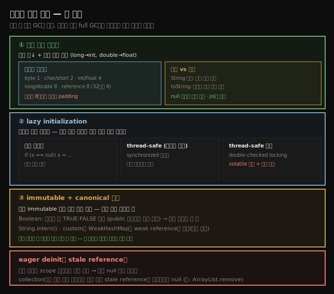

# 메모리 적게 쓰기 — 객체 크기·lazy init·canonical
> 객체를 작게·드물게·하나만 만들어 힙을 덜 채우면 GC가 줄고 그 효과가 곱해집니다

Java에서 메모리를 효율적으로 쓰는 첫 접근은 힙을 덜 쓰는 것입니다. 당연한 말이지만, 메모리를 덜 쓰면 힙이 덜 차서 GC 사이클이 줄고, 효과가 곱해집니다. young collection이 줄면 객체의 tenuring age가 덜 자주 오르고, 그러면 old로 승급될 가능성이 줄어 full GC(또는 concurrent) 사이클이 줄어듭니다. 그리고 그 full GC가 더 많은 메모리를 치울 수 있으면 빈도도 줄어듭니다.

이 노트는 메모리를 덜 쓰는 세 방법을 봅니다 — 객체 크기 줄이기, lazy 초기화, canonical 객체.





## 1. 객체 크기 줄이기 — 타입 바이트와 8바이트 정렬
> 변수 수와 타입 크기를 줄여 객체를 작게 만들되, 객체는 8바이트 배수로 padding되고 null 변수도 공간을 씁니다

객체는 일정 힙 메모리를 차지하므로, 가장 단순한 절약은 객체를 작게 만드는 것입니다. 머신 제약상 힙을 10% 키우긴 어려워도, 힙 객체 절반을 20% 줄이면 같은 목표를 이룹니다. 12장에서 다루듯 Java 11은 `String`에 그런 최적화가 있어, Java 11 사용자는 Java 8에서 필요했던 최대 힙을 GC·성능 영향 없이 25% 작게 잡는 경우가 많습니다.

객체 크기는 (당연히) 인스턴스 변수 수를 줄이고, (덜 당연하게) 그 변수의 크기를 줄여 작아집니다. 모든 Java 타입의 인스턴스 변수 크기입니다.

| 타입 | 바이트 |
|------|--------|
| byte | 1 |
| char | 2 |
| short | 2 |
| int | 4 |
| float | 4 |
| long | 8 |
| double | 8 |
| reference | 8 (32비트 Windows JVM은 4) |

reference는 어떤 Java 객체(클래스 인스턴스·배열)에 대한 참조이고, 그 공간은 참조 자체의 저장만입니다. 다른 객체 참조를 가진 객체의 크기는 shallow·deep·retained 중 무엇을 보느냐에 따라 달라지지만, 보이지 않는 **object header** 필드도 포함합니다. 일반 객체의 헤더는 32비트 JVM에서 8바이트, 64비트에서 16바이트(힙 크기 무관)입니다. 배열은 32비트 또는 32GB 미만 힙의 64비트에서 16바이트, 그 외는 24바이트입니다.

다음 클래스를 봅시다.

```java
public class A {
    private int i;
}

public class B {
    private int i;
    private Locale l = Locale.US;
}

public class C {
    private int i;
    private ConcurrentHashMap chm = new ConcurrentHashMap();
}
```

64비트 JVM(32GB 미만 힙)에서 한 인스턴스의 실제 크기입니다.

| 클래스 | shallow | deep | retained |
|--------|---------|------|----------|
| A | 16 | 16 | 16 |
| B | 24 | 216 | 24 |
| C | 24 | 200 | 200 |

클래스 B에서 `Locale` 참조 정의는 객체 크기에 8바이트를 더하지만, 이 예에서 `Locale` 객체는 다른 클래스들과 공유됩니다. 클래스가 `Locale`을 결코 안 쓴다면 참조용 8바이트만 낭비됩니다 — 하지만 B 인스턴스를 많이 만들면 그 바이트가 쌓입니다. 반면 `ConcurrentHashMap`을 정의·생성하면 참조 바이트에 더해 해시맵 객체 바이트까지 듭니다. 해시맵을 안 쓰면 C 인스턴스는 낭비입니다.

필요한 인스턴스 변수만 정의하는 게 한 절약입니다. 덜 당연한 경우는 작은 타입을 쓰는 것입니다. 클래스가 8가지 상태 중 하나를 추적하면 `int` 대신 `byte`로 해 3바이트를 아낍니다. `double` 대신 `float`, `long` 대신 `int`도 자주 인스턴스화되는 클래스에서 도움됩니다.

> **8바이트 정렬과 padding**: 객체 크기는 항상 8바이트 배수로 padding됩니다. 클래스 A에서 `i` 정의를 빼도 A 인스턴스는 16바이트입니다 — 4바이트는 그냥 8배수 padding에 쓰입니다. `i` 없이도 클래스 B는 16바이트뿐이라 A와 같습니다(추가 참조가 있어도). 그래서 B 인스턴스가 A보다 8바이트 큰 것이고(4바이트 참조 하나만 더해도), null 변수도 공간을 씁니다. 일부 필드를 없애거나 크기를 줄이는 게 이득일 수도 아닐 수도 있지만, 안 할 이유는 없습니다. OpenJDK의 **jol** 도구로 객체 크기를 잴 수 있습니다.

인스턴스 필드를 없애는 것과 별개로 회색지대가 있습니다 — 데이터 조각으로 계산한 결과를 담는 필드는 어떨까요. 이는 고전적 **시간 대 공간** 트레이드오프입니다. 값을 저장하는 데 메모리(공간)를 쓸지, 필요할 때 계산하는 데 CPU(시간)를 쓸지입니다. Java에서는 추가 메모리가 GC에 CPU를 더 쓰게 하므로 트레이드오프가 CPU 시간에도 걸립니다. `String`의 해시 코드는 각 문자를 합산해 계산하기에 다소 오래 걸리지만, 자주 쓰여 인스턴스 변수에 캐시합니다(한 번만 계산). 반면 대부분 클래스의 `toString()`은 결과를 캐시하지 않습니다 — 드물게 쓰여 매번 계산하는 편이 메모리보다 낫습니다. GC를 줄이는 게 목표면 균형은 재계산 쪽으로 더 기웁니다.


## 2. lazy 초기화 — 드물게 쓰는 변수만
> 드물게 쓰는 변수만 처음 쓸 때 초기화하며, 흔히 쓰면 절약 없이 검사 비용만 듭니다

특정 변수가 필요한지는 늘 흑백이 아닙니다. 어떤 클래스가 `Calendar` 객체를 10%만 쓰는데 `Calendar`는 생성이 비싸다면, 매번 다시 만들기보다 붙들어 두는 게 맞습니다. 이때 **lazy 초기화**가 돕습니다.

eager 초기화한 코드는 이렇습니다(thread-safe일 필요 없는 경우).

```java
public class CalDateInitialization {
    private Calendar calendar = Calendar.getInstance();
    private DateFormat df = DateFormat.getDateInstance();

    private void report(Writer w) {
        w.write("On " + df.format(calendar.getTime()) + ": " + this);
    }
}
```

lazy로 바꾸면 계산 성능에 작은 트레이드오프가 생깁니다 — 코드가 실행될 때마다 변수 상태를 검사해야 합니다.

```java
public class CalDateInitialization {
    private Calendar calendar;
    private DateFormat df;

    private void report(Writer w) {
        if (calendar == null) {
            calendar = Calendar.getInstance();
            df = DateFormat.getDateInstance();
        }
        w.write("On " + df.format(calendar.getTime()) + ": " + this);
    }
}
```

lazy 초기화는 해당 연산이 드물게 쓰일 때만 좋습니다. 흔히 쓰이면 메모리가 안 절약되고(늘 할당되므로) 흔한 연산에 작은 성능 페널티만 남습니다.

> **검사 비용이 0인 경우도 있습니다**: JDK `ArrayList`는 `elementData` 배열을 lazy로 초기화하지만, `ensureCapacity()`가 이미 배열 크기를 검사해야 했기에 흔한 메서드에 페널티가 없습니다. 초기화 검사 코드가 배열 크기 증가 검사 코드와 같기 때문입니다. 새 코드는 static·공유·길이 0 배열(`EMPTY_ELEMENTDATA`)을 써, `index`와 `elementData.length`가 둘 다 0에서 시작해 `ensureCapacity()`가 사실상 그대로입니다.


## 3. thread-safe lazy 초기화 — synchronized와 DCL
> 비안전 객체는 synchronized로, thread-safe 객체는 double-checked locking으로 lazy 초기화하며 volatile이 필수입니다

thread-safe해야 하면 lazy 초기화가 복잡해집니다. 첫 단계는 전통적 동기화를 더하는 것입니다.

```java
public class CalDateInitialization {
    private Calendar calendar;
    private DateFormat df;

    private synchronized void report(Writer w) {
        if (calendar == null) {
            calendar = Calendar.getInstance();
            df = DateFormat.getDateInstance();
        }
        w.write("On " + df.format(calendar.getTime()) + ": " + this);
    }
}
```

동기화를 넣으면 그게 병목이 될 가능성이 열립니다. 그 경우는 드뭅니다 — lazy 초기화의 이득은 그 필드를 드물게 초기화할 때만 나므로, 드물게 쓰는 코드 경로가 갑자기 많은 스레드에 동시 노출될 때만 병목입니다. 생각 못 할 일은 아니지만 가장 흔한 경우도 아닙니다.

`DateFormat`은 thread-safe하지 않아, 이 예에서는 lock이 `Calendar`를 포함하든 아니든 상관없습니다 — 비안전 객체 lazy 초기화는 그 변수 주위를 항상 동기화할 수 있습니다.

반면 `ConcurrentHashMap`처럼 thread-safe 객체를 lazy 초기화하면, 추가 동기화가 드문 병목 사례 중 하나가 될 수 있습니다(해시맵 접근이 그렇게 잦으면 lazy 초기화로 정말 뭔가 절약되는지부터 따져야 하지만). 이 병목은 **double-checked locking(DCL)** 관용구로 풉니다.

```java
public class CHMInitialization {
    private volatile ConcurrentHashMap instanceChm;

    public void doOperation() {
        ConcurrentHashMap chm = instanceChm;
        if (chm == null) {
            synchronized(this) {
                chm = instanceChm;
                if (chm == null) {
                    chm = new ConcurrentHashMap();
                    ... code to populate the map
                    instanceChm = chm;
                }
            }
            ...use the chm...
        }
    }
}
```

중요한 스레딩 이슈가 있습니다 — 인스턴스 변수는 반드시 `volatile`로 선언해야 하고, 인스턴스 변수를 로컬 변수에 대입하면 약간의 성능 이득이 납니다. 자세한 건 9장에서 다루며, lazy 초기화한 스레드 코드가 말이 되는 드문 경우 따라야 할 설계 패턴입니다.


## 4. eager deinit — stale reference만 null
> 로컬 변수는 scope 이탈로 자동 회수되므로, collection처럼 오래 사는 클래스의 stale reference만 명시적으로 null로 지웁니다

lazy 초기화의 짝은 변수를 null로 설정해 **eager하게 비초기화**하는 것입니다. 그러면 객체가 GC에 더 빨리 수집됩니다. 이론상 좋아 보이지만 쓸모는 제한적입니다.

lazy 초기화 후보처럼 보이는 변수가 eager deinit 후보로도 보일 수 있습니다 — 앞 예의 `Calendar`·`DateFormat`을 `report()` 끝에서 null로 둘 수 있습니다. 그러나 그 변수가 이후 메서드 호출이나 클래스 다른 곳에서 안 쓰인다면, 애초에 인스턴스 변수로 만들 이유가 없습니다. 메서드에 로컬 변수로 만들면 메서드 종료 시 scope를 벗어나 GC가 알아서 풉니다.

이 규칙의 흔한 예외는 Java collection 프레임워크 같은 클래스입니다 — 데이터를 오래 참조하다 더 필요 없다고 통보받는 경우입니다. JDK `ArrayList`의 `remove()`를 봅시다(코드 단순화).

```java
public E remove(int index) {
    E oldValue = elementData(index);
    int numMoved = size - index - 1;
    if (numMoved > 0)
        System.arraycopy(elementData, index+1,
                         elementData, index, numMoved);
    elementData[--size] = null; // clear to let GC do its work
    return oldValue;
}
```

GC에 대한 주석은 (주석이 드문) JDK 소스 자체에 있습니다 — 변수를 null로 설정하는 게 설명이 필요할 만큼 드문 연산이기 때문입니다. 배열의 마지막 요소가 제거될 때를 따라가 봅시다. `size`가 5에서 4로 줄면, `elementData[4]`에 저장된 것은 더는 접근할 수 없습니다 — 배열의 유효 크기를 넘었습니다. `elementData[4]`는 이제 **stale reference**입니다. `elementData` 배열은 오래 활성으로 남을 테니, 더 참조할 필요 없는 것은 능동적으로 null로 설정해야 합니다.

이 stale reference 개념이 핵심입니다 — 오래 사는 클래스가 객체 참조를 캐시했다가 버린다면, stale reference를 피하도록 주의해야 합니다. 그렇지 않으면 객체 참조를 명시적으로 null로 설정해도 성능 이득은 거의 없습니다.


## 5. immutable과 canonical 객체
> 같은 immutable 객체의 중복을 canonical 버전 하나로 제거하면 힙 사용을 크게 줄입니다

Java의 많은 객체 타입은 immutable입니다 — `Integer`·`Double`·`Boolean` 같은 primitive 대응 타입, `BigDecimal` 같은 수치 타입, 가장 흔한 `String`입니다. 설계 관점에서 custom 클래스도 immutable로 표현하는 게 좋을 때가 많습니다.

이 객체들이 빨리 생성·폐기되면 young collection에 작은 영향만 줍니다(5장 참조). 그러나 많은 immutable 객체가 old로 승급되면 성능이 나빠질 수 있습니다. 그래서 immutable 객체를 피할 이유는 없지만, 자주 가능한 최적화 하나는 **같은 객체의 중복 생성을 피하는 것**입니다.

가장 좋은 예가 `Boolean`입니다. 어떤 Java 애플리케이션도 `Boolean` 인스턴스는 둘만 필요합니다 — true 하나, false 하나. 불행히도 `Boolean`은 설계가 나빠, public 생성자가 있어 똑같은데도 원하는 만큼 만들 수 있습니다. 더 나은 설계는 private 생성자에 파라미터로 `Boolean.TRUE`나 `Boolean.FALSE`를 반환하는 static 메서드였을 것입니다. custom immutable 클래스에 그 모델을 따르면 힙 사용에 기여하지 않게 막을 수 있습니다. (당연히 `Boolean` 객체는 결코 새로 만들지 말고 `Boolean.TRUE`·`Boolean.FALSE`를 써야 합니다.) 이 단일 표현을 객체의 **canonical 버전**이라 합니다.

객체 우주가 사실상 무한해도 canonical 값으로 메모리를 아끼는 경우가 많습니다. JDK는 가장 흔한 immutable 객체에 그 수단을 줍니다 — `String`은 `intern()`으로 canonical 버전을 찾습니다(12장에서 상세). custom 클래스도 같게 할 수 있습니다. canonical 맵을 만들되, 누수 방지를 위해 맵의 객체를 **weak로 참조**합니다.

```java
public class ImmutableObject {
    private static WeakHashMap<ImmutableObject, ImmutableObject>
        map = new WeakHashMap();

    public ImmutableObject canonicalVersion(ImmutableObject io) {
        synchronized(map) {
            ImmutableObject canonicalVersion = map.get(io);
            if (canonicalVersion == null) {
                map.put(io, new WeakReference(io));
                canonicalVersion = io;
            }
            return canonicalVersion;
        }
    }
}
```

스레드 환경에서는 동기화가 병목이 될 수 있습니다. JDK 클래스만 쓰면 weak 참조용 concurrent 해시맵이 없어 쉬운 해법이 없지만, JDK에 `CustomConcurrentHashMap`을 더하자는 제안(원래 JSR 166의 일부)이 있었고 다양한 서드파티 구현을 찾을 수 있습니다.


## 자주 받는 오해

**"인스턴스 변수를 null로 두면 공간을 안 쓴다"** — null 변수도 공간을 차지합니다. 객체 크기는 8바이트 배수로 padding되므로, `int` 하나만 가진 클래스도 16바이트(헤더 + padding)입니다. 참조 필드를 더하면 그만큼 커집니다.

**"계산 결과는 무조건 필드에 캐시하는 게 빠르다"** — 시간 대 공간 트레이드오프입니다. `String` 해시처럼 자주 쓰이고 계산이 비싼 값은 캐시가 낫지만, `toString()`처럼 드물게 쓰이는 값은 매번 계산하는 편이 메모리(필드 + 참조한 문자열)를 아껴 낫습니다. GC를 줄이는 게 목표면 재계산 쪽으로 기웁니다.

**"DCL은 volatile 없이도 동작한다"** — `volatile` 없이는 다른 스레드가 부분 초기화된 객체를 볼 수 있습니다. DCL은 인스턴스 변수를 반드시 `volatile`로 선언해야 하고, 로컬 변수에 대입하면 약간의 성능 이득이 납니다.

**"eager deinit(null 대입)은 항상 메모리를 빨리 푼다"** — 로컬 변수는 scope를 벗어나면 GC가 알아서 풀어 null 대입이 불필요합니다. `ArrayList.remove()`처럼 오래 사는 클래스가 잡고 있던 stale reference만 명시적으로 null로 지웁니다.


## 면접에서 받을 만한 질문

**Q. `int i` 하나만 가진 객체는 왜 16바이트인가요?**
객체 크기가 항상 8바이트 배수로 padding되기 때문입니다. 64비트 JVM의 객체 헤더가 16바이트라, `int` 4바이트를 더해도 8배수로 맞추려 16바이트가 됩니다. null 참조 변수도 공간을 차지하므로, 필드를 줄이거나 작은 타입을 쓰면 도움이 될 수도 안 될 수도 있지만 안 할 이유는 없습니다. OpenJDK `jol`로 실제 크기를 잽니다.

**Q. lazy 초기화는 언제 쓰고, 언제 역효과인가요?**
드물게 쓰는 변수만 lazy로 둡니다(예: 10%만 쓰는 비싼 `Calendar`). 흔히 쓰면 늘 할당돼 메모리가 안 절약되고 검사 비용만 남습니다. thread-safe 비안전 객체는 synchronized로, thread-safe 객체는 DCL(volatile 필수)로 합니다. 단 `ArrayList`처럼 기존 검사에 편승하면 검사 비용이 0일 수 있습니다.

**Q. canonical 객체란 무엇이고 왜 메모리를 아끼나요?**
같은 immutable 객체를 중복 생성하지 않고 정규 버전 하나만 공유하는 것입니다. `Boolean.TRUE`·`Boolean.FALSE`나 `String.intern()`이 그 예입니다. custom 클래스는 `WeakHashMap`에 weak 참조로 저장해 누수 없이 canonical 맵을 만듭니다. 중복 제거로 힙 사용을 크게 줄이지만, 스레드 환경은 동기화 병목을 주의합니다.


## 관련 문서

- [`07-04.객체 재사용 — object pool·thread-local과 GC 비용`](./07-04.객체%20재사용%20—%20object%20pool·thread-local과%20GC%20비용.md) — 객체를 재사용하는 반대 방향
- [`07-05.indefinite reference와 compressed oops`](./07-05.indefinite%20reference와%20compressed%20oops.md) — WeakHashMap·canonical의 weak 참조 상세, 참조 크기
- [`07-02.OutOfMemoryError 진단 — 네 가지 원인과 자동 덤프`](./07-02.OutOfMemoryError%20진단%20—%20네%20가지%20원인과%20자동%20덤프.md) — 메모리 부족 진단
- [상위 인덱스](./README.md)
