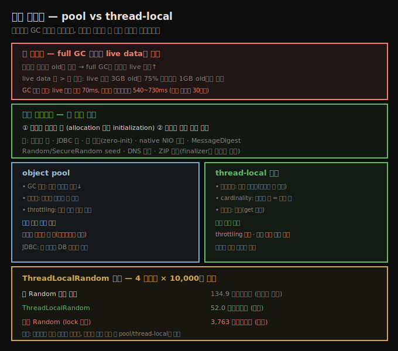

# 객체 재사용 — object pool·thread-local과 GC 비용
> 재사용은 GC 효율을 해치지만, 초기화 비용이 크고 수가 적은 객체엔 정당하며 pool과 thread-local로 합니다

7장의 둘째 큰 주제는 객체 생애주기 관리입니다. Java는 대부분 그 부담을 줄여 줍니다 — 필요할 때 객체를 만들고, 더 필요 없으면 scope를 벗어나 GC가 풉니다. 그런데 때로 이 정상 생애주기가 최적이 아닙니다. 어떤 객체는 생성이 비싸, 그 생애주기를 관리하면 GC가 일을 더 하더라도 애플리케이션 효율이 좋아집니다.

객체 재사용은 흔히 두 방법으로 합니다 — **object pool**과 **thread-local 변수**입니다. 전 세계 GC 엔지니어가 신음할 텐데, 두 기법 모두 GC 효율을 해치기 때문입니다. 특히 object pooling은 그 이유로 GC 진영에서 널리 미움받고, 그 밖의 많은 이유로 개발 진영에서도 미움받습니다. 그래도 쓸 자리가 있습니다 — 어떻게·언제 재사용할지부터 봅니다.





## 1. 왜 재사용은 GC를 해치는가 — live data가 지배
> full GC 시간은 old에 살아있는 객체 수에 비례하므로, 오래 사는 재사용 객체는 GC를 느리게 합니다

겉으로는 이유가 분명해 보입니다 — 재사용 객체는 힙에 오래 남고, 힙에 객체가 많으면 새 객체를 만들 공간이 줄어 GC가 잦아집니다. 그러나 그게 전부가 아닙니다.

6장에서 봤듯 객체가 생성되면 eden에 할당되고, 몇 young GC 사이클을 survivor space 사이로 오가다 결국 old로 승급합니다. 새로(또는 최근) 생성된 pool 객체가 처리될 때마다, GC 알고리즘은 그것을 복사하고 참조를 조정하는 일을 해야 합니다. 그게 끝이 아닙니다 — old로 승급된 뒤 성능 문제가 더 커집니다. **full GC 시간은 old에 아직 살아있는 객체 수에 비례**합니다. live data 양은 힙 크기보다 더 중요합니다 — live가 적은 3GB old를 처리하는 게 75% 객체가 살아남는 1GB old를 처리하는 것보다 빠릅니다.

> **GC 효율 실측**: 4코어 Linux, 4GB 힙(1GB는 new 고정)의 GC 로그입니다. live가 거의 비면(old에 210KB만 남음) full GC가 70ms뿐이지만, 대부분 데이터가 살아있으면 540~730ms가 걸립니다. 단일 코어에서는 짧은 GC가 80ms, 긴 GC가 2,410ms로 30배 넘게 차이 납니다.

```
[Full GC [PSYoungGen: 786432K->0K(917504K)]
        [ParOldGen: 3145727K->210K(3145728K)]
        3932159K->210K(4063232K)
        [PSPermGen: 2349K->2349K(21248K)], 0.0687770 secs]
        [Times: user=0.08 sys=0.00, real=0.07 secs]
```

concurrent collector로 full GC를 피해도 크게 낫지 않습니다 — concurrent collector의 marking phase 시간도 살아있는 데이터 양에 비례합니다. 특히 CMS는 pool 객체가 서로 다른 시점에 승급될 가능성이 커, fragmentation에 의한 concurrent failure 확률이 높아집니다. 결국 객체를 힙에 오래 둘수록 GC는 덜 효율적입니다. 그러니 **객체 재사용은 나쁩니다** — 이제 어떻게·언제 할지 봅니다.


## 2. 언제 재사용이 정당한가 — 두 조건
> 초기화 비용이 크고 객체 수가 적을 때만 정당하며, 둘 중 하나만으로는 부족합니다

JDK도 공통 object pool을 제공합니다 — 스레드 풀(9장)과 soft reference입니다. soft reference는 본질적으로 재사용 객체의 큰 풀입니다. Java 서버는 DB 등 자원 연결에 object pool을 의존하고, thread-local 값도 JDK 곳곳이 객체 재할당을 피하려 씁니다. Java 전문가도 어떤 상황에서는 재사용이 필요함을 압니다.

재사용의 이유는 많은 객체가 **초기화가 비싸**, 재사용이 늘어난 GC 시간보다 효율적이기 때문입니다. JDBC 연결 풀이 그렇습니다 — 네트워크 연결·로그인·DB 세션 수립이 비쌉니다. 두 공통 특징이 있습니다.

1. **초기화가 오래 걸림** — Java에서 객체 할당(allocation)은 빠르고 쌉니다(재사용 반대론은 이 부분에 집중). 초기화(initialization) 성능은 객체에 달렸습니다. 초기화 비용이 아주 높고, 그 비용이 프로그램의 지배적 연산 중 하나일 때만 재사용을 고려합니다.
2. **공유 객체 수가 적음** — 이것이 GC 영향을 최소화합니다. 풀에 객체 몇 개는 GC 효율에 큰 영향이 없지만, 힙을 pool 객체로 채우면 GC가 크게 느려집니다.

JDK·Java 프로그램이 객체를 재사용하는 예입니다.

| 대상 | 재사용 이유 |
|------|-------------|
| 스레드 풀 | 스레드 초기화가 비쌈 |
| JDBC 풀 | DB 연결 초기화가 비쌈 |
| 큰 배열 | 할당 시 모든 요소를 zero 값으로 초기화해야 해 시간이 듦 |
| native NIO 버퍼 | `allocateDirect()`가 크기 무관하게 비쌈 → 큰 버퍼 하나를 슬라이싱 |
| 보안 클래스 | `MessageDigest`·`Signature` 등 초기화가 비쌈 |
| Random 생성기 | `Random`·`SecureRandom` seed가 비쌈 |
| DNS 이름 | 네트워크 lookup이 비쌈 |
| ZIP 코더 | 초기화는 안 비싸나, finalization에 의존해 **해제가 비쌈** |


## 3. object pool — GC·동기화·throttling
> pool은 GC 효율을 떨어뜨리고 동기화 경합을 낳지만, 희소 자원 접근을 throttling하는 이점도 줍니다

object pool은 성능 외 이유로도 미움받습니다. 크기를 맞추기 어렵고, 객체 관리 부담을 프로그래머에게 되돌립니다 — scope를 벗어나게 두는 대신 풀에 반납하는 걸 기억해야 합니다. 성능에 초점을 맞추면 세 가지가 작용합니다.

1. **GC 영향** — 객체를 많이 붙들면 GC 효율이 (때로 극적으로) 떨어집니다.
2. **동기화** — 풀은 필연적으로 동기화되고, 객체가 자주 빠지고 들어오면 경합이 큽니다. 결과적으로 풀 접근이 새 객체 초기화보다 느려질 수 있습니다.
3. **throttling** — 이 영향은 이로울 수 있습니다. 풀은 희소 자원 접근을 throttling합니다. 2장에서 봤듯 시스템이 감당할 한계를 넘겨 부하를 늘리면 성능이 떨어집니다. 스레드 풀이 중요한 한 이유입니다 — 너무 많은 스레드가 동시에 돌면 CPU가 압도돼 성능이 나빠집니다. 원격 시스템 접근(특히 JDBC 연결)도 같습니다. DB가 감당할 수 있는 것보다 많은 연결을 만들면 DB 성능이 떨어지므로, 풀 크기를 제한해 자원 수를 throttling하는 게 낫습니다 — 애플리케이션 스레드가 빈 자원을 기다려야 하더라도.


## 4. thread-local — 관리 쉽고 동기화 없음
> thread-local은 반납이 불필요하고 cardinality가 스레드 수에 묶이며 동기화가 없어, 동기화 병목 회피에 유리합니다

객체를 thread-local 변수로 저장해 재사용하면 여러 트레이드오프가 있습니다.

1. **생애주기 관리** — pool보다 훨씬 쉽고 쌉니다. 둘 다 초기 객체를 얻어야 하지만(풀에서 체크아웃하거나 `get()` 호출), pool은 끝나면 객체를 반납해야 합니다. thread-local 객체는 스레드 안에 늘 있어 명시적 반납이 불필요합니다.
2. **cardinality** — 보통 스레드 수와 저장 객체 수가 1:1입니다. 엄밀히는 스레드가 처음 쓸 때까지 복사본이 안 생겨 스레드보다 적을 수 있지만, 더 많을 수는 없고 흔히 같습니다. 반면 pool은 임의 크기로 잡습니다(예: 8 스레드에 12 연결). thread-local은 이게 안 되고, 자원 접근을 throttling할 수도 없습니다(스레드 수 자체가 throttle이 아닌 한).
3. **동기화** — thread-local은 단일 스레드 안에서만 쓰여 동기화가 불필요하고 `get()`이 비교적 빠릅니다(과거에는 비쌌으나 현재 버전은 개선됨 — 과거 성능 때문에 피했다면 재고하세요).

동기화는 흥미로운 점을 짚습니다 — thread-local의 성능 이점은 흔히 객체 재사용보다 **동기화 비용 절약**으로 설명됩니다. Java는 `ThreadLocalRandom`을 제공하고, 샘플 stock 애플리케이션이 (단일 `Random` 대신) 이를 씁니다. 안 그러면 단일 `Random`의 `next()`에서 동기화 병목을 만납니다. thread-local 객체는 한 스레드만 쓸 수 있어 동기화 병목 회피에 좋습니다.

그런데 그 동기화 문제는 매번 새 `Random`을 만들어도 풀립니다. 다만 그렇게 풀면 전체 성능에 도움이 안 됩니다 — `Random` 초기화가 비싸, 계속 새로 만들면 여러 스레드가 한 인스턴스를 공유하는 동기화 병목보다 더 나쁩니다. 더 나은 성능은 `ThreadLocalRandom`에서 나옵니다.


## 5. ThreadLocalRandom 벤치 — 세 시나리오
> 새 Random 매번 생성 134.9, ThreadLocalRandom 52.0, 공유 Random 3,763 마이크로초로 thread-local이 최선입니다

4 스레드 각각이 난수 10,000개를 만드는 데 걸린 시간을 세 시나리오로 잽니다.

1. 각 스레드가 새 `Random`을 만들어 계산
2. 모든 스레드가 공통 static `Random`을 공유
3. 모든 스레드가 공통 static `ThreadLocalRandom`을 공유

| 연산 | 경과 시간 |
|------|-----------|
| 새 `Random` 생성 | 134.9 ± 0.01 마이크로초 |
| `ThreadLocalRandom` | 52.0 ± 0.01 마이크로초 |
| 공유 `Random` | 3,763 ± 200 마이크로초 |

lock에 경합하는 스레드의 마이크로벤치마크는 늘 신뢰도가 낮습니다. 마지막 행에서 스레드는 거의 항상 `Random` lock을 다투는데, 실제 애플리케이션에서는 경합이 훨씬 적습니다. 그래도 공유 객체에서는 어느 정도 경합을 예상할 수 있고, 매번 새 객체를 만드는 건 `ThreadLocalRandom`보다 2배 넘게 비쌉니다.

교훈은 — 객체 초기화가 오래 걸리면 object pooling이나 thread-local로 비싼 객체를 재사용하길 주저하지 마세요. 단 늘 균형을 잡아, 일반 클래스의 큰 object pool은 푸는 것보다 더 많은 문제를 일으킵니다. 이 기법은 **초기화가 비싸고 재사용 객체 수가 적을 때**에 남겨 둡니다.


## 자주 받는 오해

**"재사용은 객체 할당을 아껴 무조건 빠르다"** — Java에서 객체 할당은 빠르고 쌉니다. 재사용이 정당한 건 할당이 아니라 **초기화**가 비쌀 때입니다(스레드·JDBC 연결·`SecureRandom` seed 등). 게다가 재사용 객체는 old로 승급해 full GC 시간(live data에 비례)을 늘리므로, 초기화가 안 비싼 객체를 재사용하면 손해입니다.

**"힙이 크면 재사용 객체가 많아도 GC가 괜찮다"** — full GC 시간은 힙 크기가 아니라 old의 **live data 양**에 비례합니다. live가 적은 3GB old가 75% 살아있는 1GB old보다 빠릅니다. 힙을 pool 객체로 채우면 GC가 크게 느려집니다.

**"동기화 병목은 새 객체를 매번 만들면 풀린다"** — 병목은 풀리지만 `Random`처럼 초기화가 비싼 객체는 매번 생성이 공유 lock 경합보다 더 느릴 수 있습니다(134.9 vs 일반적 경합). 진짜 해법은 thread-local(52.0)입니다.


## 면접에서 받을 만한 질문

**Q. 객체 재사용은 왜 GC를 해치나요?**
재사용 객체는 오래 살아 old로 승급하고, full GC 시간은 old의 live 객체 수에 비례하기 때문입니다. live data 양이 힙 크기보다 중요해, live 적은 큰 old가 live 많은 작은 old보다 빠릅니다. concurrent collector도 marking 시간이 live에 비례하고, CMS는 pool 객체의 fragmentation으로 concurrent failure 위험이 큽니다.

**Q. 그럼 언제 재사용이 정당한가요?**
두 조건이 함께일 때입니다 — 초기화(할당 아님)가 비싸고, 재사용 객체 수가 적을 때. 스레드·JDBC 연결·`MessageDigest`·`SecureRandom`·native NIO 버퍼처럼 초기화가 비싸고 소수인 객체가 그렇습니다. 둘 중 하나만으로는 부족합니다 — 싼 객체를 재사용하면 GC 손해만 보고, 비싸도 수가 많으면 GC를 느리게 합니다.

**Q. object pool과 thread-local 중 무엇을 고르나요?**
스레드와 재사용 객체가 1:1이면 thread-local이 쉽습니다 — 반납이 불필요하고 동기화가 없습니다(`ThreadLocalRandom` 52 vs 공유 `Random` 3,763 마이크로초). 자원 수를 throttling하거나(JDBC가 DB 과부하 차단) 스레드 수와 다른 크기가 필요하면 pool을 씁니다 — 단 pool은 GC 영향·동기화 경합·반납 부담이 따릅니다.


## 관련 문서

- [`07-05.indefinite reference와 compressed oops`](./07-05.indefinite%20reference와%20compressed%20oops.md) — soft reference도 재사용 풀, ZIP 코더 finalizer
- [`07-03.메모리 적게 쓰기 — 객체 크기·lazy init·canonical`](./07-03.메모리%20적게%20쓰기%20—%20객체%20크기·lazy%20init·canonical.md) — 재사용의 반대 방향
- [`06-04.고급 튜닝 — tenuring·TLAB·humongous·힙 제어`](./06-04.고급%20튜닝%20—%20tenuring·TLAB·humongous·힙%20제어.md) — eden·survivor·승급 동작
- [상위 인덱스](./README.md)
