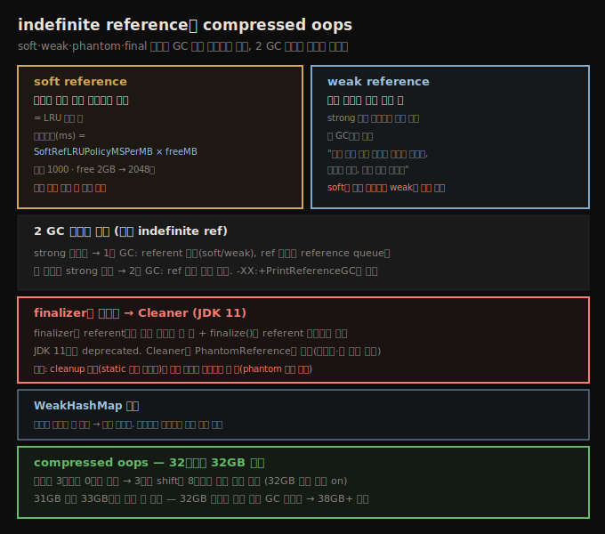

# indefinite reference와 compressed oops
> soft·weak·phantom·final 참조는 객체를 GC 친화적으로 재사용하게 하지만 2 GC 사이클 비용을 치르고, compressed oops는 32GB까지 32비트로 참조합니다

soft·weak 참조도 객체를 재사용하게 합니다. 다만 보통 단순 객체 재사용이 아니라, 긴 계산이나 DB lookup 결과를 캐시하는 데 더 자주 씁니다. 이런 참조들(soft·weak 등)을 통칭 **indefinite reference**라 부릅니다. 예컨대 stock server에서 `getHistory()`(긴 계산이나 DB 호출)의 결과를 indefinite reference로 캐시하면, 초기화가 비싼 그 객체를 재사용하는 셈입니다.

이 노트는 indefinite reference의 종류와 비용, 그리고 객체 참조 크기를 줄이는 compressed oops를 봅니다.





## 1. 용어와 2 GC 사이클 비용
> 모든 indefinite reference는 자기 메모리를 쓰고 적어도 두 GC 사이클을 거쳐야 회수됩니다

용어가 비슷해 혼동되기 쉬워 먼저 정리합니다.

1. **reference(참조)** — 모든 종류의 참조입니다. 객체를 가리키는 보통 인스턴스 변수는 **strong reference**입니다.
2. **indefinite reference** — soft·weak 같은 특수 참조를 통칭합니다. 실제로는 객체의 인스턴스입니다(예: `SoftReference` 인스턴스).
3. **referent** — indefinite reference는 자기 안에 다른 참조(거의 항상 strong)를 품습니다. 그 캡슐화된 객체가 referent입니다.

object pool·thread-local 대비 indefinite reference의 이점은 (결국) GC가 회수해 준다는 점입니다. object pool에 최근 lookup 10,000개를 담았는데 힙이 부족해지면 남은 공간이 전부인데, indefinite reference로 저장하면 JVM이 (참조 타입에 따라) 일부를 풀어 GC throughput이 낫습니다.

단점은 GC 효율에 약간 더 영향을 준다는 것입니다. indefinite reference는 다른 객체처럼 메모리를 쓰고, 무언가가 그것을 strong하게 참조합니다(예: `cachedValue` 변수). 그래서 첫 영향은 애플리케이션이 메모리를 더 쓰는 것입니다. 둘째 더 큰 영향은 **indefinite reference 객체가 회수되려면 적어도 두 GC 사이클이 든다**는 것입니다.

referent가 더는 strong 참조되지 않으면(soft 가정), referent는 JVM이 최근 충분히 안 쓰였다고 판단할 때 풀립니다. 그때 첫 GC 사이클이 referent를 풀지만 indefinite reference 객체 자체는 안 풉니다. 이제 indefinite reference 객체에는 strong 참조가 (최소) 둘 있습니다 — 애플리케이션이 만든 원래 참조와, JVM이 reference queue에 만든 새 참조입니다. 이 strong 참조가 모두 사라져야 indefinite reference 객체가 회수됩니다. 보통 reference queue를 처리하는 코드가 통보받아 strong 참조를 즉시 제거하고, 다음 GC 사이클에 객체가 풀립니다. 최악의 경우 queue가 즉시 처리 안 돼 여러 사이클이 걸리고, 최선이어도 두 GC 사이클을 거쳐야 풉니다.

> **관찰 플래그**: indefinite reference를 많이 쓰면 `-XX:+PrintReferenceGC`(기본 false)를 더해 처리 시간을 봅니다. 예컨대 weak reference 238,425개가 young collection에 23ms를 더한 게 보입니다.


## 2. soft reference — LRU 캐시
> soft reference 유지 시간은 SoftRefLRUPolicyMSPerMB × free 메모리 MB이며, 기본 1000은 free 2GB일 때 2,048초입니다

soft reference는 객체가 미래에 재사용될 가능성은 높지만, 최근 안 쓰였으면 GC가 회수하게 두고 싶을 때 씁니다(힙의 여유 메모리도 고려한 계산). 본질적으로 하나의 큰 LRU 객체 풀입니다. 좋은 성능의 열쇠는 제때 비워지게 하는 것입니다.

stock server는 심볼(또는 심볼+날짜)로 키를 잡은 전역 stock history 캐시를 둘 수 있습니다. TPKS가 가장 많이 요청되면 soft reference 캐시에 남고, 한 번뿐인 KENG 요청은 잠시 머물다 회수됩니다.

soft reference는 언제 풀릴까요. 먼저 referent가 다른 곳에서 strong 참조되지 않아야 합니다. soft reference가 유일한 참조면, referent는 그 soft reference가 최근 접근되지 않았을 때만 다음 GC에서 풀립니다. 의사코드는 이렇습니다.

```
long ms = SoftRefLRUPolicyMSPerMB * AmountOfFreeMemoryInMB;
if (now - last_access_to_reference > ms)
   free the reference
```

두 핵심 값이 있습니다. 첫째는 `-XX:SoftRefLRUPolicyMSPerMB=N`(기본 1,000)입니다. 둘째는 힙의 free 메모리(GC 완료 후)로, 최대 힙 크기에서 사용 중인 것을 뺀 값입니다.

4GB 힙 예입니다. full GC(또는 concurrent) 후 힙이 50% 점유면 free는 2GB입니다. 기본값 1,000이면 과거 2,048초(2,048,000ms) 안 쓰인 soft reference가 풀립니다 — free 2,048(MB) × 1,000이기 때문입니다. 4GB 힙이 75% 점유면 1,024초 안 쓰인 객체가 회수됩니다.

soft reference를 더 자주 회수하려면 `SoftRefLRUPolicyMSPerMB`를 낮춥니다(예: 500이면 4GB·75% 힙에서 512초 안 쓰인 객체 회수). 힙이 soft reference로 빨리 차면 이 튜닝이 필요합니다 — free 2GB에서 2,048초 안에 1.7GB soft reference를 만들면 아무것도 회수 대상이 안 돼 다른 객체에 300MB만 남아 GC가 잦아집니다.

JVM이 메모리를 완전히 소진하거나 심하게 thrashing하면, `OutOfMemoryError`를 던지는 대신 **모든 soft reference를 해제**합니다(4 연속 full GC 후, 「GC overhead limit」 조건). 반대로 free 힙이 많고 soft reference가 드물게 접근되는 장기 실행 앱이라면 값을 올릴 수 있지만, 이는 드문 상황입니다 — 값을 올리면 정상 작업용 headroom을 안 남겨 GC에 시간을 너무 쓰기 쉽습니다. soft reference를 너무 많이 쓰지 않는 게 핵심입니다. 그 경계를 넘으면 bounded 크기의 전통적 LRU object pool을 고려합니다.


## 3. weak reference — 동시 접근
> weak reference는 다른 곳에 strong 참조가 있을 때만 객체에 관심을 두며, strong이 사라지면 즉시 풀립니다

weak reference는 referent가 여러 스레드에 동시 사용될 때 씁니다. 안 그러면 너무 쉽게 회수됩니다 — weak만 참조하는 객체는 매 GC 사이클에 회수됩니다. 그래서 weak reference는 (soft와 달리) referent가 strong 참조에서 풀리면 즉시 풀립니다. 프로그램 상태가 곧장 「referent 살아있음」에서 「referent 풀림, reference 객체만 남음」으로 갑니다.

흥미로운 효과는 weak reference가 힙 어디에 있느냐입니다. reference 객체도 다른 Java 객체처럼 young에서 생성돼 old로 승급합니다. weak reference 자체가 young에 있을 때 referent가 풀리면 weak reference도 다음 minor GC에 빨리 풀립니다(queue가 빨리 처리된다는 전제). referent가 오래 남아 weak reference가 old로 승급하면, 다음 concurrent·full GC까지 안 풉니다.

stock server 캐시로 봅시다. 특정 클라이언트가 TPKS를 접근하면 또 접근할 가능성이 높다고 합시다. 그 값을 클라이언트 연결 기반 **strong 참조**로 두면, 로그아웃 즉시 연결이 비고 메모리가 회수됩니다. 그런데 다른 사용자가 TPKS를 찾으면 어떻게 할까요. 객체가 메모리 어딘가에 있으니 다시 lookup하긴 싫습니다. 그래서 연결 기반 strong 참조에 더해, 전역 캐시에 **weak 참조**도 둡니다. 이제 둘째 사용자는 (첫 사용자가 연결을 안 닫았다면) TPKS 데이터를 찾습니다. 이게 「동시 접근」의 의미입니다 — JVM에게 "누군가 이 객체에 관심 있는 동안은 위치를 알려 줘, 더 필요 없으면 버려, 내가 다시 만들게"라고 말하는 셈입니다. soft reference는 "메모리가 충분하고 가끔 접근되는 한 붙들어 둬"라고 말하는 것과 대비됩니다.

> **가장 흔한 실수**: weak reference를 "soft인데 더 빨리 풀리는 것"으로 오해하지 마세요. softly 참조된 객체는 보통 분~시간 단위로 살아있지만, weakly 참조된 객체는 referent가 살아있는 동안만(다음 GC가 풀기 전까지) 있습니다.


## 4. WeakHashMap과 finalizer·Cleaner
> WeakHashMap은 참조마다 큐를 처리해 성능이 불규칙하고, finalizer는 referent까지 잡아 위험하므로 Cleaner로 대체합니다

컬렉션 클래스는 Java 메모리 누수의 흔한 원인입니다 — `HashMap`에 객체를 넣고 안 빼면 계속 커집니다. 개발자는 이를 indefinite reference를 담는 컬렉션으로 다루곤 합니다. JDK는 `WeakHashMap`·`WeakIdentityMap`을 줍니다. 편하지만 두 비용이 있습니다. 첫째 indefinite reference의 GC 부정적 영향이고, 둘째 클래스 자신이 주기적으로 미참조 데이터를 비우는 연산을 해야 한다는 것입니다.

`WeakHashMap`은 키에 weak reference를 씁니다. weak 키가 더는 없으면, 맵이 참조될 때마다 그 키의 reference queue를 처리해 연관 값을 제거합니다. 두 성능 함의가 있습니다 — 맵을 드물게 쓰면 메모리가 원하는 만큼 빨리 안 풀리고, 맵 연산 성능이 불규칙합니다. 보통 해시맵 연산은 빨라 인기 있는데, GC 직후 `WeakHashMap` 연산은 reference queue를 처리해야 해 고정·짧은 시간이 아닙니다. 키가 자주 풀리면 `WeakHashMap` 성능은 꽤 나빠질 수 있습니다. 그래서 가능하면 **애플리케이션이 컬렉션을 직접 관리**하는 편이 낫습니다.

**finalizer**는 모든 클래스가 `Object`에서 상속한 `finalize()`로, 객체가 GC 대상이 된 뒤 데이터를 정리합니다. 좋아 보이지만 실제로는 나쁜 생각이라 쓰지 않으려 애써야 합니다. JDK 11에서 `finalize()`는 deprecated입니다(JDK 8은 아님). finalizer가 도입된 건 C++의 deconstructor처럼 객체 생애주기 정리를 하려던 것인데, JDK 8은 ZIP 파일 클래스 등에서 native 메모리 해제에 썼습니다(`close()`를 잊어도 보장).

finalizer는 기능·성능 둘 다 나쁩니다. finalizer는 indefinite reference의 특수 경우로, JVM이 `finalize()`를 가진 객체를 추적하려 `java.lang.ref.Finalizer`(이는 `FinalReference`)를 씁니다. 그런 객체가 할당되면 JVM은 객체와 Finalizer 참조 둘을 할당합니다. 다른 indefinite reference처럼 회수에 최소 두 GC 사이클이 들지만, 페널티가 훨씬 큽니다. soft·weak는 referent가 GC 대상이 되면 referent 자체는 즉시 풀리고 2사이클 페널티가 reference 객체에만 적용됩니다. 반면 **Finalizer는 referent의 `finalize()`를 호출하려 referent에 접근해야 해, finalizer가 queue에 놓일 때 referent를 못 풉니다.** 그래서 finalizer는 GC에 훨씬 큰 영향을 줍니다 — referent 메모리가 reference 객체 메모리보다 훨씬 클 수 있기 때문입니다.

게다가 기능 문제가 있습니다 — `finalize()`가 무심코 referent에 새 strong 참조를 만들 수 있습니다. 그러면 다시 strong 참조에서 풀릴 때까지 안 풀리고, 다음 번 GC 대상이 될 때 `finalize()`가 호출되지 않아 기대한 정리가 안 일어납니다. 이 오류만으로도 finalizer를 가급적 안 써야 할 이유가 됩니다. 불가피하면 객체가 접근하는 메모리를 최소로 유지합니다.

대안은 `Finalizer` 대신 다른 indefinite reference(`PhantomReference`나 weak)를 직접 써 referent가 정상 GC에서 풀리게 하는 것입니다. reference 객체의 서브클래스를 만들어 정리할 정보를 담고, referent 클래스에 `finalize()`를 정의하는 대신 reference 객체의 메서드에서 정리합니다. JDK 11은 바로 이 방식(`PhantomReference` 기반 `Cleaner`)을 씁니다.

> **finalizer queue**: heap dump 분석 시 finalizer queue의 객체(곧 풀릴 것)를 비워 두면 힙을 보기 쉽습니다. `jcmd PID GC.run_finalization`으로 처리하고, `jmap -finalizerinfo PID`로 크기를 봅니다.


## 5. Cleaner — JDK 11의 finalizer 대체
> Cleaner는 PhantomReference로 정리하되, 정리 객체가 대상을 참조하면 phantom 도달이 막히므로 static 내부 클래스를 씁니다

JDK 11에서는 `java.lang.ref.Cleaner`로 `finalize()`를 훨씬 쉽게 대체합니다. `PhantomReference`로 객체가 더는 strongly reachable하지 않을 때 통보받습니다. 개념은 JDK 8용 수동 패턴과 같지만, JDK 핵심 기능이라 개발자가 스레드 처리·참조 설정을 신경 쓸 필요 없이 적절한 객체를 등록하기만 하면 됩니다.

성능상 까다로운 부분은 등록할 「적절한」 객체를 고르는 것입니다. Cleaner는 등록 객체에 strong 참조를 유지하므로, 그 객체 자신은 결코 phantom reachable이 안 됩니다. 대신 일종의 shadow 객체를 만들어 등록합니다.

`java.util.zip.Inflater`를 봅시다. 이 클래스는 처리 중 할당한 native 메모리를 해제해야 합니다. `end()`가 그 정리를 하고 개발자에게 호출을 권하지만, 객체가 버려질 때 `end()`가 불렸음을 보장해야 합니다 — 안 그러면 native 메모리 누수입니다.

```java
public class java.util.zip.Inflater {
    private static class InflaterZStreamRef implements Runnable {
        private long addr;
        private final Cleanable cleanable;
        InflaterZStreamRef(Inflater owner, long addr) {
            this.addr = addr;
            cleanable = CleanerFactory.cleaner().register(owner, this);
        }

        void clean() {
            cleanable.clean();
        }

        private static native void freeNativeMemory(long addr);
        public synchronized void run() {
            freeNativeMemory(addr);
        }
    }

    private InflaterZStreamRef zsRef;

    public Inflater() {
        this.zsRef = new InflaterZStreamRef(this, allocateNativeMemory());
    }

    public void end() {
        synchronized(zsRef) {
            zsRef.clean();
        }
    }
}
```

내부 클래스가 Cleaner가 strong 참조할 객체를 주고, cleaner에 함께 등록된 outer(owner) 인자가 트리거를 줍니다 — owner가 phantom reachable이 되면 cleaner가 발동해 저장된 strong 참조로 정리합니다.

> **핵심 주의**: 내부 클래스는 `static`이어야 합니다. 아니면 `Inflater`에 대한 암묵 참조를 가져 `Inflater`가 결코 phantom reachable이 안 됩니다(Cleaner → InflaterZStreamRef → Inflater의 strong 사슬). **정리하는 객체는 정리 대상을 참조하면 안 됩니다.** 같은 이유로 람다는 둘러싼 클래스를 참조하기 쉬워 권장하지 않습니다.


## 6. compressed oops — 32비트로 32GB 참조
> 마지막 3비트가 0이라 가정해 3비트 shift로 8바이트 정렬을 활용하며, 31GB 힙이 33GB보다 빠를 수 있습니다

단순 프로그래밍에서 64비트 JVM은 32비트보다 느립니다 — 64비트 객체 참조가 힙에서 두 배(8바이트 vs 4바이트)를 차지해 GC가 잦아지기 때문입니다. JVM은 **compressed oops**로 이를 보상합니다. oops는 ordinary object pointers로, JVM이 객체 참조로 쓰는 핸들입니다.

32비트 oops는 4GB만 참조해 32비트 JVM이 4GB 힙에 묶입니다. 64비트 oops는 엑사바이트를 참조하지만(머신에 넣을 수 있는 것보다 훨씬 큼) 공간을 낭비합니다. 중간 지점이 있습니다 — 35비트 oops면 32GB를 참조하고 힙에서 더 적게 차지합니다. 문제는 35비트 레지스터가 없다는 것입니다. 대신 JVM은 **참조의 마지막 3비트가 모두 0이라 가정**합니다. 이제 모든 참조를 힙에 32비트로 저장하고, 64비트 레지스터에 넣을 때 3비트 왼쪽 shift(끝에 0 셋), 저장할 때 3비트 오른쪽 shift(끝 0 버림)합니다.

이로써 JVM은 힙에서 32비트만 쓰며 32GB를 참조합니다. 단 8로 나눠지지 않는 주소의 객체는 접근 못 합니다 — compressed oop의 주소는 항상 0 셋으로 끝나기 때문입니다. 그런데 객체는 이미 JVM에서 8바이트 경계에 정렬돼 있습니다(대부분 프로세서에 최적). 그래서 compressed oops로 잃는 게 없습니다. JVM이 36비트(64GB)를 흉내 내지 않는 건, 그러면 객체를 16바이트 경계에 정렬해야 해 정렬 사이 낭비가 압축 이득을 넘기 때문입니다.

두 함의가 있습니다.

1. **4GB~32GB 힙은 compressed oops를 씁니다.** `-XX:+UseCompressedOops`로 켜고, 최대 힙이 32GB 미만이면 기본으로 켜집니다(그래서 32GB 미만 64비트 JVM의 참조가 4바이트).
2. **31GB 힙 + compressed oops가 33GB 힙보다 보통 빠릅니다.** 33GB가 더 크지만, 그 힙의 비압축 포인터가 추가 공간을 써 GC가 잦아지고 성능이 나빠집니다.

그래서 32GB 미만 힙을 쓰거나, 32GB보다 몇 GB 이상 큰 힙을 씁니다. 비압축 참조가 쓰는 공간을 메우려 메모리를 더하면 GC 사이클이 줄어듭니다. 정확한 양에 정해진 규칙은 없지만, 평균 힙의 20%가 객체 참조에 쓰일 수 있어 최소 38GB를 계획하는 게 출발점입니다.


## 자주 받는 오해

**"weak reference는 soft인데 더 빨리 풀리는 것이다"** — 가장 흔한 오해입니다. soft는 메모리와 접근 빈도를 봐 객체를 분~시간 단위로 붙들지만, weak는 **다른 곳의 strong 참조 유무만** 봐 strong이 사라지면 다음 GC에 즉시 풀립니다. weak는 동시 접근(다른 곳이 잡고 있는 동안만 공유)에, soft는 LRU 캐시에 씁니다.

**"finalizer의 2 GC 사이클 비용은 다른 indefinite reference와 같다"** — finalizer는 더 큽니다. soft·weak는 referent를 즉시 풀고 2사이클 페널티가 reference 객체에만 적용되지만, Finalizer는 `finalize()` 호출을 위해 referent를 잡고 있어 referent까지 2사이클을 기다립니다. referent 메모리가 훨씬 클 수 있어 영향이 큽니다.

**"33GB 힙은 31GB보다 항상 빠르다"** — 32GB를 넘으면 compressed oops가 꺼져 참조가 8바이트가 됩니다. 31GB(압축)가 33GB(비압축)보다 빠를 수 있습니다. 32GB 직후의 작은 초과는 손해라, 32GB 미만이거나 38GB 이상을 씁니다.


## 면접에서 받을 만한 질문

**Q. soft reference와 weak reference의 차이는?**
soft는 메모리 여유와 접근 빈도를 고려해 객체를 오래(분~시간) 붙드는 LRU 캐시이고(`SoftRefLRUPolicyMSPerMB` × free MB가 유지 시간), weak는 다른 곳에 strong 참조가 있을 때만 객체를 잡는 동시 접근용입니다. strong이 사라지면 weak는 다음 GC에 즉시 풀립니다. 캐시면 soft, "다른 곳이 잡고 있으면 위치만 공유"면 weak입니다.

**Q. finalizer는 왜 피해야 하고 대안은?**
Finalizer는 `finalize()` 호출을 위해 referent까지 잡아 2 GC 사이클 동안 referent 메모리를 못 풀고(다른 indefinite reference보다 비쌈), `finalize()`가 referent를 부활시켜 다음 정리를 건너뛰는 기능 버그 위험이 있습니다. JDK 11에서 deprecated이고, `PhantomReference` 기반 `Cleaner`로 대체합니다. 단 정리 객체(static 내부 클래스)는 정리 대상을 참조하면 안 됩니다 — 그러면 phantom reachable이 안 됩니다.

**Q. compressed oops는 어떻게 동작하고 힙 크기에 어떤 함의가 있나요?**
참조의 마지막 3비트가 0이라 가정해 힙에 32비트로 저장하고, 레지스터에 넣을 때 3비트 shift합니다. 객체가 이미 8바이트 경계에 정렬돼 손실이 없고, 32비트로 32GB를 참조합니다. 32GB 미만 힙에서 기본으로 켜집니다. 그래서 31GB(압축)가 33GB(비압축)보다 빠를 수 있어, 32GB 미만이나 38GB 이상을 씁니다.


## 7장 요약

빠른 Java 프로그램은 메모리 관리에 결정적으로 의존합니다. GC 튜닝도 중요하지만, 최대 성능은 애플리케이션 안에서 메모리를 효과적으로 쓸 때 나옵니다. 한동안 하드웨어 추세가 메모리를 잊게 했지만(16GB 노트북에서 8바이트 참조 하나가 대수일까), 메모리 제한 컨테이너의 클라우드 세상에서 그 우려가 다시 분명해졌습니다. 큰 하드웨어·큰 힙에서도, 정상적인 시간·공간 트레이드오프가 시간·공간-그리고-시간 트레이드오프로 바뀌기 쉽습니다 — 힙 공간을 너무 쓰면 GC가 늘어 더 느려집니다.

관리의 상당 부분은 특수 메모리 기법(object pool·thread-local·indefinite reference)을 언제·어떻게 쓰느냐입니다. 신중히 쓰면 성능을 크게 높이지만, 남용하면 그만큼 쉽게 떨어뜨립니다. 객체 수가 작고 bounded일 때, 즉 제한된 양에서 이 기법들은 꽤 효과적입니다.


## 관련 문서

- [`07-04.객체 재사용 — object pool·thread-local과 GC 비용`](./07-04.객체%20재사용%20—%20object%20pool·thread-local과%20GC%20비용.md) — soft reference도 재사용 풀
- [`07-03.메모리 적게 쓰기 — 객체 크기·lazy init·canonical`](./07-03.메모리%20적게%20쓰기%20—%20객체%20크기·lazy%20init·canonical.md) — WeakHashMap canonical, 참조 크기 4/8바이트
- [`07-01.힙 분석 — 히스토그램·힙 덤프·retained 메모리`](./07-01.힙%20분석%20—%20히스토그램·힙%20덤프·retained%20메모리.md) — 7장 시작
- [상위 인덱스](./README.md)
