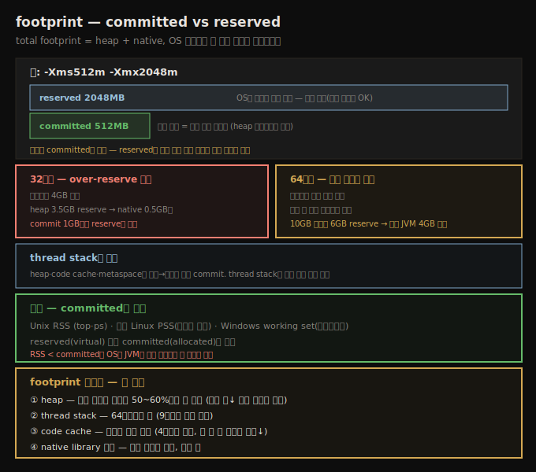

# footprint — committed vs reserved와 측정·최소화
> JVM의 total footprint는 heap+native이고, 성능엔 reserved가 아니라 실제 할당된 committed 메모리만 중요합니다

heap은 Java 애플리케이션에서 가장 큰 메모리 소비자지만, JVM은 native 메모리도 많이 할당해 씁니다. 7장이 프로그래밍 관점에서 heap을 효율적으로 관리하는 법을 다뤘다면, heap의 구성과 그것이 OS의 native 메모리와 상호작용하는 방식도 전체 성능의 중요한 요인입니다.

용어 충돌이 있습니다 — C 프로그래머는 native 메모리의 일부를 **C heap**이라 부릅니다. Java 중심 관점을 유지해, 이 노트에서 **heap**은 Java heap을, **native 메모리**는 C heap을 포함한 JVM의 non-heap 메모리를 가리킵니다.

## 1. footprint — heap과 native의 합
> total footprint는 heap+native이며, OS 관점에서 이 합이 물리 메모리에 안 들어가면 성능이 나빠질 수 있습니다

heap은 (보통) JVM이 쓰는 가장 큰 메모리지만, JVM은 내부 연산에도 메모리를 씁니다. 이 non-heap 메모리가 native 메모리입니다. native 메모리는 애플리케이션에서도 할당될 수 있습니다(`malloc()` 등에 대한 JNI 호출, New I/O(NIO) 사용 시). JVM이 쓰는 native와 heap 메모리의 합이 애플리케이션의 **total footprint**입니다.

OS 관점에서 이 total footprint가 성능의 열쇠입니다. 애플리케이션의 전체 footprint를 담을 충분한 물리 메모리가 없으면 성능이 나빠지기 **시작할 수 있습니다**. 여기서 핵심어는 「수 있다」입니다. native 메모리 일부는 시작 때만 쓰이고(예: classpath의 JAR 로딩에 연관된 메모리), 그게 swap out돼도 꼭 체감되지는 않습니다. 한 Java 프로세스의 native 메모리 일부는 시스템의 다른 Java 프로세스와 공유되고, 더 작은 일부는 다른 종류 프로세스와 공유됩니다. 그래도 대체로 최적 성능을 위해서는 모든 Java 프로세스의 total footprint가 머신의 물리 메모리를 넘지 않게 하고, 다른 애플리케이션용 메모리도 남겨 두려 합니다.

## 2. committed vs reserved — 핵심 구분
> reserved는 OS가 약속한 가상 크기이고 committed는 실제 할당된 사용 메모리이며, 성능엔 committed만 중요합니다

프로세스의 total footprint를 재려면 OS별 도구가 필요합니다. Unix 계열은 `top`·`ps`, Windows는 `perfmon`·`VMMap`입니다. 어느 도구·플랫폼이든 프로세스의 **실제 할당된 메모리(allocated)**를 봐야 합니다 — reserved 메모리가 아니라.

allocated와 reserved의 구분은 JVM(과 모든 프로그램)이 메모리를 관리하는 방식에서 옵니다. `-Xms512m -Xmx2048m`로 지정한 heap을 봅시다. heap은 512MB로 시작해, 애플리케이션의 GC 목표를 맞추려 필요에 따라 리사이즈됩니다.

이것이 **committed(또는 allocated)** 메모리와 **reserved**(프로세스의 가상 크기, virtual size) 메모리의 본질적 차이입니다.

1. **reserved** — JVM은 heap에 최대 2GB까지 필요할 수 있다고 OS에 알려, 그 메모리가 reserve됩니다. OS는 JVM이 나중에 heap을 키우며 추가 메모리를 할당하려 할 때 그게 가용하리라 약속합니다.
2. **committed** — 초기에는 그중 512MB만 할당되고, 그 512MB가 (heap에) 실제로 쓰이는 전부입니다. 그 실제 할당된 메모리가 committed입니다. committed 양은 heap이 리사이즈되며 변동합니다 — heap 크기가 커지면 committed도 그만큼 늘어납니다.

이 차이는 JVM이 할당하는 거의 모든 주요 메모리에 적용됩니다. code cache는 더 많은 코드가 컴파일되며 초기값에서 최대값으로 자랍니다. metaspace는 heap과 별도로 할당돼 초기(committed) 크기에서 최대(reserved) 크기 사이를 자랍니다.

> **thread stack은 예외**: JVM이 스레드를 만들 때마다 OS가 그 스레드 스택용 native 메모리를 할당해 프로세스에 더 commit합니다(적어도 스레드가 끝날 때까지). 그런데 thread stack은 생성 시 **전량 할당**됩니다 — 점진적으로 commit되는 다른 영역과 다릅니다.

> **over-reserve는 문제인가?**: 성능만 보면 committed만 중요합니다 — 메모리를 너무 많이 reserve해서 성능 문제가 생기지는 않습니다. 그러나 때로 JVM이 너무 많이 reserve하지 않게 하고 싶을 때가 있습니다. **32비트 JVM**이 특히 그렇습니다 — 프로세스 최대 크기가 4GB(또는 OS에 따라 그 이하)라, heap에 3.5GB를 reserve하면 stack·code cache 등 native 메모리에 0.5GB만 남습니다. heap이 1GB만 commit해도 3.5GB reservation 때문에 다른 연산용 메모리가 0.5GB로 제한됩니다. **64비트 JVM**은 프로세스 크기로 제한되지 않지만 머신의 총 가상 메모리에 제한됩니다 — 물리 4GB·가상 10GB 머신에서 최대 heap 6GB로 JVM을 띄우면 6GB 가상 메모리(+ non-heap)를 reserve해, 둘째 JVM은 4GB 미만만 reserve할 수 있습니다.

## 3. footprint 측정 — RSS·PSS·working set
> Unix는 RSS, 최신 Linux는 PSS, Windows는 working set으로 committed를 추정하며, RSS가 committed보다 작으면 위험 신호입니다

Unix에서 애플리케이션의 footprint는 OS 도구가 보고하는 프로세스의 **RSS(resident set size)**로 추정합니다. RSS는 프로세스가 쓰는 committed 메모리 양의 좋은 추정치지만, 두 가지로 부정확합니다. 첫째, OS 레벨에서 JVM과 다른 프로세스 사이에 공유되는 몇 page(공유 라이브러리의 text 부분)가 각 프로세스의 RSS에 모두 집계됩니다. 둘째, 프로세스가 어느 순간 page in한 것보다 더 많이 commit했을 수 있습니다.

그래도 프로세스의 RSS 추적은 전체 메모리 사용을 모니터링하는 좋은 1차 방법입니다. 최신 Linux 커널에서는 **PSS**가 RSS를 정제한 값으로, 다른 프로그램이 공유하는 데이터를 제거합니다. Windows에서는 같은 개념을 애플리케이션의 **working set**이라 하고, 작업 관리자가 이를 보고합니다.

## 4. footprint 최소화 — 네 영역
> heap·thread stack·code cache·native library를 줄여 footprint를 낮추며, heap은 전체의 50~60%뿐일 수 있습니다

JVM이 쓰는 footprint를 최소화하려면 다음 메모리를 제한합니다.

1. **heap** — 가장 큰 덩어리지만, 놀랍게도 total footprint의 50~60%뿐일 수 있습니다. 더 작은 최대 heap을 쓰거나(또는 heap이 완전히 확장되지 않게 GC 튜닝 파라미터를 설정) 프로그램의 footprint를 제한합니다.
2. **thread stack** — 꽤 큽니다, 특히 64비트 JVM에서. thread stack이 쓰는 메모리를 제한하는 법은 9장에서 다룹니다.
3. **code cache** — 컴파일된 코드를 담는 native 메모리입니다. 4장에서 봤듯 튜닝할 수 있지만, 공간 제한으로 모든 코드를 컴파일할 수 없으면 성능이 나빠집니다.
4. **native library 할당** — native 라이브러리는 자체 메모리를 할당할 수 있고, 때로 그게 큽니다.

## 자주 받는 오해

**"OS 도구의 virtual size(reserved)가 크면 메모리를 많이 쓰는 것이다"** — reserved는 OS가 약속한 가상 크기일 뿐, 실제 사용이 아닙니다. 성능엔 committed만 중요하고, reserved를 많이 잡아도 성능 문제는 안 생깁니다. RSS/PSS/working set으로 committed를 봐야 합니다.

**"모든 JVM 메모리 영역은 초기에서 최대로 점진 commit된다"** — heap·code cache·metaspace는 그렇지만 **thread stack은 예외**입니다. 스레드 생성 시 스택이 전량 할당됩니다. 그래서 스레드가 많으면 footprint가 빠르게 늘어납니다.

**"over-reserve는 항상 무해하다"** — 성능엔 무해하지만, 32비트(프로세스 4GB 한계)나 64비트의 가상 메모리 제약에서는 문제입니다. heap에 3.5GB를 reserve하면 native 메모리에 0.5GB만 남고, 가상 10GB에서 6GB를 reserve하면 둘째 JVM이 4GB 미만만 쓸 수 있습니다.

## 면접에서 받을 만한 질문

**Q. committed 메모리와 reserved 메모리의 차이는?**
`-Xms512m -Xmx2048m`이면 JVM은 OS에 최대 2GB가 필요할 수 있다고 알려 그만큼 **reserved**(가상 크기)로 약속받지만, 초기에 실제 할당돼 쓰이는 **committed**는 512MB뿐입니다. committed는 heap 리사이즈로 변동합니다. 성능엔 committed만 중요하고, OS 도구의 virtual size(reserved)는 무시합니다.

**Q. JVM의 footprint를 어떻게 측정하나요?**
Unix는 `top`·`ps`의 RSS, 최신 Linux는 공유분을 뺀 PSS, Windows는 작업 관리자의 working set으로 봅니다. 이들은 committed의 좋은 추정치지만, 공유 라이브러리 text가 각 프로세스에 중복 집계되고 page out된 commit은 빠지는 부정확함이 있습니다. RSS가 committed보다 작으면 OS가 JVM을 물리 메모리에 못 맞춘다는 신호입니다.

**Q. footprint를 줄이려면 어디를 보나요?**
네 영역입니다 — heap(전체의 50~60%뿐일 수 있어 최대 heap↓ 또는 미확장 튜닝), thread stack(64비트에서 큼), code cache(컴파일 코드, 단 다 못 담으면 성능↓), native library 할당. heap만 보지 않는 게 핵심입니다.

## 관련 문서

- [`08-02.Native Memory Tracking — NMT와 shared library 한계`](./08-02.Native%20Memory%20Tracking%20—%20NMT와%20shared%20library%20한계.md) — committed를 영역별로 들여다보기
- [`05-03.기본 튜닝 (1) — 힙과 세대 크기`](./05-03.기본%20튜닝%20(1)%20—%20힙과%20세대%20크기.md) — `-Xms`/`-Xmx`와 heap 리사이즈
- [`07-05.indefinite reference와 compressed oops`](./07-05.indefinite%20reference와%20compressed%20oops.md) — 7장 마지막
- [상위 인덱스](./README.md)
