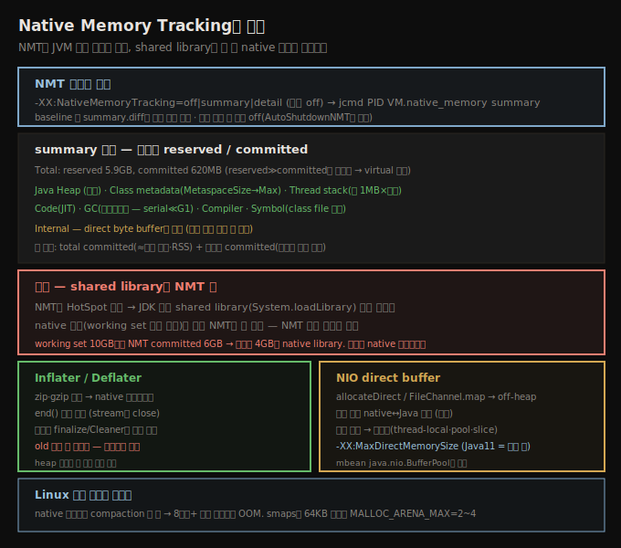

# Native Memory Tracking — NMT와 shared library 한계
> NMT는 JVM 내부 native 할당을 영역별로 보여 주지만, shared library 할당은 못 봐 native 누수를 놓칩니다

JVM은 native 메모리를 어떻게 할당하는지 제한된 가시성을 제공합니다. 중요한 건 이 추적이 **JVM 코드 자신**이 할당한 메모리에는 적용되지만, 애플리케이션이 쓰는 native 라이브러리가 할당한 메모리는 포함하지 않는다는 점입니다 — 서드파티 native 라이브러리와 JDK가 함께 배포하는 native 라이브러리(예: `libsocket.so`) 둘 다입니다.





## 1. NMT 켜기와 summary 조회
> NativeMemoryTracking 옵션으로 켜고 jcmd VM.native_memory로 보며, summary 모드가 대부분 분석에 충분합니다

`-XX:NativeMemoryTracking=off|summary|detail` 옵션으로 이 가시성을 켭니다. 기본은 off입니다. summary나 detail 모드를 켜면 `jcmd`로 언제든 native 메모리 정보를 얻습니다.

```
% jcmd process_id VM.native_memory summary
```

JVM을 `-XX:+PrintNMTStatistics`(기본 false)로 시작하면, 프로그램 종료 시 할당 정보를 출력합니다.

512MB 초기·4GB 최대 heap으로 도는 JVM의 summary 출력입니다.

```
Native Memory Tracking:

 Total: reserved=5947420KB, committed=620432KB
```

JVM이 총 5.9GB의 메모리 reservation을 했지만, 실제로는 그보다 훨씬 적은 620MB만 썼습니다. 이는 꽤 전형적이고(그래서 OS 도구가 보여 주는 프로세스 virtual size에 주의를 안 기울이는 한 이유입니다 — reservation만 반영하므로), 이 사용량은 영역별로 나뉩니다.

```
-                 Java Heap (reserved=4194304KB, committed=268288KB)
                            (mmap: reserved=4194304KB, committed=268288KB)
```

heap 자체가 (당연히) reserved 메모리의 가장 큰 부분(4GB)이지만, heap의 동적 사이징으로 268MB까지만 자랐습니다(`-Xms256m -Xmx4g`라 실제 heap 사용이 조금만 확장). 이어서 class 메타데이터용 native 메모리입니다 — committed는 `MetaspaceSize` 값에서 시작해 `MaxMetaspaceSize`까지 자랍니다.

```
-                     Class (reserved=1182305KB, committed=150497KB)
                            (classes #24316)
```

77개 thread stack이 각 약 1MB로 할당됐고, 그다음은 JIT code cache입니다(24,316 클래스는 많지 않아 code cache의 작은 부분만 committed).

```
-                    Thread (reserved=84455KB, committed=84455KB)
                            (thread #77)
-                      Code (reserved=102581KB, committed=15221KB)
```

이어 GC 알고리즘이 처리에 쓰는 heap 밖 영역입니다 — 크기는 GC 알고리즘에 따라 다릅니다(단순 serial collector는 더 복잡한 G1 GC보다 훨씬 적게 reserve, 다만 일반적으로 이 영역은 그리 크지 않음). compiler 연산 영역, internal(JVM 내부 연산 — 대부분 작지만 중요한 예외가 **direct byte buffer**로 여기 할당됨), symbol(class 파일의 상수), NMT 자신용 공간(기본 비활성인 한 이유), 그리고 몇몇 부기(bookkeeping) 영역이 따릅니다.

> **detail 모드**: `-XX:NativeMemoryTracking=detail`로 시작하면 `jcmd`(끝에 `detail` 인자)가 전체 메모리 공간의 맵을 포함한 상세 정보를 줍니다 — 어떤 함수(예: `initialize()`·`expand_by()`)에서 할당됐는지까지. JVM 엔지니어에겐 흥미롭지만, 나머지에게는 summary 정보로 충분합니다.

NMT는 두 핵심 정보를 줍니다.

1. **total committed size** — (이상적으로) 프로세스가 소비할 물리 메모리 양에 가깝고, 이는 다시 애플리케이션의 RSS(working set)에 가까워야 합니다. RSS가 committed보다 작으면, OS가 JVM 전체를 물리 메모리에 맞추기 어렵다는 신호인 경우가 많습니다.
2. **영역별 committed size** — heap·code cache·metaspace의 최대값을 튜닝할 때, JVM이 그 메모리를 얼마나 쓰는지 아는 게 도움됩니다. 이 영역들을 과할당하면 보통 무해한 reservation에 그치지만, reserved 메모리가 중요할 때 NMT가 어디를 줄일지 짚어 줍니다.


## 2. NMT over time — baseline과 diff
> baseline으로 현재 할당을 표시하고 summary.diff로 변화를 비교해 시간에 따른 footprint를 추적합니다

NMT는 시간에 따라 메모리 할당이 어떻게 일어나는지도 추적합니다. NMT를 켜고 JVM을 시작한 뒤, 다음 명령으로 메모리 사용의 baseline을 잡습니다.

```
% jcmd process_id VM.native_memory baseline
```

이러면 JVM이 현재 메모리 할당을 표시합니다. 나중에 현재 사용량을 그 표시와 비교합니다.

```
% jcmd process_id VM.native_memory summary.diff
Native Memory Tracking:

Total:  reserved=5896078KB  -3655KB, committed=2358357KB -448047KB

-             Java Heap (reserved=4194304KB, committed=1920512KB -444927KB)
                        (mmap: reserved=4194304KB, committed=1920512KB -444927KB)
....
```

이 경우 JVM은 5.8GB를 reserve했고 현재 2.3GB를 씁니다. committed 크기는 baseline 수립 때보다 448MB 적고, heap이 쓰는 committed 메모리는 444MB 줄었습니다(나머지 4MB가 어디서 줄었는지는 나머지 출력으로 확인). JVM의 footprint를 시간에 따라 살피는 유용한 기법입니다.

> **자동 비활성화**: NMT 자신도 native 메모리가 필요하고, 켜면 메모리 추적을 돕는 백그라운드 스레드가 생깁니다. JVM이 메모리나 CPU 자원으로 심하게 압박받으면 NMT는 자원을 아끼려 **자동으로 꺼집니다**. 보통 좋은 일이지만, 그 압박 상황이 바로 진단하려는 것이라면 곤란합니다. 그 경우 `-XX:-AutoShutdownNMT`(기본 true)로 NMT가 계속 돌게 합니다.


## 3. shared library의 한계 — native 누수를 놓친다
> NMT는 HotSpot 일부라 JDK 레벨 shared library 할당을 못 봐, 무한히 자라는 native 누수는 NMT로 안 잡힙니다

아키텍처 관점에서 NMT는 **HotSpot의 일부**입니다 — 애플리케이션의 Java 바이트코드를 실행하는 C++ 엔진입니다. 이는 JDK 자체보다 아래라, JDK 레벨의 할당은 추적하지 않습니다. 그 할당은 shared library(`System.loadLibrary()`로 로드된 것)에서 옵니다.

shared library는 흔히 Java의 서드파티 확장으로 여겨집니다(예: Oracle WebLogic Server는 JDK보다 효율적으로 I/O를 다루는 native 라이브러리 여럿을 씀). 그러나 JDK 자체도 native 라이브러리가 여럿이고, 모든 shared library처럼 NMT의 시야 밖입니다.

따라서 **native 메모리 누수**(애플리케이션의 RSS·working set이 시간에 따라 계속 자라는 것)는 보통 NMT로 안 잡힙니다. NMT가 모니터링하는 메모리 풀은 대개 상한이 있습니다(예: 최대 heap 크기). NMT는 그 풀 중 어느 것이 메모리를 많이 쓰는지(따라서 어느 것을 덜 쓰게 튜닝할지) 알려 주는 데 유용하지만, 무한히 native 메모리를 누수하는 애플리케이션은 보통 native 라이브러리의 문제로 그러는 것입니다.

어떤 Java 레벨 도구도 애플리케이션이 shared library에서 native 메모리를 어디에 쓰는지 찾는 데 도움이 안 됩니다. OS 레벨 도구는 프로세스의 working set이 계속 자란다고 알려 줄 수 있고, working set이 10GB까지 자랐는데 NMT가 JVM이 6GB만 commit했다고 하면 나머지 4GB는 native 라이브러리 할당임을 압니다. 어느 native 라이브러리가 책임인지는 JDK 도구가 아니라 OS 레벨 도구(디버깅용 `malloc`, native 코드까지 프로파일하는 프로파일러 등)가 필요합니다. native 메모리가 흔히 `mmap` 호출로 할당돼, `malloc` 추적 라이브러리 대부분이 그걸 놓치기 때문입니다. 좋은 대안은 3장에서 다룬 Oracle Studio Profiler 같은 혼합 언어 프로파일러로, 메모리 할당을 추적하는 옵션이 있습니다(native 코드 할당만 추적하지만 이 경우 우리가 원하는 게 그것).


## 4. Inflater/Deflater와 NIO direct buffer
> JDK에서 native 메모리를 많이 쓰는 두 흔한 원인이며, Inflater는 end() 미호출로 누수처럼 보이고 NIO는 재사용이 핵심입니다

JDK 안에서 native 메모리를 많이 쓰게 하는 두 흔한 연산이 있습니다 — `Inflater`·`Deflater` 객체와 NIO 버퍼입니다.

**Inflater/Deflater**는 zip·gzip 등 압축을 수행하고, 플랫폼별 native 라이브러리를 써 상당한 native 메모리를 할당합니다. 이 클래스를 쓰면 문서대로 연산 완료 시 `end()`를 호출해야 합니다 — 그게 객체가 쓴 native 메모리를 풉니다. 스트림을 쓰면 스트림을 close하면 됩니다(스트림 클래스가 내부 객체의 `end()`를 호출).

`end()`를 잊어도 다 잃지는 않습니다. 7장에서 봤듯 모든 객체에 이 상황을 위한 정리 메커니즘이 있습니다 — `finalize()`(JDK 8)나 연관된 `Cleaner`(JDK 11)가 `Inflater`가 수집될 때 `end()`를 호출합니다. 그래서 여기서 native 메모리를 누수하지는 않습니다 — 결국 객체가 수집·finalize되며 native 메모리가 풀립니다.

그래도 오래 걸릴 수 있습니다. `Inflater` 객체 크기는 비교적 작아, full GC를 드물게 하는 큰 heap 애플리케이션에서는 이 객체가 old로 승급돼 수시간 머물기 쉽습니다. 그래서 기술적으로 누수가 아니어도(full GC 시 native 메모리가 결국 풀림) `end()` 미호출은 **native 메모리 누수의 모든 외양**을 가질 수 있습니다. (Java 코드에서 `Inflater` 객체 자체가 누수하면 native 메모리도 실제로 누수합니다.) 그래서 native 메모리가 많이 누수하면, heap 덤프를 떠 이 `Inflater`·`Deflater` 객체를 찾는 게 도움됩니다 — 객체가 heap 자체에 문제를 일으키지는 않지만(너무 작음), 다수면 상당한 native 메모리 사용을 가리킵니다.

**NIO byte buffer**는 `ByteBuffer`의 `allocateDirect()`나 `FileChannel`의 `map()`으로 생성되면 native(off-heap) 메모리를 할당합니다. native byte buffer는 성능상 중요합니다 — native 코드와 Java 코드가 데이터를 **복사 없이** 공유하게 합니다(파일시스템·소켓 연산이 가장 흔한 예). native NIO 버퍼에 데이터를 쓰고 채널로 보내면 JVM과 C 라이브러리 사이 복사가 없지만, heap byte buffer를 쓰면 JVM이 버퍼 내용을 복사해야 합니다.

`allocateDirect()` 호출은 비싸, direct byte buffer는 가능한 한 재사용합니다. 이상적으로는 스레드가 독립적이고 각자 direct byte buffer를 thread-local 변수로 두는 경우입니다. 다만 가변 크기 버퍼가 필요한 스레드가 많으면 결국 각 스레드가 최대 크기 버퍼를 갖게 돼 native 메모리를 너무 쓸 수 있습니다 — 그런 경우 direct byte buffer의 object pool이 더 유용합니다. 또는 버퍼를 **슬라이싱**해 관리합니다 — 아주 큰 direct byte buffer 하나를 할당하고 개별 요청이 `slice()`로 일부를 떼 갑니다. 단 슬라이스 크기가 일정하지 않으면 원본 버퍼가 heap처럼 단편화될 수 있고, byte buffer의 개별 슬라이스는 compaction이 안 돼 **슬라이스가 모두 균일 크기일 때만** 잘 동작합니다.

튜닝 관점에서, 애플리케이션이 할당할 수 있는 direct byte buffer 공간은 JVM이 제한할 수 있습니다. 총량은 `-XX:MaxDirectMemorySize=N`으로 지정합니다. 현재 JVM의 기본값은 0이고, 그 의미는 자주 바뀌었지만 후기 Java 8과 모든 Java 11에서는 **최대 한도가 최대 heap 크기와 같습니다**(최대 heap 4GB면 direct·mapped byte buffer로 4GB off-heap도 만들 수 있음, 필요하면 그 이상으로 늘릴 수 있음). direct byte buffer에 할당된 메모리는 NMT 리포트의 Internal 영역에 포함되고, 그 숫자가 크면 거의 항상 이 버퍼 때문입니다. 버퍼 자체가 얼마나 쓰는지 정확히 알려면 mbean이 추적합니다 — `java.nio.BufferPool.direct.Attributes`나 `java.nio.BufferPool.mapped.Attributes`를 보면 각 타입이 할당한 메모리 양이 나옵니다.


## 5. Linux 시스템 메모리 단편화
> native 메모리는 compaction이 안 돼 대형 시스템에서 단편화로 OOM이 날 수 있고, MALLOC_ARENA_MAX로 완화합니다

대형 Linux 시스템은 메모리 할당 라이브러리 설계 때문에 native 메모리 누수를 보일 수 있습니다. 이 라이브러리는 native 메모리를 할당 세그먼트로 분할하는데, 이는 여러 스레드의 할당에 이롭습니다(lock 경합을 줄임). 그러나 native 메모리는 Java heap처럼 관리되지 않습니다 — 특히 native 메모리는 결코 **compaction되지 않습니다**. 따라서 native 메모리의 할당 패턴은 5장에서 본 것과 같은 단편화로 이어질 수 있습니다.

native 메모리 단편화로 Java에서 native 메모리가 고갈될 수 있고, 이는 큰 시스템(예: 8코어 초과)에서 가장 자주 일어납니다 — Linux의 메모리 분할 수가 시스템 코어 수의 함수이기 때문입니다. 두 가지가 이 문제 진단을 돕습니다. 첫째, 애플리케이션이 native 메모리 부족을 말하는 `OutOfMemoryError`를 던집니다. 둘째, 프로세스의 `smaps` 파일을 보면 작은(보통 64KB) 할당이 많이 보입니다. 이 경우 처방은 환경 변수 `MALLOC_ARENA_MAX`를 2나 4 같은 작은 수로 설정하는 것입니다. 그 변수의 기본값은 시스템 코어 수 × 8입니다(그래서 큰 시스템에서 더 자주 보임). 이 경우에도 native 메모리는 여전히 단편화되지만, 단편화가 덜 심해집니다.


## 자주 받는 오해

**"NMT가 JVM의 모든 native 메모리를 보여 준다"** — NMT는 HotSpot 일부라 **JVM 내부 할당만** 봅니다. `System.loadLibrary()`로 로드된 shared library(서드파티 + JDK 자체 native 라이브러리)의 할당은 못 봅니다. 그래서 무한히 자라는 native 누수는 보통 NMT로 안 잡히고, working set과 NMT committed의 차이로 추정합니다.

**"Inflater를 안 닫으면 native 메모리가 영구 누수된다"** — `end()`를 잊어도 `finalize()`(JDK 8)·`Cleaner`(JDK 11)가 수집 시 호출해 결국 풉니다. 다만 객체가 작아 old로 승급되면 full GC까지 수시간 머물러 **누수처럼 보입니다**. heap 덤프에서 이 객체 다수가 보이면 native 사용 신호입니다.

**"native byte buffer 슬라이싱은 항상 안전하다"** — 슬라이스 크기가 다르면 원본 버퍼가 단편화되고, byte buffer 슬라이스는 compaction이 안 됩니다. **모든 슬라이스가 균일 크기일 때만** 잘 동작합니다.

**"native 메모리도 heap처럼 compaction된다"** — native 메모리는 결코 compaction되지 않습니다. 그래서 대형 시스템(8코어+)에서 단편화로 OOM이 날 수 있고, `MALLOC_ARENA_MAX`를 줄여 완화합니다.


## 면접에서 받을 만한 질문

**Q. NMT는 무엇을 보여 주고 무엇을 못 보나요?**
NMT(`-XX:NativeMemoryTracking=summary|detail`, `jcmd VM.native_memory`)는 JVM 내부 native 할당을 영역별(heap·class·thread·code·GC·internal·symbol)로 reserved/committed로 보여 줍니다. baseline/summary.diff로 시간 변화도 추적합니다. 그러나 HotSpot 일부라 `System.loadLibrary()` shared library 할당은 못 봅니다. 그래서 native 누수는 NMT가 아니라 native 프로파일러로 진단합니다.

**Q. working set이 계속 자라는데 NMT는 committed가 일정합니다. 무엇이 원인일까요?**
NMT가 못 보는 shared library(서드파티 또는 JDK native 라이브러리)의 할당입니다. working set 10GB인데 NMT committed가 6GB면 나머지 4GB가 native 라이브러리입니다. JDK 안에서는 `Inflater`/`Deflater`의 `end()` 미호출, NIO direct buffer가 흔한 원인이고, native 메모리까지 프로파일하는 도구로 어느 라이브러리인지 찾습니다.

**Q. 대형 Linux 서버에서 native OOM이 납니다. 어떻게 대응하나요?**
native 메모리는 compaction이 안 돼 단편화로 고갈될 수 있고, 분할 수가 코어 수의 함수라 8코어+ 에서 자주 납니다. `smaps`에 64KB 작은 할당이 다수면 `MALLOC_ARENA_MAX`(기본 코어×8)를 2~4로 낮춰 단편화를 완화합니다.


## 관련 문서

- [`08-01.footprint — committed vs reserved와 측정·최소화`](./08-01.footprint%20—%20committed%20vs%20reserved와%20측정·최소화.md) — total footprint와 committed
- [`08-03.large pages — TLB와 OS별 huge page 설정`](./08-03.large%20pages%20—%20TLB와%20OS별%20huge%20page%20설정.md) — OS 메모리 튜닝
- [`07-05.indefinite reference와 compressed oops`](./07-05.indefinite%20reference와%20compressed%20oops.md) — Inflater의 Cleaner 정리 메커니즘
- [상위 인덱스](./README.md)
