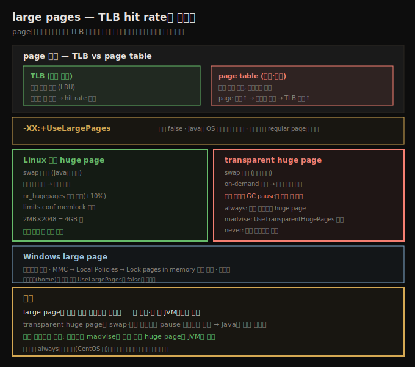

# large pages — TLB와 OS별 huge page 설정
> page를 키우면 더 적은 TLB 엔트리로 같은 메모리를 덮어 적중률이 올라가, 긴 실행·큰 힙 JVM이 빨라집니다

JVM은 OS 메모리를 쓰는 방식을 개선하는 여러 튜닝을 쓸 수 있습니다. 그중 large page는 긴 실행 JVM, 특히 큰 heap을 가진 JVM에서 거의 항상 이득을 줍니다.





## 1. page와 TLB — 왜 큰 page가 빠른가
> page는 OS의 최소 할당 단위이고, 큰 page는 더 적은 TLB 엔트리로 같은 메모리를 덮어 적중률을 높입니다

메모리 할당과 swapping 논의는 **page** 단위로 이뤄집니다. page는 OS가 물리 메모리를 관리하는 메모리 단위이자 OS의 최소 할당 단위입니다 — 1바이트를 할당해도 OS는 page 전체를 할당하고, 그 프로그램의 이후 할당은 그 page가 찰 때까지 같은 page에서 나오며, 차면 새 page가 할당됩니다.

OS는 물리 메모리에 들어갈 수 있는 것보다 훨씬 많은 page를 할당하고, 그래서 paging이 있습니다 — 주소 공간의 page가 swap 공간(또는 page 내용에 따라 다른 저장소)으로 오갑니다. 이는 page와 그것이 현재 컴퓨터 RAM 어디에 저장됐는지 사이의 매핑이 있어야 함을 뜻합니다. 그 매핑은 두 방식으로 다뤄집니다.

1. **page table** — 모든 page 매핑이 전역 page table에 보관됩니다. OS가 특정 매핑을 찾으려 스캔할 수 있습니다.
2. **TLB(translation lookaside buffer)** — 가장 자주 쓰는 매핑이 보관됩니다. TLB는 빠른 캐시에 있어, TLB 엔트리로 page에 접근하는 게 page table로 접근하는 것보다 훨씬 빠릅니다.

머신의 TLB 엔트리 수는 제한적이라, TLB 엔트리 적중률(hit rate)을 최대화하는 게 중요해집니다(LRU 캐시처럼 동작). 각 엔트리가 한 page를 나타내므로, 애플리케이션이 쓰는 page 크기를 키우는 게 자주 이롭습니다. 각 page가 더 많은 메모리를 나타내면, 전체 프로그램을 덮는 데 더 적은 TLB 엔트리가 필요하고, 필요할 때 page가 TLB에서 발견될 확률이 높아집니다. 이는 어떤 프로그램에도 일반적으로 참이라, Java 애플리케이션 서버나 중간 크기 이상 heap을 가진 Java 프로그램에도 참입니다.

large page는 Java와 OS 양쪽에서 활성화해야 합니다. Java 레벨에서는 `-XX:+UseLargePages`(기본 false)로 켭니다. 모든 OS가 large page를 지원하지는 않고, 켜는 방법도 다릅니다. 미지원 시스템에서 `UseLargePages`를 켜면 경고 없이 regular page를 씁니다. 지원하지만 large page가 가용하지 않은 시스템(이미 다 쓰였거나 OS 설정 오류)에서 켜면 JVM이 경고를 출력합니다.


## 2. Linux 전통 huge page
> 전통 huge page는 swap 안 되고 부팅 시 예약돼 항상 있으며, nr_hugepages와 limits.conf memlock으로 설정합니다

Linux는 large page를 **huge page**라 부릅니다. 설정은 릴리스마다 다소 다르니 정확한 지침은 해당 릴리스 문서를 보되, 일반 절차는 이렇습니다.

먼저 커널이 지원하는 huge page 크기를 확인합니다. 프로세서와 부팅 파라미터에 따라 다르지만 가장 흔한 값은 2MB입니다.

```
# grep Hugepagesize /proc/meminfo
Hugepagesize:       2048 kB
```

필요한 huge page 수를 계산합니다. JVM이 4GB heap을 할당하고 시스템이 2MB huge page면 그 heap에 2,048개가 필요합니다. 쓸 수 있는 huge page 수는 Linux 커널에 전역으로 정의되므로, 돌릴 모든 JVM(과 huge page를 쓸 다른 프로그램)에 대해 이 과정을 반복합니다. non-heap용 다른 huge page 사용을 감안해 이 값을 10% 과대 추정합니다(예시는 2,200개 사용). 그 값을 OS에 써(즉시 적용) `/etc/sysctl.conf`에 저장(재부팅 후 보존)합니다.

```
# echo 2200 > /proc/sys/vm/nr_hugepages
```
```
sys.nr_hugepages=2200
```

많은 Linux 버전에서 사용자가 할당할 수 있는 huge page 메모리 양이 제한됩니다. `/etc/security/limits.conf`를 편집해 JVM을 돌리는 사용자(예: `appuser`)에 `memlock` 항목을 추가합니다. limits.conf를 수정하면 사용자가 다시 로그인해야 값이 적용됩니다.

```
appuser soft    memlock        4613734400
appuser hard    memlock        4613734400
```

이 시점에 JVM이 필요한 huge page를 할당할 수 있어야 합니다. 검증은 다음 명령으로 합니다 — 성공적 완료가 huge page가 올바로 설정됐음을 뜻합니다.

```
# java -Xms4G -Xmx4G -XX:+UseLargePages -version
java version "1.8.0_201"
```

huge page 메모리 설정이 옳지 않으면 경고가 나오고(`Failed to reserve shared memory`), 프로그램은 그 경우 regular page를 써 그대로 실행됩니다.


## 3. Linux transparent huge page
> transparent huge page는 swap 가능하고 on-demand 할당이라 GC pause를 키울 수 있어 Java엔 흔히 비권장됩니다

Linux 커널 2.6.32부터 **transparent huge page**를 지원합니다. 이론상 전통 huge page와 같은 성능 이득을 주지만 몇 차이가 있습니다.

1. **swap** — 전통 huge page는 메모리에 잠겨 결코 swap되지 않습니다. Java에는 이점입니다 — heap 일부의 swapping은 GC 성능에 나쁘기 때문입니다. transparent huge page는 디스크로 swap될 수 있어 성능에 나쁩니다.
2. **할당** — 전통 huge page는 커널 부팅 시 따로 떼어 둬 항상 가용합니다. transparent huge page는 **on-demand 할당**됩니다 — 애플리케이션이 2MB page를 요청하면 커널이 물리 메모리에서 2MB 연속 공간을 찾으려 합니다. 물리 메모리가 단편화됐으면 커널이 page를 재배치하느라(Java heap의 compaction과 비슷) 시간을 쓸 수 있어, page 할당 시간이 훨씬 길어질 수 있습니다. 이는 모든 프로그램에 영향을 주지만, Java에서는 **아주 긴 GC pause**로 이어질 수 있습니다 — GC 중 JVM이 heap을 확장하며 새 page를 요청할 때 그 할당이 수백 ms나 1초 걸리면 GC 시간이 크게 영향받습니다.
3. **설정** — OS와 Java 레벨 모두 다르게 설정합니다.

OS 레벨에서는 `/sys/kernel/mm/transparent_hugepage/enabled` 내용을 바꿔 설정합니다.

```
# cat /sys/kernel/mm/transparent_hugepage/enabled
always [madvise] never
# echo always > /sys/kernel/mm/transparent_hugepage/enabled
```

세 선택지입니다.

1. **always** — 모든 프로그램이 가능할 때 huge page를 받습니다.
2. **madvise** — huge page를 요청하는 프로그램만 받고, 다른 프로그램은 regular(4KB) page를 받습니다.
3. **never** — 요청해도 어떤 프로그램도 huge page를 못 받습니다.

Linux 버전마다 기본값이 다릅니다(향후 릴리스에서 바뀔 수 있음). 예를 들어 Ubuntu 18.04 LTS는 기본을 madvise로, CentOS 7(과 그 기반 Red Hat·Oracle Enterprise Linux)은 always로 둡니다. 클라우드 머신에서는 OS 이미지 공급자가 값을 바꿨을 수 있습니다.

값이 **always**면 Java 레벨 설정이 불필요합니다 — JVM이 huge page를 받습니다(사실 시스템의 모든 프로그램이 huge page로 돕니다). 값이 **madvise**이고 JVM이 huge page를 쓰게 하려면 `UseTransparentHugePages`(기본 false)를 지정합니다 — 그러면 JVM이 page 할당 시 적절한 요청을 해 huge page를 받습니다. 값이 **never**면 어떤 Java 레벨 인자로도 huge page를 못 받습니다(단 전통 huge page와 달리, `UseTransparentHugePages`를 지정해도 시스템이 줄 수 없으면 경고가 안 나옴).

> **권장**: swap·할당 차이 때문에 transparent huge page는 Java에 흔히 비권장됩니다 — pause 시간에 예측 불가한 스파이크를 부를 수 있습니다. 반대로 기본으로 켜진 시스템에서는 (광고대로 투명하게) 대부분의 경우 성능 이득을 봅니다. 가장 매끄러운 성능을 확실히 원하면, 시스템을 **요청 시에만 transparent huge page를 쓰게(madvise)** 설정하고 JVM용 전통 huge page를 구성하는 편이 낫습니다.


## 4. Windows large page
> Windows large page는 서버판만 지원하며 MMC에서 Lock pages in memory 권한을 줘야 합니다

Windows large page는 서버 기반 Windows 버전에서만 켤 수 있습니다. Windows 10 절차입니다(릴리스마다 변형 있음).

1. MMC(Microsoft Management Center)를 시작합니다(Start → 검색창에 `mmc`).
2. 왼쪽 패널에 Local Computer Policy 아이콘이 없으면, File 메뉴에서 Add/Remove Snap-in을 골라 Group Policy Object Editor를 추가합니다. 그 옵션이 없으면 쓰는 Windows 버전이 large page를 지원하지 않습니다.
3. 왼쪽 패널에서 Local Computer Policy → Computer Configuration → Windows Settings → Security Settings → Local Policies를 펼쳐 User Rights Assignment 폴더를 클릭합니다.
4. 오른쪽 패널에서 "Lock pages in memory"를 더블클릭합니다.
5. 팝업에서 사용자나 그룹을 추가하고 OK → MMC 종료 → 재부팅합니다.

이 시점에 JVM이 필요한 large page를 할당할 수 있어야 합니다. 검증은 `java -Xms4G -Xmx4G -XX:+UseLargePages -version`으로 합니다 — 성공적으로 완료되면 large page가 올바로 설정된 것입니다. 설정이 틀리면 권한 부족 경고(`JVM cannot use large page memory because it does not have enough privilege`)가 나옵니다. large page 미지원 Windows(예: "home" 버전)에서는 에러를 출력하지 않습니다 — JVM이 미지원을 알면 커맨드라인 설정과 무관하게 `UseLargePages`를 false로 되돌립니다.


## 8장 요약

Java heap이 가장 주목받는 메모리 영역이지만, JVM의 전체 footprint가 성능에 결정적이며 특히 OS와의 관계에서 그렇습니다. 이 장의 도구들은 그 footprint를 시간에 따라 추적하게 하고, 결정적으로 reserved가 아니라 **committed 메모리에 집중**하게 합니다. JVM이 OS 메모리를 쓰는 방식 중 특히 **large page**는 성능을 높이게 튜닝할 수 있습니다. 긴 실행 JVM은, 특히 큰 heap을 가졌다면, large page에서 거의 항상 이득을 봅니다.


## 자주 받는 오해

**"page를 키우면 메모리를 더 쓴다"** — large page의 이점은 메모리 절약이 아니라 **TLB 적중률**입니다. 각 TLB 엔트리가 더 큰 메모리를 나타내, 같은 프로그램을 더 적은 엔트리로 덮어 page table 조회를 줄입니다. 이게 긴 실행·큰 heap JVM을 빠르게 합니다.

**"transparent huge page가 전통 huge page와 같다"** — 둘은 다릅니다. 전통 huge page는 swap 안 되고 부팅 시 예약돼 항상 있지만, transparent huge page는 swap 가능하고 on-demand 할당이라 단편화 시 커널이 page를 재배치하느라 할당이 길어져 **GC pause 스파이크**를 부를 수 있습니다. 그래서 Java엔 흔히 비권장입니다.

**"`UseLargePages`를 켜면 항상 large page를 쓴다"** — 미지원 OS에서는 경고 없이 regular page로 폴백하고, 지원하나 가용하지 않으면(전통 huge page) 경고를 냅니다. Windows home 버전은 `UseLargePages`를 false로 되돌립니다. OS 레벨 활성화가 함께 돼 있어야 합니다.


## 면접에서 받을 만한 질문

**Q. large page는 왜 성능을 높이나요?**
page는 OS의 최소 할당 단위이고, page 매핑은 전역 page table과 빠른 캐시인 TLB에 보관됩니다. TLB 엔트리 수가 제한적이라, page를 키우면 같은 메모리를 더 적은 엔트리로 덮어 TLB 적중률이 올라가고 느린 page table 조회가 줄어듭니다. `-XX:+UseLargePages`로 켜며, 큰 heap·긴 실행 JVM일수록 이득이 큽니다.

**Q. 전통 huge page와 transparent huge page의 차이는?**
전통 huge page는 swap되지 않고 부팅 시 예약돼 항상 가용하지만 `nr_hugepages`·`limits.conf memlock` 설정이 필요합니다. transparent huge page는 swap 가능하고 on-demand 할당이라, 물리 메모리 단편화 시 커널 재배치로 할당이 길어져 GC pause 스파이크가 생길 수 있습니다. 매끄러운 성능을 원하면 시스템을 madvise로 두고 전통 huge page를 JVM에 구성합니다.

**Q. transparent huge page의 always/madvise/never는 무엇인가요?**
`/sys/kernel/mm/transparent_hugepage/enabled` 설정입니다. always는 모든 프로그램이 huge page를 받아(Java 설정 불필요), madvise는 요청한 프로그램만(JVM은 `UseTransparentHugePages` 필요), never는 요청해도 못 받습니다. CentOS는 기본 always, Ubuntu는 madvise라 환경마다 동작이 다릅니다.


## 관련 문서

- [`08-02.Native Memory Tracking — NMT와 shared library 한계`](./08-02.Native%20Memory%20Tracking%20—%20NMT와%20shared%20library%20한계.md) — native 메모리 추적
- [`08-01.footprint — committed vs reserved와 측정·최소화`](./08-01.footprint%20—%20committed%20vs%20reserved와%20측정·최소화.md) — 8장 시작
- [`05-03.기본 튜닝 (1) — 힙과 세대 크기`](./05-03.기본%20튜닝%20(1)%20—%20힙과%20세대%20크기.md) — heap swapping과 GC
- [상위 인덱스](./README.md)
