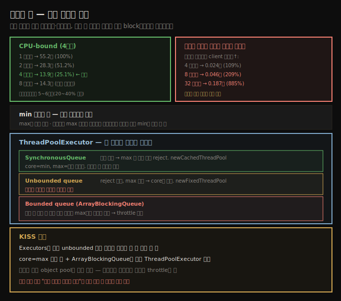

# 스레드 풀 — 크기 결정과 ThreadPoolExecutor
> 최적 스레드 수는 병목 위치에 달려 있고, 병목에 부하를 더하면 성능이 급감하므로 풀 크기 튜닝이 핵심입니다

Java의 매력 일부는 첫날부터 멀티스레드라는 데 있었습니다. CPU가 둘이면 애플리케이션이 두 배 일하거나 같은 일을 두 배 빨리 할 수 있습니다 — 단 작업을 분리 가능한 조각으로 쪼갤 수 있다는 전제하에서입니다(Java는 알고리즘 부분을 알아서 병렬화하는 언어가 아닙니다). 다행히 오늘날 컴퓨팅은 흔히 분리된 작업입니다 — 서버가 동시 요청을 처리하고, 배치가 데이터 묶음에 같은 연산을 하고, 수학 알고리즘이 부분으로 쪼개지는 식입니다.

이 노트는 Java 스레딩 facility에서 최대 성능을 얻는 법을 봅니다.

## 1. 스레딩과 하드웨어 — 하이퍼스레딩은 5~6배
> 코어를 두 배로 늘리면 성능이 두 배가 되지만, 하이퍼스레딩은 20~40% 추가일 뿐 두 배가 아닙니다

1장의 멀티코어·하이퍼스레드 논의를 떠올립시다. 소프트웨어 레벨 스레딩으로 머신의 여러 코어와 하이퍼스레드를 활용합니다. 코어를 두 배로 늘리면 올바로 작성된 애플리케이션의 성능이 두 배가 되지만, CPU에 하이퍼스레딩을 더하는 건 성능을 두 배로 만들지 않습니다.

이 장의 거의 모든 예제는 단일 스레드 CPU 4개 머신에서 돌립니다 — 하이퍼스레드 차이를 보이는 첫 예제만 예외입니다. 이후로는 스레드 추가의 성능 효과를 더 잘 이해하려 단일 스레드 코어 관점으로만 봅니다. 하이퍼스레드 CPU가 안 중요하다는 게 아닙니다 — 그 추가 하드웨어 스레드의 20~40% 성능 향상은 전체 성능·throughput을 분명히 개선합니다. Java 관점에서는 하이퍼스레드를 실제 CPU로 보고, 4코어·8하이퍼스레드 머신을 8 CPU처럼 튜닝해야 합니다. 그러나 측정 관점에서는 단일 코어 대비 **5~6배 향상만** 기대해야 합니다.

## 2. 스레드 풀 동작과 max 스레드 수 — 병목 위치가 결정
> max 스레드 수의 최적값은 워크로드의 block 빈도와 병목 위치에 달렸으며, 병목에 부하를 더하면 성능이 급감합니다

모든 스레드 풀은 본질적으로 같게 동작합니다 — 작업이 큐에 제출되고, 일정 수의 스레드가 큐에서 작업을 꺼내 실행하며, 끝나면 다시 큐로 돌아와 다음 작업을 가져옵니다(없으면 대기). 풀은 **최소·최대 스레드 수**를 가집니다. 최소 수는 작업 할당을 기다리며 유지됩니다(스레드 생성이 비싸 이미 있는 스레드가 작업을 집어 전체가 빨라짐). 최대 수는 한 번에 너무 많은 작업이 실행되는 걸 막는 throttle 역할도 합니다.

> **용어 주의**: `ThreadPoolExecutor`는 **core pool size**와 **maximum pool size**라 부르고, 그 의미는 풀 구성 방식에 따라 다릅니다(때로 core가 최소, 때로 최대, 때로 무시). 이 노트의 테스트는 단순화를 위해 core와 max를 같게 두고 max만 가리킵니다.

주어진 워크로드·하드웨어에서 최적 max 스레드 수는 단순한 답이 없습니다 — 워크로드 특성과 **각 작업이 얼마나 자주 block하는지**에 달렸습니다. 4코어 머신에서 시작합니다(시스템이 4코어든, 128코어 중 4개만 쓰든, Docker가 4 CPU로 제한하든 무관 — 목표는 그 4코어 활용 극대화).

당연히 max는 최소 4여야 합니다. 그 이상이 도움될까요? 워크로드 특성이 작용합니다. 작업이 모두 **CPU-bound**면(외부 호출·내부 락 경쟁 없음) 4코어에서 최대 throughput이고 그 이상은 약간의 페널티뿐입니다.

| 스레드 수 | 소요 시간 | baseline 비율 |
|-----------|-----------|----------------|
| 1 | 55.2초 | 100% |
| 2 | 28.3초 | 51.2% |
| 4 | 13.9초 | 25.1% |
| 8 | 14.3초 | 25.9% |
| 16 | 14.5초 | 26.2% |

완전 선형 스케일링(2스레드 50%, 4스레드 25%)은 불가능합니다 — 스레드가 큐에서 작업을 고르려 조율해야 하고, 4스레드면 CPU를 100% 쓰는데 시스템 레벨 프로세스가 일부 CPU를 가져갑니다. 그래도 이 애플리케이션은 스케일링이 잘 돼, 스레드 수를 과대 추정해도 페널티가 작습니다.

> **하이퍼스레딩의 worst case**: 같은 실험을 2코어·4하이퍼스레드 머신(JVM엔 4코어로 보임)에서 하면, 1→2 CPU(둘 다 풀 코어)는 잘 스케일하지만 하이퍼스레드 둘을 더해도 4스레드 45.7%로 이득이 적습니다. 하이퍼스레드는 보통 20% 향상뿐입니다.

## 3. 병목이 외부면 스레드 추가는 해롭다 — client 역설
> 병목이 외부 자원이면 스레드를 더하는 게 throughput을 떨어뜨리므로, 실제 병목 위치를 아는 게 중요합니다

REST 버전에서는 스레드 과다 효과가 더 큽니다. 4 CPU REST 서버에 16 동시 요청을 보내면, 4스레드에서 최대 throughput(169.5 ops/s)이고 그 이상은 약간 떨어집니다. 여기서 병목은 분명 CPU입니다(4 CPU에서 100% 사용).

그런데 병목이 다른 곳이면 어떨까요. 작업이 DB 호출·출력 등 외부 자원과 만나면 CPU가 병목이 아닐 수 있고, 그땐 **스레드 추가가 해롭습니다**. 역할을 뒤집어 봅시다 — load generator(스레드 Java 프로그램)를 최적화하려 한다고 합시다. REST 서버가 4 CPU·단일 client면 서버는 25% 바쁘고 client는 거의 idle입니다. client에 CPU 여유가 많으니 스레드를 더하면 throughput이 오를 것 같지만, 그 가정이 얼마나 틀렸는지 봅시다.

| client 스레드 | 평균 응답 시간 | baseline 비율 |
|---------------|----------------|----------------|
| 1 | 0.022초 | 100% |
| 2 | 0.022초 | 100% |
| 4 | 0.024초 | 109% |
| 8 | 0.046초 | 209% |
| 16 | 0.093초 | 422% |
| 32 | 0.187초 | 885% |

REST 서버가 병목이 된 시점(4 client 스레드)부터, 서버에 부하를 더하는 건 해롭습니다. 이 예는 DB로 요청을 보내는 REST 서버에도 그대로 적용됩니다 — 서버 CPU가 100% 미만이고 처리할 요청이 더 있다고 스레드를 늘리면, 오히려 전체 throughput이 (때로 크게) **감소**합니다. **병목에 부하를 더하면 성능이 급감하고, 병목 부하를 줄이면 성능이 오릅니다.** 이것이 자기 튜닝 풀이 어려운 이유입니다 — 풀은 대기 작업량은 알아도 실행 환경의 다른 측면은 못 봐, "작업이 밀리면 스레드 추가"가 정확히 틀린 선택일 때가 많습니다.

> **기본값의 타협**: REST 서버 기본은 4 CPU에 16스레드를 만듭니다. 외부 호출이 block되면 다른 작업을 돌려야 하니 4개 초과가 필요해, 약간 많은 스레드는 합리적 타협입니다 — CPU-bound 작업엔 작은 페널티, I/O block 작업엔 throughput 향상. 다만 sizing이 잘못되면 크게 잘못될 수 있어 충분한 테스트가 핵심 요구사항입니다.

## 4. min 스레드 수와 pre-create — 거의 중요하지 않음
> min은 거의 중요하지 않아 max와 같게 두며, 시스템은 max 부하를 감당하게 사이징해야 합니다

max를 정했으면 min을 정할 차례인데, 결론부터 말하면 거의 중요하지 않아 대부분 **max와 같게** 둡니다. min을 작게(예: 1) 두자는 논리는 스레드를 너무 많이 안 만들어 자원을 아낀다는 것입니다. 스레드마다 스택 메모리가 들지만, 2장의 일반 규칙대로 시스템은 최대 예상 throughput을 감당하게 사이징해야 하고 그때 그 스레드를 다 만들어야 합니다. 시스템이 최대 스레드를 감당 못 하면 작은 min은 도움이 안 됩니다 — 최대 스레드가 필요한 조건에 닥치면(감당 못 하면) 시스템은 확실히 곤경에 빠집니다. 결국 필요할 모든 스레드를 만들고 최대 부하를 감당하게 하는 편이 낫습니다.

> **pre-create**: 기본적으로 `ThreadPoolExecutor`는 스레드 하나로 시작합니다. core 8·max 16이면 core가 최소처럼 8개가 유지되지만, 풀 생성 시가 아니라 on-demand로 만들어집니다. 서버에서 첫 8 요청이 스레드 생성으로 약간 지연되는데, `prestartAllCoreThreads()`로 미리 만들 수 있습니다. 다만 그 효과는 작습니다.

> **idle time**: min과 max가 다르면, 부하 spike에 대응하려 만든 스레드가 곧장 종료되지 않게 idle time을 둡니다 — 만들고 5초 일하고 5초 idle 후 종료되면 5초 뒤 또 필요해지는 상황을 피합니다. 보통 idle time은 분 단위(10~30분)로 잡습니다. 단 **아주 커질 수 있는 풀**은 예외입니다 — 평균 20작업인데 spike 2,000에 대비한 풀이 1,980 idle 스레드를 유지하면, 20작업만 돌 때 throughput이 50%까지 떨어질 수 있어 좋은 min 값이 중요합니다.

> **큐 크기**: 대기 작업은 큐에 담기는데, 너무 크면 작업이 앞 작업을 오래 기다립니다(3초 지연되면 사용자는 이미 떠남). 그래서 풀은 보통 큐 크기를 제한하고, 한계 도달 시 작업 추가가 실패합니다. `ThreadPoolExecutor`는 `rejectedExecution()`이 처리하고(기본 `RejectedExecutionException`), REST 서버는 **429(too many requests)**나 **503(service unavailable)**을 반환해야 합니다.

## 5. ThreadPoolExecutor 사이징 — 큐 종류가 동작을 가른다
> SynchronousQueue·unbounded·bounded 큐가 스레드 시작 시점을 바꾸며, KISS 원칙으로 core=max + ArrayBlockingQueue를 직접 구성합니다

스레드 풀의 일반 동작은 최소 스레드로 시작해, 모두 바쁠 때 작업이 오면 새 스레드를 시작(최대까지)하고 즉시 실행, 최대인데 다 바쁘면 큐에 넣고, 이미 많이 밀렸으면 reject하는 것입니다. `ThreadPoolExecutor`는 작업을 담는 **큐 종류**에 따라 새 스레드 시작 시점이 다릅니다.

1. **SynchronousQueue** — 스레드 수에 대해 기대대로 동작하지만(모두 바쁘고 max 미만이면 새 스레드), 대기 작업을 담을 수 없어 max가 다 바쁘면 작업이 항상 reject됩니다. 적은 작업 관리엔 좋지만 그 외엔 부적합할 수 있습니다. 문서는 max를 아주 크게 잡으라 권하는데, 완전 I/O-bound면 괜찮지만 다른 상황엔 역효과일 수 있습니다. 반면 스레드 수를 쉽게 튜닝하려면 이게 낫습니다. core=최소, max=최대입니다. `Executors.newCachedThreadPool()`(unbounded max)이 이 타입입니다.
2. **Unbounded queue**(예: `LinkedBlockingQueue`) — 큐가 무제한이라 작업이 결코 reject되지 않고, executor는 **core 스레드까지만** 씁니다(max 무시). 전통 풀을 흉내 내지만, 제출이 실행보다 빠르면 메모리 과소비 위험이 있습니다. `Executors.newFixedThreadPool()`·`newSingleThreadScheduledExecutor()`가 이 타입입니다.
3. **Bounded queue**(예: `ArrayBlockingQueue`) — 복잡한 알고리즘으로 새 스레드 시작을 정합니다. core 4·max 8·큐 10이면, 작업이 와 큐에 쌓이는 동안 풀은 core(4)만 돌립니다. 큐가 완전히 차고(10개) **새 작업이 또 오면** 비로소 reject 대신 새 스레드를 시작합니다. max 8에 닿는 유일한 경우는 7작업 진행 중·큐 10개·새 작업 추가일 때입니다. 이 알고리즘은 대부분 core만으로 돌아 throttle 역할을 하고, backlog가 너무 커지면 더 많은 스레드로 해소를 시도합니다.

> **Bounded 알고리즘의 함정**: 이 알고리즘은 큐가 왜 커졌는지 모릅니다 — 외부 backlog 때문이거나 CPU-bound면 스레드 추가가 틀린 선택입니다. 추가 부하(더 많은 client) 때문일 때만 말이 되는데, 그렇다면 왜 큐가 한계에 닿을 때까지 기다리는가? 자원이 있으면 더 일찍 추가하는 게 낫습니다.

성능 극대화엔 **KISS 원칙**(keep it simple, stupid)을 적용할 때입니다. 일반 권고로, **`Executors`의 기본 unbounded 풀**(메모리 사용 제어 불가)을 쓰지 말고, **core=max 같은 수 + `ArrayBlockingQueue`로 직접 `ThreadPoolExecutor`를 구성**해 메모리에 대기할 요청 수를 제한합니다.

## 자주 받는 오해

**"CPU 여유가 있으면 스레드를 더해 throughput을 올릴 수 있다"** — 병목이 외부 자원(DB·다른 서버)이면 틀립니다. client 역설에서 보듯 서버가 병목인데 client 스레드를 4→32로 늘리면 응답이 100%→885%로 급증합니다. **병목 위치**를 먼저 확인해야 합니다.

**"하이퍼스레딩은 코어 수만큼 성능을 더한다"** — 하이퍼스레드는 보통 20~40% 추가일 뿐입니다. 4코어·8하이퍼스레드는 8 CPU처럼 튜닝하되, 측정상으로는 단일 코어 대비 5~6배만 기대합니다.

**"min 스레드를 작게 하면 자원을 아낀다"** — 시스템은 max 부하를 감당하게 사이징해야 하므로, 그 조건에 닥치면 어차피 모든 스레드를 만들어야 합니다. 작은 min은 도움이 안 되고, 보통 max와 같게 둡니다. 단 spike 2,000 같은 아주 큰 풀은 예외로 좋은 min이 중요합니다.

**"자기 튜닝 풀은 작업이 밀리면 스레드를 더해 항상 옳다"** — 풀은 실행 환경의 외부 병목을 못 봐, 외부 backlog나 CPU-bound 상황에서 스레드 추가는 정확히 틀린 선택입니다.

## 면접에서 받을 만한 질문

**Q. 스레드 풀의 최적 크기는 어떻게 정하나요?**
워크로드와 병목 위치에 달립니다. CPU-bound면 코어 수(4코어→4스레드)에서 최대 throughput이고 그 이상은 약간의 페널티뿐입니다. I/O block이 잦으면 block 중 다른 작업을 돌리려 코어 수보다 많이 둡니다. 핵심은 병목 위치 확인입니다 — 병목에 부하를 더하면 성능이 급감하므로, 외부 자원이 병목이면 스레드를 늘리면 안 됩니다.

**Q. ThreadPoolExecutor의 세 큐 종류는 어떻게 다른가요?**
`SynchronousQueue`는 대기를 못 해 max가 다 차면 즉시 reject(스레드 수 튜닝은 쉬움), unbounded queue는 reject 없이 core까지만 쓰고 max를 무시(메모리 과소비 위험), bounded queue(`ArrayBlockingQueue`)는 큐가 다 차고 새 작업이 와야 비로소 max까지 스레드를 늘립니다(throttle 역할). KISS 원칙으로 core=max + `ArrayBlockingQueue`를 직접 구성하길 권합니다.

**Q. min 스레드 수는 어떻게 정하나요?**
대부분 max와 같게 둡니다 — 시스템은 max 부하를 감당하게 사이징해야 하므로 작은 min은 도움이 안 됩니다. 예외는 평균 20작업인데 spike 2,000에 대비한 아주 큰 풀로, 1,980 idle 스레드가 throughput을 50%까지 떨어뜨릴 수 있어 좋은 min 값이 중요합니다.

## 관련 문서

- [`09-02.ForkJoinPool — work stealing과 자동 병렬화`](./09-02.ForkJoinPool%20—%20work%20stealing과%20자동%20병렬화.md) — 재귀 분할용 특수 풀
- [`07-04.객체 재사용 — object pool·thread-local과 GC 비용`](./07-04.객체%20재사용%20—%20object%20pool·thread-local과%20GC%20비용.md) — 스레드 풀이 object pool의 좋은 사례
- [`08-03.large pages — TLB와 OS별 huge page 설정`](./08-03.large%20pages%20—%20TLB와%20OS별%20huge%20page%20설정.md) — 8장 마지막
- [상위 인덱스](./README.md)
