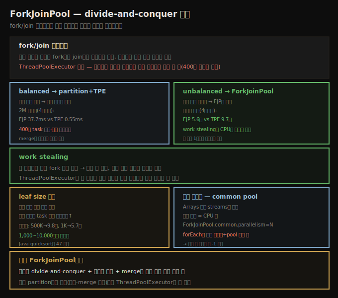

# ForkJoinPool — work stealing과 자동 병렬화
> ForkJoinPool은 재귀 분할(divide-and-conquer)·불균형 작업에 강하고, work stealing으로 적은 스레드가 수백만 작업을 처리합니다

일반 목적 `ThreadPoolExecutor` 외에, Java는 다소 특수 목적인 `ForkJoinPool`을 제공합니다. 다른 스레드 풀처럼 `Executor`·`ExecutorService` 인터페이스를 구현하지만, 인자 없이 생성하면 머신(또는 Docker 컨테이너)의 CPU 수에 맞춰 크기를 정합니다. 이 클래스는 **divide-and-conquer 알고리즘용**입니다 — 작업을 재귀적으로 부분집합으로 쪼개 병렬 처리하고 결과를 병합합니다. 고전적 예가 quicksort입니다.





## 1. fork/join 일시중지 — 적은 스레드로 수백만 작업
> 부모 작업이 자식을 기다리는 동안 스레드를 일시중지하고 다른 작업을 실행해, ThreadPoolExecutor로는 불가능한 재귀를 가능케 합니다

divide-and-conquer의 핵심은 **적은 스레드가 많은 작업을 관리**한다는 점입니다. 1천만 요소 배열 정렬은 앞 500만·뒤 500만 정렬과 병합 작업으로 시작하고, 각 500만은 250만 정렬과 병합으로, 재귀가 이어집니다. 어느 시점(예: 47 요소)에는 insertion sort가 더 효율적이라 직접 정렬합니다. 결국 leaf 정렬에 262,144 작업, 병합에 그 이상이 더해져 총 524,287 작업이 생깁니다.

핵심은 **어떤 작업도 자신이 spawn한 작업이 끝나야 완료된다**는 것입니다. 47 미만 배열을 직접 정렬하는 작업이 먼저 끝나야 두 작은 배열을 병합하고, 사슬을 따라 전체가 병합됩니다. 이 알고리즘을 `ThreadPoolExecutor`로 효율적으로 못 하는 이유는, **부모 작업이 자식을 기다려야** 하기 때문입니다 — 스레드가 큐에 작업을 추가하고 끝나길 기다리면, 대기 중이라 서브작업을 실행할 수 없습니다. 반면 `ForkJoinPool`은 스레드가 새 작업을 만들고 현재 작업을 **일시중지**하게 합니다. 일시중지 동안 스레드는 다른 대기 작업을 실행합니다.

배열에서 0.5 미만 값을 세는 예입니다.

```java
private class ForkJoinTask extends RecursiveTask<Integer> {
    private int first;
    private int last;

    public ForkJoinTask(int first, int last) {
        this.first = first;
        this.last = last;
    }

    protected Integer compute() {
        int subCount;
        if (last - first < 10) {
            subCount = 0;
            for (int i = first; i <= last; i++) {
                if (d[i] < 0.5)
                    subCount++;
            }
        }
        else {
            int mid = (first + last) >>> 1;
            ForkJoinTask left = new ForkJoinTask(first, mid);
            left.fork();
            ForkJoinTask right = new ForkJoinTask(mid + 1, last);
            right.fork();
            subCount = left.join();
            subCount += right.join();
        }
        return subCount;
    }
}
```

`fork()`·`join()`이 핵심입니다 — 이 메서드(`ThreadPoolExecutor` 작업엔 없음) 없이는 이런 재귀를 구현하기 어렵습니다. 내부의 스레드별 큐로 작업을 조작하고 스레드를 한 작업에서 다른 작업으로 전환합니다. 200만 요소를 세면 400만 작업 이상이 생기지만, 적은 스레드(하나여도)로 쉽게 실행됩니다 — `ThreadPoolExecutor`로 같은 알고리즘을 하려면 각 스레드가 서브작업을 기다려야 해 400만 스레드 이상이 필요합니다. fork/join 일시중지가 **다른 방법으론 못 쓸 알고리즘을 쓰게** 하는 게 성능상 이득입니다.


## 2. balanced vs unbalanced — partition과 ForkJoinPool
> 작업이 균등하면 partition한 ThreadPoolExecutor가 빠르고, 불균형이면 ForkJoinPool이 빠릅니다

단순한 예는 fork-join 풀의 실제 용도에 잘 맞지 않습니다. 이 풀은 **merge 부분에 의미 있는 일이 있고, leaf 계산이 작업 생성을 상쇄할 만큼 일을 할 때** 이상적입니다. 그렇지 않으면 배열을 chunk로 나눠 `ThreadPoolExecutor`로 스캔하는 게 쉽습니다.

200만 요소를 세는 두 방식을 비교합니다.

| 스레드 수 | ForkJoinPool | ThreadPoolExecutor |
|-----------|--------------|---------------------|
| 1 | 125 ms | 1.731 ms |
| 4 | 37.7 ms | 0.55 ms |

차이는 divide-and-conquer, 특히 leaf 값 10에서 옵니다 — 400만 작업 객체 생성·관리 오버헤드가 `ForkJoinPool`의 성능을 해칩니다. 비슷한 대안이 있으면 단순 분할이 더 빠를 가능성이 큽니다. leaf 계산에 일을 더해(`d[i]`를 500번 제곱) 계산이 지배하게 만들어도, merge가 의미 있는 일을 안 하면 작업 생성 페널티가 남습니다(4스레드: FJP 271ms vs TPE 258ms).

이는 **작업이 균등(balanced)할 때**의 이야기입니다. 작업 시간이 위치에 비례하는 **불균형(unbalanced)** 워크로드를 보면 반대가 됩니다.

```java
for (int i = first; i <= last; i++) {
    if (d[i] < 0.5) {
        subCount++;
    }
    for (int j = 0; j < i; j++) {
        d[i] += j;
    }
}
```

`d[0]` 계산은 아주 빠르고 `d[d.length-1]`은 오래 걸립니다. 단순 partition의 `ThreadPoolExecutor`는 불리합니다 — 첫 partition을 맡은 스레드가 아주 오래 걸리고, 마지막 partition을 끝낸 스레드는 idle로 첫 스레드를 기다립니다.

| 스레드 수 | ForkJoinPool | ThreadPoolExecutor |
|-----------|--------------|---------------------|
| 1 | 22.0초 | 21.7초 |
| 4 | 5.6초 | 9.7초 |

단일 스레드는 같지만(병렬 안 됨), 4스레드면 `ForkJoinPool`의 작업 granularity가 결정적 이점을 줘 거의 전체 동안 CPU를 바쁘게 유지합니다. 일반 권고는 — **균등 작업은 partition한 `ThreadPoolExecutor`, 불균형 작업은 `ForkJoinPool`**이 낫습니다.


## 3. work stealing — 불균형의 비밀
> 각 스레드가 자기 큐를 갖고 비면 다른 스레드 큐에서 작업을 훔쳐, 한 작업이 오래 걸려도 나머지가 진행합니다

`ForkJoinPool`을 더 강력하게 만드는 둘째 특징이 **work stealing**입니다. 각 스레드가 자기가 fork한 작업의 큐를 갖고, 자기 큐 작업을 우선하되 비면 다른 스레드 큐에서 작업을 훔칩니다. 그 결과 400만 작업 중 하나가 오래 걸려도, 풀의 다른 스레드가 나머지를 모두 완료할 수 있습니다. `ThreadPoolExecutor`는 그렇지 않습니다 — 한 작업이 오래 걸리면 다른 스레드가 추가 작업을 못 받습니다. 이것이 불균형 워크로드에서 `ForkJoinPool`이 이기는 이유입니다.

> **leaf 값 튜닝**: fork/join 재귀를 어디서 멈출지 신중히 정해야 합니다. 불균형 케이스는 작은 leaf 값에서 더 좋아집니다.

| leaf 배열 목표 크기 | ForkJoinPool |
|---------------------|--------------|
| 500,000 | 9,842 ms |
| 50,000 | 6,029 ms |
| 10,000 | 5,764 ms |
| 1,000 | 5,657 ms |
| 100 | 5,598 ms |
| 10 | 5,601 ms |

leaf 500,000은 thread pool executor 케이스와 같고(4 작업으로 분할), leaf가 줄수록 불균형 이점을 얻다 1,000~10,000에서 평탄화됩니다. Java는 quicksort 구현에서 leaf 값 **47**을 씁니다 — 그 시점이 작업 생성 오버헤드가 분할 이득을 넘는 지점입니다.


## 4. 자동 병렬화 — common ForkJoinPool
> Arrays·streams가 common ForkJoinPool을 쓰며, parallelStream의 forEach는 실행 스레드와 pool을 함께 써 1 스레드 설정도 2개를 씁니다

Java는 특정 코드를 자동 병렬화할 수 있고, 이는 `ForkJoinPool`에 의존합니다. JVM이 이 목적의 **common fork-join pool**(정적 요소, 기본 크기 = 대상 머신 CPU 수)을 만듭니다. `Arrays`의 여러 메서드(병렬 quicksort 정렬 등)와 **streams** 기능이 이를 씁니다.

정수 컬렉션으로 stock 이력을 병렬 계산하는 코드입니다.

```java
List<String> symbolList = ...;
Stream<String> stream = symbolList.parallelStream();
stream.forEach(s -> {
    StockPriceHistory sph = new StockPriceHistoryImpl(s, startDate,
                                     endDate, entityManager);
    blackhole.consume(sph);
});
```

`forEach()`가 각 요소에 작업을 만들어 common 풀로 처리합니다 — 스레드 풀을 명시적으로 다루는 것보다 훨씬 쓰기 쉽습니다. common 풀 사이징도 다른 풀만큼 중요합니다. 같은 머신에 여러 JVM을 돌리면 CPU 경쟁을 막으려 수를 제한하고, 서버가 다른 요청도 병렬 실행하면 그 작업용 CPU를 남기려 낮추며, common 풀 작업이 I/O로 block하면 늘립니다. 크기는 시스템 프로퍼티 `-Djava.util.concurrent.ForkJoinPool.common.parallelism=N`으로 설정합니다(Docker는 Java 8 update 192 이전이면 수동 설정).

`ThreadPoolExecutor`와 `forEach()`(common 풀)를 비교한 표입니다.

| 스레드 수 | ThreadPoolExecutor | ForkJoinPool |
|-----------|---------------------|--------------|
| 1 | 40초 | 20.2초 |
| 2 | 20.1초 | 15.1초 |
| 4 | 10.1초 | 11.7초 |
| 8 | 10.2초 | 10.5초 |
| 16 | 10.3초 | 10.3초 |

common 풀 1·2 결과는 성능 엔지니어를 당황시킵니다 — `ForkJoinPool`이 기대보다 너무 잘합니다. 보통 이러면 테스트 오류이지만, 여기서는 `forEach()`가 교묘한 일을 합니다 — **statement를 실행하는 스레드와 common 풀 스레드를 함께** 써 데이터를 처리합니다. 첫 테스트의 common 풀이 1 스레드여도 실제로는 2 스레드가 쓰입니다. 그래서 `ThreadPoolExecutor` 2스레드와 `ForkJoinPool` 1스레드가 본질적으로 같습니다. **parallel stream을 쓸 때 common 풀 크기를 튜닝하려면 원하는 값에서 1을 빼는 걸 고려**합니다.


## 자주 받는 오해

**"ForkJoinPool은 항상 병렬 처리에 ThreadPoolExecutor보다 낫다"** — 작업이 균등(balanced)하고 단순 분할로 충분하면 `ThreadPoolExecutor`가 더 빠릅니다(200만 카운트: FJP 37.7ms vs TPE 0.55ms). `ForkJoinPool`은 400만 작업 객체 생성·관리 오버헤드가 있어, **불균형 작업 + merge에 의미 있는 일**이 있을 때만 이깁니다.

**"leaf 값은 작을수록 좋다"** — 균등 케이스에선 큰 leaf(500,000, 4분할)가 최적이고, 불균형 케이스에선 작은 leaf가 1,000~10,000에서 평탄화됩니다. 너무 작으면 작업 생성 오버헤드가 큽니다. Java quicksort는 47을 씁니다.

**"parallelStream을 1 스레드로 설정하면 1 스레드만 쓴다"** — `forEach()`는 statement 실행 스레드와 common 풀 스레드를 함께 씁니다. 1 스레드 설정도 실제로는 2개를 쓰므로, 튜닝 시 원하는 값에서 1을 빼는 걸 고려합니다.


## 면접에서 받을 만한 질문

**Q. ForkJoinPool은 왜 ThreadPoolExecutor로 못 하는 일을 하나요?**
divide-and-conquer는 부모 작업이 자식 완료를 기다려야 하는데, `ThreadPoolExecutor`는 스레드가 기다리면 막혀 서브작업을 실행 못 합니다(400만 스레드 필요). `ForkJoinPool`은 `fork()`/`join()`으로 부모를 일시중지하고 그 스레드가 다른 대기 작업을 실행해, 적은 스레드로 수백만 작업을 처리합니다.

**Q. work stealing이란 무엇이고 왜 불균형 작업에 유리한가요?**
각 스레드가 자기 fork 큐를 갖고, 자기 큐 우선·비면 다른 스레드 큐에서 작업을 훔칩니다. 한 작업이 오래 걸려도 다른 스레드가 나머지를 처리해 CPU를 바쁘게 유지합니다. 단순 partition한 `ThreadPoolExecutor`는 첫 partition이 오래 걸리면 나머지 스레드가 idle로 기다려, 불균형 워크로드(4스레드: FJP 5.6초 vs TPE 9.7초)에서 `ForkJoinPool`이 이깁니다.

**Q. parallelStream은 어떤 풀을 쓰고, 크기를 어떻게 조절하나요?**
JVM의 common `ForkJoinPool`(기본 크기 = CPU 수)을 씁니다. `-Djava.util.concurrent.ForkJoinPool.common.parallelism=N`으로 조절합니다. 단 `forEach()`는 실행 스레드와 풀 스레드를 함께 써 설정값보다 1 많은 스레드가 동작하므로, 튜닝 시 원하는 값에서 1을 빼는 걸 고려합니다.


## 관련 문서

- [`09-01.스레드 풀 — 크기 결정과 ThreadPoolExecutor`](./09-01.스레드%20풀%20—%20크기%20결정과%20ThreadPoolExecutor.md) — 일반 목적 스레드 풀
- [`09-03.동기화 비용 — Amdahl·register flushing·CAS`](./09-03.동기화%20비용%20—%20Amdahl·register%20flushing·CAS.md) — 병렬 코드의 동기화 비용
- [상위 인덱스](./README.md)
