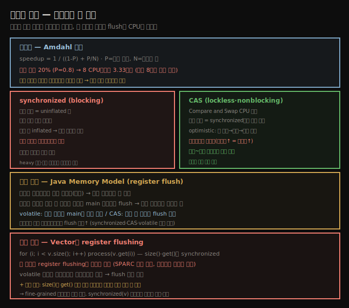

# 동기화 비용 — Amdahl·register flushing·CAS
> 동기화는 Amdahl 법칙으로 확장성을 제한하고, 락 획득과 Java Memory Model의 register flush로 CPU를 씁니다

완벽한 세상(또는 책의 예제)에서는 스레드가 동기화를 피하기 쉽지만, 실제 세상은 그렇지 않습니다. 여기서 **synchronization**은 변수 집합에 대한 접근이 직렬화돼 보이는 블록 안 코드를 가리킵니다 — `synchronized` 키워드로 보호된 블록, `java.util.concurrent.lock.Lock` 인스턴스로 보호된 코드, `java.util.concurrent`·`java.util.concurrent.atomic` 패키지 안 코드입니다.

엄밀히 atomic 클래스는 (CPU 관점에서) 동기화를 쓰지 않습니다 — **Compare and Swap(CAS)** CPU 명령을 쓰는 반면, 동기화는 자원에 배타적 접근을 요구합니다. CAS를 쓰는 스레드는 같은 자원에 동시 접근해도 block하지 않지만, 동기화 락이 필요한 스레드는 다른 스레드가 그 자원을 쥐면 block합니다. 그래도 CAS는 lockless·nonblocking이어도 block 구조의 동작 대부분을 보입니다 — 개발자에게는 스레드가 보호된 메모리에 직렬로만 접근하는 것처럼 보입니다.





## 1. 동기화와 확장성 — Amdahl 법칙
> 직렬 블록이 늘수록 멀티스레드 이득이 줄어, 직렬 블록 20%면 8 CPU에서도 3.33배뿐입니다

동기화 코드는 두 가지로 성능에 영향을 줍니다 — 첫째 동기화 블록에 머무는 시간이 확장성을 정하고, 둘째 락 획득이 CPU를 씁니다.

먼저 확장성입니다. 애플리케이션을 여러 스레드로 나눠 돌릴 때 보는 speedup은 **Amdahl 법칙**으로 정의됩니다. P는 병렬로 도는 비율, N은 활용 스레드 수입니다(각 스레드가 항상 CPU를 갖는다는 전제). 직렬 블록이 20%면(P=0.8) 8 CPU에서도 코드가 **3.33배만** 빨라집니다.

이 식의 핵심은 P가 줄수록(직렬 블록이 늘수록) **멀티스레드 이득도 준다**는 것입니다. 8 CPU에서 8배를 바랐지만, 직렬 블록이 20%면 이득이 50% 이상 깎여 3.3배가 됩니다. 그래서 직렬 블록의 코드 양을 제한하는 게 중요합니다.


## 2. 락 획득 비용 — uninflated·inflated와 CAS optimistic
> 경쟁 없는 synchronized는 수백 나노초, CAS는 더 적고, 경쟁 시 락이 inflated되며 CAS는 재시도가 늘어납니다

확장성 영향과 별개로, 동기화 연산 자체에 두 기본 비용이 있습니다. 첫째가 락 획득 비용입니다.

락이 **경쟁 없으면**(두 스레드가 동시 접근 안 함) 비용이 작습니다. `synchronized`와 CAS에 약간 차이가 있습니다 — 경쟁 없는 `synchronized` 락을 **uninflated lock**이라 하고, 획득 비용이 수백 나노초 수준입니다. 경쟁 없는 CAS는 더 작은 페널티를 봅니다.

**경쟁 있는** 구조는 더 비쌉니다. 둘째 스레드가 `synchronized` 락에 접근하려 하면 락이 (예상대로) **inflated**됩니다. 획득 시간이 약간 늘지만, 진짜 영향은 둘째 스레드가 첫 스레드의 락 해제를 기다려야 한다는 것입니다(대기 시간은 애플리케이션 의존).

CAS의 경쟁 비용은 예측 불가합니다. CAS 클래스는 **optimistic 전략**입니다 — 스레드가 값을 설정하고, 코드를 실행하고, 초기 값이 안 바뀌었는지 확인합니다. 바뀌었으면 코드를 다시 실행합니다. worst case로 두 스레드가 서로의 값을 수정하며 무한 루프에 빠질 수 있지만, 실제로는 그러지 않고 다만 **CAS 값을 다투는 스레드가 늘수록 재시도가 늘어납니다**.


## 3. Java Memory Model — register flush
> 변수는 레지스터에 임시 저장돼 다른 스레드에 안 보이며, 동기화 블록을 떠날 때 main 메모리로 flush해 최신값을 공유합니다

둘째 비용은 Java 고유이고 **Java Memory Model**에 달렸습니다. Java는 C++·C와 달리 동기화 주변 메모리 의미에 엄격한 보장을 두고, 이 보장은 CAS·전통 동기화·`volatile` 키워드에 모두 적용됩니다.

동기화의 목적은 메모리의 값(변수) 접근을 보호하는 것입니다. 4장에서 봤듯 변수는 레지스터에 임시 저장될 수 있고(main 메모리 직접 접근보다 훨씬 효율적), **레지스터 값은 다른 스레드에 안 보입니다**. 값을 레지스터에서 수정한 스레드는 어느 시점에 그 레지스터를 main 메모리로 **flush**해야 다른 스레드가 볼 수 있고, 그 시점은 스레드 동기화가 정합니다.

가장 쉽게 생각하면 — 스레드가 동기화 블록을 떠날 때 수정된 변수를 main 메모리로 flush해야 합니다. 그래서 그 블록에 진입하는 다른 스레드가 최신값을 봅니다. 마찬가지로 CAS 구조는 연산 중 수정된 변수가 main으로 flush됨을 보장하고, `volatile` 변수는 변경 때마다 main에 일관되게 갱신됩니다.

> **volatile의 두 역할** (7장 DCL 예): `private volatile ConcurrentHashMap instanceChm;`에서 `volatile`은 두 가지를 합니다. 첫째, 해시맵이 로컬 변수로 초기화되고 완성된 값만 `instanceChm`에 대입돼, 다른 스레드가 부분 초기화된 맵을 못 봅니다(인스턴스 변수를 직접 채웠다면 볼 수 있음). 둘째, 완전 초기화되면 다른 스레드가 그 값을 즉시 봅니다. 2장에서 마이크로벤치마크가 결과를 `volatile`에 저장해 컴파일러 최적화를 막는 것도 같은 이유입니다(jmh `Blackhole`이 이를 씁니다).


## 4. 실전 사례 — Vector의 register flushing
> Vector의 size()·get()이 synchronized라 register flushing이 SPARC 대형 머신에서 거대한 병목이 됐습니다

1장에서 "조기 최적화처럼 보여도 non-performant 코드 구조를 피하라"고 했는데, 실제 사례가 이 루프에서 옵니다.

```java
Vector v;
for (int i = 0; i < v.size(); i++) {
    process(v.get(i));
}
```

프로덕션에서 이 루프가 놀랄 만큼 오래 걸렸고, 논리적 가정은 `process()`가 범인이라는 것이었습니다. 그러나 그것도 아니고 `size()`·`get()` 호출 자체(컴파일러가 inline함)도 아니었습니다. `Vector`의 `get()`·`size()`는 **synchronized**라, 그 모든 호출이 요구하는 **register flushing이 거대한 성능 문제**였습니다.

이 코드는 다른 이유로도 좋지 않습니다 — `size()` 호출과 `get()` 호출 사이에 vector 상태가 바뀔 수 있습니다. 둘째 스레드가 그 사이 마지막 요소를 제거하면 `get()`이 `ArrayIndexOutOfBoundsException`을 던집니다. 의미 문제와 별개로 fine-grained 동기화가 나쁜 선택이었습니다.

한 회피법은 fine-grained 동기화 호출을 `synchronized` 블록으로 묶는 것입니다.

```java
synchronized(v) {
    for (int i = 0; i < v.size(); i++) {
        process(v.get(i));
    }
}
```

다만 `process()`가 오래 걸리면 vector를 병렬 처리할 수 없어 잘 동작하지 않습니다. 또는 vector를 복사·분할해, 복사본 안 요소를 병렬 처리하며 다른 스레드가 원본을 수정하게 합니다.

> **register flushing은 프로세서 의존**: 스레드용 레지스터가 많은 프로세서일수록 flush가 더 많이 필요합니다. 이 코드는 수천 환경에서 오래 문제없이 돌다, 스레드당 레지스터가 많은 대형 **SPARC** 머신에서 비로소 문제가 됐습니다. 멀티코어가 노트북의 표준이 됐듯, 캐싱·레지스터가 더 많은 복잡한 CPU도 흔해져 이런 숨은 문제를 드러낼 것입니다.


## 자주 받는 오해

**"atomic 클래스는 동기화를 쓴다"** — atomic은 CPU 관점에서 동기화를 쓰지 않고 **CAS 명령**을 씁니다. CAS는 lockless·nonblocking이라 같은 자원에 동시 접근해도 block하지 않습니다(synchronized는 배타적 접근이라 block). 다만 개발자에게는 직렬 접근처럼 보이는 동작을 합니다.

**"경쟁 없는 동기화는 공짜다"** — 경쟁 없는 `synchronized`(uninflated lock)도 수백 나노초가 들고, CAS는 더 적지만 0은 아닙니다. 게다가 Java Memory Model의 register flush 비용이 더해지며, 이는 경쟁이 없어도 발생합니다.

**"동기화 비용은 락 대기뿐이다"** — 둘째 비용이 Java Memory Model의 **register flush**입니다. 동기화 블록을 떠날 때 레지스터를 main 메모리로 flush해야 하고, 레지스터 많은 프로세서(SPARC 등)에서는 이것만으로 거대한 병목이 될 수 있습니다(`Vector` 사례).

**"volatile은 가시성만 보장한다"** — 가시성(변경 즉시 다른 스레드가 봄)에 더해, DCL에서 보듯 **부분 초기화된 객체를 못 보게** 합니다 — 완성된 값만 대입되도록 보장합니다.


## 면접에서 받을 만한 질문

**Q. Amdahl 법칙은 동기화와 어떤 관계인가요?**
speedup = 1 / ((1-P) + P/N)에서 P는 병렬 비율, N은 스레드 수입니다. 직렬(동기화) 블록이 늘면 P가 줄고, 멀티스레드 이득이 급감합니다 — 직렬 20%(P=0.8)면 8 CPU에서도 3.33배뿐입니다. 그래서 동기화 블록의 코드 양을 최소화하는 게 확장성의 핵심입니다.

**Q. synchronized와 CAS의 경쟁 시 동작 차이는?**
경쟁 시 `synchronized` 락은 inflated되고 둘째 스레드가 첫 스레드의 해제를 기다립니다(blocking). CAS는 optimistic이라 값이 바뀌면 재시도하고(nonblocking), 다투는 스레드가 늘수록 재시도가 늘어 비용이 예측 불가합니다. 경미~중간 경쟁은 CAS가 빠르고, heavy 경쟁은 대형 머신에서 synchronized가 유리해집니다.

**Q. register flushing이 왜 성능 문제가 되나요?**
변수는 레지스터에 임시 저장돼 빠르지만 다른 스레드에 안 보입니다. 동기화 블록을 떠날 때 레지스터를 main 메모리로 flush해야 가시성이 보장됩니다. `Vector`의 `size()`/`get()`처럼 fine-grained 동기화가 루프마다 flush를 강제하면, 레지스터 많은 SPARC 머신에서 거대한 병목이 됩니다. `volatile`이 아니면 컴파일러가 레지스터에 유지해 flush가 없어 빠릅니다.


## 관련 문서

- [`09-04.동기화 회피와 false sharing`](./09-04.동기화%20회피와%20false%20sharing.md) — 동기화를 줄이는 thread-local·CAS·LongAdder
- [`07-03.메모리 적게 쓰기 — 객체 크기·lazy init·canonical`](./07-03.메모리%20적게%20쓰기%20—%20객체%20크기·lazy%20init·canonical.md) — DCL과 volatile 상세
- [`09-02.ForkJoinPool — work stealing과 자동 병렬화`](./09-02.ForkJoinPool%20—%20work%20stealing과%20자동%20병렬화.md) — 병렬 분할
- [상위 인덱스](./README.md)
