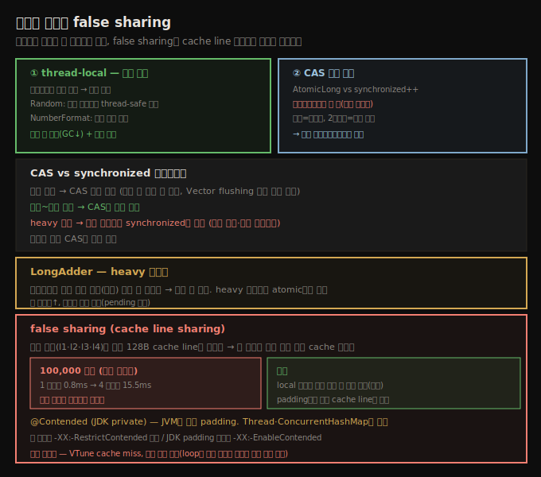

# 동기화 회피와 false sharing
> 동기화를 thread-local·CAS로 피하면 락 페널티가 사라지고, false sharing은 local 변수나 padding으로 cache line 무효화를 막습니다

동기화를 아예 피하면 락 페널티가 애플리케이션 성능에 영향을 주지 않습니다. 그리고 잘 안 다뤄지는 동기화 성능 문제인 **false sharing**은, 멀티코어가 표준이 되고 다른 명백한 동기화 문제가 해결되면서 점점 중요해집니다.





## 1. 동기화 회피 (1) — thread-local로 다른 객체
> 스레드마다 다른 객체를 쓰면 경쟁이 사라지며, 생성 비싼 NumberFormat을 thread-local로 두면 객체 수도 제한합니다

동기화를 피하는 두 일반 접근이 있습니다. 첫째는 **스레드마다 다른 객체**를 써 접근이 경쟁 없게 하는 것입니다. 많은 Java 객체가 thread-safe하려 동기화되지만 꼭 공유될 필요는 없습니다. `Random`이 그런 부류로, 12장에 thread-local 기법으로 그 동기화를 피하는 새 클래스를 만든 JDK 예가 나옵니다.

반대로, 많은 Java 객체는 생성이 비싸거나 메모리를 많이 씁니다. `NumberFormat`을 봅시다 — 인스턴스가 thread-safe하지 않고, 국제화 때문에 생성이 비쌉니다. 단일 공유 전역 `NumberFormat`으로 버틸 수 있지만 접근을 동기화해야 합니다. 더 나은 패턴은 **`ThreadLocal` 객체**입니다.

```java
public class Thermometer {
    private static ThreadLocal<NumberFormat> nfLocal = new ThreadLocal<>() {
        public NumberFormat initialValue() {
            NumberFormat nf = NumberFormat.getInstance();
            nf.setMinumumIntegerDigits(2);
            return nf;
        }
    }
    public String toString() {
        NumberFormat nf = nfLocal.get();
        nf.format(...);
    }
}
```

thread-local 변수로 **객체 총수를 제한**하고(GC 영향 최소화), 각 객체가 결코 스레드 경쟁의 대상이 되지 않게 합니다.


## 2. 동기화 회피 (2) — CAS와 마이크로벤치마크 함정
> AtomicLong vs synchronized 차이는 마이크로벤치마크로 못 재며, 실제 애플리케이션에서 판단해야 합니다

둘째는 **CAS 기반 대안**을 쓰는 것입니다. 엄밀히는 동기화를 피한다기보다 문제를 다르게 푸는 것이지만, 동기화 페널티를 줄여 같은 효과를 냅니다.

CAS와 전통 동기화의 성능 차이는 마이크로벤치마크의 이상적 사례처럼 보입니다 — CAS 연산과 synchronized 메서드를 비교하는 코드가 자명해 보입니다. JDK는 CAS로 카운터를 유지하는 `AtomicLong` 등을 줍니다.

```java
AtomicLong al = new AtomicLong(0);
public long doOperation() {
    return al.getAndIncrement();
}
```

전통 synchronized 버전입니다.

```java
private long al = 0;
public synchronized doOperation() {
    return al++;
}
```

그런데 이 둘의 차이는 **마이크로벤치마크로 측정 불가**합니다. 단일 스레드면(경쟁 불가) 경쟁 없는 환경의 비용 추정은 되지만, 경쟁 환경 정보는 안 줍니다(경쟁이 없다면 애초에 thread-safe할 필요도 없음). 두 스레드로 돌리면 공유 자원에 엄청난 경쟁이 생기는데, 실제 애플리케이션에서 두 스레드가 항상 동시 접근할 가능성은 낮아 비현실적입니다. 스레드를 더하면 비현실적 경쟁만 더해집니다. 2장에서 봤듯 **마이크로벤치마크는 동기화 병목 효과를 크게 과장**합니다. 훨씬 현실적인 그림은 이 코드를 실제 애플리케이션에서 써야 얻습니다.

일반적으로 CAS와 전통 동기화 성능에 다음 가이드라인이 적용됩니다.

1. 접근이 **경쟁 없으면** CAS가 전통 동기화보다 약간 빠릅니다. 항상 경쟁 없으면 **아무 보호도 안 쓰는 게** 약간 더 빠르고, `Vector` register flushing 같은 코너 케이스도 피합니다.
2. 접근이 **경미~중간 경쟁**이면 CAS가 (흔히 훨씬) 빠릅니다.
3. 자원이 **heavy 경쟁**이 되면 어느 시점부터 전통 동기화가 더 효율적입니다. 실제로는 아주 많은 스레드를 돌리는 아주 큰 머신에서만 일어납니다.
4. CAS는 값을 **읽기만 하고 쓰지 않으면** 경쟁의 대상이 아닙니다.


## 3. 경쟁하는 atomic — LongAdder
> LongAdder는 스레드별로 값을 따로 담아 heavy 경쟁에서 atomic보다 빠르며, 조회 시 합산합니다

`java.util.concurrent.atomic` 패키지 클래스는 전통 동기화 대신 CAS를 씁니다. 그래서 `AtomicLong` 같은 클래스 성능이 long 변수를 증가시키는 synchronized 메서드보다 빠른 경향입니다 — 단 CAS 경쟁이 너무 높아지기 전까지입니다.

Java는 너무 많은 스레드가 atomic 값을 다투는 상황을 다루는 클래스를 줍니다 — **atomic adder·accumulator**(예: `LongAdder`)입니다. 이들은 전통 atomic보다 확장성이 좋습니다. 여러 스레드가 `LongAdder`를 갱신하면, 클래스가 각 스레드의 갱신을 **따로** 담습니다. 스레드는 서로 기다릴 필요 없이 값을 (본질적으로) 배열에 저장하고 빨리 반환합니다. 나중에 스레드가 현재 값을 조회하려 할 때 값들이 더해지거나 누적됩니다.

경쟁이 적거나 없으면 프로그램 실행 중 값이 누적돼 전통 atomic과 동작이 같습니다. 심한 경쟁에서는 갱신이 훨씬 빠르지만, 인스턴스가 배열 저장에 메모리를 더 쓰기 시작하고, 그 경우 조회도 배열의 pending 갱신을 처리해야 해 약간 느립니다. 그래도 아주 경쟁이 심한 조건에서는 이 새 클래스가 atomic보다 더 좋은 성능을 냅니다. 결국 코드가 돌 실제 프로덕션 조건에서 광범위한 테스트를 하는 것 외에 대안은 없습니다.


## 4. false sharing — cache line 무효화
> 인접 변수가 같은 cache line에 로드돼 한 코어가 쓰면 다른 코어 cache가 무효화되며, 경쟁이 없어도 성능이 직렬화됩니다

잘 안 다뤄지는 동기화 성능 영향이 **false sharing**(cache line sharing)입니다. CPU가 캐시를 다루는 방식 때문에 일어납니다.

```java
public class DataHolder {
    public volatile long l1;
    public volatile long l2;
    public volatile long l3;
    public volatile long l4;
}
```

각 long 값은 메모리에 인접 저장됩니다 — `l1`이 `0xF20`이면 `l2`는 `0xF28`, `l3`는 `0xF2C` 식입니다. 프로그램이 `l2`에 연산할 때 비교적 큰 메모리(예: `0xF00`~`0xF80`의 128바이트)를 한 코어의 **cache line**에 로드합니다. `l3`에 연산하려는 둘째 스레드는 같은 청크를 다른 코어 cache line에 로드합니다. 인접 값을 함께 로드하는 건 대부분 합리적입니다 — 한 인스턴스 변수에 접근하면 인접 변수도 접근할 가능성이 높고, 이미 cache에 있으면 그 접근이 아주 빠릅니다.

문제는 프로그램이 local cache의 값을 갱신할 때마다, 그 코어가 다른 모든 코어에 그 메모리가 바뀌었다고 알려야 한다는 것입니다. 다른 코어는 cache line을 **무효화**하고 메모리에서 다시 로드해야 합니다. 네 스레드가 `DataHolder`의 각기 다른 멤버만 접근하면(공유 변수 없음), 동기화 관점에서 경쟁이 없어 1스레드든 4스레드든 같은 시간을 기대할 만합니다. 그러나 그렇지 않습니다.

| 스레드 수 | 경과 시간 |
|-----------|-----------|
| 1 | 0.8 ms |
| 2 | 5.7 ms |
| 3 | 10.4 ms |
| 4 | 15.5 ms |

한 스레드가 자기 volatile 값을 쓸 때마다 다른 모든 스레드의 cache line이 무효화돼, 성능이 **직렬화**됩니다. 엄밀히 false sharing은 synchronized(volatile) 변수가 꼭 필요하지 않습니다 — CPU cache의 어떤 데이터든 쓰이면 같은 범위를 가진 다른 cache가 무효화됩니다. 다만 Java Memory Model이 동기화 primitive 끝(CAS·volatile 포함)에만 main 메모리에 쓰도록 요구하므로, 그때 가장 자주 만납니다. long 변수가 volatile이 아니면 컴파일러가 레지스터에 유지해 스레드 수와 무관하게 약 0.7ms에 돕니다.


## 5. false sharing 대응 — padding과 @Contended
> local 변수로 모아 끝에 한 번만 쓰는 게 최선이며, padding이나 @Contended로 변수를 다른 cache line에 분리합니다

false sharing은 표준 도구(3장)로 잡기 어렵습니다 — 프로세서 아키텍처 지식이 필요합니다. 운이 좋으면 대상 프로세서 벤더가 도구를 줍니다(예: Intel **VTune Amplifier**가 cache miss 이벤트로 탐지). native 프로파일러가 주는 명령당 클럭 사이클(CPI)도 단서입니다 — loop 안 단순 명령의 높은 CPI는 대상 메모리를 cache에 다시 로드하길 기다린다는 신호입니다. 그 외에는 직관과 실험이 필요합니다 — 특정 loop가 놀랄 만큼 오래 걸리면, 여러 스레드가 loop 안 **비공유 변수**에 접근하는지 확인합니다. (VTune 매뉴얼조차 "false sharing 회피의 주된 수단은 코드 검사"라 합니다.)

false sharing 예방은 코드 변경이 필요합니다.

1. **변수를 덜 자주 쓰기** (이상적) — 계산을 **local 변수**로 하고 끝 결과만 `DataHolder` 변수에 씁니다. 쓰기가 아주 적어 cache line 경쟁이 안 생겨, 네 스레드가 끝에 동시에 써도 성능 영향이 없습니다.
2. **padding** — 변수를 같은 cache line에 안 실리게 띄웁니다. 단 배열로 padding하면 JVM이 인스턴스 변수 레이아웃을 재배치해 배열끼리·long끼리 다시 붙을 수 있어 잘 안 됩니다. primitive 값으로 padding하면 더 잘 되지만, 필요한 변수 수 때문에 비실용적일 수 있습니다. padding 크기는 CPU마다 cache 크기가 달라 예측이 어렵고, 인스턴스 크기를 크게 키워 GC에 영향을 줍니다.

> **@Contended 애너테이션** (JEP 142): JDK private 클래스의 기능으로 지정 필드의 cache 경쟁을 줄입니다 — `@sun.misc.Contended`로 표시한 변수를 JVM이 자동 padding합니다. Java 8은 `sun.misc`, Java 11은 `jdk.internal.vm.annotation` 패키지이고, Java 11 모듈 시스템에서는 `-add-exports` 플래그 없이 컴파일할 수 없습니다. JVM은 기본적으로 JDK 클래스 외에는 이 애너테이션을 무시합니다 — 앱 코드에서 쓰려면 `-XX:-RestrictContended`(기본 true)를 켭니다. 반대로 JDK의 자동 padding을 끄려면 `-XX:-EnableContended`(기본 true)를 설정하는데, 이는 `Thread`·`ConcurrentHashMap` 크기를 줄입니다(둘 다 이 애너테이션으로 false sharing을 막음).


## 자주 받는 오해

**"thread-local은 메모리만 더 쓰고 이점이 없다"** — thread-local은 스레드마다 다른 객체를 줘 **경쟁을 없애고**, 동시에 객체 총수를 제한해 GC 영향을 최소화합니다. 생성 비싼 `NumberFormat`이나 공유 불필요한 `Random`에 이상적입니다.

**"AtomicLong vs synchronized 성능은 마이크로벤치마크로 잴 수 있다"** — 못 잽니다. 단일 스레드는 경쟁이 없고 두 스레드는 비현실적 과도 경쟁이라, 둘 다 실제를 반영 못 합니다. 마이크로벤치마크는 동기화 병목을 크게 과장하므로, 실제 애플리케이션에서 판단해야 합니다.

**"false sharing은 변수를 공유해야 생긴다"** — 변수를 **공유하지 않아도** 생깁니다. 인접 변수가 같은 cache line에 로드되면, 한 스레드가 자기 변수만 써도 다른 스레드의 cache line이 무효화됩니다. 4스레드가 각자 다른 변수만 써도 0.8ms→15.5ms로 직렬화됩니다.

**"LongAdder가 항상 AtomicLong보다 빠르다"** — 경쟁이 적으면 동작이 같고, heavy 경쟁에서만 빠릅니다. 대신 메모리를 더 쓰고 조회가 약간 느립니다(pending 배열 합산). 실제 프로덕션 조건에서 테스트해야 합니다.


## 면접에서 받을 만한 질문

**Q. 동기화를 피하는 두 방법은?**
첫째 thread-local로 스레드마다 다른 객체를 써 경쟁을 없앱니다(`Random`처럼 공유 불필요하거나 `NumberFormat`처럼 생성 비싼 객체). 둘째 CAS 기반 대안(`AtomicLong` 등)으로 락 페널티를 줄입니다. 경쟁 없으면 아무것도 안 쓰는 게 가장 빠르고, 경미~중간 경쟁은 CAS, heavy 경쟁은 대형 머신에서 synchronized가 유리합니다.

**Q. false sharing이란 무엇이고 왜 경쟁이 없어도 느려지나요?**
인접 변수(`l1`~`l4`)가 같은 128바이트 cache line에 로드되는데, 한 코어가 자기 변수를 쓰면 그 cache line을 가진 다른 코어가 무효화하고 다시 로드해야 합니다. 변수를 공유하지 않아도, 네 스레드가 각자 다른 변수만 써도 무효화로 직렬화됩니다(0.8ms→15.5ms). Java Memory Model이 동기화 primitive 끝에 main에 쓰게 해 volatile 변수에서 가장 자주 만납니다.

**Q. false sharing은 어떻게 대응하나요?**
최선은 계산을 local 변수로 하고 끝에 한 번만 쓰는 것입니다(쓰기가 적어 경쟁 없음). 또는 변수를 다른 cache line에 padding하는데, 배열 padding은 JVM 재배치로 실패하기 쉽고 primitive padding은 비실용적일 수 있습니다. JDK는 `@Contended`(JEP 142)로 자동 padding하며 `Thread`·`ConcurrentHashMap`이 이를 씁니다. 앱에서 쓰려면 `-XX:-RestrictContended`가 필요합니다.


## 관련 문서

- [`09-03.동기화 비용 — Amdahl·register flushing·CAS`](./09-03.동기화%20비용%20—%20Amdahl·register%20flushing·CAS.md) — CAS·synchronized 비용 기초
- [`09-05.JVM 스레드 튜닝과 모니터링`](./09-05.JVM%20스레드%20튜닝과%20모니터링.md) — biased locking·@Contended 플래그
- [`07-04.객체 재사용 — object pool·thread-local과 GC 비용`](./07-04.객체%20재사용%20—%20object%20pool·thread-local과%20GC%20비용.md) — thread-local 재사용 트레이드오프
- [상위 인덱스](./README.md)
