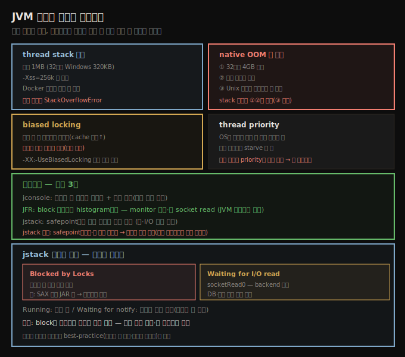

# JVM 스레드 튜닝과 모니터링
> 스레드 튜닝 효과는 작고, 모니터링은 스레드 수와 락 대기 시간을 jconsole·JFR·jstack으로 봅니다

JVM에는 스레드·동기화 성능에 영향을 주는 몇 잡다한 튜닝이 있습니다. 이 튜닝들은 애플리케이션 성능에 작은 영향만 줍니다. 스레드 성능은 튜닝보다 — 만질 JVM 플래그가 적고 효과도 제한적이라 — **스레드 수 관리와 동기화 최소화의 best-practice**가 핵심입니다.





## 1. thread stack 크기 — -Xss와 native OOM
> stack 기본 1MB는 메모리가 빠듯할 때 -Xss로 줄이며, native OOM은 세 원인 중 stack 축소로 둘만 해결됩니다

메모리가 귀할 때 스레드가 쓰는 메모리를 조정할 수 있습니다. 각 스레드는 **native stack**을 가지며, OS가 그 스레드의 호출 스택 정보(예: `main()`이 `calculate()`를, 그게 `add()`를 호출했다는 사실)를 저장합니다. native stack 크기는 **1MB**입니다(32비트 Windows JVM은 320KB). 64비트 JVM에서는 물리 메모리가 아주 빠듯하고 작은 스택이 native 메모리 고갈을 막을 때가 아니면 이 값을 설정할 이유가 보통 없습니다 — 메모리가 제한된 Docker 컨테이너 안에서 특히 그렇습니다. 실무 규칙으로 많은 프로그램이 256KB 스택으로 돌고, 1MB가 다 필요한 경우는 적습니다. 너무 작게 설정하면 호출 스택이 아주 큰 스레드가 `StackOverflowError`를 던집니다. 변경은 `-Xss=N`(예: `-Xss=256k`)으로 합니다.

> **native OOM 세 원인**: 스레드를 만들 native 메모리가 부족하면 `OutOfMemoryError`가 나며, 세 가지를 가리킵니다 — ① 32비트 JVM이 4GB(또는 OS에 따라 그 이하) 최대 크기에 닿음, ② 시스템이 가상 메모리를 실제로 소진, ③ Unix 시스템에서 사용자가 (모든 프로그램 합쳐) 로그인에 설정된 최대 프로세스 수를 이미 만듦(개별 스레드도 그 점에서 프로세스로 침). **stack 축소는 ①②만 해결하고 ③엔 효과가 없습니다.** JVM 에러로는 어느 경우인지 알 수 없어, 이 에러를 만나면 셋을 모두 고려합니다.


## 2. biased locking과 thread priority — 의존하지 말 것
> biased locking은 스레드 풀엔 오히려 나쁘고, thread priority는 OS가 경과 시간도 봐 실행 빈도를 의존할 수 없습니다

**biased locking** — 락이 경쟁할 때 JVM(과 OS)은 락 할당 방식을 고릅니다. 공정하게(round-robin) 주거나, 최근 락을 쓴 스레드 쪽으로 **편향**시킬 수 있습니다. 편향의 이론은, 스레드가 최근 락을 썼다면 프로세서 cache에 그 스레드가 다음에 필요할 데이터가 남아 있을 가능성이 높다는 것입니다 — 재획득에 우선권을 주면 cache 적중 확률이 올라 성능이 좋아집니다. 그러나 편향은 부기(bookkeeping)가 필요해 때로 성능에 나쁩니다.

특히 **스레드 풀을 쓰는 애플리케이션**(일부 애플리케이션·REST 서버 포함)은 biased locking이 켜져 있으면 흔히 더 나쁩니다 — 그 모델에서는 다른 스레드들이 경쟁 락에 동등하게 접근할 가능성이 높기 때문입니다. 이런 애플리케이션은 `-XX:-UseBiasedLocking`으로 끄면 작은 성능 향상을 얻습니다. biased locking은 기본 활성입니다.

**thread priority** — 각 Java 스레드는 개발자가 정한 priority를 갖는데, 이는 그 스레드가 얼마나 중요한지 OS에 주는 **힌트**입니다. priority로 특정 작업 성능을 높일 수 있을 것 같지만 그렇게 안 됩니다. OS는 모든 스레드의 **current priority**를 계산하는데, Java가 정한 priority도 고려하지만 다른 요인, 특히 **마지막 실행 후 경과 시간**을 가장 중요하게 봅니다. 이로써 모든 스레드가 어느 시점에 실행될 기회를 갖고, priority와 무관하게 어떤 스레드도 CPU 접근을 기다리며 starve하지 않습니다. 두 요인의 균형은 OS마다 다릅니다 — Unix는 경과 시간이 지배해 Java priority 효과가 거의 없고, Windows는 높은 priority가 더 자주 돌지만 낮은 priority도 공정한 CPU를 받습니다. 어느 쪽이든 **실행 빈도를 priority에 의존할 수 없어**, 작업 우선순위는 애플리케이션 로직으로 정해야 합니다.


## 3. 스레드 가시성 — jconsole과 JFR
> jconsole로 스레드 수를 실시간으로 보고, block 진단은 JVM에 통합된 JFR이 histogram에서 monitor 대기를 보여 줘 가장 좋습니다

애플리케이션의 스레딩·동기화 효율을 분석할 때 두 가지를 봅니다 — **전체 스레드 수**(너무 높지도 낮지도 않은지)와 **스레드가 락·자원을 기다리는 시간**입니다.

거의 모든 JVM 모니터링 도구가 스레드 수 정보를 줍니다. `jconsole` 같은 인터랙티브 도구는 Threads 패널에서 실행 중 스레드 수가 늘고 주는 걸 실시간으로 봅니다(예: NetBeans가 최대 45 스레드, 30~31에 안착). 개별 스레드 스택도 출력해, 어떤 스레드가 reference queue 락을 기다리는지 등을 보입니다.

실시간 모니터링은 높은 수준 그림엔 좋지만 스레드가 뭘 하는지는 안 줍니다. CPU 사이클을 어디서 쓰는지는 **프로파일러**(3장)가 필요합니다. block된 스레드 진단은 더 어렵지만 전체 실행에서 흔히 더 중요합니다 — 특히 멀티 CPU에서 모든 CPU를 안 쓰는 경우입니다.

> **JFR로 block 진단** (최선): block을 아는 가장 좋은 방법은 JVM을 들여다봐 낮은 수준에서 스레드 block을 아는 도구입니다. **Java Flight Recorder**(3장)가 그런 도구로, JFR이 잡은 이벤트를 파고들어 스레드를 block시키는 걸 찾습니다. 보통 monitor 획득 대기 이벤트를 보고, 긴 socket read(드물게 write)도 block일 수 있습니다. Java Mission Control의 Histogram 패널에서 쉽게 봅니다 — 예로 `sun.awt.AppContext.get()`의 HashMap 락이 66초간 163번 경쟁해 요청 응답에 평균 31ms를 더했고, stack trace가 JSP의 `java.util.Date` 처리에서 비롯됐음을 짚어, thread-local date formatter로 개선할 수 있음을 보입니다. histogram에서 block 이벤트를 골라 호출 코드를 보는 이 과정은 도구와 JVM의 긴밀한 통합으로 가능합니다.


## 4. jstack — safepoint 상태별 집계
> jstack은 safepoint에서 스레드 상태를 덤프해 Running·Blocked·Waiting·I/O로 집계하며, block된 스레드가 많으면 성능 저하 신호입니다

JFR 기록이 없으면, 프로그램에서 스레드 스택을 많이 떠 살피는 게 대안입니다. `jstack`·`jcmd` 등이 모든 스레드 상태(실행 중·락 대기·I/O 대기 등)를 줍니다. 유용하지만 출력에서 너무 많은 걸 기대하지 않는 한에서입니다.

> **jstack 주의 두 가지**: 첫째, JVM은 **safepoint에서만** 스레드 스택을 덤프합니다. 둘째, 스택은 스레드별로 하나씩 덤프돼 **모순된 정보**가 나올 수 있습니다 — 두 스레드가 같은 락을 쥔 것처럼 보이거나, 아무도 안 쥔 락을 기다리는 스레드가 보일 수 있습니다. 그래서 스택 덤프를 빠르게 연속으로 떠 프로파일러 대용으로 쓰고 싶어지지만, safepoint와 불일치 스냅샷 때문에 잘 안 됩니다 — 높은 수준 개요는 얻어도 진짜 프로파일러가 훨씬 정확합니다.

스레드 스택은 스레드가 얼마나 심하게 block됐는지 보입니다(block된 스레드는 이미 safepoint에 있음). 연속 덤프가 한 락에 많은 스레드가 block된 걸 보이면 그 락에 심한 경쟁이 있다고, I/O를 기다리며 많이 block됐으면 그 I/O(예: DB 호출 SQL)를 튜닝해야 한다고 결론낼 수 있습니다.

jstack 파서 출력 예입니다.

```
Threads in state Blocked by Locks
    41 threads running in
        com.sun.enterprise.loader.EJBClassLoader.getResourceAsStream
    (EJBClassLoader.java:801)
Total Blocked by Locks Threads: 41

Threads in state Waiting for notify
    39 threads running in
        com.sun.enterprise.web.connector.grizzly.LinkedListPipeline.getTask
    (LinkedListPipeline.java:294)
Total Waiting for notify Threads: 74

Threads in state Waiting for I/O read
    14 threads running in com.acme.MyServlet.doGet(MyServlet.java:603)
Total Waiting for I/O read Threads: 14
```

파서가 모든 스레드를 집계해 상태별 수를 보입니다.

1. **Blocked by Locks (41)** — 보고된 메서드는 스택의 첫 non-JDK 메서드입니다(예: GlassFish `EJBClassLoader.getResourceAsStream()`). 이 예에서는 모든 스레드가 같은 JAR 파일을 읽으려 block됐고, SAX 파서 인스턴스화에서 왔습니다 — SAX 파서가 manifest로 동적 정의될 수 있어 JDK가 전체 classpath를 뒤지고, JAR 읽기에 동기화 락이 필요해 모든 스레드가 같은 락을 다퉈 throughput을 크게 해쳤습니다. (`-Djavax.xml.parsers.SAXParserFactory` 프로퍼티를 설정해 그 lookup을 피합니다.)
2. **Waiting for notify (74)** — 무언가 일어나길 기다립니다. 흔히 풀에서 작업 준비 통보를 기다리거나(`getTask()`), System 스레드(RMI 분산 GC·JMX 모니터링)입니다 — 성능 문제가 꼭 아니고 정상일 수 있습니다.
3. **Waiting for I/O read (14)** — block I/O 호출(보통 `socketRead0()`)로 backend 응답을 기다립니다. throughput을 해치므로 DB·backend 성능을 봐야 합니다.

핵심은 **block된 스레드가 많으면 성능이 저하**된다는 것입니다 — 원인이 무엇이든 설정·애플리케이션 변경으로 피해야 합니다.


## 9장 요약

스레드 동작 이해는 중요한 성능 이득을 줄 수 있습니다. 다만 스레드 성능은 튜닝의 문제가 아닙니다 — 만질 JVM 플래그가 적고 그 효과도 제한적입니다. 좋은 스레드 성능은 **스레드 수 관리와 동기화 영향 제한의 best-practice를 따르는 것**입니다. 적절한 프로파일링·락 분석 도구의 도움으로, 애플리케이션을 검사·수정해 스레딩·락 문제가 성능에 악영향을 주지 않게 합니다.


## 자주 받는 오해

**"thread stack을 줄이면 모든 native OOM이 해결된다"** — native OOM 세 원인 중 ①32비트 4GB 한계, ②가상 메모리 고갈만 stack 축소로 풀립니다. ③Unix 사용자 프로세스 수 한계는 stack 축소와 무관합니다. JVM 에러로 어느 경우인지 알 수 없어 셋을 모두 고려합니다.

**"biased locking은 항상 성능을 높인다"** — 부기 비용이 있어 때로 나쁩니다. 특히 **스레드 풀**은 여러 스레드가 락에 동등하게 접근해 오히려 나빠, `-XX:-UseBiasedLocking`으로 끄면 작은 향상을 얻습니다.

**"thread priority로 중요한 작업을 더 자주 돌릴 수 있다"** — priority는 힌트일 뿐입니다. OS는 마지막 실행 후 경과 시간을 더 중요하게 봐 어떤 스레드도 starve하지 않습니다. Unix는 priority 효과가 거의 없습니다. 실행 빈도는 priority에 의존할 수 없고 애플리케이션 로직으로 정해야 합니다.

**"jstack을 빠르게 연속으로 뜨면 프로파일러로 쓸 수 있다"** — safepoint에서만 덤프되고 스레드별로 하나씩 떠 모순된 정보가 나올 수 있어 잘 안 됩니다. 높은 수준 개요는 얻어도, 진짜 프로파일러가 훨씬 정확합니다.


## 면접에서 받을 만한 질문

**Q. thread stack 크기는 언제 줄이고, native OOM은 어떻게 진단하나요?**
기본 1MB(32비트 Windows 320KB)는 물리 메모리가 빠듯하거나 Docker처럼 제한적일 때 `-Xss=256k`로 줄입니다. 너무 작으면 `StackOverflowError`가 납니다. 스레드 생성 native OOM은 세 원인 — 32비트 4GB 한계, 가상 메모리 고갈, Unix 프로세스 수 한계 — 이 있고, stack 축소는 앞 둘만 해결합니다.

**Q. biased locking은 무엇이고 왜 스레드 풀에선 끄나요?**
최근 락을 쓴 스레드에 재획득 우선권을 줘 cache 적중을 높이는 기법입니다. 그러나 부기 비용이 있고, 스레드 풀은 여러 스레드가 락에 동등하게 접근해 편향이 오히려 손해입니다. `-XX:-UseBiasedLocking`으로 끄면 REST 서버 등에서 작은 향상을 얻습니다.

**Q. block된 스레드는 어떻게 진단하나요?**
가장 좋은 건 JVM에 통합된 **JFR**로, Histogram에서 monitor 대기·긴 socket read 이벤트를 골라 호출 코드를 봅니다. JFR이 없으면 **jstack**으로 스택을 여러 번 떠 상태별(Blocked by Locks·Waiting for notify·Waiting for I/O)로 집계합니다 — 단 safepoint에서만·하나씩 떠 모순이 가능합니다. 한 락에 많이 block되면 그 락 경쟁, I/O에 많이 block되면 backend 튜닝 신호입니다.


## 관련 문서

- [`09-04.동기화 회피와 false sharing`](./09-04.동기화%20회피와%20false%20sharing.md) — @Contended 등 9장 동기화
- [`03-04.Java Flight Recorder와 JMC`](./03-04.Java%20Flight%20Recorder와%20JMC.md) — JFR 기초
- [`08-01.footprint — committed vs reserved와 측정·최소화`](./08-01.footprint%20—%20committed%20vs%20reserved와%20측정·최소화.md) — thread stack과 native 메모리
- [상위 인덱스](./README.md)
