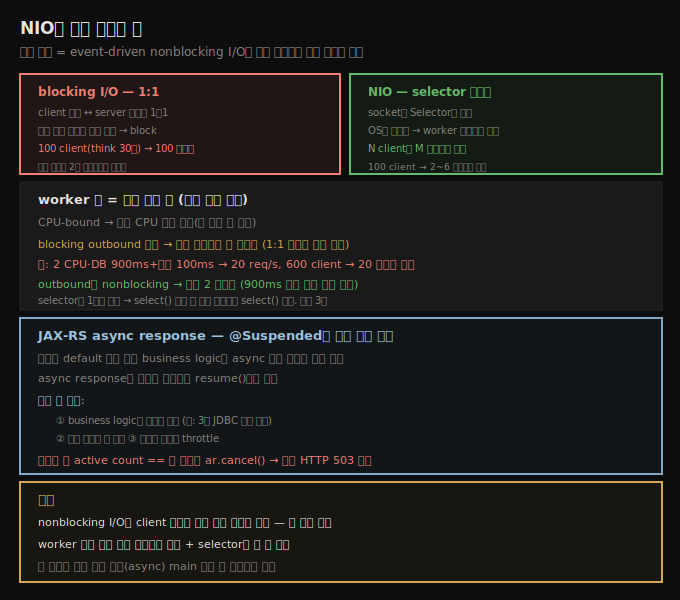

# NIO와 서버 스레드 풀 — selector·worker·async REST
> 서버 확장은 nonblocking I/O로 적은 스레드가 많은 연결을 처리하는 데 있고, worker 풀은 동시 요청 수에 맞춥니다

이 장은 Java 서버 기술을 봅니다. 본질적으로 이 기술들은 client와 server 사이에 (보통 HTTP로) 데이터를 전송하는 법입니다. 서버 확장은 대체로 스레드의 효과적 사용이고, 그 사용은 **event-driven nonblocking I/O**를 요구합니다. Tomcat·WebSphere·WebLogic 같은 전통 Java/Jakarta EE 서버는 한동안 Java NIO API로 이를 해 왔고, Netty·Vert.x 같은 프레임워크는 NIO API의 복잡함을 격리해 작은 footprint 서버의 building block을 제공하며, Spring WebFlux·Helidon이 (둘 다 Netty 위에) 이를 기반으로 확장 가능한 서버를 만듭니다.

이 프레임워크들은 **reactive programming** 모델을 제공합니다 — 본질적으로 event 기반으로 비동기 데이터 스트림을 다룹니다. reactive와 asynchronous 둘 다 우리 목적엔 같은 성능 이득을 줍니다 — 프로그램(특히 I/O)을 많은 연결·데이터 소스로 확장하는 능력입니다.





## 1. NIO 개요 — blocking 1:1에서 selector 이벤트로
> blocking I/O는 client와 스레드가 1:1이라 비효율적이고, NIO는 selector 이벤트로 N client를 M 스레드로 처리합니다

초기 Java는 모든 I/O가 blocking이었습니다. socket에서 데이터를 읽으려는 스레드는 적어도 일부 데이터가 가용하거나 읽기가 timeout될 때까지 **block**됐습니다. 더 중요하게, **읽기를 시도하지 않고는 socket에 데이터가 있는지 알 방법이 없었습니다**. 그래서 client 연결로 데이터를 처리하려는 스레드는 읽기 요청을 내고, 데이터가 올 때까지 block하고, 요청을 처리해 응답을 보내고, 다시 socket의 blocking 읽기로 돌아가야 했습니다.

blocking I/O는 server가 client 연결과 server 스레드를 **1:1**로 두기를 요구합니다 — 각 스레드가 단일 연결만 다룹니다. HTTP keepalive를 쓰려는 client에 특히 문제입니다. 100 client가 평균 30초 think time으로 요청하고 server가 요청 처리에 500ms 걸리면, 어느 시점에도 평균 2개 미만의 요청만 진행 중인데 server는 모든 client를 처리하려 **100 스레드**가 필요합니다. 크게 비효율적입니다.

그래서 Java가 nonblocking NIO API를 도입하자 서버 프레임워크가 그 모델로 옮겼습니다. 이제 각 client의 socket이 server의 **selector**(`Selector` 인스턴스 — socket에 데이터가 가용할 때 통지하는 OS 인터페이스를 다룸)에 등록됩니다. client가 요청을 보내면 selector가 OS에서 이벤트를 받아, server 스레드 풀의 한 스레드에 특정 client에 읽을 I/O가 있다고 통지합니다. 그 스레드가 데이터를 읽고, 요청을 처리하고, 응답을 보내고, 다음 요청 대기로 돌아갑니다. N client를 **M 스레드**로 처리합니다.

client가 특정 스레드에 묶이지 않으므로, server 스레드 풀을 **server가 처리할 동시 요청 수**에 맞춰 튜닝할 수 있습니다. 앞 예에서 크기 2인 풀로 100 client의 부하를 충분히 처리하고, 요청이 비균일하게 도착해도 30초 think time 범위 안이면 5~6 스레드면 됩니다. client 수보다 훨씬 적은 스레드를 쓰는 게 **큰 효율 이득**입니다.

> 원문 Figure 10-1·10-2를 [`10-01b.blocking-vs-nio-selector.svg`](./_assets/10-01b.blocking-vs-nio-selector.svg)로 재현했습니다.


## 2. selector와 worker 스레드 — 4가지 구성
> selector는 I/O 가용을 통지하고 worker가 요청을 처리하며, 둘은 분리되거나 합쳐진 4가지 방식으로 구성됩니다

기본 연결 처리를 튜닝합니다. 서버 프레임워크는 연결과 스레드 풀을 다루는 방식이 다릅니다. 기본 모델은 **selector** 역할 스레드(I/O 가용 시 통지)와, selector가 client에 I/O가 대기 중이라 통지한 뒤 실제 요청/응답을 다루는 별도의 **worker** 스레드 풀입니다. selector와 worker는 여러 방식으로 구성됩니다.

1. **분리된 풀** — selector가 모든 socket의 통지를 기다렸다 worker 풀에 요청을 넘깁니다.
2. **타입별 분배** — selector가 I/O 통지를 받으면 (일부만) 읽어 요청 정보를 파악하고, 타입에 따라 다른 server 스레드 풀로 전달합니다.
3. **selector는 수락만** — selector 풀이 `ServerSocket`에서 새 연결을 수락하고, 연결 후엔 모든 작업이 worker 풀에서 처리됩니다. worker 스레드가 때로 `Selector`로 기존 연결의 대기 I/O를 기다리고, 때로 통지를 처리합니다.
4. **구분 없음** — selector와 요청 처리 스레드 구분이 아예 없습니다. socket에 I/O가 가용하다고 통지받은 스레드가 전체 요청을 처리하고, 그동안 풀의 다른 스레드는 다른 socket의 I/O를 통지받아 처리합니다.


## 3. worker 수 — 동시 요청과 outbound 호출
> worker 수는 동시 실행+동시 block 수에 맞추며, blocking outbound면 20 스레드가, nonblocking이면 2 스레드가 필요합니다

차이에도 불구하고 server 스레드 풀 튜닝 시 두 기본을 기억합니다. 첫째(가장 중요), server가 처리할 **동시 요청 수**(동시 연결 아님)를 다룰 worker 스레드가 충분해야 합니다. 9장에서 봤듯 이는 요청이 CPU-집약 코드를 돌릴지 다른 blocking 호출을 할지에 부분적으로 달렸습니다.

CPU-집약 계산만 하는 REST 서버를 봅시다. 모든 CPU-bound 케이스처럼 머신·컨테이너의 가상 CPU 수보다 많은 스레드가 필요 없습니다 — 그 이상은 못 돌립니다. 그런데 REST 서버가 다른 자원(다른 REST 서버·DB)에 **outbound 호출**을 하면, 그 호출이 blocking인지 nonblocking인지에 달립니다.

blocking이라 가정합시다. 이제 동시 outbound blocking 호출마다 한 스레드가 필요합니다 — 서버를 비효율적 1:1 모델로 되돌릴 위험입니다. 2 non-hyper-threaded CPU에서 worker 스레드가 한 client 요청을 만족하려 DB에서 데이터를 받는 데 900ms, 그 호출 셋업과 응답 처리에 100ms를 쓴다고 합시다. 이 서버는 초당 20 요청을 처리할 CPU가 있고, client가 30초마다 요청하면 600 client를 다룹니다. client 연결 처리가 nonblocking이라 600 스레드는 안 필요하지만, 평균 20 요청이 동시에 block되므로 **worker 풀에 최소 20 스레드**가 필요합니다.

이제 outbound 요청도 **nonblocking**이라 합시다 — DB가 답을 주는 900ms 동안 DB 호출을 한 스레드가 다른 요청을 자유롭게 처리합니다. 다시 **2 worker 스레드**면 됩니다 — DB 데이터를 다루는 100ms 구간을 처리하며 CPU를 꽉 채우고 throughput을 최대로 유지합니다. 기본 규칙은 — **동시에 코드를 실행하고 동시에 다른 자원에 block될 만큼 worker 풀에 스레드가 필요**합니다.

둘째 튜닝은 어느 시점에 selector 역할을 할 스레드 수입니다. **하나로는 부족**합니다. selector 스레드가 `select()` 호출로 어느 socket에 I/O가 가용한지 알아낸 뒤 그 데이터 처리(최소한 어느 client에 요청이 있는지 worker에 통지)에 시간을 쓰는 동안, 다른 스레드가 다른 socket에 `select()`를 실행해야 합니다. 그래서 selector 전용 풀이 있는 프레임워크는 풀에 최소 몇 개(보통 기본 3개)를 두고, 같은 풀이 선택과 처리를 모두 하면 worker 가이드라인보다 몇 개를 더 둡니다.


## 4. async REST 서버 — @Suspended로 다른 풀에 미룸
> JAX-RS async response는 business logic을 다른 풀에 미뤄 병렬성·throttle을 얻고, active count로 과부하 시 503을 즉시 반환합니다

요청 스레드 풀 튜닝의 대안은 작업을 **다른 스레드 풀로 미루는** 것입니다 — JAX-RS async 구현, Netty event executor task 등이 취하는 접근입니다.

단순 REST 서버는 요청·응답을 같은 스레드에서 다뤄 동시성을 throttle합니다(예: 8 CPU Helidon 기본 풀 32). 다음 엔드포인트를 봅시다(`sleep`은 원격 DB 호출이나 다른 REST 호출을 흉내 내는 100ms라 가정).

```java
    @GET
    @Path("/sleep")
    @Produces(MediaType.APPLICATION_JSON)
    public String sleepEndpoint(
        @DefaultValue("100") @QueryParam("delay") long delay
        ) throws ParseException {
        try { Thread.sleep(delay); } catch (InterruptedException ie) {}
        return "{\"sleepTime\": \"" + delay + "\"}";
    }
```

기본 설정 Helidon이면 32 동시 요청을 다룹니다 — 동시성 32 부하 생성기는 각 요청이 100ms(+처리 1~2ms), 64는 각 200ms를 보고합니다(앞 요청이 끝나야 시작). 흔히 좋은 일이지만, 이 머신은 CPU-bound 근처도 아니어서(단일 코어의 20~30%만 씀) 기본 풀 설정을 바꿔 동시성을 늘릴 수 있습니다.

JAX-RS는 둘째 방법으로 **asynchronous response**를 줍니다 — business logic 처리를 다른 풀(async 풀)에 미룹니다.

```java
    ThreadPoolExecutor tpe = Executors.newFixedThreadPool(64);
    @GET
    @Path("/asyncsleep")
    @Produces(MediaType.APPLICATION_JSON)
    public void sleepAsyncEndpoint(
        @DefaultValue("100") @QueryParam("delay") long delay,
        @Suspended final AsyncResponse ar
        ) throws ParseException {
        tpe.execute(() -> {
            try { Thread.sleep(delay); } catch (InterruptedException ie) {}
            ar.resume("{\"sleepTime\": \"" + delay + "\"}");
        });
    }
```

요청이 default 풀로 와서 business logic을 async 풀에서 실행하게 셋업하고 `sleepAsyncEndpoint()`가 즉시 반환합니다 — default 풀 스레드가 풀려 다른 요청을 즉시 처리합니다. `@Suspended` async response는 로직 완료를 기다렸다 `resume()`으로 응답합니다. 다만 솔직히 default 풀을 64로 키운 것과 다를 게 없고, 오히려 다른 스레드로 보내 약간 느립니다. **async response를 쓰는 세 이유**가 있습니다.

1. business logic에 **병렬성 추가** — 100ms sleep 대신 3개(무관한) JDBC 호출로 데이터를 받아야 하면, async response로 각 호출을 async 풀의 별도 스레드로 병렬 처리합니다.
2. 활성 스레드 수 **제한**.
3. 서버를 적절히 **throttle**.

대부분 REST 서버에서 요청 스레드 풀만 throttle하면 새 요청이 차례를 기다리고 큐가 커집니다 — 흔히 무제한이라 총 요청이 감당 불가가 됩니다. 큐에 오래 있던 요청은 처리될 때쯤 버려지고, 안 버려져도 긴 응답이 전체 throughput을 죽입니다. 더 나은 접근은 **큐잉 전에 async 풀 상태를 보고, 너무 바쁘면 요청을 reject**하는 것입니다.

```java
    @GET
    @Path("/asyncreject")
    @Produces(MediaType.APPLICATION_JSON)
    public void sleepAsyncRejectEndpoint(
        @DefaultValue("100") @QueryParam("delay") long delay,
        @Suspended final AsyncResponse ar
        ) throws ParseException {
        if (tpe.getActiveCount() == 64) {
            ar.cancel();
            return;
        }
        tpe.execute(() -> {
            try { Thread.sleep(delay); } catch (InterruptedException ie) {}
            ar.resume("{\"sleepTime\": \"" + delay + "\"}");
        });
    }
```

active count가 풀 크기와 같으면 응답을 즉시 cancel합니다(더 정교하면 bounded 큐 + rejected execution handler). 호출자는 즉시 **HTTP 503 Service Unavailable**을 받습니다 — REST 세계에서 과부하 서버를 다루는 선호 방식이고, 즉시 그 상태를 반환하면 과부하 서버의 부하를 줄여 결국 전체 성능이 훨씬 좋아집니다.


## 자주 받는 오해

**"server는 client 연결마다 스레드가 필요하다"** — blocking I/O만 그렇습니다(1:1). NIO는 socket을 selector에 등록하고 OS 이벤트로 worker에 통지해, N client를 M(훨씬 적은) 스레드로 처리합니다. 100 client(think 30초)도 worker 2~6개면 충분합니다.

**"worker 풀은 동시 연결 수에 맞춘다"** — 동시 **요청** 수에 맞춥니다(동시 연결 아님). CPU-bound면 가상 CPU 수, blocking outbound 호출이면 동시 호출 수만큼(2 CPU·DB 900ms → 20 스레드)이 필요합니다. outbound도 nonblocking이면 다시 2 스레드로 줄어듭니다.

**"async response는 default 풀을 키운 것보다 항상 빠르다"** — 단순히 다른 풀로 미루기만 하면 default 풀을 같은 크기로 키운 것과 다를 게 없고, 다른 스레드로 보내 약간 느립니다. 진짜 이점은 병렬성 추가·활성 스레드 제한·throttle(503 반환)입니다.

**"selector는 하나면 된다"** — 하나로는 부족합니다. `select()` 결과를 처리하는 동안 다른 스레드가 `select()`를 실행해야 해, 보통 selector 풀에 3개를 둡니다.


## 면접에서 받을 만한 질문

**Q. nonblocking I/O가 왜 서버 확장의 기본인가요?**
blocking I/O는 client 연결과 스레드가 1:1이라, 100 client(think 30초)에 동시 진행이 2개 미만인데도 100 스레드가 필요합니다. NIO는 socket을 `Selector`에 등록하고, OS가 데이터 가용 이벤트를 selector에 주면 worker 풀의 한 스레드에 통지합니다 — N client를 M(훨씬 적은) 스레드로 처리해, 풀을 동시 요청 수에 맞춰 튜닝할 수 있습니다.

**Q. worker 스레드 수는 어떻게 정하나요?**
동시에 코드를 실행하고 동시에 다른 자원에 block될 수만큼입니다. CPU-bound면 가상 CPU 수면 됩니다. blocking outbound 호출(2 CPU·DB 900ms+처리 100ms)이면 평균 20 요청이 block돼 20 스레드가 필요하지만, outbound도 nonblocking이면 900ms 동안 다른 요청을 처리해 2 스레드로 돌아갑니다. selector용으로 몇 개(보통 3개)를 더 둡니다.

**Q. JAX-RS async response는 언제 쓰나요?**
세 이유입니다 — business logic에 병렬성 추가(3 JDBC 병렬), 활성 스레드 수 제한, throttle. 단순히 다른 풀에 미루기만 하면 default 풀을 키운 것과 같으니, 핵심 가치는 과부하 시 `getActiveCount()`로 풀이 꽉 찼는지 보고 `ar.cancel()`로 즉시 HTTP 503을 반환해 과부하 서버 부하를 줄이는 것입니다.


## 관련 문서

- [`10-02.비동기 outbound 호출 — HTTP client와 DB`](./10-02.비동기%20outbound%20호출%20—%20HTTP%20client와%20DB.md) — outbound 호출을 nonblocking으로
- [`09-01.스레드 풀 — 크기 결정과 ThreadPoolExecutor`](./09-01.스레드%20풀%20—%20크기%20결정과%20ThreadPoolExecutor.md) — 풀 크기와 병목
- [`09-05.JVM 스레드 튜닝과 모니터링`](./09-05.JVM%20스레드%20튜닝과%20모니터링.md) — 9장 마지막
- [상위 인덱스](./README.md)
