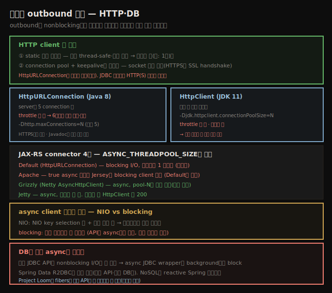

# 비동기 outbound 호출 — HTTP client와 DB
> outbound 호출이 nonblocking이면 호출마다 스레드를 전담하지 않아 풀을 줄이며, HTTP client는 재사용·connection pool이 핵심입니다

앞 노트에서 2 CPU 서버가 최대 throughput에 20 스레드 풀이 필요했던 건, 스레드가 다른 자원에 outbound 호출하며 90% 시간을 I/O에 block됐기 때문입니다. nonblocking I/O가 여기서도 돕습니다 — 그 outbound HTTP·JDBC 호출이 nonblocking이면 호출에 스레드를 전담하지 않아 풀 크기를 줄일 수 있습니다.





## 1. HTTP client 두 핵심 — 재사용과 connection pool
> client는 static 공유 객체로 두고(thread-safe·생성 비쌈), connection pool과 keepalive로 연결을 재사용합니다

HTTP client는 server로의 HTTP 요청을 다루는 클래스입니다. 여러 client가 있고 각기 다른 기능·성능 특성을 가집니다. Java 8은 기본 `java.net.HttpURLConnection`(보안은 `HttpsURLConnection`)을, Java 11은 새 `java.net.http.HttpClient`(HTTPS도 다룸)를 더합니다. 그 외 Apache `HttpClient`, Netty 기반 `AsyncHttpClient`, Eclipse Jetty `HttpClient`가 있습니다.

`HttpURLConnection`으로 기본 연산이 가능하지만, 대부분 REST 호출은 JAX-RS 같은 프레임워크로 합니다. 기본 JAX-RS 구현은 인기 HTTP client용 connector도 제공해, 최고 성능을 주는 client를 골라 쓸 수 있습니다. 두 기본 성능 고려사항이 있습니다.

**첫째, client 객체는 static 공유 객체입니다.**

```java
private static Client client;
static {
    ClientConfig cc = new ClientConfig();
    cc.connectorProvider(new JettyConnectorProvider());
    client = ClientBuilder.newClient(cc);
}

public Message getMessage() {
    Message m = client.target(URI.create(url)
                  .request(MediaType.APPLICATION_JSON)
                  .get(Message.class);
    return m;
}
```

핵심은 client 객체가 static 공유 객체라는 것입니다. 모든 client 객체는 **thread-safe**하고 **생성이 비싸**, 애플리케이션에 제한된 수(예: 1개)만 둡니다.

**둘째, HTTP client가 connection을 제대로 pool하고 keepalive로 열어 두게 합니다.** HTTP 통신용 socket 열기는 비싼 연산이고, HTTPS이고 client·server가 SSL handshake를 해야 하면 특히 그렇습니다. JDBC 연결처럼 HTTP(S) 연결도 재사용해야 합니다(`HttpURLConnection`은 재사용 불가라 예외).


## 2. connection pool — throttle하지 않는다
> HttpURLConnection은 server당 5 연결을, JDK11 HttpClient는 무제한을 풀하되 둘 다 throttle하지 않고, HttpClient는 객체별 풀입니다

모든 HTTP client가 풀 메커니즘을 주지만, `HttpURLConnection`의 풀링은 자주 오해됩니다. 기본적으로 이 클래스는 (server당) **5 connection**을 풀합니다. 다만 전통 풀과 달리 **throttle하지 않습니다** — 6번째 연결을 요청하면 새 연결이 생성됐다 끝나면 파괴됩니다. 그런 임시 연결은 전통 connection pool에선 안 보입니다. 그래서 `HttpURLConnection` 기본 설정에서는 임시 연결이 많이 보여 풀링이 안 된다고 오해하기 쉽습니다(Javadoc도 풀링 기능을 언급 안 함). 풀 크기는 `-Dhttp.maxConnections=N`(기본 5)으로 바꾸고, 이름과 달리 HTTPS에도 적용됩니다 — 단 이 클래스로 연결을 throttle할 방법은 없습니다.

JDK 11 새 `HttpClient`의 풀은 비슷하나 두 중요한 차이가 있습니다. 첫째, 기본 풀 크기가 **무제한**이고 `-Djdk.httpclient.connectionPoolSize=N`으로 설정합니다(역시 throttle 안 함 — 설정보다 많이 요청하면 생성됐다 파괴). 둘째, 이 풀은 **`HttpClient` 객체별**이라, 객체를 재사용하지 않으면 connection 풀링이 전혀 안 됩니다.

JAX-RS에서는 connection pool을 원하면 기본 외 connector를 쓰라는 제안이 흔한데, 기본 connector가 `HttpURLConnection`을 쓰므로 사실이 아닙니다 — 연결을 throttle하려는 게 아니면 위처럼 그 클래스의 연결 크기를 튜닝할 수 있습니다. 인기 connector별 풀링 메커니즘입니다.

| Connector | HTTP client 클래스 | 풀링 메커니즘 |
|-----------|---------------------|----------------|
| Default | `java.net.HttpURLConnection` | `maxConnections` 시스템 프로퍼티 |
| Apache | `org.apache.http.client.HttpClient` | `PoolingHttpClientConnectionManager` 생성 |
| Grizzly | `com.ning.http.client.AsyncHttpClient` | 기본 풀링, 설정 수정 가능 |
| Jetty | `org.eclipse.jetty.client.HttpClient` | 기본 풀링, 설정 수정 가능 |

JAX-RS에서 Grizzly connection manager는 `com.ning.http.client.AsyncHttpClient`를 쓰는데, 이는 `org.asynchttpclient.AsyncHttpClient`로 이름이 바뀐, Netty 위의 async client입니다.


## 3. async HTTP client — NIO vs blocking
> async client는 응답 처리를 다른 스레드에 미뤄 동시성을 높이며, NIO 기반은 blocking 기반보다 적은 스레드를 씁니다

async HTTP client는 async HTTP server처럼 더 나은 스레드 관리를 줍니다. async 호출을 하는 스레드가 요청을 원격 server로 보내고, 다른(background) 스레드가 가용할 때 요청을 처리하게 합니다. 성능 관점에서 핵심은 응답 처리를 다른 스레드에 미뤄 더 많은 것을 병렬로 돌린다는 것입니다.

async HTTP client는 JAX-RS 2.0 기능이고, 대부분 standalone client도 async를 직접 지원합니다(이름에 async가 든 것들은 기본 비동기 — 동기 모드는 async 호출 후 응답 완료를 기다렸다 동기 반환). 참조 Jersey 구현의 connector도 비동기로 쓸 수 있으나, **모두가 진짜 비동기는 아닙니다**. 모든 경우 응답 처리는 다른 스레드에 미뤄지지만, 두 방식으로 동작합니다.

1. **blocking I/O** — 그 다른 스레드가 표준 blocking Java I/O를 씁니다. background 풀에 동시 처리할 요청마다 한 스레드가 필요합니다(async server처럼 스레드를 많이 더해 동시성을 얻음).
2. **nonblocking I/O** — background 스레드가 NIO key selection용 몇(최소 1, 보통 더 많음) + 응답 처리용 몇 스레드만 필요합니다. 전체적으로 더 적은 스레드를 씁니다. NIO는 고전적 event-driven — socket에 데이터가 가용하면 풀 스레드가 통지받아 읽고 처리(또는 다른 스레드에 전달)한 뒤 풀로 돌아갑니다.

엄밀히 async는 event-driven이라, blocking I/O를 쓰는(요청 전체에 스레드를 pin) async client는 진짜 비동기가 아닙니다 — API가 비동기처럼 보이는 환상을 줄 뿐 스레드 확장성은 기대와 다릅니다.

aggregator(3개 다른 REST 서비스 정보를 종합하는 REST 서비스) 예입니다.

```java
public class TestResource {
    public static class MultiCallback extends InvocationCallback<Message> {
        private AsyncResponse ar;
        private AtomicDouble total = new AtomicDouble(0);
        private AtomicInteger pendingResponses;
        public MultiCallback(AsyncResponse ar, int targetCount) {
            this.ar = ar;
            pendingResponse = new AtomicInteger(targetCount);
        }
        public void completed(Message m) {
            double d = total.getAndIncrement(Message.getValue());
            if (targetCount.decrementAndGet() == 0) {
                ar.resume("{\"total\": \"" + d + "\"}");
            }
        }
    }

    @GET
    @Path("/aggregate")
    @Produces(MediaType.APPLICATION_JSON)
    public void aggregate(@Suspended final AsyncResponse ar)
                    throws ParseException {
        MultiCallback callback = new MultiCallback(ar, 3);
        target1.request().async().get(callback);
        target2.request().async().get(callback);
        target3.request().async().get(callback);
    }
}
```

여기서도 async response를 쓰지만 앞처럼 별도 풀은 안 필요합니다 — 요청은 응답을 다루는 스레드 중 하나에서 resume됩니다.

> 원문 Figure 10-3·10-4(async client 스레드 타임라인)를 [`10-02b.async-client-thread-timeline.svg`](./_assets/10-02b.async-client-thread-timeline.svg)로 재현했습니다. 핵심은 client 스레드의 처리 시간입니다 — 처리가 빠르고 응답이 잘 분산되면 한 스레드가 모든 응답을 다루고, 오래 걸리거나 몰리면 요청마다 한 스레드가 필요합니다. REST 서버는 완전 async여도 business logic의 CPU 요구 때문에 좋은 동시성을 위해 꽤 많은 스레드가 필요합니다(nginx 정적 콘텐츠와 다름).


## 4. connector별 background 풀과 async DB
> connector마다 background 풀 동작이 다르고 ASYNC_THREADPOOL_SIZE로 튜닝하며, DB의 진짜 async는 R2DBC나 Project Loom fibers가 필요합니다

background 풀은 throttle 역할을 하므로, 애플리케이션 동시성을 다루되 backend를 압도하지 않게 튜닝합니다. 보통 기본값으로 충분하지만, JAX-RS 참조 구현 connector별 정보입니다.

1. **Default** — blocking I/O. Jersey 단일 async client 풀(`jersey-client-async-executor`로 시작하는 이름)이 모든 요청을 다루고, 동시 요청마다 한 스레드가 필요합니다(기본 무제한). `ClientProperties.ASYNC_THREADPOOL_SIZE`로 bound를 설정합니다.
2. **Apache** — Apache 라이브러리에 진짜 async client(NIO로 응답 읽기)가 있으나, Jersey의 Apache connector는 **blocking** Apache client를 씁니다. 풀은 Default와 동일하게 동작·설정됩니다.
3. **Grizzly** — async client(Figure 10-3 모델). 여러 풀이 관여합니다 — 요청 쓰는 풀(`grizzly-ahc-kernel`), NIO 이벤트 대기 풀(`nioEventLoopGroup`), 응답 읽고 처리하는 풀(`pool-N`). 마지막 풀이 throughput/throttle용 설정 대상이고, 무제한이라 `ASYNC_THREADPOOL_SIZE`로 throttle합니다.
4. **Jetty** — async client. 요청 송수신과 이벤트 폴링이 같은 풀에서 일어납니다. Jersey에서 이 풀도 `ASYNC_THREADPOOL_SIZE`로 설정하나, Jetty 서버는 backend 풀이 둘입니다 — 표준 `jersey-client-async-executor` 풀(잡다한 bookkeeping)과 Jetty client 처리 풀(`HttpClient`로 시작하는 이름). 미설정 시 `HttpClient` 풀 크기는 200입니다.

> **async DB는 어렵습니다**: outbound 호출이 관계형 DB 호출이면 진짜 비동기로 만들기 어렵습니다. 표준 JDBC API는 nonblocking I/O에 안 맞아 새 API·기술이 필요합니다. 관련 API 제안들이 거절됐고, 현재 희망은 **fibers**라는 경량 task 모델이 기존 동기 API를 비동기 프로그래밍 없이 잘 확장하게 하는 것입니다 — OpenJDK **Project Loom**의 일부이나 릴리스 날짜는 미정입니다. 비동기 JDBC wrapper 제안은 흔히 JDBC 작업을 별도 풀에 미루는데, background 스레드가 I/O에 block돼 확장성을 얻지 못합니다. JDK 밖 프로젝트가 빈자리를 채웁니다 — 가장 널리 쓰이는 **Spring Data R2DBC**가 관계형 DB의 nonblocking 접근에 현재 최선입니다(다른 API·일부 DB만). NoSQL은 Java 표준이 애초에 없어 DB 독자 API에 의존하므로, reactive NoSQL용 Spring 프로젝트로 진짜 비동기 접근을 할 수 있습니다.


## 자주 받는 오해

**"HttpClient는 요청마다 새로 만들어도 된다"** — client 객체는 모두 thread-safe하고 생성이 비싸, static 공유 객체로 제한된 수(예: 1개)만 둡니다. 특히 JDK 11 `HttpClient`는 풀이 **객체별**이라, 재사용하지 않으면 connection 풀링이 전혀 안 됩니다.

**"connection pool은 연결을 throttle한다"** — `HttpURLConnection`(server당 5)도 JDK 11 `HttpClient`(무제한)도 throttle하지 않습니다. 풀 크기보다 많이 요청하면 임시 연결이 생성됐다 파괴되므로, 풀링이 안 된다고 오해하기 쉽습니다. throttle이 필요하면 Apache `PoolingHttpClientConnectionManager` 등을 씁니다.

**"async client는 모두 진짜 비동기다"** — 응답 처리를 다른 스레드에 미루지만, **blocking I/O**를 쓰는 async client는 요청마다 스레드를 pin해 진짜 비동기가 아닙니다(API만 비동기처럼 보임). NIO 기반만 적은 스레드로 확장됩니다. Jersey Apache connector는 blocking client를 씁니다.

**"async를 쓰면 DB 호출도 nonblocking이 된다"** — 표준 JDBC는 nonblocking에 안 맞아, async JDBC wrapper도 background에서 block돼 확장성을 얻지 못합니다. 진짜 nonblocking은 Spring Data R2DBC(다른 API)나 Project Loom fibers(릴리스 미정)가 필요합니다.


## 면접에서 받을 만한 질문

**Q. HTTP client 사용의 두 성능 핵심은?**
첫째 client 객체를 static 공유로 둡니다 — 모두 thread-safe하고 생성이 비싸 1개만 둡니다(JDK 11 `HttpClient`는 풀이 객체별이라 재사용 필수). 둘째 connection pool + keepalive로 연결을 재사용합니다 — socket 열기가 비싸고 HTTPS는 SSL handshake까지 들기 때문입니다. 단 기본 풀은 throttle하지 않아, 필요하면 Apache `PoolingHttpClientConnectionManager`를 씁니다.

**Q. NIO 기반 async client와 blocking 기반의 차이는?**
NIO 기반은 NIO key selection용 몇 + 응답 처리용 몇 스레드만 써 전체적으로 적은 스레드를 씁니다. blocking 기반은 응답 처리를 다른 스레드에 미루지만 요청마다 스레드를 pin해 동시 요청 수만큼 스레드가 필요합니다(진짜 비동기가 아니라 API만 그렇게 보임). 사용자 결과는 같지만 스레드 사용·시스템 효율이 다릅니다.

**Q. DB 호출을 진짜 비동기로 하려면?**
표준 JDBC API는 nonblocking I/O에 안 맞아, async JDBC wrapper도 background에서 block돼 확장성이 없습니다. 관계형 DB는 Spring Data R2DBC가 현재 최선이고(다른 API·일부 DB만), NoSQL은 reactive Spring 프로젝트를 씁니다. 장기적으로는 Project Loom의 fibers가 동기 API를 비동기 없이 확장하게 할 희망입니다(릴리스 미정).


## 관련 문서

- [`10-01.NIO와 서버 스레드 풀 — selector·worker·async REST`](./10-01.NIO와%20서버%20스레드%20풀%20—%20selector·worker·async%20REST.md) — async server와 짝
- [`10-03.JSON 처리 — 파싱 vs 마샬링과 객체 모델`](./10-03.JSON%20처리%20—%20파싱%20vs%20마샬링과%20객체%20모델.md) — 전송된 데이터 처리
- [상위 인덱스](./README.md)
