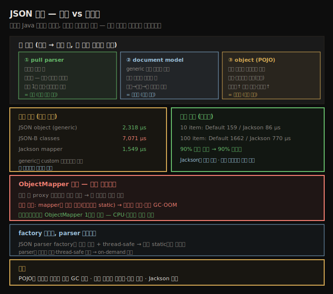

# JSON 처리 — 파싱 vs 마샬링과 객체 모델
> JSON을 Java 객체로 만들면 마샬링, 읽으며 처리하면 파싱이고, 직접 파싱은 필터링·메모리 이득을 주며 Jackson이 가장 빠릅니다

서버에서 데이터가 전송되는 방식을 봤으니, 데이터 자체를 다룹니다. 이 노트는 주로 **JSON 처리**를 봅니다(오래된 Java는 XML을 자주 쓰는데, JSON과 XML의 처리 트레이드오프는 거의 동일합니다). Apache Avro·Google protocol buffers 같은 새 형식도 있습니다.

이 노트의 예제는 eBay REST 서비스가 키워드에 맞는 판매 item 100개를 반환한 JSON에 기반합니다(`findItemsByKeywordsResponse` → `searchResult` → `item` 배열에 `itemId`·`title` 등).





## 1. 파싱 vs 마샬링 — 세 기법
> 출력이 Java 객체면 마샬링, 읽으며 처리하면 파싱이며, pull parser·document·object 세 기법은 기능 차이가 성능보다 중요합니다

JSON 문자열을 Java가 처리하기 좋은 데이터로 바꾸는 건 맥락·출력에 따라 **마샬링** 또는 **파싱**이라 합니다. 출력이 Java 객체면 **marshaling**, 읽으며 처리하면 **parsing**입니다. 역방향(다른 데이터에서 JSON 문자열 생성)은 **unmarshaling**입니다. 세 일반 기법이 있습니다.

1. **pull parser** — 입력 데이터가 파서에 연결되고, 프로그램이 파서에서 토큰을 당겨(pull) 옵니다.
2. **document model** — 입력이 document 스타일 객체로 변환돼, 애플리케이션이 데이터를 찾으며 walk through합니다. 인터페이스가 generic document 객체 단위입니다.
3. **object representation** — 입력이 데이터 구조를 반영한 미리 정의된 클래스로 하나 이상의 Java 객체(POJO)로 변환됩니다.

대략 빠른 → 느린 순이지만, **기능 차이가 성능 차이보다 중요**합니다. 파서는 단순 스캔만 할 수 있어 랜덤 순서나 두 번 이상 접근할 데이터엔 부적합합니다 — 그런 경우 파서만 쓰면 내부 데이터 구조를 직접 만들어야 합니다. 반면 document·object 모델은 이미 구조화된 데이터를 줘 보통 더 쉽습니다.

이것이 파서와 데이터 마샬러의 진짜 차이입니다 — 목록의 첫째(pull parser)는 **파서**로, 파서가 주는 대로 애플리케이션 로직이 데이터를 다룹니다. 다음 둘은 **데이터 마샬러**로, 파서를 써 데이터를 처리하되 복잡한 프로그램이 로직에 쓸 데이터 표현을 제공합니다. 그래서 기법 선택은 **애플리케이션을 어떻게 작성해야 하는지**가 정합니다.

1. 데이터를 한 번 단순 통과하면 → 가장 빠른 파서로 충분. 단순 앱 정의 구조에 저장할 때도 파서 직접 사용이 적합(예: item 가격을 `ArrayList`에).
2. 데이터 **형식이 중요**하면 → document model. 형식을 보존해야 하면 읽어서 수정하고 새 스트림에 쓰기가 쉽습니다.
3. **궁극의 유연성**이면 → object model. 데이터를 객체·속성이라는 익숙한 용어로 다룹니다. 마샬링 복잡함이 (대부분) 개발자에게 투명하고 약간 느릴 수 있지만, 코드 생산성 향상이 그 문제를 상쇄합니다.


## 2. JSON 객체 — generic vs JSON-B와 마샬 성능
> generic JsonObject는 클래스 없이 다루고 JSON-B는 POJO로 바인딩하며, generic·Jackson mapper가 JSON-B 클래스보다 빠릅니다

JSON 데이터는 두 객체 표현이 있습니다. 첫째는 **generic** 단순 JSON 객체 — `JsonObject`·`JsonArray` 등 generic 인터페이스로 다루며, 데이터의 특정 클래스 표현 없이 JSON 문서를 만들거나 검사합니다. 둘째는 JSON-B(JSON binding)로 JSON 데이터를 본격 Java 클래스(POJO)에 바인딩합니다(예: item 데이터를 `Item` 클래스로).

차이는 첫째가 generic이라 클래스가 안 필요하다는 것입니다. item을 나타내는 `JsonObject`에서 title은 이렇게 찾습니다.

```java
JsonObject jo;
String title = jo.getString("title");
```

JSON-B에서는 더 직관적인 getter/setter로 가능합니다.

```java
Item i;
String title = i.getTitle();
```

어느 경우든 객체는 내부 파서로 생성되므로 파서를 최적 성능으로 설정하는 게 중요합니다. 객체 구현은 객체에서 JSON 문자열을 생성(unmarshal)하기도 합니다. 그 성능입니다.

| 객체 모델 | 마샬 성능 |
|-----------|-----------|
| JSON object (generic) | 2,318 ± 51 μs |
| JSON-B classes | 7,071 ± 71 μs |
| Jackson mapper | 1,549 ± 40 μs |

단순 JSON 객체 생성이 custom Java 클래스 생성보다 상당히 빠릅니다 — 단 Java 클래스가 프로그래밍 관점에서 다루기 쉽습니다.

표의 **Jackson mapper**는 대안 접근으로, 현재 다른 용도를 거의 압도했습니다. Jackson은 표준 JSON-P 파싱 API 구현도 제공하지만, JSON 데이터를 Java 객체로 마샬/언마샬하되 JSON-B를 따르지 않는 대안 구현이 있습니다 — `ObjectMapper` 클래스 기반입니다. JSON-B 코드와 `ObjectMapper` 코드의 차이입니다.

```java
// JSON-B
Jsonb jsonb = JsonbBuilder.create();
FindItemsByKeywordsResponse f =
    jsonb.fromJson(inputStream, FindItemsByKeywordsResponse.class);

// ObjectMapper
ObjectMapper mapper = new ObjectMapper();
FindItemsByKeywordsResponse f =
    mapper.readValue(inputStream, FindItemsByKeywordsResponse.class);
```

> **ObjectMapper 함정 — 단일 인스턴스**: 성능 관점에서 `ObjectMapper`엔 함정이 있습니다. JSON을 마샬할 때 mapper가 POJO 생성에 쓸 proxy 클래스를 많이 만들어, 클래스 첫 사용이 다소 느립니다. 이를 극복하려 흔한 실수(둘째 성능 이슈)는 **mapper 객체를 많이 만드는 것**입니다(마샬하는 클래스당 static 하나). 이는 흔히 메모리 압박·과도한 GC 사이클, 심지어 OOM을 부릅니다. 애플리케이션에 **`ObjectMapper` 1개**면 충분하고, CPU·메모리 모두에 이롭습니다. 그래도 데이터의 object 모델 표현은 그 객체들에 메모리를 소비합니다.


## 3. JSON 파싱 — pull parser와 필터링
> 직접 파싱은 메모리를 아끼고 데이터를 필터링하며, 모든 JSON 파서는 pull parser로 토큰을 당겨 옵니다

JSON 데이터 직접 파싱은 두 이점이 있습니다. 첫째, JSON object 모델이 애플리케이션에 너무 메모리 집약적이면 직접 파싱·처리가 그 메모리를 아낍니다. 둘째, 다루는 JSON에 데이터가 많거나 필터링하고 싶으면 직접 파싱이 더 효율적입니다.

모든 JSON 파서는 **pull parser**로, 스트림에서 데이터를 on-demand로 가져옵니다. 기본 pull parser의 main 로직 루프입니다.

```java
parser = factory.createParser(inputStream);
int idCount = 0;
while (parser.hasNext()) {
    Event event = parser.next();
    switch (event) {
        case KEY_NAME:
            String s = parser.getString();
            if (ID.equals(s)) {
                isID = true;
            }
            break;
        case VALUE_STRING:
            if (isID) {
                if (addId(parser.getString())) {
                    idCount++;
                    return;
                }
                isID = false;
            }
            continue;
        default:
            continue;
    }
}
```

파서에서 토큰을 당겨 대부분은 버립니다. start 토큰을 만나면 item ID인지 확인하고, 맞으면 다음 character 토큰이 저장할 ID입니다. 이 테스트는 데이터를 **필터링**합니다 — JSON의 첫 10 item만 읽습니다. ID 처리 시 `addItemId()`로 저장하고, 원하는 수가 저장되면 `true`를 반환해 루프가 남은 데이터를 처리하지 않고 그냥 반환합니다.

> **factory 재사용, parser 비재사용**: JSON parser factory는 생성이 비쌉니다. 다행히 factory는 **thread-safe**해 전역 static 변수에 저장해 재사용하기 쉽습니다. 반면 실제 **파서는 재사용 불가**하고 thread-safe하지도 않아, 보통 on-demand로 생성합니다.

파서 성능입니다(10 item 후 파싱 중단 vs 전체 문서).

| 처리 item | Default parser | Jackson parser |
|-----------|----------------|----------------|
| 10 | 159 ± 2 μs | 86 ± 5 μs |
| 100 | 1,662 ± 46 μs | 770 ± 4 μs |

예상대로 90% 적은 item을 파싱하면 90% 성능 향상이 납니다. 한동안 그랬듯 **Jackson 파서가 우수**하고, 둘 다 실제 객체 읽기보다 훨씬 빠릅니다.


## 10장 요약

nonblocking I/O는 서버가 비교적 적은 스레드로 비교적 많은 연결을 다루게 해 효과적 서버 확장의 기본입니다. 전통 서버는 기본 client 연결 처리에 이를 쓰고, 새 서버 프레임워크는 nonblocking 성질을 스택 위로 다른 애플리케이션까지 확장합니다.


## 자주 받는 오해

**"마샬링과 파싱은 같은 말이다"** — 출력이 Java **객체**면 마샬링, 읽으며 **처리**하면 파싱입니다. 역방향(객체→JSON 문자열)은 unmarshaling입니다. pull parser는 파서(앱이 직접 처리), document·object 모델은 마샬러(구조 제공)입니다.

**"object 모델이 항상 낫다"** — 다루기 쉽지만 generic JSON object(2,318μs)보다 JSON-B 클래스(7,071μs)가 느리고, 크면 GC 이슈가 생깁니다. 한 번 단순 통과나 필터링이면 직접 파싱이 메모리·성능에 유리합니다. 형식 보존이면 document, 유연성이면 object를 고릅니다.

**"ObjectMapper는 클래스당 하나씩 만드는 게 좋다"** — 흔한 실수입니다. mapper가 proxy 클래스를 많이 만들어, 여러 mapper는 메모리 압박·과도한 GC·OOM을 부릅니다. 애플리케이션에 **1개**면 충분하고 CPU·메모리 모두에 이롭습니다.

**"JSON parser factory와 parser 모두 재사용한다"** — factory만 재사용합니다(thread-safe → 전역 static). parser는 재사용 불가하고 thread-safe하지 않아 on-demand로 생성합니다.


## 면접에서 받을 만한 질문

**Q. JSON 처리 세 기법을 어떻게 고르나요?**
한 번 단순 통과면 가장 빠른 **pull parser**(필터링·성능 이득), 데이터 형식 보존이 중요하면 **document model**(읽기→수정→쓰기), 객체·속성으로 다루는 유연성이면 **object model(POJO)**입니다. 빠른 순서지만 기능 차이가 성능보다 중요합니다 — 파서는 스캔만 하고, 마샬러는 구조를 제공합니다.

**Q. ObjectMapper의 성능 함정은?**
첫 사용 시 POJO 생성용 proxy 클래스를 많이 만들어 다소 느립니다. 이를 피하려 mapper를 클래스당 여러 개 만드는 게 흔한 실수인데, 메모리 압박·과도한 GC·OOM을 부릅니다. 애플리케이션에 `ObjectMapper` **1개**면 충분하고 CPU·메모리 모두에 이롭습니다.

**Q. 직접 파싱이 객체 모델보다 나은 경우는?**
JSON이 너무 커서 object 모델이 메모리 집약적이거나, 데이터가 많아 필터링하고 싶을 때입니다. pull parser로 첫 10 item만 읽고 반환하면 90% 적게 파싱해 90% 빨라집니다. factory는 thread-safe라 전역 static으로 재사용하고, parser는 on-demand로 만듭니다. Jackson 파서가 가장 빠릅니다.


## 관련 문서

- [`10-02.비동기 outbound 호출 — HTTP client와 DB`](./10-02.비동기%20outbound%20호출%20—%20HTTP%20client와%20DB.md) — 데이터를 전송하는 메커니즘
- [`07-04.객체 재사용 — object pool·thread-local과 GC 비용`](./07-04.객체%20재사용%20—%20object%20pool·thread-local과%20GC%20비용.md) — ObjectMapper 단일 인스턴스와 객체 재사용
- [상위 인덱스](./README.md)
