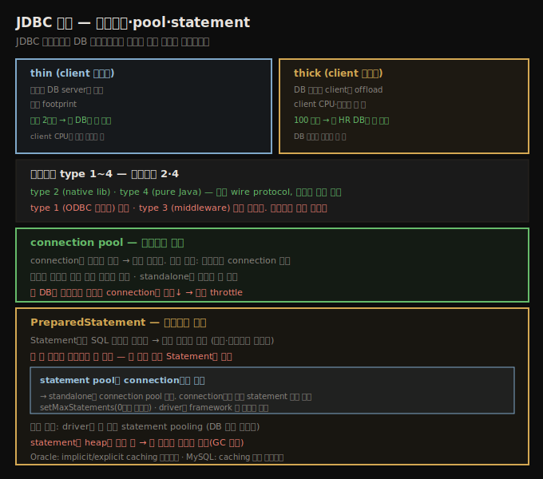

# JDBC 기초 — 드라이버·connection pool·prepared statement
> JDBC 드라이버가 DB 애플리케이션 성능의 가장 중요한 요인이고, connection과 prepared statement는 재사용해야 합니다

이 장은 Java 기반 DB 애플리케이션 성능을 봅니다. DB에 접근하는 애플리케이션은 Java 외 성능 문제에 종속됩니다 — DB가 I/O-bound이거나 인덱스 누락으로 full table scan을 하는 SQL을 실행하면, 어떤 Java 튜닝·코딩도 문제를 못 풉니다. DB 기술을 다룰 때는 (다른 자료로) DB를 튜닝·프로그래밍하는 법을 배울 준비를 해야 합니다.

그렇다고 DB 애플리케이션 성능이 JVM·Java 기술의 통제 아래 있는 것에 둔감하다는 건 아닙니다 — 좋은 성능을 위해 DB와 애플리케이션 **둘 다** 올바로 튜닝하고 최선의 코드를 실행해야 합니다. 이 장은 JDBC 드라이버로 시작합니다(관계형 DB와 대화하는 데이터 프레임워크에 영향을 줌). 많은 프레임워크가 JDBC 디테일을 추상화하는데, **JPA와 Spring data 모듈**도 그렇습니다.

> **이 노트의 관점**: 실무에서는 JDBC를 직접 쓰기보다 **JPA·Spring Data 위에서** 다루지만, 그 프레임워크가 JDBC를 내부에서 쓰므로 JDBC 성능을 이해하면 프레임워크에서 더 나은 성능을 끌어냅니다. Spring 전용 설정 상세는 11_spring SSOT를 참조하고, 이 노트는 그 아래 깔린 JDBC 원리에 집중합니다.

## 1. SQL과 NoSQL — 표준의 유무
> 관계형 DB는 SQL 표준을 따라 JDBC라는 표준 인터페이스를 갖지만, NoSQL은 표준이 없어 개념만 적용됩니다

이 장은 관계형 DB와 그에 접근하는 Java 기술에 집중합니다. 관계형 DB는 ANSI/ISO SQL 표준(SQL:2003)을 따르고, 그래서 Java 플랫폼이 표준 인터페이스를 줄 수 있습니다 — 그게 **JDBC**(그 위에 JPA)입니다.

NoSQL DB에는 대응 표준이 없어 표준 플랫폼 지원도 없습니다. (Jakarta EE 9에 NoSQL 표준 접근 명세가 포함될 전망이나 디테일은 유동적입니다.) 다만 이 장 예제가 NoSQL을 다루지 않아도 **개념은 분명히 적용됩니다** — batching·트랜잭션 경계는 NoSQL에도 관계형만큼 중요한 효과를 줍니다.

> **샘플 DB**: 이 장 예제는 256개 stock의 1년(영업일 261일) 데이터를 씁니다. `STOCKPRICE` 테이블은 (symbol, date) primary key로 **66,816행**(256 × 261), `STOCKOPTIONPRICE` 테이블은 (symbol, date, 옵션 번호) primary key로 **334,080행**(256 × 261 × 5)을 가집니다.

## 2. JDBC 드라이버 — thin/thick과 type 1~4
> 드라이버는 성능의 가장 중요한 요인이고, thin/thick·type 모두 본질적 우위 없이 환경에 달려 직접 테스트해야 합니다

JDBC 드라이버는 DB 애플리케이션 성능의 **가장 중요한 요인**입니다. DB마다 자체 드라이버가 있고, 인기 DB는 대체 드라이버도 있습니다(흔히 더 나은 성능을 명분으로). 드라이버 평가 시 고려할 점입니다.

**작업이 어디서 수행되는가 — thin vs thick.** 드라이버는 Java 애플리케이션(DB client)에서 더 많은 작업을 하거나, DB server에서 더 많이 하게 쓸 수 있습니다. Oracle의 thin/thick 드라이버가 좋은 예입니다 — **thin**은 작은 footprint로 DB server 처리에 의존하고, **thick**은 반대로 DB 작업을 client로 offload하되 client CPU·메모리를 더 씁니다. 어느 모델도 **본질적 우위는 없고** 환경에 달렸습니다 — 작은 2코어가 크고 잘 튜닝된 DB에 붙으면 client CPU가 먼저 포화돼 thin이 낫고, 100 부서가 한 HR DB에 붙으면 DB 자원을 아끼는 thick이 낫습니다. 그래서 드라이버 성능 주장은 의심해야 합니다 — 특정 환경에 맞는 드라이버를 골라 우월하게 보이기 쉽습니다. 늘 **자기 환경에서, 배포 환경을 반영해 테스트**합니다.

**드라이버 type.** 드라이버는 1~4 type이 있고, 오늘날 널리 쓰이는 건 **type 2**(native code)와 **type 4**(pure Java)입니다.

1. **type 1** — ODBC↔JDBC 브리지. ODBC로 대화해야 할 때만 쓰고, 성능이 꽤 나쁩니다.
2. **type 2** — native 라이브러리로 DB 접근. 벤더가 C 라이브러리에 들인 수년의 작업을 활용해 잘 동작하지만, 플랫폼별 native 라이브러리가 필요해 배포가 어렵습니다.
3. **type 3** — pure Java지만 middleware가 중간 번역을 하는 특정 아키텍처용. DMZ에 둬 보안을 더할 수 있고 caching 이점이 있으나, 거의 채택되지 않았습니다(서버를 middle tier에 두는 게 더 쉬움).
4. **type 4** — DB 벤더의 wire protocol을 구현한 pure Java. JAR만 classpath에 더하면 돼 배포가 쉽고, type 2와 같은 wire protocol을 써 보통 동등한 성능입니다.

type 2가 thick, type 4가 thin인 경향은 있지만 필수는 아닙니다. 어느 쪽이 나은지는 환경과 구체적 드라이버에 달려, **사전에 알 방법이 없습니다**. 선택권이 있으면 ODBC와 type 1은 피합니다.

## 3. connection pool — 스레드당 하나
> connection은 생성이 비싸 풀해 재사용하며, 스레드당 하나가 일반 규칙이지만 DB가 병목이면 풀로 throttle합니다

DB connection은 생성이 시간이 많이 들어, Java에서 재사용해야 할 또 다른 전형적 객체입니다. 대부분 서버 환경은 connection이 서버의 connection pool에서 옵니다. JPA를 쓰는 Java SE는 대부분 JPA provider가 `persistence.xml`로 설정한 pool을 투명하게 씁니다. standalone Java SE는 애플리케이션이 직접 관리해야 하는데, connection pool 라이브러리를 쓰거나 **각 스레드의 thread-local 변수에 connection을 저장**하는 게 흔히 더 쉽습니다.

풀된 객체가 차지하는 메모리와 풀링이 유발하는 추가 GC 사이의 균형이 중요합니다. 특히 다음 절의 **prepared statement cache** 때문입니다 — connection 객체 자체는 크지 않아도 statement cache(connection별로 존재)는 꽤 커질 수 있습니다. 이 균형은 **DB에도** 적용됩니다 — DB의 각 connection은 DB 자원(JDBC 드라이버가 쓰는 prepared statement마다 추가 메모리)을 요구해, 애플리케이션 서버가 너무 많은 connection을 열면 DB 성능이 나빠질 수 있습니다.

connection pool의 일반 규칙은 **애플리케이션 스레드당 connection 하나**입니다 — 서버는 스레드 풀과 같은 크기로 시작하고, standalone은 스레드 수 기준으로 잡습니다. 보통 이게 최선입니다(스레드가 connection을 기다리지 않고, DB 자원도 충분). 그러나 **DB가 병목**이면 이 규칙이 역효과입니다 — 작은 DB에 connection이 너무 많은 건 바쁜 시스템에 부하를 주입하는 또 다른 예입니다. connection pool로 작은 DB에 보내는 작업량을 **throttle**하는 게 그 상황의 개선책입니다 — 스레드가 빈 connection을 기다려도 DB가 과부하되지 않으면 전체 throughput이 최대가 됩니다.

## 4. prepared statement와 statement pooling
> PreparedStatement는 SQL 정보를 재사용해 빠르지만 connection별로 풀되며, 한 번만 쓰면 셋업이 낭비입니다

대부분 상황에서 JDBC 호출은 `Statement`보다 **`PreparedStatement`**를 써야 합니다 — DB가 실행 중인 SQL 정보를 재사용해 후속 실행에서 작업을 아끼고, 보안·파라미터 지정 이점도 있습니다. **재사용이 핵심어**입니다 — prepared statement의 첫 사용은 정보 셋업·저장 때문에 더 오래 걸립니다. 한 번만 쓰면 그 작업이 낭비라, 그 경우 일반 `Statement`가 낫습니다.

DB 호출이 몇 개뿐이면 `Statement`가 더 빨리 끝나지만, batch 프로그램조차 같은 SQL에 수백·수천 JDBC 호출을 합니다(이 장 예제는 batch로 400,896 레코드를 적재). 많은 JDBC 호출을 하는 batch와, 평생 많은 요청을 처리하는 서버는 **`PreparedStatement`**가 낫습니다(프레임워크가 자동으로 함). prepared statement의 성능 이점은 **풀될 때**(실제 `PreparedStatement` 객체가 재사용될 때) 납니다. 제대로 풀하려면 JDBC connection pool과 JDBC 드라이버 설정 둘을 고려해야 합니다.

**statement pool은 connection별로 동작합니다.** 한 스레드가 pool에서 connection을 꺼내 prepared statement를 쓰면 그 정보는 그 connection에만 유효합니다 — 둘째 connection을 쓰는 둘째 스레드는 둘째 풀 인스턴스를 만듭니다. 결국 각 connection 객체가 애플리케이션에서 쓴 모든 prepared statement의 자기 풀을 가집니다. 이것이 standalone JDBC 애플리케이션이 connection pool을 써야 하는 한 이유이고, **connection pool 크기가 (JDBC·JPA 모두에) 중요한** 이유입니다 — 특히 프로그램 초기에, 아직 특정 prepared statement를 안 쓴 connection을 쓰면 첫 요청이 조금 느립니다. 또 풀 크기는 prepared statement를 caching해 heap을 (흔히 많이) 차지하므로 중요합니다 — 재사용은 좋지만 그 재사용 객체가 차지하는 공간이 GC 시간에 악영향을 주지 않게 해야 합니다.

**statement pool 관리.** `ConnectionPoolDataSource`의 `setMaxStatements()`로 statement pooling을 켜고 끕니다(0이면 비활성). 이 인터페이스는 pooling이 어디서(JDBC 드라이버냐 애플리케이션 서버냐) 일어날지 정의하지 않고, 일부 드라이버엔 추가 설정이 필요합니다. JDBC를 직접 쓰는 Java SE는 **드라이버가 풀을 만들게 설정**하거나 **애플리케이션 코드가 직접 만들어** 관리합니다(프레임워크를 쓰면 흔히 프레임워크가 관리). 표준이 없어, 드라이버와 데이터 계층 프레임워크 둘 다 풀을 관리할 수 있는 상황을 만날 수 있는데, 그때 **하나만 설정**하는 게 중요합니다. 일반 규칙으로 **드라이버가 더 나은 statement pooling**을 합니다(DB 특화 최적화). 활성화는 드라이버 문서를 참조하되, 흔히 `maxStatements` 프로퍼티를 풀 크기로 설정하면 됩니다(Oracle은 implicit/explicit caching 프로퍼티, MySQL은 caching 활성 프로퍼티가 추가로 필요).

## 자주 받는 오해

**"성능 좋다는 JDBC 드라이버를 그냥 쓰면 된다"** — thin/thick도 type 2/4도 **본질적 우위가 없고** 환경에 달렸습니다. 작은 client+큰 DB는 thin, 100 부서+한 DB는 thick이 낫습니다. 벤더가 특정 환경에 맞는 드라이버를 골라 우월하게 보이기 쉬우니, **자기 배포 환경에서 직접 테스트**해야 합니다.

**"connection은 스레드당 하나가 항상 최선이다"** — 보통은 최선이지만 **DB가 병목**이면 역효과입니다. 작은 DB에 connection이 너무 많으면 과부하로 성능이 떨어지므로, connection pool로 작업량을 throttle해 스레드가 빈 connection을 기다리게 하는 편이 전체 throughput을 높입니다.

**"PreparedStatement는 항상 Statement보다 빠르다"** — 첫 사용은 정보 셋업 때문에 더 느립니다. **한 번만 쓰면** 그 셋업이 낭비라 일반 `Statement`가 낫습니다. 같은 SQL을 반복(batch·서버)할 때만 재사용 이점이 납니다.

**"statement pool은 전역으로 하나다"** — statement pool은 **connection별**로 동작합니다. 그래서 standalone도 connection pool이 필요하고, 초기에 특정 statement를 처음 쓰는 connection은 조금 느립니다.

## 면접에서 받을 만한 질문

**Q. thin과 thick 드라이버 중 무엇이 빠른가요?**
본질적 우위가 없고 환경에 달렸습니다. thin은 작은 footprint로 DB server에 작업을 의존해 작은 client+큰 DB에서 유리하고(client CPU가 먼저 포화), thick은 DB 작업을 client로 offload해 100 부서가 한 HR DB에 붙는 등 DB 자원을 아껴야 할 때 유리합니다. type 2/4도 같은 wire protocol이라 우위가 없으니, 자기 배포 환경에서 직접 테스트합니다.

**Q. connection pool 크기는 어떻게 정하나요?**
일반 규칙은 스레드당 connection 하나입니다 — 서버는 스레드 풀과 같은 크기로 시작하고 standalone은 스레드 수 기준입니다. 단 DB가 병목이면 과도한 connection이 DB를 과부하시켜 성능이 떨어지므로, pool로 작업량을 throttle합니다. connection별 statement cache가 heap을 많이 써, GC와 DB 자원 양쪽에 악영향이 없게 균형을 잡습니다.

**Q. prepared statement는 왜 풀해야 하나요?**
첫 사용은 SQL 정보 셋업으로 느리지만, 풀해 재사용하면 DB가 그 정보를 재활용해 후속 실행이 빨라집니다. 단 statement pool은 **connection별**로 동작해, standalone은 connection pool이 필요합니다. 드라이버와 프레임워크 중 하나만 설정하되, 보통 드라이버가 DB 특화 최적화로 더 나은 pooling을 합니다. statement는 heap을 많이 써 풀 크기를 신중히 튜닝합니다.

## 관련 문서

- [`11-02.JDBC 트랜잭션 — autocommit·batch·격리 수준·락`](./11-02.JDBC%20트랜잭션%20—%20autocommit·batch·격리%20수준·락.md) — 트랜잭션 최적화
- [`07-04.객체 재사용 — object pool·thread-local과 GC 비용`](./07-04.객체%20재사용%20—%20object%20pool·thread-local과%20GC%20비용.md) — connection·statement 재사용의 GC 트레이드오프
- [`10-03.JSON 처리 — 파싱 vs 마샬링과 객체 모델`](./10-03.JSON%20처리%20—%20파싱%20vs%20마샬링과%20객체%20모델.md) — 10장 마지막
- [상위 인덱스](./README.md)
