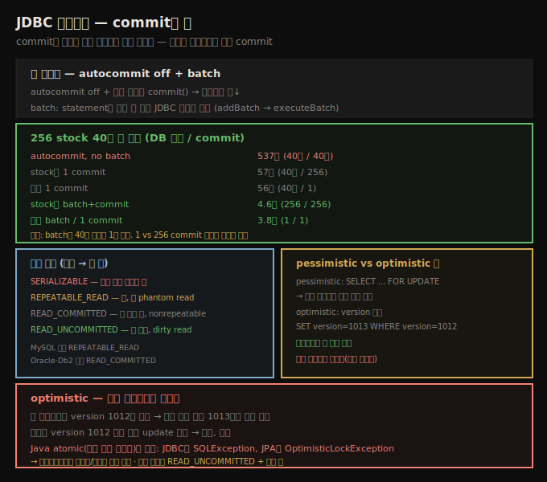

# JDBC 트랜잭션 — autocommit·batch·격리 수준·락
> 트랜잭션은 commit이 비싸고 락이 확장성을 막는 적대적 두 비용을 가지며, batch와 적절한 격리 수준이 핵심입니다

애플리케이션의 정확성 요구가 결국 트랜잭션 처리 방식을 정합니다. repeatable-read가 필요한 트랜잭션은 read-committed만 필요한 것보다 느리지만, nonrepeatable read를 못 견디는 애플리케이션엔 그 사실이 실익이 적습니다. 그러니 이 노트가 가장 덜 침습적인 격리 의미를 쓰는 법을 다뤄도, **속도 욕심이 정확성을 이기게 하지 마세요**.

DB 트랜잭션은 두 성능 페널티가 있습니다. 첫째 DB가 트랜잭션을 셋업하고 commit하는 데 시간이 듭니다(디스크 저장·로그 일관성 등). 둘째 트랜잭션 중 특정 데이터 집합에 **락**을 얻는 게 흔합니다 — 두 트랜잭션이 같은 행의 락을 다투면 확장성이 나빠집니다. Java 관점에서 이는 9장의 경쟁/비경쟁 락 논의와 정확히 유사합니다.





## 1. JDBC 트랜잭션 제어 — autocommit
> autocommit이 켜지면 각 statement가 트랜잭션이고, 끄고 끝에 명시적 commit하면 트랜잭션 수가 줄어 빨라집니다

JDBC에서 트랜잭션은 `Connection` 객체 사용 방식으로 시작·종료됩니다. 기본 JDBC 사용에서 connection은 **autocommit 모드**(`setAutoCommit()`)를 가집니다. autocommit이 켜지면(대부분 드라이버 기본) 각 statement가 자기 트랜잭션이라, commit에 아무 동작이 안 필요합니다(사실 `commit()`을 호출하면 흔히 성능이 나빠짐). autocommit을 끄면 connection 객체의 첫 호출(예: `executeQuery()`)에서 트랜잭션이 암묵적으로 시작돼 `commit()`(또는 `rollback()`)까지 이어지고, 다음 DB 호출에서 새 트랜잭션이 시작됩니다.

트랜잭션은 commit이 비싸 한 트랜잭션에 가능한 한 많은 작업을 하는 게 한 목표지만, 락을 쥐므로 가능한 한 짧아야 한다는 목표와 완전히 상충합니다. 균형이 있고, 그건 애플리케이션과 락 요구에 달렸습니다.

stock 데이터 삽입 예입니다. 유효 데이터의 각 날마다 `STOCKPRICE`에 1행, `STOCKOPTIONPRICE`에 5행을 삽입합니다.

```java
try (Connection c = DriverManager.getConnection(URL, p)) {
    try (PreparedStatement ps = c.prepareStatement(insertStockSQL);
         PreparedStatement ps2 = c.prepareStatement(insertOptionSQL)) {
        for (StockPrice sp : stockPrices) {
            String symbol = sp.getSymbol();
            ps.clearParameters();
            ps.setBigDecimal(1, sp.getClosingPrice());
        ... set other parameters ...
            ps.executeUpdate();
            for (int j = 0; j < 5; j++) {
                ps2.clearParameters();
                ps2.setBigDecimal(1,
                    sp.getClosingPrice().multiply(
                        new BigDecimal(1 + j / 100.)));
                ... set other parameters ...
                ps2.executeUpdate();
            }
        }
    }
}
```

2019년 데이터면 이 루프는 `STOCKPRICE`에 261행, `STOCKOPTIONPRICE`에 1,305행을 삽입합니다. 기본 autocommit이면 **1,566개의 별도 트랜잭션**이라 꽤 비쌉니다. autocommit을 끄고 루프 끝에 명시적 commit하면 더 빠릅니다(논리적으로도 1년치 전체 또는 무 데이터로 끝나 합리적).

```java
try (Connection c = DriverManager.getConnection(URL, p)) {
    c.setAutoCommit(false);
    try (PreparedStatement ps = c.prepareStatement(insertStockSQL);
         PreparedStatement ps2 = c.prepareStatement(insertOptionSQL)) {
        ... same code as before ....
    }
    c.commit();
}
```


## 2. batch — 한 원격 호출로 모아 전송
> batch는 statement를 모아 한 원격 JDBC 호출로 보내며, 40만 행 삽입에서 537초를 3.8초로 줄입니다

각 `executeUpdate()`는 DB로 원격 호출을 하고 락이 걸립니다. **batch**로 더 최적화할 수 있습니다 — batch하면 JDBC 드라이버가 statement를 모았다 한 원격 JDBC 호출로 전송합니다.

```java
try (Connection c = DriverManager.getConnection(URL, p)) {
    try (PreparedStatement ps = c.prepareStatement(insertStockSQL);
         PreparedStatement ps2 = c.prepareStatement(insertOptionSQL)) {
        for (StockPrice sp : stockPrices) {
            String symbol = sp.getSymbol();
            ps.clearParameters();
            ps.setBigDecimal(1, sp.getClosingPrice());
        ... set other parameters ...
            ps.addBatch();
            for (int j = 0; j < 5; j++) {
                ps2.clearParameters();
                ps2.setBigDecimal(1,
                    sp.getClosingPrice().multiply(
                        new BigDecimal(1 + j / 100.)));
                ... set other parameters ...
                ps2.addBatch();
            }
        }
    ps.executeBatch();
    ps2.executeBatch();
    }
}
```

일부 드라이버는 batch할 수 있는 statement 수에 제한이 있고 batch가 메모리를 쓰므로, 전체 끝에 commit해도 batch는 더 자주 실행해야 할 수 있습니다. 이 최적화들의 효과입니다(256 stock, 400,896 삽입).

| 프로그래밍 모드 | 소요 시간 | DB 호출 | DB commit |
|------------------|-----------|---------|-----------|
| autocommit, no batch | 537초 | 400,896 | 400,896 |
| stock당 1 commit | 57초 | 400,896 | 256 |
| 전체 1 commit | 56초 | 400,448 | 1 |
| stock당 batch+commit | 4.6초 | 256 | 256 |
| stock당 1 batch, 1 commit | 3.9초 | 256 | 1 |
| 전체 1 batch/commit | 3.8초 | 1 | 1 |

> **표가 보여 주는 두 사실**: ① 행 1→2 차이는 autocommit을 끄고 명시적 `commit()`만 한 것이고, 행 1→4 차이는 **batch만 켠 것**(autocommit은 여전히 켜짐)입니다 — batch는 한 트랜잭션이라 DB 호출과 commit이 1:1이고, 40만 호출을 없앤 게 그 인상적 속도의 원인입니다. ② 40만 vs 256 commit(행 1·2)은 한 자릿수 차이지만, **1 vs 256 commit(행 2·3, 5·6)은 무시할 만합니다** — commit이 충분히 빨라 256번이면 노이즈이고, 40만 번이면 쌓입니다.


## 3. 격리 수준 — 비싼 순서와 TRANSACTION_NONE
> 격리 수준은 SERIALIZABLE부터 READ_UNCOMMITTED까지 비싼 순이며, 데이터 무결성과 확장성을 맞바꿉니다

트랜잭션 성능의 둘째 요인은 데이터가 락되는 동안의 DB 확장성입니다. 락은 데이터 무결성을 보호하고, 한 트랜잭션을 다른 트랜잭션과 격리합니다. JDBC·JPA는 네 주요 격리 모드를 지원합니다(비싼 → 싼 순).

1. **`TRANSACTION_SERIALIZABLE`** — 가장 비쌉니다. 트랜잭션 중 접근한 모든 데이터를 락합니다(primary key·`WHERE` 절 모두). `WHERE` 절이 있으면 그 절을 만족하는 새 레코드를 추가할 수 없게 테이블을 락합니다. 매번 같은 데이터를 봅니다.
2. **`TRANSACTION_REPEATABLE_READ`** — 접근한 모든 데이터를 락하지만, 다른 트랜잭션이 새 행을 삽입할 수 있어 **phantom read**(같은 `WHERE` 쿼리 재실행 시 다른 데이터)가 생길 수 있습니다.
3. **`TRANSACTION_READ_COMMITTED`** — 트랜잭션 중 **쓴 행만** 락합니다. **nonrepeatable read**(한 시점에 읽은 데이터가 다른 시점과 다름)가 생깁니다.
4. **`TRANSACTION_READ_UNCOMMITTED`** — 가장 쌉니다. 락이 없어 한 트랜잭션이 다른 트랜잭션의 쓰인(미commit) 데이터를 읽는 **dirty read**가 생깁니다 — 첫 트랜잭션이 롤백하면 둘째는 잘못된 데이터로 동작합니다.

DB는 기본 격리 모드가 있습니다 — MySQL은 `REPEATABLE_READ`, Oracle·IBM Db2는 `READ_COMMITTED`로 시작합니다(Db2는 자기 기본을 CS라 부르고, Oracle은 `READ_UNCOMMITTED`·`REPEATABLE_READ`를 지원 안 함). JDBC statement는 DB 기본 모드를 쓰거나, `setTransactionIsolation()`으로 지정합니다(DB가 미지원이면 드라이버가 예외를 던지거나 다음 엄격 수준으로 조용히 올림).

> **TRANSACTION_NONE과 autocommit**: JDBC 명세는 다섯째 모드 `TRANSACTION_NONE`을 정의합니다. 엄밀히는 `setTransactionIsolation()`으로 지정 불가지만(트랜잭션이 있으면 none으로 못 바꿈), 일부 드라이버(특히 Db2)는 허용하거나 기본으로 둡니다. `TRANSACTION_NONE` connection의 statement는 데이터를 commit할 수 없어 read-only 쿼리여야 합니다 — 쓰면 어떤 락이 있어야 합니다(아니면 부분 쓰기를 둘째 사용자가 봄). 그래서 쓰기 작업은 실제로 (최소) `READ_UNCOMMITTED` 의미를 가집니다. `TRANSACTION_NONE` 쿼리는 commit할 수 없지만, autocommit이 켜지면 쿼리 쓰기를 허용할 수 있고 — DB가 각 쿼리를 별도 트랜잭션으로 다뤄 부분 쓰기를 안 보이게 하므로 실제로는 `READ_UNCOMMITTED` 의미입니다.


## 4. pessimistic과 optimistic 락
> FOR UPDATE는 능동 차단하는 pessimistic이고 version 컬럼은 optimistic이며, optimistic은 충돌 시 자동 재시도하지 않습니다

단순 JDBC는 위로 충분하지만, 흔히(특히 JPA에서) 한 트랜잭션 안에서 데이터별로 격리 수준을 섞고 싶습니다. 내 직원 레코드는 `REPEATABLE_READ`로 보호하되, 같은 트랜잭션이 접근하는 사무실 ID 테이블은 락할 이유가 없어 `READ_COMMITTED`(또는 더 낮게)로 둘 수 있습니다. JPA는 entity별 락 수준을 지정할 수 있어 JDBC보다 쉽지만, JDBC에서도 같은 pessimistic·optimistic 의미를 쓸 수 있습니다. JDBC 레벨의 기본 접근은 connection 격리를 `READ_UNCOMMITTED`로 두고, 락이 필요한 데이터만 명시적으로 락하는 것입니다.

```java
try (Connection c = DriverManager.getConnection(URL, p)) {
    c.setAutoCommit(false);
    c.setTransactionIsolation(TRANSACTION_READ_UNCOMMITTED);
    try (PreparedStatement ps1 = c.prepareStatement(
        "SELECT * FROM employee WHERE e_id = ? FOR UPDATE")) {
        ... process info from ps1 ...
    }
    try (PreparedStatement ps2 = c.prepareStatement(
           "SELECT * FROM office WHERE office_id = ?")) {
        ... process info from ps2 ...
    }
    c.commit();
}
```

`ps1`은 직원 데이터에 명시적 락을 겁니다 — 트랜잭션 동안 다른 트랜잭션이 그 행에 접근 못 합니다. SQL 문법은 비표준이라 벤더 문서를 봐야 하지만, 흔한 문법은 **`FOR UPDATE`** 절입니다. 이를 **pessimistic locking**이라 합니다 — 다른 트랜잭션의 접근을 능동적으로 막습니다.

**optimistic locking**으로 성능을 자주 개선할 수 있습니다 — 데이터 접근이 비경쟁이면 큰 이득이지만, 조금이라도 경쟁하면 프로그래밍이 어려워집니다. DB에서 optimistic concurrency는 **version 컬럼**으로 구현됩니다. 데이터를 select할 때 version도 함께 가져옵니다.

```sql
SELECT first_name, last_name, version FROM employee WHERE e_id = 5058;
```

이름(Scott·Oaks)과 현재 version(예: 1012)을 반환합니다. 트랜잭션 완료 시 version을 갱신합니다.

```sql
UPDATE employee SET version = 1013 WHERE e_id = 5058 AND version = 1012;
```

repeatable-read·serialization이면 데이터를 읽기만 해도 이 update를 해야 하고, read-committed면 행의 다른 데이터도 갱신될 때만 version을 갱신합니다. 두 트랜잭션이 동시에 내 레코드를 쓰면 둘 다 version 1012를 읽습니다 — 먼저 끝난 쪽만 1013으로 갱신 성공하고, 둘째는 version 1012 행이 없어 update가 실패해 **예외를 받고 롤백**됩니다.

> **Java atomic과의 차이 — 자동 재시도하지 않는다**: 이것이 DB optimistic 락과 Java atomic primitive의 큰 차이입니다. 9장의 atomic 유틸리티(CAS 기반)는 본질적으로 **무한·자동 재시도**하는 optimistic concurrency입니다. DB에서는 트랜잭션 코드가 메모리 값 증가보다 훨씬 복잡해, 실패한 optimistic 트랜잭션을 자동 재시도하면 끝없는 재시도 나선에 빠질 잠재력이 훨씬 큽니다(무엇을 재시도할지 자동 판단도 흔히 불가). 그래서 JDBC는 `commit()`에서 `SQLException`을, JPA는 `OptimisticLockException`을 받고 — **애플리케이션이** 재시도(한두 번)·다른 데이터 요청·실패 안내를 결정합니다. optimistic은 **충돌 가능성이 낮을 때** 최선입니다(공동 계좌처럼). 주식 데이터처럼 자주 갱신되는 건 optimistic 락이 역효과라, 거래량 때문에 가능하면 락을 안 쓰기도 합니다(실제 거래 갱신은 어떤 락이 필요).


## 자주 받는 오해

**"트랜잭션은 길게 잡아 commit을 적게 하는 게 항상 빠르다"** — commit이 비싸 가능한 한 많은 작업을 한 트랜잭션에 하는 게 한 목표지만, 락을 쥐므로 짧아야 한다는 목표와 상충합니다. 특히 엄격한 격리는 락을 오래 쥐는 것보다 **자주 commit하는 쪽**으로 균형을 잡습니다.

**"commit 횟수를 줄이는 게 batch보다 중요하다"** — 표에서 40만→256 commit은 한 자릿수 효과지만 **1 vs 256 commit은 무시할 만합니다**. 진짜 큰 효과는 **batch**(537→3.8초)로, 40만 DB 호출을 1로 줄이는 것입니다. batch는 autocommit이 켜져 있어도 효과가 큽니다.

**"optimistic 락은 충돌 시 자동 재시도된다"** — Java atomic(무한 자동 재시도)과 달리 DB optimistic은 충돌 시 `SQLException`/`OptimisticLockException`을 던지고 **자동 재시도하지 않습니다**. 트랜잭션 코드가 복잡해 자동 재시도가 끝없는 나선이 될 수 있어서입니다. 애플리케이션이 재시도/안내를 결정합니다.

**"optimistic 락이 항상 빠르다"** — 비경쟁이면 큰 이득이지만, 자주 갱신되는 데이터(주식)는 충돌이 빈번해 역효과입니다. 충돌 가능성이 낮을 때만 최선입니다.


## 면접에서 받을 만한 질문

**Q. 트랜잭션의 두 성능 비용은?**
첫째 commit이 비쌉니다(디스크 저장·로그 일관성). 둘째 락이 확장성을 막습니다(같은 행을 다투면 9장 경쟁 락과 유사). 둘은 적대적이라 — commit을 미루면 락을 오래 쥡니다. 특히 엄격한 격리는 자주 commit하는 쪽으로 균형을 잡습니다.

**Q. batch와 commit 중 무엇이 성능에 더 중요한가요?**
batch입니다. 256 stock 40만 행 삽입에서 autocommit+no batch는 537초인데, batch면 3.8초로 40만 DB 호출을 1로 줄입니다. commit은 충분히 빨라 1 vs 256 commit 차이는 무시할 만하지만, 40만 commit이면 쌓여 537초의 주원인이 됩니다. `addBatch()`로 모아 `executeBatch()`로 한 원격 호출에 보냅니다.

**Q. pessimistic과 optimistic 락의 차이는?**
pessimistic은 `SELECT ... FOR UPDATE`로 다른 트랜잭션 접근을 능동 차단하고, optimistic은 version 컬럼으로 `UPDATE ... WHERE version=N` 후 영향 행이 0이면 충돌로 판단합니다. optimistic은 비경쟁이면 큰 이득이지만 충돌 시 자동 재시도하지 않고 예외를 던져 애플리케이션이 처리합니다 — 충돌 가능성이 낮을 때 최선이고, 주식처럼 자주 갱신되면 역효과입니다.


## 관련 문서

- [`11-03.JDBC result set과 JPA 쓰기 최적화`](./11-03.JDBC%20result%20set과%20JPA%20쓰기%20최적화.md) — result set과 JPA batch
- [`09-03.동기화 비용 — Amdahl·register flushing·CAS`](./09-03.동기화%20비용%20—%20Amdahl·register%20flushing·CAS.md) — atomic의 CAS 무한 재시도와 대비
- [`11-01.JDBC 기초 — 드라이버·connection pool·prepared statement`](./11-01.JDBC%20기초%20—%20드라이버·connection%20pool·prepared%20statement.md) — 11장 시작
- [상위 인덱스](./README.md)
