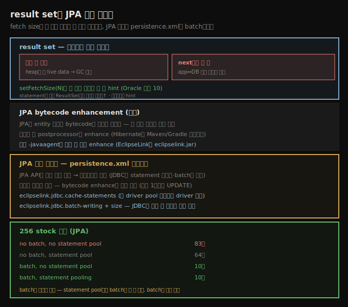

# JDBC result set과 JPA 쓰기 최적화
> fetch size로 한 번에 전송할 행 수를 조절하고, JPA 쓰기는 bytecode enhancement와 persistence.xml batch로 최적화합니다

이 노트는 JDBC result set 처리(많은 행을 어떻게 가져올지)와, JDBC의 두 핵심 최적화(prepared statement 재사용·batch)를 JPA에서 어떻게 적용하는지를 봅니다.





## 1. result set 처리 — fetch size
> result set 데이터가 어디 사느냐가 문제이며, setFetchSize로 한 번에 전송할 행 수를 hint합니다

전형적 DB 애플리케이션은 데이터 범위에 연산합니다. stock 애플리케이션은 단일 stock의 가격 이력을 한 `SELECT`로 로드합니다.

```sql
SELECT * FROM stockprice WHERE symbol = 'TPKS' AND
    pricedate >= '2019-01-01' AND pricedate <= '2019-12-31';
```

이건 261행을 반환합니다. 샘플 DB 전체(256 stock 1년)는 400,896행을 반환합니다. 이 데이터를 쓰려면 result set을 스크롤합니다.

```java
try (PreparedStatement ps = c.prepareStatement(...)) {
    try (ResultSet rs = ps.executeQuery()) {
        while (rs.next()) {
            ... read the current row ...
        }
    }
}
```

문제는 **400,896행의 데이터가 어디 사느냐**입니다. `executeQuery()`에서 전체 데이터를 반환하면 heap에 큰 live data 청크가 생겨 GC 등 문제를 일으킬 수 있습니다. 반대로 `next()`마다 한 행만 반환하면 result set 처리 중 app과 DB 사이 왕복 트래픽이 많아집니다.

정답은 없습니다 — 어떤 경우는 데이터를 DB에 두고 필요할 때 가져오는 게, 어떤 경우는 쿼리 실행 시 전부 로드하는 게 효율적입니다. 이를 제어하려 `PreparedStatement`의 **`setFetchSize()`**로 드라이버에 한 번에 전송할 행 수를 알립니다. 기본값은 드라이버마다 다릅니다 — Oracle은 10입니다. `executeQuery()`가 호출되면 DB가 10행을 반환해 드라이버가 내부 버퍼링하고, 처음 10번의 `next()`가 그 버퍼 행을 처리하며, 11번째 호출이 DB로 돌아가 또 10행을 가져옵니다.

> **fetch size 설정 다른 방법**: `setFetchSize()`는 `ResultSet` 인터페이스에도 있지만, 어느 경우든 **hint**일 뿐입니다 — 드라이버가 무시·반올림할 수 있습니다. 쿼리 실행 전(즉 statement 객체에) 설정하는 게 hint가 존중될 가능성이 높습니다. 일부 드라이버는 `getConnection()`에 프로퍼티를 넘겨 기본 fetch size를 설정할 수 있습니다. 드라이버는 보통 기본 fetch size를 꽤 작게 두는데, 대부분 합리적입니다(메모리 이슈 회피). `next()`(또는 result set 첫 getter) 성능이 가끔 느리면 fetch size 증가를 고려합니다.


## 2. JPA와 bytecode enhancement
> JPA는 entity 클래스 bytecode를 변경해 최적화하며, 컴파일 시 postprocessor나 -javaagent로 enhance해야 동작이 예측 가능합니다

JPA 성능은 그 아래 JDBC 드라이버 성능에 직접 영향받아, JDBC의 성능 고려사항 대부분이 JPA에 적용됩니다. JPA엔 추가 고려사항이 있습니다.

JPA는 **entity 클래스의 bytecode를 변경**해 많은 성능 향상을 이룹니다. 대부분 서버 프레임워크에서 이는 투명하게 일어나지만, Java SE에서는 bytecode 처리를 올바로 설정해야 합니다 — 안 그러면 JPA 성능이 예측 불가합니다(lazy로 기대한 필드가 eager 로드되거나, DB에 중복 데이터가 저장되거나, JPA 캐시에 있어야 할 데이터를 다시 fetch하는 등).

bytecode를 처리하는 JPA 정의 방식은 없습니다. 보통 **컴파일의 일부**로 합니다 — entity 클래스 컴파일 후(JAR 적재나 JVM 실행 전) 구현별 postprocessor를 통과시켜 bytecode를 "enhance"해, 원하는 최적화가 든 변경된 class 파일을 만듭니다(Hibernate는 컴파일 중 Maven/Gradle 플러그인으로). 일부 JPA 구현은 클래스가 JVM에 로드될 때 **동적으로 enhance**하는 방법도 줍니다 — JVM 안 agent가 클래스 로딩에 끼어들어 bytes를 바꿉니다. agent는 커맨드라인에 지정합니다(EclipseLink는 `-javaagent:path_to/eclipselink.jar`).


## 3. JPA 쓰기 최적화 — 필드 최소화와 batch
> 변경된 필드만 쓰기는 bytecode enhance로 추적하며, statement 재사용·batch는 persistence.xml 프로퍼티로 설정합니다

JDBC에서 두 핵심 기법(prepared statement 재사용·batch 업데이트)을 봤습니다. JPA에서도 둘 다 가능하지만 방식은 구현에 달렸고, JPA API에 직접 호출이 없습니다 — Java SE는 보통 `persistence.xml`에 특정 프로퍼티를 설정합니다.

**필드 적게 쓰기.** 흔한 쓰기 최적화는 **변경된 필드만 쓰는 것**입니다. 내 월급을 2배로 하는 HR 코드는 내 레코드에서 20필드를 가져와야 할 수 있지만, DB에 쓰는 건 (아주 중요한) 1필드뿐입니다. JPA는 이를 투명하게 해야 하고 — 이것이 JPA bytecode가 enhance돼야 하는 이유 중 하나입니다(코드의 값이 언제 바뀌는지 추적하는 과정). 제대로 enhance되면, 2배 월급을 쓰는 SQL은 그 단일 컬럼만 update합니다.

EclipseLink 참조 구현에서 statement 재사용은 다음 프로퍼티로 켭니다.

```xml
<property name="eclipselink.jdbc.cache-statements" value="true" />
```

이건 EclipseLink 구현 안의 statement 재사용을 켭니다. **JDBC 드라이버가 statement pool을 줄 수 있으면, 드라이버에서 statement caching을 켜고 이 프로퍼티는 빼는 게 보통 낫습니다.** statement batching은 다음 프로퍼티로 합니다.

```xml
<property name="eclipselink.jdbc.batch-writing" value="JDBC" />
<property name="eclipselink.jdbc.batch-writing.size" value="10000" />
```

**JDBC 드라이버는 statement batching을 자동 구현할 수 없어, 이건 모든 경우 유용한 프로퍼티**입니다. batch 크기는 두 방법으로 제어합니다 — `size` 프로퍼티를 설정하거나, 애플리케이션이 주기적으로 entity manager의 `flush()`를 호출해 batch된 statement를 즉시 실행합니다. statement 재사용·batch의 효과입니다.

| 프로그래밍 모드 | 소요 시간 |
|------------------|-----------|
| no batch, no statement pool | 83초 |
| no batch, statement pool | 64초 |
| batch, no statement pool | 10초 |
| batch, statement pooling | 10초 |

batch가 지배적 효과입니다 — statement pool만으로는 83→64초지만, batch면 10초로 떨어지고 statement pool 추가는 차이가 없습니다. **batch는 항상 설정**합니다.

> **Spring 관점**: Spring Data JPA를 쓰면 이 `persistence.xml` 프로퍼티(또는 Spring Boot의 `spring.jpa.properties.*`)가 그대로 적용됩니다. Spring Boot의 `hibernate.jdbc.batch_size` 등 구체 설정은 11_spring SSOT를 참조하고, 핵심 원리(batch가 지배적·driver statement pool 우선·변경 필드만 쓰기)는 이 노트가 SSOT입니다.


## 자주 받는 오해

**"result set은 항상 전체를 한 번에 가져온다"** — 드라이버 fetch size에 따라 다릅니다. 전체를 한 번에 가져오면 heap에 큰 live data가 생겨 GC 이슈가 나고, `next()`마다 한 행이면 왕복 트래픽이 많습니다. `setFetchSize()`로 한 번에 전송할 행 수를 hint합니다(Oracle 기본 10). statement에 걸면 `ResultSet`보다 hint가 존중될 가능성이 높습니다.

**"JPA는 설정 없이 바로 최적 동작한다"** — JPA는 entity 클래스 **bytecode enhancement**가 필요합니다. 컴파일 시 postprocessor(Hibernate Maven/Gradle 플러그인)나 `-javaagent`로 enhance하지 않으면, lazy 필드가 eager 로드되는 등 성능이 예측 불가합니다. 서버 프레임워크는 투명하게 하지만 Java SE는 직접 설정합니다.

**"JPA의 statement pool과 batch 중 batch는 부차적이다"** — batch가 지배적입니다. statement pool만으로는 83→64초지만, batch면 10초로 떨어집니다. JDBC 드라이버가 batching을 자동 못 하므로 **batch는 항상 설정**하고, statement caching은 (가능하면) JDBC 드라이버 쪽을 먼저 켭니다.


## 면접에서 받을 만한 질문

**Q. result set의 fetch size는 왜 중요한가요?**
`executeQuery()`에서 전체를 반환하면 heap에 큰 live data가 생겨 GC 이슈가 나고, `next()`마다 한 행이면 app↔DB 왕복이 많습니다. `setFetchSize(N)`으로 한 번에 전송할 행 수를 hint해 균형을 잡습니다(Oracle 기본 10). 어디까지나 hint라 드라이버가 무시할 수 있고, 쿼리 실행 전 statement에 걸면 존중될 가능성이 높습니다.

**Q. JPA bytecode enhancement는 왜 필요한가요?**
JPA는 entity 클래스 bytecode를 변경해 lazy 로딩·변경 필드 추적·중복 쓰기 방지 등을 구현합니다. 안 하면 lazy 필드가 eager 로드되는 등 성능이 예측 불가합니다. 컴파일 시 postprocessor(Hibernate 플러그인)나 로드 시 `-javaagent`(EclipseLink)로 enhance합니다. 서버 프레임워크는 투명하게 처리합니다.

**Q. JPA 쓰기를 어떻게 최적화하나요?**
변경된 필드만 쓰기(bytecode enhance로 추적), statement 재사용(`cache-statements`), batch(`batch-writing`+size)입니다. batch가 지배적이라(83→10초) 항상 설정하고, statement caching은 가능하면 JDBC 드라이버 쪽을 먼저 켭니다. `persistence.xml` 프로퍼티나 `flush()` 호출로 제어합니다.


## 관련 문서

- [`11-04.JPA 읽기 최적화 — lazy·eager·JOIN·named query`](./11-04.JPA%20읽기%20최적화%20—%20lazy·eager·JOIN·named%20query.md) — JPA 읽기 최적화
- [`11-02.JDBC 트랜잭션 — autocommit·batch·격리 수준·락`](./11-02.JDBC%20트랜잭션%20—%20autocommit·batch·격리%20수준·락.md) — JDBC batch 원리
- [`04-01.JIT 기초와 tiered compilation`](./04-01.JIT%20기초와%20tiered%20compilation.md) — warm-up 기간과 컴파일
- [상위 인덱스](./README.md)
