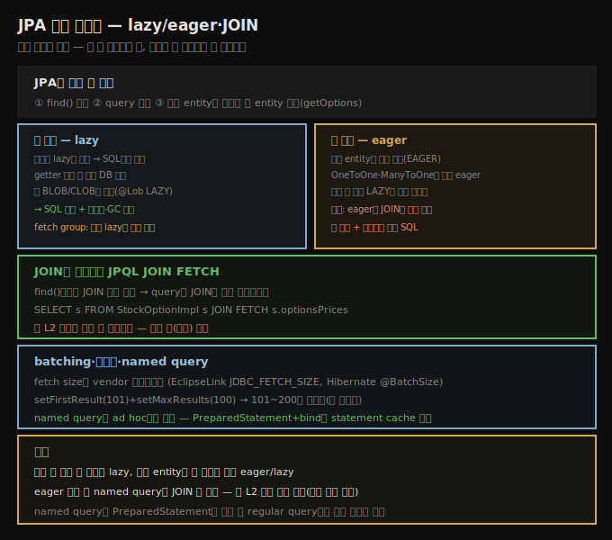

# JPA 읽기 최적화 — lazy·eager·JOIN·named query
> JPA는 안 쓸 데이터는 lazy로 덜 읽고 쓸 데이터는 eager로 더 읽되, eager는 JOIN을 안 써 JPQL JOIN FETCH가 필요합니다

JPA가 언제·어떻게 DB에서 데이터를 읽는지 최적화하는 건 보기보다 복잡합니다 — JPA가 미래 요청을 만족하려 데이터를 **캐시**하기 때문입니다. 보통 성능에 좋지만, JPA가 생성한 SQL이 겉보기엔 suboptimal로 보일 수 있다는 뜻입니다(데이터 검색이 진행 중인 특정 요청이 아니라 JPA 캐시 필요에 맞춰 최적화됨). 캐시 디테일은 다음 노트에서 보고, 여기선 기본 읽기 최적화를 봅니다.

JPA는 세 경우에 DB에서 읽습니다 — `EntityManager`의 **`find()`** 호출, **JPA 쿼리** 실행, 기존 entity의 **관계로 새 entity 탐색**(stock에서 `getOptions()`). `find()`는 가장 단순합니다 — 단일 행만 관여하고, 제어할 건 가져올 데이터 양뿐입니다(일부 필드만·전체 행·관련 entity prefetch). 이 최적화는 쿼리에도 적용됩니다. 두 방향이 있습니다 — **덜 읽기**(안 쓸 데이터)와 **더 읽기**(확실히 쓸 데이터).





## 1. 덜 읽기 — lazy와 fetch group
> 안 쓸 필드는 lazy로 표시해 SQL에서 제외하며, 큰 BLOB/CLOB에 쓰고 fetch group으로 여러 lazy를 묶습니다

덜 읽으려면 해당 필드를 **lazy로 로드**한다고 지정합니다. entity 검색 시 lazy 애너테이션 필드는 SQL에서 제외되고, 그 필드 getter가 실행되면 그 데이터를 가져오려 또 DB로 갑니다. 기본 타입의 단순 컬럼에 이 애너테이션을 쓰는 건 드물지만, entity가 큰 **BLOB·CLOB** 객체를 담으면 고려합니다.

```java
@Lob
@Column(name = "IMAGEDATA")
@Basic(fetch = FetchType.LAZY)
private byte[] imageData;
```

여기서 entity는 이진 이미지 데이터를 저장하는 테이블에 매핑됩니다. 이진 데이터가 커서 필요할 때만 로드한다고 가정합니다. 안 쓰는 데이터를 안 로드하면 두 목적을 이룹니다 — entity 검색 시 SQL이 빨라지고, 메모리를 많이 아껴 GC 압박이 줄어듭니다.

> **fetch group**: entity에 lazy 필드가 여럿이면 보통 접근될 때 하나씩 로드됩니다. lazy 필드 셋이 있고 하나가 필요하면 다 필요한 경우, 전부 한 번에 로드하는 게 낫습니다. 표준 JPA로는 불가하지만 대부분 구현이 **fetch group**으로 허용합니다 — 어떤 lazy 필드들을 그룹으로 묶어 하나가 접근되면 함께 로드하게 지정합니다. JPA 표준이 아니라 특정 구현에 묶입니다. 또 lazy 애너테이션은 결국 **hint**일 뿐이라, 구현이 그 데이터를 eager 제공하도록 요청할 수 있습니다.


## 2. 더 읽기 — eager는 JOIN을 쓰지 않는다
> 관련 entity를 eager로 함께 로드하되, eager는 JOIN이 아니라 관련마다 별도 SQL을 내므로 주의합니다

반대로 다른 데이터를 미리 로드해야 할 수도 있습니다 — 한 entity를 fetch할 때 관련 entity 데이터도 반환하는 것을 **eager fetching**이라 하고, 비슷한 애너테이션을 씁니다.

```java
@OneToMany(mappedBy="stock", fetch=FetchType.EAGER)
private Collection<StockOptionPriceImpl> optionsPrices;
```

기본적으로 관계 타입이 **`@OneToOne`·`@ManyToOne`이면 이미 eager로 fetch**됩니다(그래서 거의 안 쓰면 `FetchType.LAZY`로 반대 최적화 가능). 이것도 hint일 뿐이지만, stock 가격을 검색할 때마다 관련 옵션 가격도 검색하라는 뜻입니다.

> **주의 — eager는 JOIN을 쓰지 않습니다**: eager 관계 fetch에 대한 흔한 기대는 생성 SQL에 **JOIN**을 쓴다는 것인데, 전형적 JPA provider는 그렇지 않습니다 — 주 객체를 fetch하는 단일 SQL 쿼리를 내고, 그다음 추가 관련 객체를 fetch하는 하나 이상의 SQL을 냅니다. 단순 `find()`로는 이를 제어할 수 없어, JOIN이 필요하면 **쿼리를 써 JOIN을 직접 프로그래밍**해야 합니다.


## 3. JPQL JOIN FETCH — 한 문장으로 관련 entity까지
> JPQL은 필드를 지정할 수 없고 lazy 표시로만 제어하며, 관계는 JOIN FETCH로 한 문장에 가져옵니다

**JPQL**(JPA Query Language)은 가져올 객체의 필드를 지정할 수 없습니다. 다음 JPQL 쿼리는

```java
Query q = em.createQuery("SELECT s FROM StockPriceImpl s");
```

항상 이 SQL을 냅니다.

```sql
SELECT <enumerated list of non-LAZY fields> FROM StockPriceTable
```

생성 SQL에서 필드를 줄이려면 lazy로 표시하는 수밖에 없고, lazy 필드를 쿼리에서 fetch할 진짜 방법도 없습니다. entity 간 관계가 있으면 JPQL에서 명시적으로 join해 초기 entity와 관련 entity를 한 번에 가져옵니다.

```java
Query q = em.createQuery("SELECT s FROM StockOptionImpl s " +
             "JOIN FETCH s.optionsPrices");
```

이건 다음과 비슷한 SQL을 냅니다.

```sql
SELECT t1.<fields>, t0.<fields> FROM StockOptionPrice t0, StockPrice t1
WHERE ((t0.SYMBOL = t1.SYMBOL) AND (t0.PRICEDATE = t1.PRICEDATE))
```

> **join fetch 다른 방법**: 많은 provider가 query hint로 join fetch를 지정할 수 있습니다(EclipseLink는 `q.setQueryHint("eclipselink.join-fetch", "s.optionsPrices")`). 일부는 관계에 쓰는 `@JoinFetch` 애너테이션도 있습니다. join fetch는 관계가 eager든 lazy든 유효합니다 — lazy 관계에 join을 내면 그 lazy entity가 DB에서 검색되고, 나중에 쓰여도 추가 DB 왕복이 없습니다. join fetch가 반환하는 모든 데이터를 쓸 때 큰 성능 향상을 주지만, **L2 캐시와 예상 밖으로 상호작용**합니다 — 다음 노트의 결과를 이해하고 custom 쿼리를 쓰세요.


## 4. batching·페이징·named query
> 쿼리 fetch size는 vendor 프로퍼티로 설정하고 setFirstResult로 페이징하며, named query가 PreparedStatement를 써 더 빠릅니다

JPA 쿼리는 result set을 내는 JDBC 쿼리처럼 다뤄집니다 — 구현이 전부 한 번에, 반복하며 하나씩, 또는 몇 개씩(JDBC fetch size처럼) 가져올 수 있습니다. 표준 제어법은 없고 vendor 독자 메커니즘으로 fetch size를 설정합니다(EclipseLink는 `q.setHint("eclipselink.JDBC_FETCH_SIZE", "100000")`, Hibernate는 `@BatchSize` 애너테이션).

아주 큰 데이터 집합이면 쿼리가 반환한 리스트를 **페이징**해야 할 수 있습니다 — 웹 페이지에 데이터 일부(예: 100행)와 Next/Previous 링크를 보이는 것과 자연스럽게 연결됩니다. 쿼리에 범위를 설정해 합니다.

```java
Query q = em.createNamedQuery("selectAll");
query.setFirstResult(101);
query.setMaxResults(100);
List<? implements StockPrice>  = q.getResultList();
```

이건 둘째 페이지(101~200 항목)에 적합한 리스트를 반환합니다. 필요한 범위만 검색하는 게 200행을 가져와 앞 100을 버리는 것보다 효율적입니다.

> **named query가 빠르다**: 이 예는 ad hoc 쿼리(`createQuery()`)가 아니라 **named query**(`createNamedQuery()`)를 씁니다. 많은 JPA 구현에서 named query가 더 빠릅니다 — 구현이 거의 항상 bind 파라미터를 가진 **PreparedStatement**를 써 statement cache 풀을 활용하기 때문입니다. unnamed ad hoc 쿼리에 비슷한 로직을 막을 건 없지만 구현이 어려워, JPA 구현이 매번 새 `Statement`를 만드는 데 default할 수 있습니다.


## 자주 받는 오해

**"@Lob 같은 큰 필드도 항상 함께 로드된다"** — 자주 안 쓰는 큰 BLOB/CLOB는 **lazy**로 표시해 SQL에서 제외해야 합니다(`@Basic(fetch = FetchType.LAZY)`). getter 실행 시에만 DB로 가, entity 검색 SQL이 빨라지고 메모리·GC를 아낍니다. 단 lazy는 hint라 구현이 eager 제공할 수 있습니다.

**"eager 관계 fetch는 JOIN을 쓴다"** — 전형적 JPA provider는 **JOIN을 쓰지 않습니다**. 주 객체 쿼리 + 관련 객체마다 별도 SQL을 냅니다. JOIN이 필요하면 `find()`로는 불가하고, JPQL에 `JOIN FETCH`를 직접 써야 합니다.

**"JPQL 쿼리로 가져올 필드를 지정할 수 있다"** — JPQL은 객체 필드를 지정할 수 없습니다. 생성 SQL에서 필드를 줄이려면 **lazy로 표시**하는 수밖에 없고, lazy 필드를 쿼리에서 fetch할 방법도 없습니다.

**"named query와 ad hoc 쿼리는 성능이 같다"** — named query가 흔히 빠릅니다 — 구현이 bind 파라미터의 `PreparedStatement`를 써 statement cache를 활용합니다. ad hoc 쿼리는 구현이 매번 새 `Statement`를 만드는 데 default할 수 있습니다.


## 면접에서 받을 만한 질문

**Q. JPA에서 데이터를 덜 읽으려면?**
안 쓸 필드를 **lazy**로 표시해 SQL에서 제외합니다 — 특히 자주 안 쓰는 큰 BLOB/CLOB에 `@Basic(fetch = FetchType.LAZY)`를 씁니다. getter 실행 시에만 DB로 가, 검색 SQL이 빨라지고 메모리·GC를 아낍니다. 여러 lazy 필드를 함께 쓰면 fetch group으로 묶어 한 번에 로드합니다(vendor 기능).

**Q. eager 관계 fetch가 JOIN을 쓰지 않는다는 게 무슨 뜻인가요?**
`@OneToMany(fetch=EAGER)`로 관련 entity를 함께 로드해도, 전형적 provider는 JOIN이 아니라 주 객체 쿼리 + 관련 객체마다 별도 SQL을 냅니다(66,816 SELECT 등). 한 문장으로 JOIN하려면 `find()`로는 불가하고, JPQL `SELECT s ... JOIN FETCH s.optionsPrices`를 써야 합니다. 단 JOIN FETCH는 L2 캐시와 예상 밖으로 상호작용합니다.

**Q. named query가 왜 ad hoc 쿼리보다 빠른가요?**
JPA 구현이 named query에 거의 항상 bind 파라미터를 가진 `PreparedStatement`를 써 statement cache 풀을 활용하기 때문입니다. ad hoc 쿼리(`createQuery()`)는 구현이 매번 새 `Statement`를 만드는 데 default할 수 있습니다. 페이징은 `setFirstResult()`+`setMaxResults()`로 필요한 범위만 가져옵니다.


## 관련 문서

- [`11-05.JPA 캐시와 Spring Data`](./11-05.JPA%20캐시와%20Spring%20Data.md) — JOIN FETCH와 L2 캐시 상호작용
- [`11-03.JDBC result set과 JPA 쓰기 최적화`](./11-03.JDBC%20result%20set과%20JPA%20쓰기%20최적화.md) — bytecode enhancement
- [`07-05.indefinite reference와 compressed oops`](./07-05.indefinite%20reference와%20compressed%20oops.md) — lazy 로딩과 메모리
- [상위 인덱스](./README.md)
