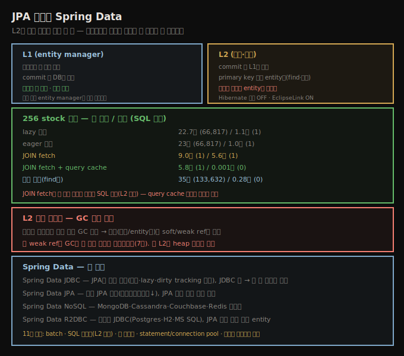

# JPA 캐시와 Spring Data
> L2 캐시는 primary key로 접근한 entity만 캐시하고 쿼리 결과는 안 담아, 장기적으로 쿼리를 피하는 게 이로울 수 있습니다

Java의 전형적 성능 use case 하나는 backend DB 데이터를 캐시하는 middle tier를 두는 것입니다. Java tier가 아키텍처상 유용한 기능(client의 직접 DB 접근 방지)을 하고, 성능 관점에서 자주 쓰는 데이터를 Java tier에 캐시하면 응답 시간이 크게 빨라집니다. JPA는 그 아키텍처를 염두에 두고 설계됐습니다.





## 1. L1과 L2 캐시 — 쿼리 결과는 L2에 안 들어간다
> 각 entity manager는 L1 캐시, commit 시 병합되는 전역은 L2이며, L2는 primary key 접근 entity만 캐시합니다

JPA에 두 종류 캐시가 있습니다. 각 entity manager 인스턴스가 자기 캐시입니다 — 트랜잭션 중 검색한 데이터를 로컬 캐시하고, 쓴 데이터도 로컬 캐시했다 commit 시에만 DB로 보냅니다. 프로그램에 여러 entity manager 인스턴스가 있을 수 있고 각자 다른 트랜잭션·자기 로컬 캐시를 가집니다(특히 Java 서버에 주입된 entity manager는 별개 인스턴스). entity manager가 트랜잭션을 commit하면 로컬 캐시의 모든 데이터가 **전역 캐시**로 병합될 수 있습니다 — 전역 캐시는 애플리케이션의 모든 entity manager가 공유하고, **L2(Level 2, second-level) 캐시**라 합니다. entity manager의 캐시는 **L1(first-level) 캐시**입니다.

entity manager 트랜잭션 캐시(L1)는 튜닝할 게 적고 모든 JPA 구현에서 켜집니다. **L2는 다릅니다** — 대부분 구현이 제공하지만 모두가 기본으로 켜진 건 아닙니다(Hibernate는 안 켜고, EclipseLink는 켬). 켜지면 L2 캐시를 튜닝·사용하는 방식이 성능에 상당히 영향을 줍니다.

> **L2의 핵심 제약**: JPA 캐시는 **primary key로 접근한 entity**에만 동작합니다 — `find()` 호출이나 관련 entity 접근(eager 로드)으로 검색된 것입니다. entity manager가 primary key나 관계 매핑으로 객체를 찾을 때 L2를 보고 있으면 반환해 DB 왕복을 아낍니다. 그러나 **쿼리로 검색한 항목은 L2에 안 담깁니다.** 일부 구현은 쿼리 결과를 캐시하는 vendor 메커니즘이 있으나, 그 결과는 **정확히 같은 쿼리**가 재실행될 때만 재사용되고, entity 자체는 L2에 저장되지 않아 후속 `find()`로 반환될 수 없습니다.


## 2. lazy·eager·JOIN과 캐시 — 표로 보는 효과
> 쿼리로 로드한 stock은 L2에 없어 매번 SQL이 들지만 관계로 로드한 옵션은 L2에 남아, 첫 실행과 후속이 크게 다릅니다

L2 캐시 때문에 같은 루프가 첫 실행과 후속(보통 더 빠른) 실행에서 다르게 동작합니다. 다음 루프로 살펴봅니다.

```java
EntityManager em = emf.createEntityManager();
Query q = em.createNamedQuery(queryName);
List<StockPrice> l = q.getResultList();        // SQL Call Site 1
for (StockPrice sp : l) {
    ... process sp ...
    if (processOptions) {
        Collection<? extends StockOptionPrice> options = sp.getOptions();  // SQL Call Site 2
        for (StockOptionPrice sop : options) {
        ... process sop ...
        }
    }
}
em.close();
```

**기본 캐싱(lazy 로딩).** `@OneToMany`는 기본 lazy입니다.

| 테스트 케이스 | 첫 실행 | 후속 실행 |
|----------------|---------|-----------|
| lazy 관계 | 22.7초 (66,817 SQL) | 1.1초 (1 SQL) |
| lazy 관계, 탐색 없음 | 2.0초 (1 SQL) | 1.0초 (1 SQL) |

첫 실행은 Call Site 1에서 named query 1개 SQL을 내고, 루프가 각 옵션 컬렉션을 방문하며 Call Site 2에서 66,816개 SELECT를 내(261일 × 256 stock) 총 66,817 호출입니다. 후속 실행은 1초인데 — named query만 실행되기 때문입니다. **관계로 검색된 옵션 entity는 L2에 남아** DB 호출이 안 필요합니다(L2는 관계·find 로드만 동작해, 쿼리로 로드된 stock 가격은 L2에 없어 다시 로드). 둘째 행(관계 미탐색, `processOptions=false`)은 훨씬 빠릅니다(첫 2초·후속 1초, 차이는 컴파일러 warm-up).

**eager 로딩.** 관계를 eager로 재정의합니다.

| 테스트 케이스 | 첫 실행 | 후속 실행 |
|----------------|---------|-----------|
| eager 관계 | 23초 (66,817 SQL) | 1.0초 (1 SQL) |
| eager 관계, 탐색 없음 | 23초 (66,817 SQL) | 1.0초 (1 SQL) |

모든 데이터를 쓰면(첫 행) eager·lazy 성능이 본질적으로 같습니다. 관계 데이터를 안 쓰면(둘째 행) lazy가 첫 실행에서 시간을 아낍니다. **SQL 수는 같지만 실행 시점이 다릅니다** — eager면 쿼리 실행(`getResultList()`) 중 result set을 즉시 처리해 모든 SQL이 Call Site 1에서 나고, lazy면 Call Site 1에서 stock 가격만 로드되고 옵션은 Call Site 2 관계 탐색 시 66,816번 로드됩니다.

**JOIN fetch.** 쿼리에 명시적 JOIN을 씁니다.

| 테스트 케이스 | 첫 실행 | 후속 실행 |
|----------------|---------|-----------|
| 기본 설정 | 22.7초 (66,817 SQL) | 1.1초 (1 SQL) |
| Join fetch | 9.0초 (1 SQL) | 5.6초 (1 SQL) |
| Join fetch + query cache | 5.8초 (1 SQL) | 0.001초 (0 SQL) |

JOIN 쿼리 첫 실행은 큰 이득입니다(9초) — SQL 66,817개 대신 1개를 내기 때문입니다. 그러나 후속도 그 1개 SQL이 필요합니다 — **쿼리 결과가 L2에 없어서**입니다. 후속이 5.6초인 건 JOIN SQL이 400,000행 넘게 검색하기 때문입니다. provider가 query caching을 구현하면 후속에 SQL이 안 필요해 1ms뿐입니다(단 query cache는 파라미터가 매번 정확히 같을 때만 동작).


## 3. 쿼리 회피와 캐시 사이징
> entity를 쿼리로 안 가져오면 모두 L2로 접근 가능해 후속이 빠르며, 캐시는 크기나 soft/weak ref로 사이징합니다

**쿼리 회피.** entity를 쿼리로 절대 검색하지 않으면, 초기 warm-up 후 모든 entity를 L2로 접근할 수 있습니다. L2를 모든 entity 로드로 warm-up합니다(앞 예를 `find()` 기반으로 수정).

| 테스트 케이스 | 첫 실행 | 후속 실행 |
|----------------|---------|-----------|
| 기본 설정 | 22.7초 (66,817 SQL) | 1.1초 (1 SQL) |
| 쿼리 없음 | 35초 (133,632 SQL) | 0.28초 (0 SQL) |

첫 실행은 133,632 SQL이 필요합니다(`find()`에 66,816 + `getOptions()`에 66,816). 그러나 후속은 모든 entity가 L2에 있어 SQL이 안 필요해 그만큼 빠릅니다.

> **warm-up 주의**: L2를 entity 반복으로 warm-up할 때, 관련 entity를 개별 반복하지 말고 **관계를 방문**해서 합니다. 샘플 DB는 (date, symbol)당 5개 옵션 가격(총 334,080개)이 있는데, 관계로 접근하면 한 번에 다 검색돼 66,816 SQL이면 됩니다 — 여러 행이 반환돼도 JPA가 entity를 캐시할 수 있습니다(쿼리 실행과 다름). 코드를 최적화할 때 캐시(특히 L2) 효과를 고려해야 합니다 — JPA가 생성한 것보다 나은 SQL을 쓸 수 있다고 생각해도, 캐시가 작용한 뒤 그 코드가 가치 있는지 확인하세요.

**캐시 사이징.** 객체 재사용이 늘 그렇듯 L2 캐시는 잠재적 단점이 있습니다 — 너무 많은 메모리를 쓰면 GC 압박을 일으킵니다. 캐시 크기를 조정하거나 entity가 캐시에 남는 모드를 제어해야 할 수 있는데, 표준 옵션이 아니라 JPA provider별로 합니다. 구현은 보통 캐시 크기를 (전역 또는 entity별로) 설정하는 옵션을 줍니다 — entity별이 더 유연하지만 각 entity 최적 크기 결정에 더 많은 작업이 듭니다. 대안은 L2에 **soft·weak 참조**를 쓰는 것입니다(EclipseLink는 5가지 캐시 타입 제공). 단 **weak 참조는 GC를 못 견뎌 캐시로 의심스럽습니다**(7장). soft/weak 기반 캐시면 성능이 heap의 다른 일에도 달려, 큰 L2 캐시가 있을 때 heap 튜닝이 좋은 성능에 중요합니다.


## 4. Spring Data — 네 모듈
> Spring Data는 JDBC·JPA·NoSQL·R2DBC 네 모듈이며, 각각 이 장의 JDBC·JPA 성능 고려가 그대로 적용됩니다

JDBC·JPA는 Java 플랫폼 표준이지만, 다른 서드파티 프레임워크도 DB 접근을 관리합니다. 가장 널리 쓰이는 **Spring Data**는 관계형·NoSQL DB의 데이터 접근 모듈 모음입니다.

1. **Spring Data JDBC** — JPA의 단순 대안. JPA와 비슷한 entity 매핑을 주되 **캐싱·lazy 로딩·dirty entity tracking이 없습니다.** 표준 JDBC 드라이버 위에 있어 넓게 지원됩니다 — 즉 이 장의 성능 측면(반복 호출에 prepared statement, batch statement 모델 지원 인터페이스 구현, autocommit 의미를 위해 connection 직접 다루기)을 Spring 코드에서 추적할 수 있습니다.
2. **Spring Data JPA** — 표준 JPA의 래퍼. 큰 이점은 보일러플레이트 코드를 줄이는 것입니다(개발 생산성엔 좋지만 여기서 논하는 성능엔 영향 적음). 표준 JPA를 감싸므로 이 장의 JPA 성능 측면(eager vs lazy 로딩, update·insert batch, L2 캐시)이 모두 적용됩니다.
3. **Spring Data for NoSQL** — MongoDB·Cassandra·Couchbase·Redis 등 커넥터. NoSQL 접근을 다소 단순화합니다(접근 기법이 같아짐, 단 셋업·초기화 차이는 남음).
4. **Spring Data R2DBC** — 10장에서 언급한, Postgres·H2·MS SQL의 **비동기 JDBC 접근**. 직접 JDBC가 아니라 전형적 Spring Data 모델을 따라 Spring Data JDBC와 비슷합니다(캐싱·lazy 로딩 등 JPA 기능 없는 단순 entity).

> **이 책의 위치**: 사용자가 실무에서 주로 쓰는 게 이 Spring Data 계층입니다. 이 책(《Java Performance》)은 그 **아래 깔린 JDBC·JPA 원리**를 SSOT로 다루고, Spring Data 모듈의 구체 설정·repository 패턴·`@Transactional` 전파 등은 11_spring SSOT가 다룹니다. 둘은 같은 주제를 계층으로 나눠 갖습니다.


## 11장 요약

JDBC·JPA의 DB 접근을 제대로 튜닝하는 게 middle-tier 애플리케이션 성능에 가장 큰 영향을 주는 방법 중 하나입니다. best practice는 — ① JDBC·JPA 설정으로 읽기·쓰기를 가능한 한 **batch**, ② 애플리케이션이 내는 **SQL 최적화**(JPA는 L2 캐시 관여 고려), ③ 가능한 한 **락 최소화**(비경쟁이면 optimistic, 경쟁이면 pessimistic), ④ **prepared statement pool** 사용, ⑤ **적절한 크기의 connection pool**, ⑥ **적절한 트랜잭션 범위**(락을 쥐는 시간으로 확장성을 해치지 않는 한 크게)입니다.


## 자주 받는 오해

**"L2 캐시는 모든 검색 결과를 캐시한다"** — L2는 **primary key 접근 entity**(`find()`·관계 로드)만 캐시합니다. **쿼리로 검색한 entity는 L2에 안 담깁니다.** 그래서 lazy 관계는 후속 실행이 빠른데(옵션이 L2에 남음), JOIN fetch는 후속도 SQL이 필요합니다(쿼리 결과가 L2 우회).

**"JOIN fetch는 항상 빠르다"** — 첫 실행은 SQL 1개로 큰 이득(66,817→1)이지만, 쿼리 결과가 L2에 없어 **후속도 그 SQL이 필요**해 5.6초가 듭니다(400,000행 검색). query cache가 있어야 후속이 1ms입니다. 그래서 JOIN fetch는 L2를 우회해 종종 역효과입니다.

**"L2 캐시에 weak 참조를 쓰면 안전하다"** — weak 참조는 **GC를 못 견뎌** 캐시로 의심스럽습니다(7장). soft 참조가 더 낫지만, soft/weak 기반이면 성능이 heap의 다른 일에 달려 heap 튜닝이 중요합니다. entity별 크기 설정이 더 유연합니다.

**"Spring Data를 쓰면 이 장 내용과 무관하다"** — Spring Data JDBC는 JDBC 위에, Spring Data JPA는 JPA 위에 있어 이 장의 성능 고려(batch·prepared statement·L2 캐시·lazy/eager)가 **그대로 적용**됩니다. Spring Data R2DBC는 비동기 접근을 더합니다.


## 면접에서 받을 만한 질문

**Q. L1과 L2 캐시의 차이는?**
L1은 각 entity manager의 트랜잭션 로컬 캐시로 튜닝할 게 적고 항상 켜집니다. L2는 commit 시 L1이 병합되는 전역 공유 캐시로, Hibernate는 기본 꺼짐·EclipseLink는 켜짐입니다. L2는 **primary key로 접근한 entity**(`find()`·관계)만 캐시하고 **쿼리 결과는 안 담습니다.**

**Q. JOIN fetch가 왜 종종 역효과인가요?**
JOIN fetch는 첫 실행에 SQL을 66,817개에서 1개로 줄여 큰 이득(22.7→9.0초)이지만, 쿼리 결과가 L2 캐시에 없어 **후속 실행도 그 SQL(400,000행 검색)이 필요**해 5.6초가 듭니다. query cache를 지원하면 후속이 1ms지만, 파라미터가 매번 같을 때만 동작합니다. lazy 관계는 옵션이 L2에 남아 후속이 1.1초입니다.

**Q. 쿼리를 피하면 어떤 이점이 있나요?**
entity를 쿼리로 안 가져오고 `find()`·관계로만 접근하면 모두 L2에 들어가, warm-up 후 후속 실행에 SQL이 0개입니다(0.28초). 첫 실행은 133,632 SQL로 느리지만, 장기적으로는 쿼리 회피가 이롭습니다. 단 L2 캐시 크기를 soft 참조나 entity별 설정으로 사이징해 GC 압박을 막아야 합니다.


## 관련 문서

- [`11-04.JPA 읽기 최적화 — lazy·eager·JOIN·named query`](./11-04.JPA%20읽기%20최적화%20—%20lazy·eager·JOIN·named%20query.md) — JOIN FETCH 작성
- [`10-02.비동기 outbound 호출 — HTTP client와 DB`](./10-02.비동기%20outbound%20호출%20—%20HTTP%20client와%20DB.md) — Spring Data R2DBC 비동기
- [`07-05.indefinite reference와 compressed oops`](./07-05.indefinite%20reference와%20compressed%20oops.md) — soft/weak 참조 캐시
- [상위 인덱스](./README.md)
