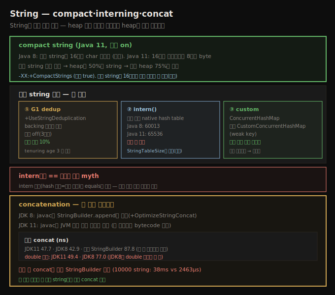

# String — compact string·interning·concatenation
> Java 11 compact string은 평균 heap을 75%로 줄이고, 중복 제거·intern으로 string 메모리를 더 아끼며, 루프 concat은 StringBuilder를 씁니다

이 장은 구현 특성이 성능에 영향을 주는 Java SE API 영역을 봅니다 — 저자가 (자기 코드에서도) 일관되게 성능 문제를 발견하는 영역들입니다. String은 (당연히) 가장 흔한 Java 객체라, string이 쓰는 메모리를 다루는 여러 방법을 봅니다. 이 기법들은 프로그램이 요구하는 heap을 상당히 줄일 수 있습니다.

> **앞 장과의 연결**: 7장(메모리 적게 쓰기)·8장(NMT)에서 "12장에서 compact string·intern을 다룬다"고 미뤘던 내용입니다. 7장의 String 해시 캐시·canonical 객체와 이어집니다.

## 1. compact string — Java 11 heap 75%
> Java 11은 16비트가 불필요하면 8비트 byte로 인코딩해 평균 string이 절반이 되고, heap의 50%가 string이라 평균 heap이 75%로 줍니다

Java 8은 인코딩과 무관하게 모든 string을 **16비트 char 배열**로 인코딩합니다. 낭비입니다 — 대부분 서양 로케일은 8비트 byte 배열로 인코딩할 수 있고, 모든 문자에 16비트가 필요한 로케일에서도 프로그램 상수 같은 string은 흔히 8비트로 인코딩됩니다.

Java 11은 16비트 char가 명시적으로 필요하지 않으면 string을 **8비트 byte 배열**로 인코딩합니다 — 이를 **compact string**이라 합니다(Java 6의 실험적 compressed string과 개념은 같으나 구현이 크게 다름). 그래서 Java 11의 평균 string 크기는 Java 8의 약 **절반**입니다. 보통 큰 절약입니다 — 평균적으로 전형적 Java heap의 50%가 string 객체일 수 있어, 같은 프로그램을 Java 11로 돌리면 heap 요구량이 Java 8의 **75%**뿐입니다.

이 효과가 극대화되는 예를 만들기 쉽습니다 — Java 8에서 GC에 엄청난 시간을 쓰는 프로그램을 같은 heap 크기로 Java 11에서 돌리면 컬렉터에 거의 시간을 안 써, 3~10배 성능 향상으로 보고될 수 있습니다. 그런 주장은 걸러 들어야 합니다 — 보통 그렇게 제약된 heap으로 Java 프로그램을 돌리지 않습니다. 잘 튜닝된 애플리케이션의 진짜 이득은 **메모리 사용**입니다 — 평균 프로그램의 최대 heap을 즉시 25% 줄여도 같은 성능을 얻거나, heap을 그대로 두면 더 많은 부하를 GC 병목 없이 넣을 수 있습니다(나머지 애플리케이션이 그 부하를 감당한다면).

`-XX:+CompactStrings`(기본 true)로 제어합니다. Java 6 compressed string과 달리 compact string은 견고하고 성능이 좋아 거의 항상 기본값을 유지하려 합니다. 한 예외는 모든 string이 16비트 인코딩이 필요한 프로그램입니다 — 그 string 연산이 compact에서 약간 더 길 수 있습니다.

## 2. 중복 string 제거 — 세 방법
> 중복 string은 G1 dedup·intern()·custom 세 방법으로 제거하며, 어느 것이든 heap 분석으로 중복량을 먼저 확인합니다

같은 문자 시퀀스를 담은 string 객체를 많이 만드는 건 흔합니다 — string은 immutable이라 기존 string을 재사용하는 게 낫습니다(7장의 canonical 객체 개념을 string에 확장). 중복 string이 많은지는 heap 분석이 필요합니다(Eclipse Memory Analyzer의 Group By Value로 `java.lang.String` 그룹화 — 예에서 Name·Memnor·Parent Name이 각 30만 개 넘는 등 총 230만 중복).

중복은 세 방법으로 제거합니다 — **G1 자동 dedup**, **`intern()`**, **custom 방법**입니다.

**string deduplication** — JVM이 중복을 찾아 모든 참조를 한 복사본으로 모으고 나머지를 해제합니다. **G1 GC + `-XX:+UseStringDeduplication`**(기본 false)일 때만 가능합니다(Java 8 update 20 이후·모든 Java 11). 기본 비활성인 세 이유 — ① G1의 young·mixed phase에 추가 처리로 약간 길어짐, ② 애플리케이션과 동시 실행되는 추가 스레드가 CPU를 가져갈 수 있음, ③ dedup된 string이 적으면 추적 bookkeeping 때문에 메모리가 오히려 늘어남. 프로덕션 활성화 전 철저한 테스트가 필요하지만, Java 엔지니어 추정 기대 이득은 **10%**입니다.

> **dedup 동작과 로그**: `-XX:+PrintStringDeduplicationStatistics`(Java 8)나 `-Xlog:gc+stringdedup*=debug`(Java 11)로 봅니다. 한 pass가 110ms 동안 62,420 후보 중 15,604 중복을 찾아 731.4K를 아낀 예입니다(약 25% 중복인데 731.4K=22.2% 절약). **backing char/byte 배열만 공유**하고 string 객체의 나머지 필드(24~32바이트 오버헤드)는 공유 안 하기 때문입니다 — 16자 동일 string 둘은 dedup 전 각 44(또는 52)바이트로 총 80바이트, dedup 후 64바이트, intern하면 40바이트뿐입니다. dedup은 young collection 후 old로 승급된 것과 **tenuring age 3**(기본)인 string을 후보로 삼습니다 — short-lived string은 dedup 안 돼(곧 버릴 걸 dedup할 CPU·메모리를 안 씀) 좋은 일입니다. `-XX:StringDeduplicationAgeThreshold=N`(기본 3)으로 바꿉니다.

## 3. string interning — 고정 크기 hash table
> intern()은 고정 크기 native hash table(Java 8 60013·Java 11 65536)을 써, 많이 intern하면 StringTableSize로 키워야 합니다

프로그래밍 레벨에서 중복을 다루는 전형적 방법이 **`intern()`**입니다. 대부분 최적화처럼 임의로 하면 안 되지만, 중복 string이 heap의 상당 부분을 차지하면 효과적입니다 — 단 흔히 특별한 튜닝이 필요합니다.

intern된 string은 **native 메모리의 특수 hash table**에 보관됩니다(string 자체는 heap). 이 native hash table은 Java의 `Hashtable`·`HashMap`과 달리 **고정 크기**입니다 — **Java 8은 60,013, Java 11은 65,536**(32비트 Windows JVM은 1,009). 즉 충돌이 시작되기 전 약 32,000개만 저장할 수 있습니다. `-XX:StringTableSize=N`(기본 1,009/60,013/65,536)으로 JVM 시작 시 설정하고, 많이 intern하면 이 수를 키워야 하며 **소수**일 때 가장 효율적입니다.

> **고정 크기 hash table**: hash table은 일정 수의 엔트리를 담는 배열(각 요소가 bucket)이고, 저장 위치는 `hashCode % numberOfBuckets`로 계산합니다. 다른 hash 값의 두 객체가 같은 bucket에 매핑될 수 있어(충돌) 각 bucket은 연결 리스트입니다. 객체가 많이 삽입될수록 충돌이 늘어 리스트가 길어지고 탐색이 느려집니다. Java `Hashtable`·`HashMap`은 동적으로 리사이즈하지만, JVM 내부 이 table은 **생성 시 크기가 고정**돼 리사이즈할 수 없습니다.

intern 성능은 string table 크기 튜닝에 좌우됩니다(100만 random string intern).

| 튜닝 | 100% hit rate | 0% hit rate |
|------|---------------|--------------|
| table size 60013 | 4.992초 | 2.759초 |
| table size 100만 | 2.446초 | 2.737초 |

100% hit rate에서 부적절한 크기의 심한 페널티에 주목하세요 — 예상 데이터에 맞게 크기를 잡으면 성능이 크게 개선됩니다. **0% hit rate는 튜닝 유무 차이가 없는데**, 이 케이스는 intern 직후 string을 버려서입니다 — 내부 string table은 키가 weak 참조처럼 동작해, string이 버려지면 table이 비웁니다(실제로 table이 차지 않고 몇 엔트리만 남음).

> **table 상태 확인**: `-XX:+PrintStringTableStatistics`(기본 false)로 JVM 종료 시 출력합니다. 100% hit rate 예는 2,002,784 intern string에 평균 bucket 33·최대 60(이상은 평균 1 미만·최대 1 근접), 0% hit rate는 2,753 엔트리에 평균 0.046·최대 3입니다. `jmap -heap`으로도 intern string 수·크기를 봅니다. table 크기를 너무 높게 잡는 페널티는 작습니다 — bucket당 8바이트라, 최적보다 몇천 개 많아도 native(heap 아님) 메모리 몇 KB의 일회성 비용입니다.

> **intern과 ==**: intern한 string은 `==`로 비교 가능해 빠를 거라 생각하지만 대부분 **myth**입니다. `String.equals()`는 꽤 빠릅니다(길이 다르면 즉시 false, 같으면 스캔). `==`가 더 빠르긴 하나 intern 비용(hash 계산=전체 스캔, `equals`가 하는 것과 같음)을 고려해야 합니다 — **같은 길이 string 집합을 많이 반복 비교**하고 둘 다 미리 intern됐을 때만 이득입니다.

> **custom interning**: string table 튜닝이 어색하니 custom hash map은 어떨까요. 일반 `ConcurrentHashMap`(100% hit 7.665초)은 내부 string table과 같은 GC 압박을 받고, JSR166의 `CustomConcurrentHashMap`(weak key, 2.743초)이 string table을 더 닮습니다. 둘 다 잘 튜닝된 string table보다 낫지는 않지만, custom map의 장점은 **크기를 미리 설정할 필요 없이 자동 리사이즈**돼 다양한 애플리케이션에 더 적응적이라는 점입니다.

## 4. string concatenation — JDK 8 vs 11
> 한 줄 concat은 JDK가 최적화하고 JDK 11은 double도 처리하지만, 루프 안 concat은 항상 StringBuilder를 명시합니다

`String answer = integerPart + "." + mantissa;` 같은 단순 concat을 Java가 특별히 최적화합니다(릴리스마다 다름). **Java 8**은 javac가 `new StringBuilder(...).append(...).toString()`으로 변환하고, JVM이 이를 특수 처리합니다(`-XX:+OptimizeStringConcat`, 기본 true). **Java 11**은 javac가 꽤 다른 bytecode를 만들어 JVM 내부 특수 메서드를 호출합니다.

이건 bytecode가 릴리스 간 중요한 드문 경우입니다 — 보통은 새 릴리스로 옮겨도 재컴파일이 불필요하지만(bytecode가 같음), 이 최적화는 실제 bytecode에 의존합니다. Java 8로 컴파일한 concat 코드를 Java 11로 돌리면 Java 11 JDK가 Java 8과 같은 최적화를 적용해 여전히 빠르지만, Java 11로 재컴파일하면 새 최적화를 써 더 빠를 수 있습니다.

| 모드 | 단일 concat | double 포함 |
|------|-------------|--------------|
| JDK 11 최적화 | 47.7 ns | 49.4 ns |
| JDK 8 최적화 | 42.9 ns | 77.0 ns |
| 수동 StringBuilder | 87.8 ns | — |

단일 concat은 JDK 8·11 차이가 작지만 둘 다 **수동 코딩보다 빠릅니다**(수동이 append 호출이 하나 적어 일을 덜 하는데도, JVM 최적화가 그 패턴을 못 잡아 느림). 다만 **double을 더하면** JDK 8(77.0ns)이 JDK 11(49.4ns)보다 50% 느립니다 — JDK 8 최적화는 string·integer에 잘 동작하나 **double(등 대부분 타입)을 못 다뤄** 특수 최적화를 건너뛰고 수동처럼 동작합니다.

여러 concat, 특히 **루프 안**에서는 두 최적화 모두 적용 안 됩니다.

| 모드 | 10 string | 1,000 string |
|------|-----------|---------------|
| JDK 11 코드 | 613 ns | 2,463 μs |
| JDK 8 코드 | 584 ns | 2,602 μs |
| StringBuilder | 412 ns | 38 μs |

루프에서는 수동 코딩이 유리합니다 — JDK 8은 매 반복 새 `StringBuilder`를 만들고, Java 11도 매 루프 string 생성 오버헤드가 쌓입니다. **결론: 한 (논리적) 줄에서 가능하면 concat을 두려워 말되, 루프 안에서는 (다음 반복에 안 쓰는 게 아니면) 절대 string concat을 쓰지 말고 항상 `StringBuilder`를 명시**합니다. 1장의 "조기 최적화=좋은 코드 작성"의 대표 예입니다.

## 자주 받는 오해

**"Java 11로 옮기면 String 코드를 재컴파일할 필요 없다"** — 대부분 bytecode가 같아 그렇지만, **string concatenation 최적화는 bytecode에 의존**합니다. Java 8로 컴파일한 코드는 Java 11에서 Java 8 최적화를 받지만(여전히 빠름), 재컴파일하면 double 등에 더 나은 최적화를 받습니다.

**"intern()으로 == 비교하면 빠르다"** — 대부분 myth입니다. `equals()`도 빠르고, intern 비용(hash 계산=전체 스캔)이 `equals`와 비슷합니다. 같은 길이 string을 많이 반복 비교하고 둘 다 미리 intern됐을 때만 이득입니다.

**"string deduplication은 25% 중복이면 25% 메모리를 아낀다"** — backing 배열만 공유하고 string 객체의 나머지 24~32바이트 오버헤드는 공유 안 해 그보다 적습니다(25% 중복에 22.2% 절약). intern하면 객체 자체가 하나라 더 아낍니다.

**"루프 안 concat도 JDK가 최적화한다"** — 한 줄 concat만 최적화하고 **루프 안에서는 적용 안 됩니다**. 매 반복 string을 새로 만들어 1,000 string에 2,463μs(StringBuilder 38μs)가 듭니다. 항상 `StringBuilder`를 명시합니다.

## 면접에서 받을 만한 질문

**Q. compact string이 무엇이고 왜 heap을 아끼나요?**
Java 8은 모든 string을 16비트 char 배열로 인코딩하는데, Java 11은 16비트가 불필요하면 8비트 byte 배열로 인코딩합니다(`-XX:+CompactStrings`, 기본 on). 평균 string이 절반이 되고, heap의 50%가 string이라 평균 heap이 75%로 줍니다. 잘 튜닝된 앱은 최대 heap을 25% 줄이거나 부하를 더 넣을 수 있습니다.

**Q. 중복 string을 제거하는 세 방법은?**
G1 dedup(`-XX:+UseStringDeduplication`, backing 배열만 공유, 기대 10%), `intern()`(고정 크기 native hash table — Java 8 60013·Java 11 65536, `StringTableSize`로 튜닝), custom(`ConcurrentHashMap`/`CustomConcurrentHashMap`, 자동 리사이즈로 적응적)입니다. intern이 객체 자체를 공유해 가장 메모리를 아끼지만 table 크기 튜닝이 필요합니다.

**Q. string concatenation은 어떻게 써야 하나요?**
한 (논리적) 줄 concat은 JDK가 최적화해(JDK 8은 string·integer, JDK 11은 double도) 수동 StringBuilder보다 빠릅니다. 그러나 **루프 안에서는 최적화가 적용 안 돼** 매 반복 string을 새로 만들므로(1,000개에 2,463μs vs StringBuilder 38μs), 루프에서는 항상 `StringBuilder`를 명시합니다(다음 반복에 안 쓰는 string이면 예외).

## 관련 문서

- [`07-03.메모리 적게 쓰기 — 객체 크기·lazy init·canonical`](./07-03.메모리%20적게%20쓰기%20—%20객체%20크기·lazy%20init·canonical.md) — canonical 객체와 String 해시 캐시
- [`12-02.Buffered IO와 classloading (CDS)`](./12-02.Buffered%20IO와%20classloading%20(CDS).md) — string encoder 버퍼링
- [`11-05.JPA 캐시와 Spring Data`](./11-05.JPA%20캐시와%20Spring%20Data.md) — 11장 마지막
- [상위 인덱스](./README.md)
