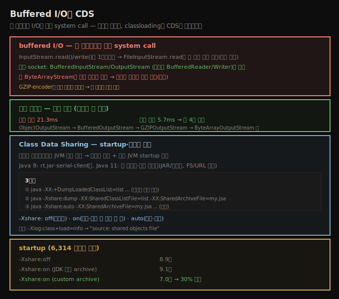

# Buffered I/O와 classloading (CDS)
> 한 바이트씩 I/O는 매번 system call이라 Buffered 스트림으로 감싸고, classloading은 CDS archive로 startup을 30% 가속합니다

이 노트는 흔한 실수인 buffered I/O와, Java 11의 classloading 가속 기능 CDS를 봅니다. 저자조차 이 책 1·2판 모두에서 buffered I/O 실수를 했다고 고백할 만큼 흔한 함정입니다.





## 1. buffered I/O — 한 바이트씩은 매번 system call
> InputStream.read()/write()는 1바이트씩 동작해 매 호출이 커널 진입이므로, Buffered 스트림으로 감싸야 합니다

`InputStream.read()`·`OutputStream.write()` 메서드는 **단일 문자**에 동작합니다. 접근하는 자원에 따라 아주 느릴 수 있습니다 — `read()`를 쓰는 `FileInputStream`은 고통스럽게 느립니다. 각 메서드 호출이 1바이트 데이터를 가져오려 **커널로 진입**하기 때문입니다. 대부분 OS는 커널이 I/O를 버퍼링해 매 호출이 디스크 읽기를 일으키지는 않지만, 그 버퍼는 커널에 있지 애플리케이션에 있지 않아, 한 번에 1바이트 읽기는 매 호출마다 비싼 system call을 합니다. 쓰기도 같습니다 — `write()`로 1바이트를 `FileOutputStream`에 보내면 system call로 커널 버퍼에 저장하고, 결국(파일 close·flush 시) 커널이 디스크에 씁니다.

**이진 데이터 파일 I/O는 항상 `BufferedInputStream`·`BufferedOutputStream`으로 기저 파일 스트림을 감쌉니다. 문자(string) 데이터는 항상 `BufferedReader`·`BufferedWriter`로 감쌉니다.** 파일 I/O로 가장 쉽게 이해되지만 거의 모든 I/O에 적용됩니다 — socket에서 얻은 스트림(`getInputStream()`·`getOutputStream()`)도 같아, socket으로 한 바이트씩 I/O는 아주 느립니다. 여기도 항상 버퍼링 필터 스트림으로 감쌉니다.


## 2. ByteArray와 GZIP — 언제 버퍼가 해가 되나
> ByteArrayStream은 이미 메모리 버퍼라 감싸면 이중 복사가 되지만, GZIP·encoder가 끼면 블록 단위가 효율적이라 버퍼가 필요합니다

`ByteArrayInputStream`·`ByteArrayOutputStream`엔 더 미묘한 이슈가 있습니다 — 이미 큰 in-memory 버퍼입니다. 버퍼링 필터로 감싸면 데이터가 **두 번 복사**됩니다(필터 버퍼로 한 번, ByteArray 버퍼로 한 번). 다른 스트림이 없으면 그 경우 버퍼링을 피해야 합니다.

다른 필터링 스트림이 끼면 버퍼링 여부가 복잡해집니다. 압축 스트림 **없이는** 이렇게 씁니다.

```java
protected void makePrices() throws IOException {
    ByteArrayOutputStream baos = new ByteArrayOutputStream();
    ObjectOutputStream oos = new ObjectOutputStream(baos);
    oos.writeObject(prices);
    oos.close();
}
```

이 경우 `baos`를 `BufferedOutputStream`으로 감싸면 데이터를 한 번 더 복사하는 페널티를 받습니다. 그러나 압축을 더하면 이렇게 쓰는 게 최선입니다.

```java
protected void makeZippedPrices() throws IOException {
    ByteArrayOutputStream baos = new ByteArrayOutputStream();
    GZIPOutputStream zip = new GZIPOutputStream(baos);
    BufferedOutputStream bos = new BufferedOutputStream(zip);
    ObjectOutputStream oos = new ObjectOutputStream(bos);
    oos.writeObject(prices);
    oos.close();
    zip.close();
}
```

이제 출력 스트림 버퍼링이 필요합니다 — **`GZIPOutputStream`은 단일 바이트보다 데이터 블록에 더 효율적**이기 때문입니다. 두 경우 모두 `ObjectOutputStream`은 다음 스트림에 단일 바이트를 보냅니다. 그 다음이 최종 목적지(`ByteArrayOutputStream`)면 버퍼링이 불필요하지만, 중간에 다른 필터링 스트림(`GZIPOutputStream`)이 있으면 흔히 필요합니다. 두 스트림 사이에 버퍼를 끼울지에 대한 일반 규칙은 없지만, 가능한 케이스는 모두 단일 바이트보다 **블록**을 받을 때 더 잘 동작합니다. 입력 스트림(`GZIPInputStream`)도 같고, 특히 **stream encoder·decoder**가 그렇습니다 — byte↔char 변환은 가능한 한 큰 데이터에 동작해야 성능이 좋습니다.

이 압축 예의 버퍼링 실수가 저자가 1판에서 한 실수입니다.

| 모드 | 시간 |
|------|------|
| 버퍼 없는 압축/해제 | 21.3 ms |
| 버퍼 있는 압축/해제 | 5.7 ms |

버퍼링 실패가 최대 **4배** 페널티를 냈습니다.


## 3. Class Data Sharing — startup·메모리 가속
> CDS는 클래스 메타데이터를 JVM 사이 공유해 메모리를 아끼고 단일 JVM startup을 개선하며, Java 11은 전 플랫폼에서 동작합니다

classloading 성능은 program startup이나 동적 시스템의 신규 코드 배포를 최적화하려는 누구에게나 골칫거리입니다 — 클래스 데이터(bytecode)가 디스크·네트워크에서 로드돼야 하고, classpath의 여러 JAR·여러 classloader에서 찾아야 합니다. 일부 프레임워크는 네트워크에서 읽은 클래스를 숨김 디렉토리에 캐시하고, 애플리케이션을 더 적은 JAR로 패키징하면 classloading이 빨라집니다.

**Class Data Sharing(CDS)**는 클래스 메타데이터를 JVM 사이에 공유하는 메커니즘입니다 — 여러 JVM 실행 시 메모리를 아끼고(보통 각 JVM이 자기 메타데이터를 가져 물리 메모리를 차지하는데, 공유하면 한 복사본만 상주), **단일 JVM의 startup 시간도 개선**합니다. Java 8(과 이전)에도 있지만 `rt.jar` 클래스 + serial collector + client JVM에만 적용돼 32비트·단일 CPU·Windows 데스크톱에만 도움됐습니다. **Java 11은 전 플랫폼에서 일반적으로 가능**하나, 클래스 메타데이터의 기본 공유 archive가 없어 즉시 동작하지는 않습니다(Java 12는 공통 JDK 클래스의 기본 archive가 있어 모든 앱이 기본 startup·메모리 이득). Java 11 CDS는 어느 classloader·JAR·모듈에서 로드되든 모든 클래스에 동작하나, **모듈·JAR 파일에서 로드된 클래스만** 됩니다(파일시스템·네트워크 URL 불가).

> **3단계**: ① `-XX:+DumpLoadedClassList=filename`으로 애플리케이션이 로드한 클래스 목록을 만듭니다. ② 그 목록으로 archive를 생성합니다.
> ```
> $ java -Xshare:dump -XX:SharedClassListFile=filename \
>     -XX:SharedArchiveFile=myclasses.jsa ... classpath arguments ...
> ```
> classpath를 실행 때와 같게 설정해야 합니다. 동적 생성 클래스(proxy·reflection)를 못 찾는 경고가 많이 나는데 정상입니다(그 클래스는 classpath에서 정상 로드, 약간 느릴 뿐). ③ archive로 실행합니다.
> ```
> $ java -Xshare:auto -XX:SharedArchiveFile=myclasses.jsa ... other args ...
> ```

`-Xshare`는 세 값 — **off**(미사용), **on**(항상, 매핑 실패 시 실행 안 됨), **auto**(시도, 기본)입니다. CDS는 archive를 메모리 영역에 매핑하는 데 의존하고 (드물게) 실패할 수 있어, 기본 auto는 실패 시 archive 없이 진행합니다. `SharedArchiveFile` 기본값은 앞서 말한 `classes.jsa` 경로입니다. **archive 생성 classpath는 실행 classpath의 부분집합이어야 하고 JAR가 바뀌면 안 됩니다** — auto에서 JAR가 바뀌면 archive를 안 쓰고 실행되는데 경고가 없어 startup만 느려지므로, `-Xshare:on`을 고려할 이유입니다. 검증은 `-Xlog:class+load=info`로 `source: shared objects file`을 봅니다.

| CDS 모드 | startup |
|----------|---------|
| `-Xshare:off` | 8.9초 |
| `-Xshare:on` (JDK 기본 archive) | 9.1초 |
| `-Xshare:on` (custom archive) | 7.0초 |

custom archive(6,314 클래스 로드)가 startup을 **30%** 아낍니다. CDS는 메모리도 아끼지만(클래스 데이터 공유), 8장에서 봤듯 native 메모리의 클래스 데이터는 heap에 비해 작아 절약 비율도 작습니다.

> **Spring 관점**: Spring Boot 앱은 클래스가 많아(수천~수만) CDS·AppCDS 이득이 큽니다. Spring Boot 3+의 AOT·native image(GraalVM)와 함께 startup 최적화의 한 축이고, 구체 설정은 별도 SSOT가 다룹니다.


## 자주 받는 오해

**"파일·socket I/O는 알아서 버퍼링된다"** — `read()`/`write()`는 1바이트씩 동작해 매 호출이 커널 진입(system call)입니다. **`BufferedInputStream`/`OutputStream`(문자는 `BufferedReader`/`Writer`)으로 직접 감싸야** 합니다. socket도 같습니다.

**"버퍼링은 항상 빠르다"** — `ByteArrayStream`은 이미 메모리 버퍼라 감싸면 데이터가 **두 번 복사**돼 오히려 느립니다. 다른 필터 없이 ByteArray만 쓰면 버퍼링을 피하고, `GZIP`·encoder가 끼면(블록 단위가 효율적) 그 사이에 버퍼를 넣습니다.

**"CDS는 여러 JVM에서만 이득이다"** — 메모리 공유에 더해 **단일 JVM의 startup도 개선**합니다(6,314 클래스에 30%). Java 11은 전 플랫폼에서 동작하고, custom archive를 만들면 애플리케이션 클래스까지 빠르게 로드합니다.

**"-Xshare:auto면 archive를 항상 쓴다"** — JAR가 바뀌면 archive를 안 쓰고 **경고 없이** 실행돼 startup만 느려집니다. 확실히 쓰려면 `-Xshare:on`을 고려합니다(매핑 실패 시 실행 안 됨).


## 면접에서 받을 만한 질문

**Q. buffered I/O는 왜 중요한가요?**
`InputStream.read()`/`write()`는 1바이트씩 동작해, `FileInputStream.read`는 매 호출이 커널 진입(system call)이라 아주 느립니다. `BufferedInputStream`/`OutputStream`(문자는 Reader/Writer)으로 감싸 블록 단위로 처리합니다. 단 `ByteArrayStream`은 이미 메모리 버퍼라 감싸면 이중 복사가 되고, `GZIP`·encoder가 끼면 블록 단위가 효율적이라 버퍼가 필요합니다(버퍼 누락 시 21.3→5.7ms, 4배 차이).

**Q. CDS는 무엇이고 어떻게 쓰나요?**
클래스 메타데이터를 JVM 사이 공유해 메모리를 아끼고 startup을 개선합니다. Java 11은 전 플랫폼·모든 클래스(JAR/모듈만)에 동작합니다. ① `-XX:+DumpLoadedClassList`로 목록 생성 → ② `-Xshare:dump`로 archive 생성 → ③ `-Xshare:auto -XX:SharedArchiveFile`로 실행입니다. custom archive가 6,314 클래스에 startup 30%를 아낍니다.

**Q. -Xshare의 off/on/auto 차이는?**
off는 미사용, on은 항상 사용(archive 매핑 실패 시 실행 안 됨), auto는 시도하되 실패 시 archive 없이 진행(기본)입니다. auto는 JAR가 바뀌면 경고 없이 archive를 안 써 startup만 느려지므로, 확실히 쓰려면 on을 고려합니다. classpath는 생성 때가 실행 때의 부분집합이어야 합니다.


## 관련 문서

- [`12-03.Random·JNI·Exceptions`](./12-03.Random·JNI·Exceptions.md) — 비싼 연산 3종
- [`04-04.GraalVM과 precompilation — AOT·native image`](./04-04.GraalVM과%20precompilation%20—%20AOT·native%20image.md) — startup 가속과 native image
- [`12-01.String — compact string·interning·concatenation`](./12-01.String%20—%20compact%20string·interning·concatenation.md) — 12장 시작
- [상위 인덱스](./README.md)
