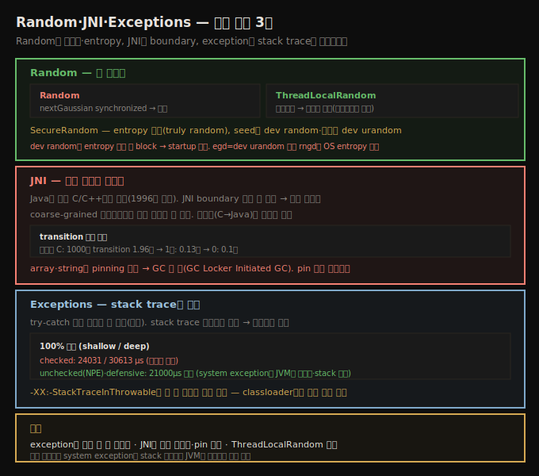

# Random·JNI·Exceptions
> Random은 동기화·entropy, JNI는 boundary 횟수, exception은 stack trace 깊이가 비용이며 모두 절제해 씁니다

이 노트는 세 가지 비싼 연산을 봅니다 — 난수 생성(동기화·entropy), JNI(boundary 횟수), exception(stack trace). 셋 다 "필요할 때만 절제해 쓰라"는 공통 교훈을 줍니다.





## 1. Random 세 클래스 — 동기화와 entropy
> Random은 nextGaussian이 synchronized라 경쟁하고, ThreadLocalRandom은 동기화가 없으며, SecureRandom은 entropy 기반이라 block할 수 있습니다

Java는 세 표준 난수 생성 클래스를 줍니다 — `java.util.Random`, `java.util.concurrent.ThreadLocalRandom`, `java.security.SecureRandom`. 중요한 성능 차이가 있습니다.

**Random vs ThreadLocalRandom** — `Random`의 주 연산(`nextGaussian()`)이 **synchronized**입니다. 난수를 가져오는 모든 메서드가 이를 써, 두 스레드가 같은 생성기를 동시에 쓰면 하나가 다른 하나를 기다려 락이 경쟁할 수 있습니다. 그래서 thread-local 버전이 있습니다 — 각 스레드가 자기 생성기를 가지면 `Random`의 동기화가 더는 이슈가 아닙니다(7장에서 봤듯 생성 비싼 객체 재사용 이점도). **SecureRandom**은 알고리즘이 다릅니다 — `Random`(과 상속받은 `ThreadLocalRandom`)은 전형적 pseudorandom 알고리즘으로, 정교하지만 결국 **결정적**입니다(초기 seed를 알면 시리즈를 알 수 있어 해커가 다음 수를 알아낼 수 있음). `SecureRandom`은 시스템 인터페이스로 seed를 얻어 **truly random 이벤트**(마우스 이동 등) 기반 데이터를 줍니다 — entropy 기반 randomness로 훨씬 안전합니다.

> **entropy와 block**: Java는 두 난수 소스를 구분합니다 — seed 생성용(공개·비공개 키 등 long-lived, 가장 강한 암호화 필요)과 난수 자체 생성용입니다. Linux는 seed에 **`/dev/random`**, 난수에 **`/dev/urandom`**을 씁니다. 둘 다 머신의 entropy(마우스·키보드 등 truly random) 기반인데, entropy는 제한적이고 무작위로 재생성됩니다 — `/dev/random`은 entropy가 충분할 때까지 **block**하고, `/dev/urandom`은 PRNG로 폴백합니다(truly random 소스로 초기화돼 보통 똑같이 강함). 그래서 seed를 많이 얻으면 오래 걸려 성능 타이밍이 어려워집니다 — `generateSeed()`는 entropy가 없으면 수초간 멈춘 듯 보일 수 있습니다.

다만 `generateSeed()`는 두 연산(미래 `nextRandom()`용 seed 획득 — 보통 한 번 또는 주기적, long-lived 키 생성 — 꽤 드묾)에만 쓰여 대부분 앱은 entropy가 안 떨어집니다. 그래도 startup에 cipher를 만드는 앱, 특히 **클라우드 환경**(host OS 난수 장치를 여러 VM·Docker가 공유)에서는 문제가 됩니다 — 타이밍 변동이 크고 startup이 느려집니다. 대응법 — ① (코드 변경 가능 시) 성능 테스트에 `Random`을 쓰되 결국 `SecureRandom`으로 부하 테스트, ② `-Djava.security.egd=file:/dev/urandom`으로 seed에도 urandom 사용, ③ `java.security`의 `securerandom.source=file:/dev/random`을 urandom으로 변경. **더 나은 해법은 OS에 entropy를 더하는 것**(`rngd` 데몬, 신뢰 가능한 하드웨어 소스 `/dev/hwrng` 사용) — 머신의 모든 프로그램에 entropy 이슈를 해결합니다.


## 2. JNI — 성능 해법이 아니다
> JNI boundary를 넘는 게 비싸 호출을 최소화하며, array·string은 pinning이 GC를 막으므로 pin 구간을 최단으로 합니다

초기 Java 성능 팁은 "정말 빠른 코드는 native를 쓰라"고 했지만, 사실 **가장 빠른 코드를 원하면 JNI(Java Native Interface)를 피해야** 합니다. 잘 작성된 Java 코드는 현재 JVM에서 적어도 C/C++만큼 빠릅니다(1996년이 아닙니다). 애플리케이션이 이미 Java로 작성됐다면, 성능 이유로 native를 호출하는 건 거의 항상 나쁜 생각입니다.

그래도 JNI는 때로 유용합니다 — OS 특화 함수 접근이나 상용 native 라이브러리 활용입니다. 가장 효율적인 JNI 코드의 답은 **Java→C 호출을 최대한 줄이는 것**입니다. JNI boundary를 넘는(cross-language 호출) 게 비쌉니다. 기존 C 라이브러리 호출에 glue 코드가 필요하니, 그 glue로 **coarse-grained 인터페이스**를 만들어 C 라이브러리 호출 여러 개를 한 번에 합니다. 흥미롭게 역방향(C→Java)은 큰 페널티가 없습니다.

```java
@Benchmark
public void testJavaCC(Blackhole bh) {
    long l = 0;
    for (int i = 0; i < nTrials; i++) {
        long a = calcCC(nValues);
        l += 50 - a;
    }
    bh.consume(l);
}

private native long calcCC(int nValues);
```

10,000 trial·10,000 value의 다양한 조합 성능입니다.

| Calc | Random | JNI transition | 전체 시간 |
|------|--------|-----------------|-----------|
| Java | Java | 0 | 0.104초 |
| Java | C | 10,000,000 | 1.96초 |
| C | C | 10,000 | 0.132초 |
| C | C | 0 | 0.139초 |

가장 안쪽 메서드만 C로 하면 boundary 교차가 가장 많고(trial × loop = 1천만) 1.96초인데, 교차를 trial(1만)로 줄이면 오버헤드가 크게 줄고, 0으로 줄이면 최선(0.1초)입니다.

> **array·string pinning**: 파라미터가 단순 primitive가 아니면 JNI가 더 나빠집니다. 단순 참조는 주소 변환이 필요하고, **array 데이터는 native 코드에서 특수 처리**됩니다(`String`도 string 데이터가 char 배열이라 포함 — JDK 8은 UTF-16→UTF-8 변환). 개별 요소 접근에 객체를 메모리에 **pin**하는 특수 호출이 필요하고, 다 쓰면 명시적으로 release해야 합니다. **pin된 동안 GC가 못 돌아**, 가장 비싼 JNI 실수는 long-running 코드에서 string·array를 pin하는 것입니다 — GC를 막아 모든 애플리케이션 스레드를 block합니다. GC 로그의 `GC Locker Initiated GC`가 그 신호입니다(스레드가 JNI에서 데이터를 pin해 GC가 필요했는데 못 함). 자주 보이면 JNI를 빠르게 만들고, **pin 구간을 최단**으로 합니다. boundary 교차를 줄이는 목표와 충돌하면 후자(교차 줄이기)가 더 중요하지만, array·string pin 구간은 최단으로 합니다.


## 3. Exceptions — stack trace가 비용
> try-catch 자체는 안 비싸고 stack trace 채우기가 비싸 깊을수록 비싸며, system exception은 JVM이 재사용해 거의 공짜입니다

Java 예외 처리는 비싸다는 평판이 있습니다. 일반 제어 흐름보다 다소 비싸지만, 대부분 우회하려는 노력만큼 가치 없습니다. 그래도 공짜가 아니니 일반 메커니즘으로 쓰면 안 됩니다 — **예상 못 한 일이 일어났음을 알릴 때만** 예외를 던지는 좋은 설계 원칙을 따르면 예외 처리에 안 느려집니다.

두 가지가 예외 성능에 영향을 줍니다. 첫째 코드 블록 자체 — **try-catch 셋업은 (오래전엔 그랬을지 몰라도) 수년째 비싸지 않습니다**(인터넷의 오래된 기억 때문에 try-catch 회피 권고를 보지만 구식입니다). 둘째 예외는 **그 지점의 stack trace를 얻는데**, 이 연산이 비쌀 수 있습니다 — 특히 stack이 깊으면.

세 구현(checked·unchecked·defensive)을 100,000 반복, pctError 1(매 호출 예외)로 비교합니다 — shallow(stack에 3 클래스)와 deep(100 클래스)입니다.

| 메서드 | shallow | deep |
|--------|---------|------|
| checked exception | 24031 μs | 30613 μs |
| unchecked exception | 21181 μs | 21550 μs |
| defensive programming | 21088 μs | 21262 μs |

세 가지 흥미로운 점 — ① **checked exception은 shallow와 deep 차이가 큽니다**(stack trace 구성이 stack 깊이에 의존). ② **unchecked exception**(JVM이 null 역참조 시 생성)은 깊이 무관합니다 — 컴파일러가 system 생성 예외를 최적화해 **같은 예외 객체를 재사용**하기 때문입니다(call stack을 안 담아 `printStackTrace()`가 출력 없음, 충분한 warm-up 후에야 발생). ③ **예외를 안 던지는 defensive**가 unchecked와 거의 같습니다(이 실험의 control) — 차이는 예외 생성·던지기·잡기 시간뿐이라 100,000 호출 평균에 거의 안 잡힙니다(최악 케이스인데도).

그래서 예외의 성능 페널티는 예상보다 작고, 같은 system 예외 다수의 페널티는 거의 없습니다. 그래도 너무 많은 예외를 만드는 코드면, 페널티가 stack trace 채우기에서 오므로 `-XX:-StackTraceInThrowable`(기본 true)로 stack trace 생성을 끌 수 있습니다 — 단 좀처럼 좋은 생각이 아닙니다(분석 능력 상실, stack trace를 검사해 복구하는 코드를 미스터리하게 깨뜨림).

> **JDK의 예외 남용 사례**: 여러 collection이 없는 항목 조회 시 예외를 던집니다(`Stack.pop()`은 빈 stack에 `EmptyStackException`) — 보통 길이를 먼저 검사하는 defensive가 낫습니다. JDK에서 가장 악명 높은 건 **classloading**입니다 — `ClassLoader.loadClass()`는 못 찾는 클래스에 `ClassNotFoundException`을 던지는데, 이는 예외적 조건이 아닙니다(개별 classloader가 모든 클래스를 알 필요 없어 계층이 있음). 수십 classloader 환경에서 계층을 뒤지며 많은 예외가 생겨, 30,000+ 클래스를 수백 JAR에서 로드하는 대형 앱 서버에서 stack trace 생성을 끄면 start time이 **3%**까지 빨라집니다.


## 자주 받는 오해

**"성능엔 ThreadLocalRandom보다 SecureRandom이 낫다"** — 보안엔 `SecureRandom`(entropy 기반)이 낫지만 **느리고 block**할 수 있습니다. 멀티스레드 성능엔 `ThreadLocalRandom`(동기화 없음)이 낫습니다. `SecureRandom`은 startup cipher·클라우드에서 entropy 부족으로 멈출 수 있어, `rngd`로 OS entropy를 더하는 게 최선입니다.

**"native 코드가 Java보다 빠르니 JNI를 쓰자"** — Java가 보통 C/C++만큼 빠릅니다(1996년 아님). 이미 Java면 JNI는 거의 항상 나쁜 생각이고, boundary 교차가 비쌉니다(1천만 교차 1.96초 vs 0 교차 0.1초). 써야 하면 coarse-grained로 호출을 최소화합니다.

**"try-catch 블록은 비싸다"** — 구식 생각입니다. try-catch 셋업은 수년째 안 비쌉니다. 비싼 건 **stack trace 채우기**라 stack이 깊을수록 비쌉니다. 자주 생성되는 system 예외는 JVM이 객체를 재사용해 stack 없이 거의 공짜입니다.

**"예외는 항상 비싸니 피해야 한다"** — 절제해 쓰면(예상 못 한 일에만) 페널티가 작습니다. 다만 array·string을 long-running JNI에서 pin하면 GC를 막아 큰 문제이고, classloader처럼 대량 예외를 만드는 코드는 `-XX:-StackTraceInThrowable`을 고려합니다(정보 손실 주의).


## 면접에서 받을 만한 질문

**Q. Random·ThreadLocalRandom·SecureRandom의 차이는?**
`Random`은 `nextGaussian`이 synchronized라 멀티스레드에서 경쟁하고, `ThreadLocalRandom`은 스레드별이라 동기화가 없습니다(멀티스레드 선호). `SecureRandom`은 entropy 기반 truly random이라 안전하지만 느리고, seed를 `/dev/random`에서 얻어 entropy 부족 시 block합니다. 클라우드 startup이 느리면 `rngd`로 OS entropy를 더하는 게 최선입니다.

**Q. JNI를 쓸 때 성능 핵심은?**
boundary 교차가 비싸 **호출을 최소화**합니다 — 안쪽만 C로 하면 1천만 교차로 1.96초인데, coarse-grained 인터페이스로 0 교차면 0.1초입니다. array·string은 접근에 pinning이 필요하고 pin된 동안 **GC가 못 돌아**(`GC Locker Initiated GC`) 모든 스레드를 block하므로, pin 구간을 최단으로 합니다.

**Q. 예외 처리의 비용은 무엇이고 어떻게 줄이나요?**
try-catch 셋업은 안 비싸고 **stack trace 채우기**가 비쌉니다(깊을수록 비쌈 — checked deep 30613μs). system 예외(NPE 등)는 JVM이 객체를 재사용해 stack 없이 거의 공짜입니다. 예외는 예상 못 한 일에만 쓰고, classloader처럼 대량 생성 코드는 `-XX:-StackTraceInThrowable`로 끌 수 있으나(start time 3% 개선) 분석 정보를 잃습니다.


## 관련 문서

- [`12-04.Logging과 Collections`](./12-04.Logging과%20Collections.md) — API 위생
- [`09-04.동기화 회피와 false sharing`](./09-04.동기화%20회피와%20false%20sharing.md) — ThreadLocalRandom과 동기화 회피
- [`12-02.Buffered IO와 classloading (CDS)`](./12-02.Buffered%20IO와%20classloading%20(CDS).md) — classloading과 예외
- [상위 인덱스](./README.md)
