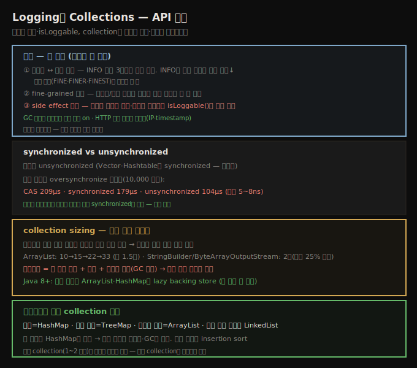

# Logging과 Collections
> 로깅은 레벨 균형·fine-grained·isLoggable()로 절제하고, collection은 알맞은 타입과 정확한 초기 크기가 핵심입니다

이 노트는 두 API 위생 주제를 봅니다 — 로깅(절제와 side effect 회피)과 collections(타입 선택·크기). 둘 다 "기본은 보수적으로, 필요한 만큼만"이라는 공통 원칙을 따릅니다.

## 1. 로깅 — 세 원칙과 GC 로그
> INFO 이상이 기본 출력이라 흐름 추적에 쓰면 성능이 나빠지고, GC 로그는 오버헤드가 낮아 항상 켭니다

로깅은 성능 엔지니어가 사랑하거나 미워하는(보통 둘 다) 것입니다 — 프로그램이 나쁘게 돌면 가장 먼저 로그를 찾지만, 잘 도는 코드의 성능 리뷰에는 모든 로깅을 끄라고 권합니다. 여러 로그가 있습니다.

**JVM 로그** — 가장 중요한 건 GC 로그(6장)입니다. 별도 파일로 보내고 JVM이 크기를 관리할 수 있습니다. **프로덕션에서도 GC 로깅(상세 포함)은 오버헤드가 낮고 문제 시 이득이 커 항상 켜야** 합니다.

**HTTP 접근 로그** — 매 요청마다 갱신돼 눈에 띄는 영향이 있습니다(끄면 성능 향상). 진단엔 별로 안 도움되지만 비즈니스 요구로 흔히 필수라 켜둬야 합니다. Apache `mod_log_config`로 무엇을 로그할지 지정하되, **요구를 충족하는 최소 정보**만 로그합니다. **모든 정보를 숫자로** 로그하는 게 좋습니다 — hostname보다 IP, string보다 timestamp(epoch 초). 변환은 시간·메모리를 써 후처리로 미룹니다.

**애플리케이션 로그 세 원칙** —

1. **데이터와 레벨의 균형** — JDK는 7 표준 레벨이 있고 기본은 3개(INFO 이상)를 출력합니다. INFO는 흔할 것 같아 흐름 추적("now task A")에 쓰기 쉬운데, 특히 heavy 스레드·확장 가능 앱에서는 그만큼 로깅이 성능에 해롭습니다. **낮은 레벨을 두려워 말고**, 최종 사용자·관리자에게 의미 없는 메시지는 기본 활성화하지 않습니다.
2. **fine-grained 로거** — 클래스당 로거는 설정이 번거롭지만 출력 제어가 좋아 가치 있습니다(작은 모듈당 공유가 타협). 프로덕션 문제, 특히 부하·성능 문제는 환경이 크게 바뀌면 재현이 까다롭습니다 — **로깅을 작은 코드 집합에만 켤 수 있어야**(처음엔 FINE 몇 개, 이후 FINER·FINEST) 성능에 영향을 안 줍니다.
3. **의도치 않은 side effect 조심** — 로깅이 비활성이어도 side effect가 있는 로깅 코드를 쓰기 쉽습니다. 로그할 정보가 **메서드 호출·문자열 결합·할당**(예: `MessageFormat` 인자용 `Object` 배열)을 포함하면 **`isLoggable()`로 먼저 검사**합니다.

> **Spring 관점**: Spring Boot는 SLF4J + Logback이 기본입니다. SLF4J의 `{}` 파라미터 플레이스홀더(`log.debug("x={}", expensive())`)는 인자가 메서드 호출이면 여전히 그 호출이 일어나므로, `if (log.isDebugEnabled())` 가드나 `Supplier` 람다 변형(`log.atDebug().addArgument(() -> expensive())`)을 씁니다. 원리(레벨 균형·fine-grained·isLoggable)는 이 노트가, 구체 SLF4J 설정은 별도 SSOT가 다룹니다.

## 2. synchronized vs unsynchronized collection
> 대부분 collection은 unsynchronized이고 Vector·Hashtable만 synchronized이며, 비경쟁 oversynchronize 페널티는 5~8ns로 작습니다

기본적으로 거의 모든 Java collection은 **unsynchronized**입니다(주요 예외는 `Hashtable`·`Vector`와 관련 클래스). 이들이 synchronized인 건 역사적입니다 — 초기 Java(1.2 이전)의 유일한 collection이었고, 당시 스레딩 이해가 부족해 thread-safe하게 만들었습니다. 그러나 초기 Java에서 동기화(비경쟁이어도)가 큰 성능 문제라, 첫 메이저 개정의 Collections Framework는 반대로 **모든 새 collection을 기본 unsynchronized**로 했습니다.

9장이 CAS vs 전통 동기화 마이크로벤치마크가 스레드 케이스에서 비실용적이라 했는데, 데이터가 **항상 단일 스레드로만 접근**되면 어떨까요 — 동기화를 전혀 안 쓰는 효과는? 경쟁을 모델링하지 않으니 이 한 상황(경쟁 불가, "oversynchronize" 페널티 측정)에서 마이크로벤치마크가 유효합니다.

| 모드 | 단일 접근 | 10,000 접근 |
|------|-----------|--------------|
| CAS 연산 | 22.1 ns | 209 μs |
| synchronized 메서드 | 20.8 ns | 179 μs |
| unsynchronized 메서드 | 15.8 ns | 104 μs |

어떤 데이터 보호든 단순 unsynchronized보다 작은 페널티가 있습니다 — 마이크로벤치마크답게 차이는 **5~8나노초**로 작습니다. 자주 실행되면 다소 눈에 띄지만 대부분 다른 영역의 비효율이 이를 압도합니다. `synchronizedList()`의 synchronized list vs unsynchronized `ArrayList` 중 무엇을 쓸까 — `ArrayList` 접근이 약간 빠르지만, **미래에 멀티스레드 가능성**이 있으면 지금 synchronized를 써 영향을 완화하는 게 낫습니다(설계 선택, future-proofing 가치는 상황에 따라).

## 3. collection sizing — 정확한 초기 크기
> 배열 백킹 collection은 리사이즈 시 복사·메모리 낭비가 생기므로 최종 크기를 추정해 지정하며, Java 8+는 lazy backing store를 씁니다

collection은 임의 수의 요소를 담고 추가 시 확장하도록 설계됐습니다 — **적절한 sizing이 전체 성능에 중요**합니다. collection은 기본 수준에서 Java primitive(숫자·객체 참조·배열)로만 데이터를 담습니다. `ArrayList`는 실제 배열(`Object[] elementData`)을, `HashMap`은 `HashMap$Entry` 배열을 가집니다. `LinkedList`처럼 배열을 안 쓰는 것도 있지만, **생성자에 초기 크기 인자가 있으면 내부 배열을 쓰는 것**이고 특별한 sizing 고려가 필요합니다.

`ArrayList`의 `elementData`는 기본 초기 크기 10으로 시작해, 11번째 삽입 시 확장합니다 — 새 배열 할당·기존 복사·새 항목 추가입니다. `ArrayList`는 **기존 크기의 약 절반을 더해** 리사이즈해 10→15→22→33으로 갑니다. 어떤 알고리즘이든 이는 **메모리 낭비**(GC 시간에 영향)와 매번 **비싼 배열 복사**를 부릅니다. 페널티 최소화를 위해 **최종 크기를 최대한 정확히 추정해** collection을 생성합니다.

> **non-collection 클래스의 확장**: 많은 non-collection도 내부 배열에 데이터를 담습니다 — `ByteArrayOutputStream`은 모든 쓰인 데이터를, `StringBuilder`·`StringBuffer`는 모든 char를 내부 char 배열에 담습니다. 대부분 리사이즈 시 **2배**로 키워, 평균 내부 배열이 현재 데이터보다 25% 큽니다. 크기 인자를 받는 생성자가 있고 최종 크기를 추정 가능하면 그 생성자를 씁니다.

> **lazy backing store**: 미사용 collection이 많은 문제 때문에, Java는 (Java 8과 Java 7 후기부터) `ArrayList`·`HashMap`을 최적화했습니다 — 크기 인자가 없으면 backing store를 **할당하지 않고, 첫 항목 추가 시** 할당합니다. 7장의 lazy 초기화 기법으로, 여러 공통 앱에서 안 쓰는 collection이 많아 GC 감소로 성능이 향상됐습니다(매 접근마다 backing store 크기를 어차피 검사해야 해 검사 페널티 없음). 마찬가지로 키가 하나면 `HashMap`은 단순 객체 참조보다 과하고, 키가 몇 개여도 객체 참조 몇 개가 full `HashMap`보다 메모리를 훨씬 덜 씁니다.

> **알고리즘에 맞는 collection**: 첫 규칙은 알고리즘에 맞는 collection을 쓰는 것입니다(Data Structures 101) — 검색은 `HashMap`, 정렬 유지는 `TreeMap`, 인덱스 접근은 `ArrayList`, 중간 삽입이 잦으면 `LinkedList`입니다. 희소 collection(1~2 요소)이 많으면 메모리를 많이 낭비하니, 크기를 지정하거나 **정말 collection이 필요한지** 따집니다(작은 배열은 quicksort보다 insertion sort가 빠릅니다 — 크기가 중요).

## 자주 받는 오해

**"INFO 레벨은 흐름 추적에 적합하다"** — INFO 이상이 기본 출력이라, heavy 스레드·확장 앱에서 INFO를 흐름 추적("now task A")에 쓰면 성능에 해롭습니다. **낮은 레벨(FINE·FINER·FINEST)을 두려워 말고**, 최종 사용자에게 의미 없는 메시지는 기본 활성화하지 않습니다.

**"로깅이 꺼져 있으면 비용이 없다"** — 로그 인자가 **메서드 호출·문자열 결합·할당**을 포함하면, 로깅이 비활성이어도 그 인자 계산이 일어납니다. **`isLoggable()`로 먼저 검사**해야 합니다(SLF4J는 `isDebugEnabled()` 가드).

**"unsynchronized collection이 항상 낫다"** — 비경쟁 단일 스레드면 `ArrayList`가 약간 빠르지만(oversynchronize 페널티 5~8ns), **미래에 멀티스레드 가능성**이 있으면 지금 synchronized를 쓰는 게 안전합니다(설계 선택).

**"collection 초기 크기는 중요하지 않다"** — 배열 백킹 collection(`ArrayList` 등)은 리사이즈 시 **새 배열 할당·복사·메모리 낭비**(GC 영향)가 생깁니다. `ArrayList`는 1.5배(10→15→22→33), `StringBuilder`는 2배로 키우므로, **최종 크기를 추정해** 생성자에 지정합니다.

## 면접에서 받을 만한 질문

**Q. 로깅의 세 원칙은?**
① 데이터와 레벨의 균형 — INFO 이상이 기본 출력이라 흐름 추적에 쓰면 성능이 나쁘니 낮은 레벨을 씁니다. ② fine-grained 로거 — 클래스/작은 모듈당 로거로 작은 부분만 켤 수 있게 합니다. ③ side effect 조심 — 인자가 메서드 호출·문자열 결합이면 `isLoggable()`로 먼저 검사합니다. GC 로그는 오버헤드가 낮아 프로덕션에서도 항상 켭니다.

**Q. synchronized와 unsynchronized collection 중 무엇을 쓰나요?**
대부분 collection은 unsynchronized이고 `Vector`·`Hashtable`만 synchronized입니다(역사적). 비경쟁 단일 스레드면 `ArrayList`가 약간 빠르지만(oversynchronize 페널티 5~8ns로 작음), 미래에 멀티스레드 가능성이 있으면 지금 synchronized를 쓰는 게 안전합니다 — future-proofing 가치는 상황에 따른 설계 선택입니다.

**Q. collection sizing이 왜 중요한가요?**
배열 백킹 collection(`ArrayList`·`HashMap`)은 용량 초과 시 새 배열을 할당·복사하고 메모리를 낭비합니다 — `ArrayList`는 1.5배(10→15→22→33), `StringBuilder`는 2배로 키웁니다. 최종 크기를 추정해 생성자에 지정하면 복사·GC를 줄입니다. Java 8+는 크기 미지정 시 lazy backing store로 첫 추가 때 할당해, 미사용 collection의 GC를 줄입니다.

## 관련 문서

- [`12-05.Lambda·Stream·Serialization`](./12-05.Lambda·Stream·Serialization.md) — Java 8 기능과 직렬화
- [`07-03.메모리 적게 쓰기 — 객체 크기·lazy init·canonical`](./07-03.메모리%20적게%20쓰기%20—%20객체%20크기·lazy%20init·canonical.md) — lazy 초기화와 적절한 크기 collection
- [`12-03.Random·JNI·Exceptions`](./12-03.Random·JNI·Exceptions.md) — 비싼 연산 3종
- [상위 인덱스](./README.md)
