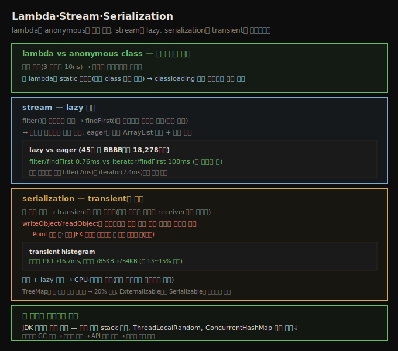

# Lambda·Stream·Serialization
> lambda는 anonymous class와 성능이 같고, stream은 lazy 평가로 일부만 처리하며, serialization은 transient로 데이터를 줄입니다

이 노트는 Java 8의 두 핵심 기능(lambda·stream)과 object serialization을 봅니다. 그리고 이 책의 마지막 본문 노트로서, 《Java Performance》 전체를 관통하는 주제로 마무리합니다.





## 1. lambda vs anonymous class — 차이 거의 없음
> lambda와 anonymous class는 성능이 거의 같아 프로그래밍 편의로 고르되, lambda는 별도 class 파일이 아니라 classloading 환경에서 약간 빠릅니다

Java 8의 가장 흥미로운 기능은 lambda였습니다 — 생산성에 큰 긍정적 영향을 주지만 정량화는 어렵습니다. lambda의 가장 기본 질문은 대체 대상인 **anonymous class**와의 비교인데, **차이가 거의 없습니다**.

```java
// anonymous class
IntegerInterface a1 = new IntegerInterface() {
    public int getInt() { return 1; }
};
// lambda
IntegerInterface a1 = () -> { return 1; };
```

lambda·anonymous class의 **본문이 핵심**입니다 — 본문이 의미 있는 연산을 하면 그 시간이 구현 차이를 압도합니다. 최소 케이스에서도 시간이 본질적으로 같습니다.

| 구현 | 1,024 표현식 | 3 표현식 |
|------|--------------|----------|
| anonymous class | 781 μs | 10 ns |
| lambda | 587 μs | 10 ns |
| static class | 734 μs | 10 ns |

anonymous class를 쓰는 코드는 메서드 호출마다 **새 객체를 생성**합니다(많이 호출하면 빠르게 생성·폐기, 5장에서 봤듯 성능 영향 작음). 표의 마지막 행은 preconstructed 객체를 씁니다 — lambda의 전형적 사용은 루프마다 새 객체를 안 만들어 일부 코너 케이스가 lambda 성능에 유리하지만 차이는 최소입니다.

> **lambda와 classloading**: 한 코너 케이스가 startup·classloading입니다. lambda 코드를 anonymous class의 syntactic sugar로 보기 쉽지만 그렇지 않습니다 — **lambda 코드는 특수 helper 클래스로 호출되는 static 메서드를 만듭니다**. anonymous class는 실제 Java 클래스라 **별도 class 파일**이 있고 classloader에서 로드됩니다. classloading 성능은 (긴 classpath면) 중요하니, anonymous class가 많은 프로그램(lambda 대신)의 startup이 더 넓은 차이를 보일 수 있습니다 — 그 경우 lambda가 약간 빠릅니다.


## 2. stream — lazy 평가
> filter는 포인터만 설정하고 findFirst가 호출돼야 처리해 일부만 처리하고 멈출 수 있어, iterator보다 두 자릿수 빠릅니다

Java 8의 또 다른 핵심 Stream의 중요한 성능 특징은 **lazy 자료구조**라는 점입니다. A를 포함하지 않는 첫 symbol을 찾는 코드입니다.

```java
Stream<String> stream = al.stream();
Optional<String> t = stream.filter(symbol -> symbol.charAt(0) != 'A').
    filter(symbol -> symbol.charAt(1) != 'A').
    filter(symbol -> symbol.charAt(2) != 'A').
    filter(symbol -> symbol.charAt(3) != 'A').findFirst();
```

각 `filter()`가 새 stream을 반환해 사실상 4개의 논리적 stream이 있습니다. **`filter()`는 일련의 포인터를 설정할 뿐 실제로는 아무것도 안 합니다** — `findFirst()`가 호출돼야 데이터 처리가 시작됩니다. `findFirst()`가 이전 stream(filter 4)에 요소를 요청하면, filter 4가 filter 3에 콜백하고... filter 1이 배열에서 첫 요소를 가져와 첫 문자가 A인지 검사합니다. 콜백이 많아 비효율적으로 들리지만, eager 구현은 ① 임시 `ArrayList` 인스턴스를 많이 만들고 ② 전체 리스트를 여러 번 처리해야 합니다(lazy는 `findFirst()`가 요소를 얻는 즉시 멈춰 일부만 필터 통과).

| 구현 | 시간 |
|------|------|
| Filter/findFirst | 0.76 ms |
| Iterator/findFirst | 108.4 ms |

456,976개 4글자 symbol(알파벳순)에서 eager는 BBBB까지 18,278개만 처리하면 멈출 수 있는데, iterator는 그 답을 찾는 데 **두 자릿수 더** 걸립니다. filter가 빠른 한 이유는 **알고리즘적 최적화 기회**(필요한 일을 하면 즉시 처리 종료)입니다.

전체 데이터를 처리해야 하면? 단일 filter로 바꿔 전체 카운트합니다.

| 구현 | 시간 |
|------|------|
| Filters | 7 ms |
| Iterator | 7.4 ms |

전체 처리에서도 **단일 filter가 iterator보다 약간 빠릅니다**. (단 여러 filter는 오버헤드가 있으니 좋은 filter를 작성해야 합니다 — 위 4-filter 예는 단일 filter로 합쳐야 합니다.)


## 3. serialization — transient와 함정
> transient로 데이터를 적게 직렬화하되, writeObject로 객체 참조를 잘못 다루면 공유 객체가 별개가 되는 미묘한 버그가 납니다

object serialization은 객체의 binary 상태를 써 나중에 재생성하는 방법입니다(`Serializable`·`Externalizable` 구현). 기본 직렬화 코드는 거의 모든 객체에서 개선 가능하지만, **조기 최적화가 현명하지 않은** 대표 경우입니다 — 특수 코드 작성에 시간이 들고, 유지보수가 어렵고, 올바로 짜기 까다롭습니다.

**transient 필드** — 직렬화 비용을 줄이는 일반 방법은 데이터를 적게 직렬화하는 것입니다. 필드를 **`transient`**로 표시하면 기본 직렬화에서 제외되고, 필요하면 `writeObject()`·`readObject()`로 처리합니다. 데이터가 안 필요하면 transient 표시만으로 충분합니다.

**writeObject/readObject 함정** — `writeObject()`·`readObject()`로 완전한 제어가 가능하지만 큰 책임이 따릅니다. 단순 `Point`는 더 복잡한 코드도 기능상 맞지만, 일반 케이스를 조심해야 합니다.

```java
// 이 코드는 기능상 틀림
private void writeObject(ObjectOutputStream oos) throws IOException {
    oos.defaultWriteObject();
    oos.writeInt(airportsVisited.length);
    for (int i = 0; i < airportsVisited.length; i++) {
        oos.writeInt(airportsVisited[i].getX());
        oos.writeInt(airportsVisited[i].getY());
    }
}
```

`airportsVisited`는 방문한 공항 배열로 JFK가 자주, SYD가 한 번 나옵니다. 객체 참조 쓰기가 비싸 이 코드는 기본 직렬화보다 빠르지만(10만 `Point`에 15.5→1ms), **틀렸습니다** — 직렬화 전엔 한 객체가 JFK를 나타내고 그 참조가 배열에 여러 번 나오는데, **역직렬화 후엔 여러 객체가 JFK를 나타냅니다**. 한 객체를 바꾸면 그것만 바뀌어 나머지 JFK 참조와 다른 데이터가 됩니다. **직렬화 최적화는 흔히 객체 참조 특수 처리인데, 잘못하면 미묘한 버그**를 냅니다.

`StockPriceHistoryImpl`에서는 lazily 초기화되는 필드(`highPrice`·`histogram` 등)를 모두 `prices` 배열에서 계산할 수 있어 **transient로 표시**하고, 받는 쪽에서 lazy 재초기화합니다. 이는 `prices`와 `histogram`의 객체 관계도 보존합니다.

| 객체 | 직렬화 | 역직렬화 | 데이터 크기 |
|------|--------|----------|-------------|
| transient 없음 | 19.1 ms | 16.8 ms | 785,395 bytes |
| transient histogram | 16.7 ms | 14.4 ms | 754,227 bytes |

약 15% 시간과 13% 크기를 아낍니다. 단 **histogram이 항상 필요하고 계산이 2.4ms 넘게 걸리면** lazy 필드 케이스가 오히려 순 성능 감소입니다(이 예는 histogram 계산이 빨라 해당 없음).

> **압축**: 직렬화 데이터를 압축하면 전송이 빠릅니다(`prices` 맵을 `GZIPOutputStream`으로). byte 스트림 직렬화 목적이면 압축 시간이 더 길어 손해지만(43.6 vs 16.7ms), **lazy 압축 해제**가 핵심입니다 — `readObject()`에서 풀지 않고 `getPrice()` 첫 호출 시 풉니다. receiver가 집계(`getHighPrice()`)만 필요하면 압축 해제(43.6ms)를 건너뛰어 큰 시간을 아끼고, HTTP session state 백업처럼 **메모리 절약**(압축 데이터가 작음)에도 유용합니다. 네트워크 전송이면 속도 트레이드오프가 있습니다 — 50만 byte 덜 보내는 데 40ms 압축이라, 100 Mbit/s가 break-even이라 느린 공용 WiFi는 이득, 빠른 네트워크는 손해입니다.

> **중복 객체 추적과 Externalizable**: `writeObject()`의 강력한 최적화는 **중복 객체 참조를 안 쓰는 것**입니다. JDK 컬렉션은 이미 최적 직렬화돼 있습니다 — `TreeMap`은 부모 참조가 이미 쓰였으면(node A) 데이터를 다시 안 쓰고 참조만 추가합니다. 나아가 키·값만 쓰고 관계(정렬 순서)는 버려 역직렬화 시 재정렬하는데, 재정렬이 비쌀 것 같지만 기본 직렬화(모든 객체 참조 추적)보다 1만 stock에 **20% 빠릅니다**. `Externalizable`은 `Serializable`과 달리 non-transient 필드를 자동으로 안 써(`defaultWriteObject` 없음) 모든 필드를 명시해야 합니다 — 모든 필드가 transient여도 **`Serializable` + `defaultWriteObject()`가 유지보수에 낫고**, 성능 이점도 없습니다(결국 쓰는 데이터 양이 중요).


## 책 전체 요약 — JDK 성능의 진화

이 Java SE JDK 핵심 영역 탐색으로 Java 성능 검토를 마칩니다. 이 장 대부분 주제의 흥미로운 한 테마는 **JDK 자신의 성능 진화**를 보여 준다는 점입니다 — Java가 플랫폼으로 발전·성숙하며, 개발자들은 반복 생성 예외가 thread stack을 제공할 필요 없음을, 난수 생성기 동기화를 피하는 thread-local 변수가 좋음을, `ConcurrentHashMap` 기본 크기가 너무 컸음을 발견했습니다.

이 **지속적 점진 개선**이 Java 성능 튜닝의 전부입니다. 컴파일러·GC 튜닝에서, 메모리 효율적 사용으로, API의 핵심 성능 차이 이해로 — 이 책의 도구와 프로세스가 여러분의 코드에 비슷한 지속적 개선을 제공하게 합니다.

> **정독 노트를 마치며**: 서문(00-00)부터 12장까지, 이 책은 성능을 **art와 science의 결합**으로 봤습니다(1장). 측정 없는 추측을 경계하고(2장 jmh·통계), 도구로 병목을 찾고(3장 JFR·프로파일러), JIT(4장)·GC(5·6장)를 이해하고, heap(7장)·native(8장) 메모리를 효율적으로 쓰고, 스레드(9장)·서버(10장)·DB(11장)를 확장하고, API(12장)의 함정을 피하는 — 이 전체 흐름이 한 엔지니어의 사고 방식을 보여 줍니다. "조기 최적화"라는 말에 겁먹지 말고 **좋은 코드를 쓰되, 측정으로 검증하라**는 것이 책 전체의 메시지입니다.


## 자주 받는 오해

**"lambda는 anonymous class의 syntactic sugar다"** — lambda는 **특수 helper로 호출되는 static 메서드**를 만들고, anonymous class는 **별도 class 파일**로 로드됩니다. 성능은 거의 같지만(3 표현식 10ns), classloading이 중요한 환경(긴 classpath)에서는 lambda가 약간 빠릅니다.

**"stream filter는 콜백이 많아 iterator보다 느리다"** — lazy 평가로 **`findFirst()`가 요소를 얻는 즉시 멈춰** 일부만 처리합니다(45만 중 18,278개). filter/findFirst 0.76ms vs iterator 108ms로 두 자릿수 빠릅니다. 전체 처리해도 단일 filter(7ms)가 iterator(7.4ms)보다 약간 빠릅니다.

**"writeObject로 객체 참조를 직접 쓰면 항상 빠르다"** — 빠르지만 **공유 객체가 별개가 되는 버그**를 냅니다. 공유 JFK 객체를 좌표로 직접 쓰면 역직렬화 후 여러 별개 객체가 됩니다. `TreeMap`처럼 **중복될 수 없는 객체**(node)만 직접 쓰고, 중복 가능한 값은 참조로 써야 합니다.

**"Externalizable이 Serializable보다 빠르다"** — 성능 이점이 없습니다(결국 쓰는 데이터 양이 중요). `Externalizable`은 모든 필드를 명시해야 해 유지보수가 어려워, 모든 필드가 transient여도 `Serializable` + `defaultWriteObject()`가 낫습니다.


## 면접에서 받을 만한 질문

**Q. lambda와 anonymous class의 성능 차이는?**
거의 없습니다(3 표현식 10ns로 동등). 선택은 프로그래밍 편의로 합니다. 단 lambda는 특수 helper로 호출되는 static 메서드를 만들고 anonymous class는 별도 class 파일로 로드되므로, classloading이 중요한 환경(긴 classpath)에서는 lambda가 약간 빠릅니다.

**Q. stream이 iterator보다 빠를 수 있는 이유는?**
stream은 lazy 자료구조라 `filter()`가 포인터만 설정하고 `findFirst()`가 호출돼야 처리합니다 — **필요한 일을 하면 즉시 멈춰** 일부만 처리합니다(45만 중 BBBB까지 18,278개). filter/findFirst 0.76ms vs iterator 108ms로 두 자릿수 빠릅니다. 전체를 처리해도 단일 filter가 iterator보다 약간 빠릅니다.

**Q. serialization을 어떻게 최적화하나요?**
계산 가능한 필드를 `transient`로 표시해 적게 직렬화하고 receiver에서 재생성합니다(15% 시간·13% 크기 절감). 단 `writeObject()`로 객체 참조를 직접 쓰면 공유 객체가 별개가 되는 버그를 조심해야 합니다 — 중복될 수 없는 객체만 직접 씁니다. 압축 + lazy 해제로 CPU·메모리를 아끼고(느린 네트워크 아니어도 유용), `Externalizable`보다 `Serializable`이 유지보수에 낫습니다.


## 관련 문서

- [`12-04.Logging과 Collections`](./12-04.Logging과%20Collections.md) — 12장 API 위생
- [`12-01.String — compact string·interning·concatenation`](./12-01.String%20—%20compact%20string·interning·concatenation.md) — 12장 시작
- [`00-00.서문 — 책 소개와 2판 변경점`](./00-00.서문%20—%20책%20소개와%202판%20변경점.md) — 책의 출발점
- [상위 인덱스](./README.md)
