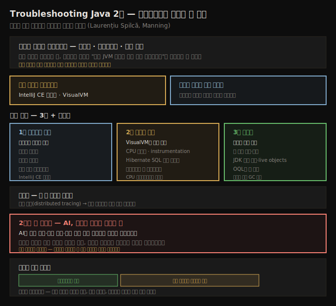

# 서문 — 트러블슈팅의 본질과 책 구성
---
> 개발자가 코드를 *쓰는* 시간보다 *조사하는* 시간이 더 길고, 이 책은 그 조사를 빠르게 만드는 기술을 모았습니다

이 노트는 『Troubleshooting Java, 2판』(Laurențiu Spilcă, Manning)의 추천사(Ben Evans)와 머리말(저자)을 정리한 메타 노트입니다. 기술적인 정독 노트는 1장부터 시작하므로, 여기서는 이 책이 어떤 문제의식에서 출발했는지, 어떻게 구성돼 있는지, 어떤 도구를 다루는지를 먼저 짚습니다. 본문에 들어가기 전에 저자가 깔아 둔 전제를 이해하기 위해서입니다.

저자 Laurențiu Spilcă는 『Spring Security in Action』과 『Spring Start Here』로 알려진 사람입니다. 추천사를 쓴 Ben Evans는 Java 챔피언이자 『The Well-Grounded Java Developer』의 저자입니다. 두 사람이 공통으로 강조하는 메시지는 하나입니다. 소프트웨어 개발은 코드를 작성하는 일이 아니라 **시스템이 어떻게 동작하는지 조사하는 일**이며, 그 조사를 잘하는 것이 개발자가 기를 수 있는 가장 전략적인 기술이라는 것입니다.

## 1. 이 책이 푸는 문제 — 개발은 코드 작성이 아니라 조사다
> 디버깅·프로파일링·로그 분석으로 "지금 JVM 안에서 무슨 일이 일어나는가"를 알아내는 활동이 개발의 본질입니다

머리말은 도발적인 질문으로 시작합니다. "소프트웨어 개발자는 무엇으로 먹고사는가?" 많은 사람이 "코드를 짠다"고 답하겠지만, 저자는 코드를 쓰는 시간은 전체의 작은 일부일 뿐이라고 말합니다. 하루의 대부분은 해법을 설계하고, 기존 코드가 어떻게 동작하는지 읽어 이해하고, 새 개념을 배우는 데 쓰입니다. 코드는 그 모든 활동을 성공적으로 해낸 *결과물*일 뿐입니다.

그래서 프로그래머는 코드를 쓰는 시간보다 읽는 시간이 훨씬 깁니다. 클린 코딩이라는 분야가 생겨난 배경도 이것입니다. 나중에 읽기 쉽도록 처음부터 깔끔하게 짜는 편이 더 효율적이기 때문입니다. 하지만 모든 코드가 깨끗하지는 않고, 모든 시스템이 단순하지도 않습니다. 낯선 해법을 파고들어 코드가 *실제로* 어떻게 동작하는지 밝혀내야 하는 상황은 늘 찾아옵니다.

문제는 코드를 읽는 것만으로는 부족할 때가 많다는 데 있습니다. 자기 코드와 서드파티 의존성을 따라가며 왜 기대대로 동작하지 않는지 알아내려면, 더 깊이 들어가야 합니다. 디버깅, 프로파일링, 로그 분석을 동원해 JVM 안에서 무슨 일이 벌어지는지, 환경이 애플리케이션에 어떤 영향을 주는지를 들여다봐야 합니다. 어떤 기술을 언제 적용해야 하는지 아는 것만으로도 막대한 시간을 아낄 수 있다고 저자는 강조합니다. 이 조사 활동을 최적화하는 일이 곧 이 책의 목표입니다.

## 2. 무료 도구로 충분하다 — IntelliJ CE 디버거와 VisualVM
> 책은 누구나 쓸 수 있는 무료 도구를 중심으로, 그 능력과 한계를 함께 보여줍니다

추천사가 짚는 이 책의 강점 하나는 도구 선택입니다. 책은 IntelliJ Community Edition 디버거와 VisualVM 같은 **무료 도구**를 주된 수단으로 삼습니다. 비싼 상용 도구가 없어도 트러블슈팅의 핵심을 익힐 수 있다는 뜻입니다.

다만 도구를 소개하는 데 그치지 않고, 그 *능력과 한계*를 함께 다룹니다. Ben Evans는 이 책이 디버거의 기본을 훌쩍 넘어 조건부 중단점(conditional breakpoint)이나 실행을 멈추지 않는 비중단 중단점(nonpausing breakpoint) 같은 기법까지 파고든다는 점을 다른 자료와의 차별점으로 꼽습니다. 또한 무엇이 잘못될 수 있는지를 보여주는 예제와 시연이 많아, 도구를 직접 쓰며 경험과 자신감을 쌓도록 돕는다고 평가합니다.

## 3. 책의 구성 — 디버거, 리소스 소비, 메모리, 그리고 분산 시스템
> 1부 디버깅과 로그, 2부 리소스 소비와 VisualVM, 3부 메모리, 마무리로 분산 추적까지 이어집니다

추천사는 책의 3부 구성과 마무리를 명확히 정리해 줍니다. 각 부가 무엇을 다루는지 미리 알아 두면 정독 순서를 잡는 데 도움이 됩니다.

1. **1부 — 디버깅과 로그**: IntelliJ CE 디버거 같은 흔한 도구의 능력과 한계를 다룹니다. 조건부 중단점, 비중단 중단점처럼 기본을 넘어서는 디버거 기법을 여럿 소개하고, 로그를 활용한 Java 애플리케이션 트러블슈팅의 기초도 탄탄하게 짚습니다.
2. **2부 — 리소스 소비**: 트러블슈팅에서 리소스 소비가 차지하는 중심 역할을 전면에 둡니다. 무료 도구 VisualVM이 이 영역을 이해하는 주된 수단이고, CPU 샘플링(sampling)과 instrumentation 같은 중요한 주제를 깊이 다룹니다. 자주 간과되는 외부 의존성 처리는 Hibernate를 쓰는 SQL 데이터베이스 예제로 보여 줍니다. 멀티스레드 프로그래밍과 락(lock) 트러블슈팅은 CPU 프로파일링에서 자연스럽게 이어집니다.
3. **3부 — 메모리**: 샘플링과 프로파일링으로 메모리 누수(memory leak)를 추적하고, 힙 덤프(heap dump)를 만들어 탐색하는 법을 다룹니다. JDK 타입을 걸러내거나 살아 있는 객체(live object)만 보는 VisualVM 기능, 힙 덤프를 질의하는 OQL 같은 실전 기법도 포함합니다. 1부와 마찬가지로 이 부의 마지막 장은 로그를 다루는데, 여기서는 GC 로그입니다.

마무리에서는 더 큰 규모의 시스템으로 시야를 넓힙니다. 핵심 기법으로 분산 추적(distributed tracing)을 소개한 뒤, 이종(heterogeneous) 시스템에 걸친 분산 트랜잭션을 논의하며 전체를 묶습니다.

## 4. 2판의 새 동반자 — AI, 그러나 판단은 사람의 몫
> AI는 조사를 극적으로 빠르게 하지만, 증거를 해석하고 결정하는 주체는 여전히 개발자입니다

2판에서 새로 등장한 주제는 인공지능입니다. 머리말과 추천사가 같은 비유를 씁니다. 탐정은 조수와 도구를 쓰지만 사건을 푸는 것은 결국 탐정 자신입니다. 마찬가지로 AI 도구는 로그를 분석하고, 가설을 제안하고, 의심스러운 코드 경로를 짚어 줄 수 있어 조사를 극적으로 앞당깁니다. 그러나 증거를 해석하고 결정을 내리는 전문가는 여전히 개발자입니다.

저자는 책 전반에서 AI를 신중하고 전술적으로 씁니다. 만능 해결책(magic bullet)은 없다는 점을 강조하고, 실질적인 활용 사례에 집중합니다. AI는 사람을 대체하지 못하지만, 유능한 엔지니어를 더 생산적으로 만들고 더 높은 수준의 문제에 집중하게 해 줍니다. 저자가 말하는 오늘날의 효율이란, AI에 의존하지 않으면서 AI를 잘 쓰는 법을 아는 것까지 포함합니다.

## 5. 누구를 위한 책인가
> 입문자에게도 친절하지만, 숙련 엔지니어의 직관과 경험을 현대 도구로 보강하려는 사람에게도 맞습니다

추천사는 이 책이 Java 개발에 처음 입문하는 사람에게 특히 유용하다고 말합니다. 개념을 차근차근 다루고, 쓸 수 있는 무료 도구와 사용법을 충실히 설명하기 때문입니다. 동시에 이 책은 앞을 내다보는 책이기도 합니다. 현대적인 도구가 어떻게 일하는 소프트웨어 엔지니어의 직관·경험·문제 해결 통찰을 보완하고 강화하는지를 인정합니다.

저자의 목표는 처음부터 끝까지 일관됩니다. 독자를 더 효율적인 개발자로 만드는 것입니다. 이 책의 기법과 사고방식을 익히면 근본 원인을 빠르게 찾고, 계속 배우며, 가장 까다로운 문제도 자신 있게 풀 수 있게 된다고 저자는 약속합니다.

## 관련 문서
- [이 책 인덱스 (Troubleshooting Java MOC)](./README.md) — 장별 정독 노트 진척
- [JVM 학습 인덱스 (상위 MOC)](../../README.md) — 정독 노트 갈래 전체
