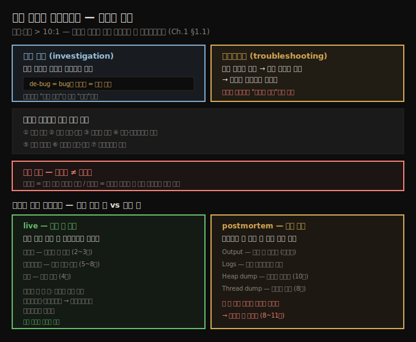
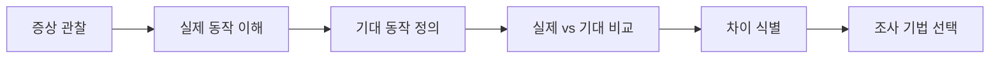
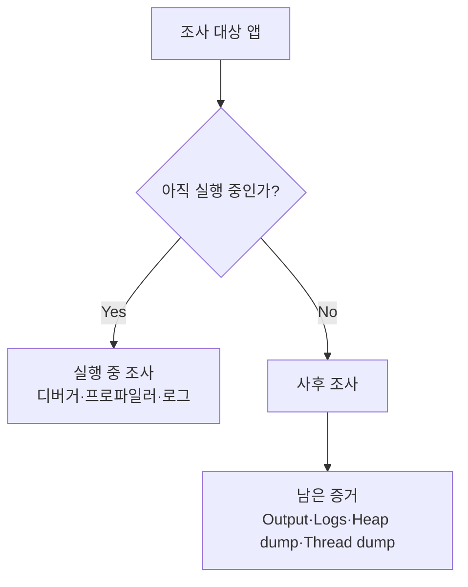

# 코드 조사와 트러블슈팅 — 정의와 기법의 지형
---
> 트러블슈팅은 추측이 아니라 조사입니다 — 시스템의 실제 동작과 기대 동작을 견주어 *무엇이 다른가*를 찾아내는 일이고, 디버깅은 그 조사 기법 중 하나일 뿐입니다

이 노트는 『Troubleshooting Java』 1장의 전반부(§1.1)를 정리합니다. 1장은 책 전체의 토대를 까는 도입 장이고, 그중 §1.1은 "코드를 조사한다"는 활동과 "트러블슈팅"이 정확히 무엇인지를 정의합니다. 

용어를 분명히 해 두면 뒤따르는 시나리오(다음 편 §1.2)와 도구별 장(2장 이후)을 일관된 틀로 읽을 수 있습니다. 핵심 도구 사용법은 후속 장의 몫이고, 여기서는 *언제 무엇을 조사하는가*의 지형을 먼저 그립니다.




## 1. 왜 트러블슈팅을 배워야 하는가 — 읽기가 쓰기보다 10배 길다
> 개발자의 시간은 코드를 쓰는 데가 아니라 읽고 이해하는 데 쏠려 있어서, 조사를 잘하는 것이 생산성을 가장 크게 끌어올립니다

저자는 Robert C. Martin의 『Clean Code』를 인용하며 출발합니다. "코드를 읽는 시간 대 쓰는 시간의 비율은 10대 1을 훌쩍 넘는다. 새 코드를 쓰기 위해 우리는 끊임없이 옛 코드를 읽는다. 그러니 읽기 쉽게 만드는 것이 곧 쓰기 쉽게 만드는 것이다." 저자는 여기서 한 발 더 나아갑니다. 읽는 것만으로는 부족하고, 진짜는 **코드를 조사(investigate)하는 것**이며, 그 조사는 여러 기법을 조합해서 한다는 것입니다.

트러블슈팅은 개발자가 익힐 수 있는 가장 값진 기술 중 하나입니다. 새 코드를 쓰든 운영 중인 복잡한 시스템을 유지보수하든, 문제는 반드시 생기기 때문입니다. 서비스가 갑자기 타임아웃을 내고, 내 머신에서는 멀쩡한데 QA에서 죽고, 겉보기엔 멀쩡한데 사용자는 잘못된 결과를 보고합니다. 이런 상황을 이해하게 해 주는 기술이 트러블슈팅입니다.

저자가 특히 강조하는 대비가 하나 있습니다. 흔히 개발자에게 "더 빨리 코드를 짜서 효율을 높이라"고 조언하지만, 저자는 **트러블슈팅 실력을 먼저 길러야 한다**고 봅니다. 

- 시간의 대부분은 새 코드 작성이 아니라 기존 코드를 읽고, 앱이 어떻게 동작하는지 이해하고, 왜 기대대로 안 되는지 알아내는 데 쓰이기 때문입니다. 
- 그래서 조사하고 추론하는 능력을 다듬는 편이 타이핑 속도를 올리는 것보다 훨씬 빨리 효율로 돌아옵니다. 트러블슈팅은 무언가 망가졌을 때뿐 아니라 기존 로직을 확장·리팩터링할 때도 시간을 아껴 주는 **힘의 증폭기(force multiplier)**입니다.


## 2. 코드 조사의 정의 — 디버깅보다 넓은 활동
> 코드 조사는 "특정 소프트웨어 기능의 동작을 분석하는 과정"이고, 옛날의 buge 제거를 넘어 *이해*까지 포함합니다

저자는 코드 조사(investigating code)를 **"어떤 소프트웨어 기능의 구체적인 동작을 분석하는 과정"**이라고 일부러 넓게 정의합니다. 왜 이렇게 포괄적일까요. 소프트웨어 개발 초기에는 코드를 들여다보는 목적이 하나뿐이었습니다. 오류(bug)를 찾아 고치는 것입니다. 그래서 많은 개발자가 지금도 이 활동을 디버깅(debugging)이라 부릅니다. 단어 자체가 그 흔적입니다.

```
de-bug = bug를 빼낸다 = 오류를 제거한다
```

- 오늘날에도 오류를 찾아 고치려고 앱을 디버깅하는 경우는 많습니다. 그러나 초기와 달리 앱이 훨씬 복잡해졌습니다. 이제는 특정 기술이나 라이브러리를 배우려고, 어떤 기능이 어떻게 동작하는지 조사하는 일이 잦습니다. 

- 즉 디버깅은 더 이상 *문제를 찾는 것*만이 아니라, 동작을 *올바로 이해하는 것*까지 포함하게 됐습니다. 저자가 정리한 코드를 조사하는 이유는 다음과 같습니다.

  - 특정 문제를 찾기 위해

  - 어떤 기능이 어떻게 동작하는지 이해해 개선하기 위해

  - 정확성을 검토(review)하기 위해

  - 특정 기술이나 라이브러리를 배우기 위해

  - 성능을 최적화하기 위해

  - 취약점을 제거하고 보안을 높이기 위해

  - 유지보수성을 높이기 위해


여기에 더해 많은 개발자가 *재미로* 코드를 조사한다고 저자는 덧붙입니다. 동작을 파헤치는 일은 답답할 때도 있지만, 근본 원인을 찾아내거나 마침내 원리를 이해했을 때의 느낌에 견줄 것이 없다는 것입니다.


## 3. 트러블슈팅의 정의 — 모르는 데서 시작하는 조사
> 트러블슈팅은 실제 동작과 기대 동작을 견주어 차이를 찾는 일이며, 구문 오류 고치기와 달리 *무엇이 틀렸는지 모르는 지점*에서 시작합니다

> 💬 **정의**: 트러블슈팅이란 시스템이 어떻게 동작하는지 이해하고, 그것을 어떻게 동작*해야* 하는지와 비교한 뒤, 무엇이 다른지 짚어내는 것입니다.

이 정의의 핵심은 *비교*입니다. 트러블슈팅은 논리·관찰, 그리고 때로는 약간의 직관이 결합된 활동입니다. 구문 오류를 고치거나 깨진 단위 테스트를 통과시키는 일과 결정적으로 다른 점은, **진짜 트러블슈팅은 무엇이 잘못됐는지 아직 모르는 상태에서 시작한다**는 것입니다. 많은 개발자가 바로 이 지점에서 막힙니다.

트러블슈팅을 절차로 보면 다음 흐름입니다. 시작점은 "증상이 있다"이지 "원인을 안다"가 아니며, 실제 동작과 기대 동작을 비교한 뒤에야 어떤 기법을 쓸지 고를 수 있습니다.



- 효과적으로 트러블슈팅할 줄 알게 되면 더 빠르고, 더 자신 있고, 더 독립적인 개발자가 됩니다. 낯선 코드베이스에서 일하고, 운영 문제를 풀고, 설계 결함이 장애로 번지기 전에 잡아내는 도구를 손에 쥐기 때문입니다. 
- 저자는 이것이 시니어 엔지니어를 가르는 기준이라고 말합니다. 시니어가 모든 답을 알아서가 아니라, **조사하는 법을 알기 때문**입니다.

한 가지 용어 정리가 더 필요합니다. 많은 개발자가 모든 조사 기법을 뭉뚱그려 "디버깅"이라 부르지만, 디버깅은 여러 도구 중 하나일 뿐입니다. 

- 저자는 개발자들이 debugging을 다음처럼 서로 다른 목적에 쓰고 있다고 짚습니다. 
- 새 프레임워크 학습, 문제의 근본 원인 찾기, 기존 로직을 이해해 확장하기. 이렇게 목적이 다양하므로, 디버깅을 곧 디버거 도구 사용과 동일시하는 흔한 오해(특히 초보자)는 바로잡아야 합니다.


## 4. 디버거가 필요한 순간 — 난독 코드를 손으로 따라가기
> 잘 짠 코드도 책처럼 위에서 아래로 읽히지 않고, 읽기 어려운 레거시·난독 코드는 디버거로 한 줄씩 실행해 데이터 변화를 관찰해야 풀립니다

코드를 읽는 것만으로 이해되면 좋지만, 코드 읽기는 책 읽기와 다릅니다. 논리적 순서로 위에서 아래로 흐르는 짧은 문단이 아니라, 메서드에서 메서드로, 파일에서 파일로 건너뛰며 거대한 미로 속을 헤매는 느낌을 받습니다. 게다가 현실의 소스 코드는 읽기 쉽게 쓰여 있지 않은 경우가 많습니다. 패턴과 원칙을 배워도 제대로 적용하지 않는 개발자가 여전히 많고, 레거시 앱은 그 원칙이 존재하기도 전에 쓰였기 때문입니다. 그래도 그런 코드를 조사할 수 있어야 합니다.

저자가 든 예가 listing 1.1입니다. 어떤 문제의 근본 원인을 찾다가 마주친 코드라고 가정합니다. 분명 리팩터링이 필요하지만, 리팩터링하려면 먼저 *무엇을 하는지* 이해해야 합니다.

```java
// da-ch1-ex1 프로젝트. 한눈에 무엇을 하는지 파악하기 어려운 의도적 난독 코드
public int m(int f, int g) {
  try {
    int[] far = new int[f];
    far[g] = 1;
    return f;
  } catch(NegativeArraySizeException e) {
    f = -f;
    g = -g;
    return (-m(f, g) == -f) ? -g : -f;
  } catch(IndexOutOfBoundsException e) {
    return (m(g, 0) == 0) ? f : g;
  }
}
```

- 이 로직을 이해하려고 저자는 디버거를 씁니다. 특정 줄에서 실행을 멈추고(breakpoint), 명령을 하나씩 수동으로 실행하며 데이터가 어떻게 바뀌는지 관찰하는 도구입니다. 
- 주어진 입력으로 몇 번 따라가 보면, 이 코드가 **두 입력의 최댓값을 계산한다**는 사실이 드러납니다. 
- 배열 크기 음수 예외와 인덱스 초과 예외를 의도적으로 유발해 분기를 만든, 재귀로 짠 max 함수입니다. 읽기만 해서는 알기 어렵고, 한 줄씩 실행해 값의 변화를 눈으로 봐야 풀리는 전형적인 사례입니다.

AI에게 도움을 청할 수도 있지만, 저자는 프롬프트 방식에 분명한 선을 긋습니다. 목적은 *답을 받는 것*이 아니라 *원리를 익히는 것*이기 때문입니다.

- ❌ `이 코드가 뭘 하나요?` — 결과만 받으면 세 가지 위험이 있습니다. 답이 틀릴 수 있고(환각), 틀렸는데 그럴듯해 보이면 오히려 더 헤매고, 맞더라도 *어떻게* 그 일을 하는지 몰라 전체 맥락에 못 넣습니다.
- ✅ `이 코드를 한 단계씩 설명해 주세요, 제가 이해할 수 있도록:` — 과정을 따라가며 스스로 이해하게 이끄는 프롬프트가 단기·장기 모두에 이롭습니다.


## 5. 의존성과 시작점 부재 — 읽기로 안 될 때
> 프레임워크·라이브러리는 추상화 계층 때문에 소스가 있어도 따라가기 어렵고, 어디서 시작할지조차 모를 땐 프로파일러로 실행 중인 코드를 먼저 찾습니다

어떤 상황은 코드를 따라가는 것 자체를 막거나 더 어렵게 만듭니다. 오늘날 대부분의 앱은 라이브러리·프레임워크 같은 의존성에 기댑니다. 오픈소스라 소스에 접근할 수 있어도, 프레임워크 로직을 정의하는 코드를 따라가기는 여전히 어렵습니다. 프레임워크와 라이브러리는 확장성과 설정 편의를 위해 여러 추상화 계층을 두는데, 바로 그 점이 기능을 조사할 때 복잡도를 더합니다.

> **주의**: 트러블슈팅은 내 애플리케이션 소유가 아닌 소스 코드를 다뤄야 할 때 특히 까다롭습니다. 라이브러리나 프레임워크의 구현을 상대해야 하는 경우가 많습니다.

어디서 시작할지조차 모르는 경우도 흔합니다. 이럴 때는 다른 기법을 동원합니다. 예를 들어 프로파일링 도구(profiler, 5~8장)로 어떤 코드가 실행되는지 식별한 뒤, 디버거로 조사를 시작할 지점을 정합니다.


## 6. Postmortem investigation — 이미 죽은 앱을 조사하기
> 앱이 크래시해 더 이상 돌지 않으면 전통적 디버깅이 불가능하므로, 로그·힙 덤프·스레드 덤프 같은 사후 데이터로 원인을 추적합니다

앱이 크래시해서 더 이상 실행되지 않으면 전통적인 디버깅 방법은 쓸 수 없습니다. 여기서 **사후 조사(postmortem investigation)** 개념이 나옵니다. 예를 들어 운영 서비스가 예상치 못한 메모리 오류로 죽으면, 개발자는 사후 조사로 원인을 밝히고 수정해야 합니다.

> 💬 **정의**: Postmortem investigation이란 앱 크래시를 *일으킨 뒤*의 상황·동작을 트러블슈팅하는 것입니다. 앱이 더 이상 돌지 않으므로 쓸 수 있는 기법의 일부만 남고, 다른 상황보다 트러블슈팅이 대체로 더 어렵습니다.

목표는 사건 도중이나 이후에 수집된 데이터로 근본 원인을 빠르게 짚는 것입니다. 사후 조사에 흔히 쓰는 도구는 다음과 같습니다(8~11장에서 상세히 다룹니다).

| 도구 | 무엇을 주는가 |
|------|--------------|
| Output | 실행 후 앱이 만들어 낸 결과·산출물 (있다면) |
| Logs | 실패 직전까지의 앱 활동 기록 |
| Heap dump | 앱 메모리의 스냅샷 |
| Thread dump | 특정 순간 모든 스레드의 상태 |

앱이 아직 살아 있는지에 따라 조사 기법의 선택지는 크게 달라집니다. 실행 중인 앱은 디버거·프로파일러·로그처럼 현재 동작에 접근하는 도구를 쓸 수 있지만, 이미 죽은 앱은 사건 전후에 남은 증거를 해석해야 합니다.



- 살아 있는 앱을 실시간으로 따라가는 조사와, 죽은 앱의 흔적만으로 거슬러 올라가는 조사는 성격이 다릅니다. 다음 편에서는 이 구분을 포함해, *어떤 증상에 어떤 기법을 고르는가*를 네 가지 시나리오로 풀어 봅니다.


## 7. 면접 한 줄 정리
> 핵심 개념을 한 문장으로 말할 수 있는지 점검합니다

- **트러블슈팅이란?** 시스템의 실제 동작을 이해하고, 기대 동작과 비교해, 무엇이 다른지 찾아내는 것입니다. 핵심은 추측이 아니라 비교에 근거한 *조사*입니다.
- **디버깅과 디버거의 차이는?** 디버깅은 코드 동작을 분석하는 여러 기법의 통칭이고, 디버거는 실행을 멈추고 한 줄씩 따라가게 해 주는 *도구 하나*입니다. 디버깅 = 디버거는 흔한 오해입니다.
- **왜 타이핑 속도보다 트러블슈팅이 먼저인가?** 개발 시간의 대부분이 새 코드 작성이 아니라 기존 코드를 읽고 이해하는 데 쓰이므로, 조사 능력이 효율로 더 빨리 돌아옵니다(force multiplier).
- **Postmortem investigation이란?** 앱이 크래시해 더 이상 돌지 않을 때, 로그·힙 덤프·스레드 덤프 같은 사후 데이터로 원인을 추적하는 조사입니다. 쓸 수 있는 기법이 줄어 더 어렵습니다.


## 관련 문서
- [이 책 인덱스 (Troubleshooting Java MOC)](./README.md) — 장별 정독 노트 진척
- [서문 — 트러블슈팅의 본질과 책 구성](./00-00.서문%20—%20트러블슈팅의%20본질과%20책%20구성.md) — 책 전체가 푸는 문제와 3부 구성
- [조사 기법의 네 시나리오와 AI 활용](./01-02.조사%20기법의%20네%20시나리오와%20AI%20활용.md) — §1.1의 정의를 실제 증상에 적용하는 1장 후반부
