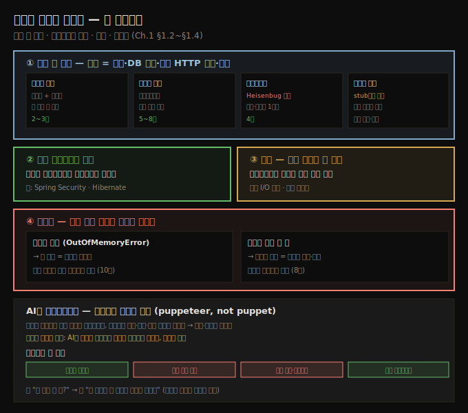
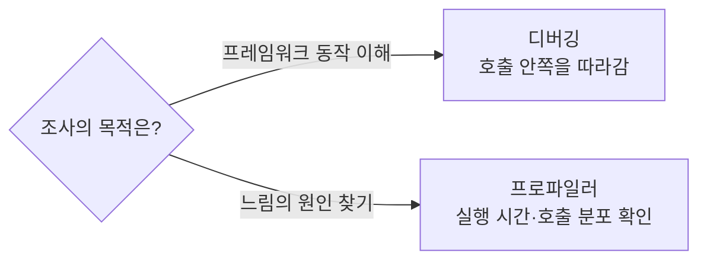
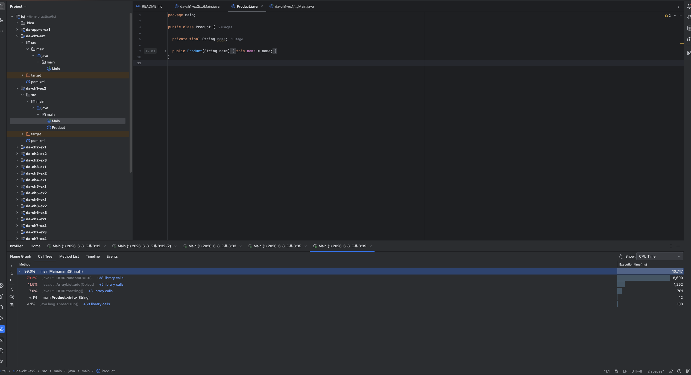
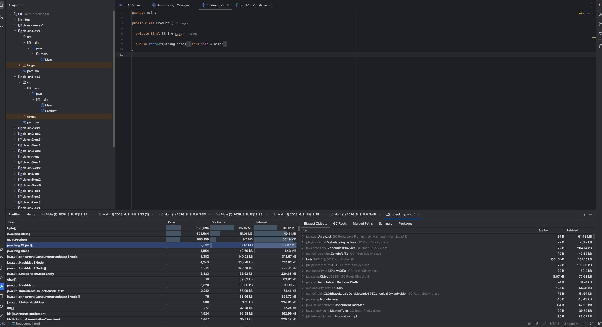
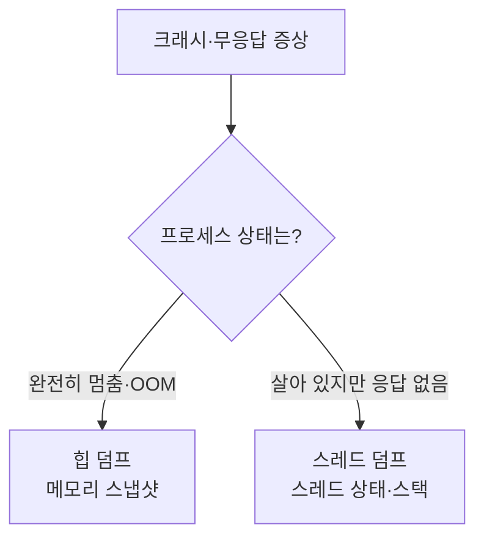

# 조사 기법의 네 시나리오와 AI 활용
---
> 증상이 곧 기법을 고릅니다 — 예상 밖 출력엔 디버거, 시작점이 없으면 프로파일러, 멀티스레드엔 로그, 크래시엔 힙·스레드 덤프이며, AI는 어디서 시작할지 짚어 주는 조수입니다

이 노트는 『Troubleshooting Java』 1장의 후반부(§1.2~§1.4)를 정리합니다. 앞 편(§1.1)이 *무엇을 조사하는가*의 정의였다면, 여기서는 실제 현장에서 마주치는 네 가지 시나리오를 통해 *어떤 증상에 어떤 기법을 고르는가*를 익힙니다. 이어서 2판의 새 주제인 AI를 트러블슈팅에 어떻게 쓰는지, 그리고 책 전체에서 무엇을 배우게 되는지로 마무리합니다.




## 1. 시나리오로 보는 기법 선택 — 네 가지 전형
> 저자는 예상 밖 출력·외부 라이브러리 학습·느림·크래시라는 네 부류로 조사 상황을 나누고, 각각에 맞는 기법을 제시합니다

저자는 코드 조사가 필요한 상황을 네 가지 전형으로 분류합니다. 실무 문제는 대부분 이 중 하나(또는 조합)에 들어맞습니다.

- 어떤 로직이 기대와 다른 결과를 낼 때 (예상 밖 출력)
- 앱이 의존하는 기술이 어떻게 동작하는지 배울 때 (외부 라이브러리 학습)
- 앱이 느린 등 성능 문제의 원인을 찾을 때 (느림)
- 앱이 갑자기 멈추는 근본 원인을 찾을 때 (크래시)

각 부류마다 도구가 갈립니다. 핵심 도구의 상세 사용법은 후속 장으로 미루고, 여기서는 *왜 이 증상엔 이 도구인가*의 연결을 잡습니다.


## 2. 예상 밖 출력 — 출력의 정의와 네 단계 시나리오
> 출력은 콘솔 텍스트뿐 아니라 DB 변경·외부 HTTP 요청·응답까지 포함하며, 단순할수록 디버거, 시작점이 모호할수록 프로파일러로 갑니다

가장 흔한 조사 상황은 어떤 로직의 결과가 기대와 다를 때입니다. 먼저 출력(output)을 넓게 정의해야 합니다.

> 💬 **정의**: 출력이란 어떤 로직을 실행한 결과로, 데이터 변경·정보 교환·다른 컴포넌트나 시스템에 대한 동작을 낳는 모든 것입니다.

즉 콘솔의 텍스트만이 아니라, DB에 바뀐 레코드, 다른 시스템으로 보낸 HTTP 요청, 클라이언트에게 보낸 HTTP 응답이 모두 출력입니다. 저자는 출력 문제를 난도순으로 네 시나리오로 풀어냅니다.

1. **시나리오 1 — 단순한 경우.** 
   - 앱이 DB에 레코드를 넣어야 하는데 일부만 들어갑니다. 가장 단순한 출발은 디버깅 도구로 실행을 따라가는 것입니다. 
   - 원하는 줄에 중단점(breakpoint)을 찍어 실행을 멈추고, 명령을 하나씩 수동 실행하며 변수 값이 어떻게 바뀌는지 관찰하고, 즉석에서 식(expression)을 평가합니다. 디버거 기능을 제대로 익히면 이런 문제는 금방 풉니다.
2. **시나리오 2 — 어디서 디버깅을 시작하지?** 
   - 수천 줄짜리 복잡한 서비스에서 출력 문제가 났는데, 어느 부분이 그 기능을 구현하는지 모릅니다. 한 동료는 "모든 줄에 중단점을 걸어 뭐가 실제로 실행되는지 보고 싶다"고 농담했지만, 그건 해법이 아닙니다. 
   - 대신 **프로파일러(profiler)**로 *실행 중인 코드*를 식별해 중단점을 걸 후보를 좁힙니다. 프로파일러는 앱이 돌 때 어떤 코드가 실행되는지 알려 주므로, 디버거로 조사를 시작할 지점을 정해 줍니다.
3. **시나리오 3 — 멀티스레드 앱.** 
   - 여러 스레드로 구현된 로직은 디버거가 *간섭*에 민감해 대개 쓸 수 없습니다(자세히는 §4).
   - 프로파일러도 실행에 끼어들어 결과를 왜곡할 수 있으므로, 로깅(4장)을 심거나 활성 스레드를 하나로 줄여 디버거로 조사하는 방법을 씁니다.
4. **시나리오 4 — 잘못된 호출을 보내는 경우.** 
   - 내 앱이 다른 앱에 보내는 HTTP 요청 형식이 틀렸다는 통보를 받습니다(헤더 누락, 잘못된 바디 등). 이것도 잘못된 출력입니다.
   -  요청을 보내는 코드를 알면 디버거로 어떻게 만들어지는지 보고, 모르면 프로파일러로 그 시점에 실행되는 코드를 찾습니다. 저자가 즐겨 쓰는 요령은 상대 앱을 **스텁(stub)**으로 바꾸는 것입니다.

> 💬 **정의**: 스텁이란 문제를 짚어내기 위해 제어할 수 있는 가짜 애플리케이션입니다.

예를 들어 스텁이 요청을 막아 내 앱이 응답을 무한히 기다리게 만든 뒤, 프로파일러로 어디서 멈췄는지 봅니다. 스텁은 문제를 고친 뒤 해법을 검증하는 데도 씁니다.


## 3. 외부 라이브러리 학습 — 디버깅으로 프레임워크를 익히다
> 6시간 디버깅이 5분 문서 읽기를 아낀다는 농담이 있지만, 복잡한 프레임워크는 디버깅으로 파고들 때 제대로 이해됩니다

저자가 특히 아끼는 용도는 문제 해결이 아니라 *기술 학습*입니다. "6시간 디버깅이 5분 문서 읽기를 아낀다"는 농담이 있고 문서 읽기도 중요하지만, 너무 복잡해서 책이나 명세만으로는 익히기 어려운 기술이 있습니다. 저자는 두 가지를 예로 듭니다.

- **Spring Security** — 처음엔 단순해 보입니다. 인증·인가일 뿐이니까요. 그런데 이 둘을 설정하는 방식이 다양하고, 잘못 섞으면 곤란해집니다. 안 되는 걸 상대하는 가장 좋은 방법이 Spring Security 코드를 직접 조사하는 것이었고, 저자는 디버깅으로 이 프레임워크를 이해했다고 말합니다.
- **Hibernate** — SQL 데이터베이스 연동을 구현하는 고수준 프레임워크입니다. 기초는 책으로 쉽게 배우지만, 실제로 *어떻게·어디서* 쓰는지는 기초를 훨씬 넘어섭니다. 저자는 Hibernate 코드를 깊이 파고들지 않았다면 지금만큼 알지 못했을 것이라고 합니다.

조언은 단순합니다. 배우는 모든 기술에 대해, 자기가 쓴 코드를 살펴보고 한 발 더 들어가 프레임워크 코드를 디버깅하라는 것입니다.


## 4. 느림과 Heisenbug — 성능 문제의 결과 관찰
> 느림은 성능 문제의 한 종류일 뿐이고, 프로파일러는 명령별 소요 시간을 보여 주며, 멀티스레드는 간섭하면 동작이 바뀌는 Heisenbug에 주의해야 합니다

성능 문제도 원인을 조사한 뒤에야 풀 수 있습니다. 많은 개발자가 느림(slowness)과 성능을 같다고 보지만, 느림은 성능 문제의 *한 종류*일 뿐입니다.

-  저자는 배터리를 너무 빨리 먹는 안드로이드 앱을 디버깅한 적이 있는데, Bluetooth 라이브러리가 스레드를 닫지 않고 계속 만들어 내는 게 원인이었습니다. 
- 목적 없이 열린 채 도는 이런 스레드를 **좀비 스레드(zombie thread)**라 부르며, 성능·메모리 문제를 일으키고 조사하기도 까다롭습니다. 네트워크 대역폭을 과하게 쓰는 것도 성능 문제의 예입니다.

가장 흔한 느림 문제는 프로파일러로 원인을 찾기 쉽습니다. 프로파일러는 *어떤 코드가 실행되는지*뿐 아니라 *각 명령에 앱이 쓴 시간*까지 보여 주기 때문입니다(그래서 느림의 근본 원인 식별에 탁월합니다). 느림은 흔히 파일·DB 읽기·쓰기나 네트워크 전송 같은 I/O 호출이 원인이라, 영향받는 기능을 알면 그 기능의 I/O 호출에 집중해 범위를 좁힙니다.

외부 라이브러리 학습과 성능 문제는 둘 다 실행 흐름을 본다는 점에서 헷갈리기 쉽습니다. 차이는 목적입니다. 프레임워크가 어떻게 동작하는지 이해하려면 디버깅으로 호출 안쪽을 따라가고, 어디에서 시간이 쓰이는지 찾으려면 프로파일러로 실행 시간과 호출 분포를 봅니다.



멀티스레드 시나리오에서 주의할 함정이 **Heisenbug(Heisenberg 실행)**입니다.

> 💬 **비유**: 물리학자 Heisenberg의 불확정성 원리처럼, 입자에 간섭하면 거동이 달라져 속도와 위치를 동시에 정확히 알 수 없습니다. 멀티스레드 앱도 디버거로 간섭하면 동작이 달라져, 원래 알고 싶던 동작을 제대로 조사할 수 없게 됩니다.

이 때문에 멀티스레드 문제에서는 디버거가 거동 자체를 바꿔 버려, 로그를 심거나 스레드를 하나로 줄이는 우회가 필요합니다.


## 5. 크래시 — 힙 덤프와 스레드 덤프
> 앱이 완전히 멈추면(흔히 OutOfMemoryError) 힙 덤프로 메모리 스냅샷을, 멈췄지만 응답만 안 하면 스레드 덤프로 스레드 상태를 봅니다

앱이 응답을 멈추는 문제는 대개 더 어렵습니다. 특정 조건에서만 일어나 로컬에서 재현(reproduce)하기 힘든 경우가 많기 때문입니다. 저자는 문제를 조사할 땐 늘 먼저 재현할 수 있는 환경을 만들라고 권합니다. 재현은 근본 원인을 찾기 쉽게 할 뿐 아니라, 해법이 실제로 듣는지 확인하게도 해 줍니다. 다만 크래시는 재현이 쉽지 않습니다. 크래시는 두 모습으로 나타납니다.

- **앱이 완전히 멈춘다** — 회복 불가능한 오류, 가장 흔하게는 메모리 오류 때문입니다. Java에서 힙 메모리가 가득 차 앱이 더는 동작하지 못하는 상황이 `OutOfMemoryError`입니다.
- **앱은 돌지만 요청에 응답하지 않는다** — 스레드가 어딘가에 묶여 있는 경우입니다.

완전히 멈춘 경우엔 **힙 덤프(heap dump)**를 씁니다. 특정 시점 힙 메모리의 스냅샷으로, `OutOfMemoryError`가 나며 크래시할 때 자동 생성되도록 Java 프로세스를 설정할 수 있습니다. listing 1.2는 의도적으로 OOM을 내는 예입니다.

```java
// da-ch1-ex2 프로젝트. Product 인스턴스를 무한히 리스트에 쌓아 힙을 가득 채운다
public class Main {
  private static List<Product> products = new ArrayList<>();   // Product 참조를 담는 리스트

  public static void main(String[] args) {
    while (true) {
      products.add(
        new Product(UUID.randomUUID().toString()));   // 각 Product는 무작위 String 식별자를 가짐
    }
  }
}
```

- 이 앱의 힙 덤프를 보면 Product와 String 인스턴스가 힙의 대부분을 채운 게 한눈에 보입니다. 힙 덤프는 메모리의 지도와 같아서, 인스턴스 사이의 관계와 값까지 알려 줍니다. 코드를 보지 않아도 Product와 String 인스턴스 수가 비슷하다는 것만으로 둘의 연관을 눈치챌 수 있습니다(상세는 10장).

### 실제 heap dump로 `da-ch1-ex2` 원인 좁히기

아래 화면은 같은 예제를 IntelliJ Profiler로 실행한 뒤 Call Tree를 연 결과입니다. Call Tree는 리소스 사용량이 높은 호출 스택을 위에서부터 보여 주므로, 지금 실행 시간이 `main.Main.main(String[])` 아래에 모이고 있음을 먼저 확인하게 해 줍니다. 펼쳐 보면 `UUID.randomUUID()`, `ArrayList.add(Object)`, `UUID.toString()`이 반복 호출되는 흐름이 보입니다.



이 화면만 보면 애플리케이션이 무한 루프 안에서 UUID를 만들고 리스트에 넣는다는 실행 경로는 알 수 있습니다. 다만 CPU profiler의 주된 질문은 "어디에서 시간이 쓰이는가"입니다. OOM의 직접 원인인 "무엇이 힙에 남아 있고, 누가 붙잡고 있는가"를 확정하려면 heap dump를 열어야 합니다.

실습에서 생성한 증거 파일은 `/Users/simbohyeon/jvm-practice/tsj/heapdump.hprof`입니다. 2026-06-08 15:45에 만들어진 86MB Java HPROF dump이고, IntelliJ에서 열면 아래처럼 Classes와 GC Roots를 함께 볼 수 있습니다.



이 화면에서 먼저 볼 곳은 왼쪽 Classes 표입니다. `main.Product`가 약 60만 개, `java.lang.String`과 `byte[]`도 비슷한 규모로 쌓여 있습니다. `Product` 하나가 `String name`을 들고 있고, 그 `String`은 내부적으로 문자 데이터를 보관하므로, `Product -> String -> byte[]` 객체 그래프가 반복 생성됐다고 해석할 수 있습니다.

두 번째로 볼 곳은 오른쪽 Biggest Objects / GC Roots입니다. `java.util.ArrayList`가 약 61MB retained size를 가지고 있고, GC Root가 `main.Main.main(Main.java:13)`로 연결됩니다. retained size는 그 객체가 사라지면 함께 회수될 수 있는 메모리 규모이므로, 이 예제에서는 `static List<Product> products`가 `Product`들을 계속 붙잡고 있다는 결론으로 좁혀집니다.

| 화면 | 읽을 것 | 이 예제에서의 해석 |
|------|---------|-------------------|
| CPU profiler Call Tree | 실행 시간과 호출 경로 | `main` 루프에서 UUID 생성과 리스트 추가가 반복됩니다. |
| Allocation profiling | 어떤 호출 지점에서 객체가 많이 할당되는지 | 객체가 많이 만들어지는 위치를 찾는 데 좋지만, 남아 있는 객체의 소유자는 별도로 봐야 합니다. |
| Heap dump Classes | 어떤 객체가 힙에 많이 남았는지 | `Product`, `String`, `byte[]`가 같은 규모로 누적됩니다. |
| Heap dump GC Roots | 누가 객체를 회수되지 못하게 붙잡는지 | `ArrayList`가 `Product` 객체 그래프를 retained하고 있습니다. |

따라서 이 실습의 결론은 "UUID 생성이 느리다"가 아닙니다. 진짜 문제는 `products` 리스트가 끝없이 커지며 `Product` 인스턴스를 계속 참조한다는 점입니다. CPU profiler는 실행 흐름을 좁히는 데 유용하고, heap dump는 OOM 사후 증거에서 메모리 보유 원인을 확정하는 데 유용합니다.

여기서 `products`가 붙잡는 참조는 일반적인 **강한 참조(strong reference)**입니다. Java에서 평범하게 변수에 담거나 컬렉션에 넣은 객체는 대부분 강한 참조로 연결됩니다. 따라서 GC Root에서 `Main` 클래스의 `static products` 필드에 도달할 수 있고, 그 리스트가 `Product` 객체를 담고 있다면 메모리가 부족해도 GC는 이 객체들을 임의로 회수하지 않습니다.

반대로 **SoftReference**는 없어져도 다시 만들 수 있는 캐시성 객체에 제한적으로 씁니다. Spring 같은 프레임워크 내부에서도 리플렉션 결과나 메타데이터처럼 재생성 가능한 캐시를 다룰 때 참조 기반 맵을 볼 수 있지만, 주문·결제·도메인 객체처럼 반드시 보존해야 하는 데이터에는 쓰지 않습니다. 이 예제의 `ArrayList<Product>`는 SoftReference가 아니므로, 힙이 부족해져도 `Product`를 자동으로 버려 주지 않습니다.

앱이 돌지만 응답을 멈춘 경우엔 **스레드 덤프(thread dump)**가 최선입니다. 덤프 시점에 돌던 스레드들의 상태와 스택 트레이스를 담아, 스레드가 무엇을 실행 중이었는지 또는 무엇에 막혔는지 알려 줍니다. 앱이 왜 멈췄거나 느린지 조사하는 데 값집니다(8장).

크래시 계열 증상에서는 "프로세스가 죽었는가, 살아 있지만 응답하지 않는가"를 먼저 가릅니다. 이 구분이 힙 덤프와 스레드 덤프 중 무엇을 먼저 볼지 결정합니다.




## 6. AI를 트러블슈팅에 — 조수이되 주인은 당신
> AI는 어디서 시작할지 짚어 주고 로그를 요약하지만, 시스템의 비즈니스 규칙·이력·설계 결정을 모르므로 증거 해석과 결정은 개발자의 몫입니다

저자는 IDE가 Notepad·vi를 대체했듯, AI 도구도 앞으로 일상이 될 것이라고 봅니다. 트러블슈팅에서 AI의 첫 용도는 **어디서 시작할지 아이디어를 얻는 것**입니다. 문제를 설명하면 출발점 후보를 짚어 줍니다. 책에 실린 Sarah 이야기가 그 예입니다. 간헐적으로 크래시하는 레거시 Java 앱(구버전 Hibernate·Spring, Oracle DB)을 두고 ChatGPT에 상황을 설명하자, "세션 팩토리 설정 오류나 트랜잭션 처리의 무한 루프"를 짚어 줬고, 실제로 매 트랜잭션마다 새 세션을 열고 닫지 않는 설정이 원인이었습니다.

이 이야기의 교훈은 AI가 *대신 풀어 주는 게 아니라 방향을 짚어 준다*는 것입니다. AI는 비즈니스 규칙·이력·아키텍처 결정을 모르고, 사소해 보이는 불일치가 사건 전체의 열쇠임을 알아채지 못합니다.

> 💬 **비유**: 범죄 현장 조사와 같습니다. AI는 증거를 처리하고 단서를 제안하는 유능한 파트너이지만, *탐정은 당신*입니다. 옳은 질문을 던지고 점을 잇는 건 당신이고, 트러블슈팅의 토대가 없으면 어떤 AI도 헛다리(red herring) 쫓기를 막아 주지 못합니다.

> **팁**: AI로 *배우고 실력을 키우며 스스로* 푸는 데 쓰십시오. 꼭두각시(puppet)가 아니라 꼭두각시를 부리는 사람(puppeteer)이 되십시오.

저자가 제시한 AI 프롬프트 네 가지 원칙은 다음과 같습니다.

- **최대한 자세히 쓴다** — 세부를 많이 줄수록 좋은 출발점을 얻습니다.
- **민감 정보를 조심한다** — 회사명이 든 패키지명, 키·비밀번호, 코드 일부를 붙일 때의 내부 정보에 주의하고, 회사의 AI 사용 정책을 따릅니다.
- **맹신하지 않는다** — AI는 환각(hallucination)으로 그럴듯하지만 틀린 정보를 지어낼 수 있고, 출력 품질은 입력 품질에 크게 좌우됩니다. 항상 신뢰할 수 있는 출처와 교차 검증합니다.
- **여러 프롬프트로 빈틈을 메운다** — 한 번에 안 풀려도 대화를 이어 가며 더 파고듭니다.


## 7. 면접 한 줄 정리
> 시나리오별 기법 선택과 핵심 개념을 한 문장으로 점검합니다

- **출력 문제에서 디버거 대신 프로파일러는 언제?** 어느 코드가 그 기능을 구현하는지 몰라 *어디에 중단점을 걸지* 모를 때, 프로파일러로 실행 중인 코드를 식별해 시작점을 좁힙니다.
- **Heisenbug란?** 디버거가 멀티스레드 앱에 간섭하면 동작이 달라져 원래 거동을 조사할 수 없게 되는 현상입니다. 불확정성 원리에서 이름을 땄고, 로그나 단일 스레드 축소로 우회합니다.
- **스텁(stub)은 왜 쓰나?** 내 앱이 잘못된 요청을 보내는 위치를 못 찾을 때, 상대 앱을 제어 가능한 가짜로 바꿔(예: 요청을 막아 멈추게 해) 어디서 보내는지 프로파일러로 짚고, 수정 후 해법 검증에도 씁니다.
- **힙 덤프 vs 스레드 덤프?** 앱이 완전히 멈추면(OOM 등) 힙 덤프로 메모리 스냅샷을 보고, 돌지만 응답만 안 하면 스레드 덤프로 스레드 상태·스택을 봅니다.
- **CPU profiler vs heap dump?** CPU profiler는 어디가 실행되고 시간이 쓰이는지 보여 주고, heap dump는 무엇이 힙에 남아 있으며 어떤 GC Root가 붙잡는지 보여 줍니다. OOM 사후 분석에서는 heap dump가 더 결정적인 증거입니다.
- **강한 참조 vs SoftReference?** 평범한 변수·필드·컬렉션 참조는 대부분 강한 참조라 GC가 마음대로 회수하지 못합니다. SoftReference는 메모리가 부족하면 버려도 되는 캐시성 객체에 제한적으로 씁니다.
- **AI를 어떻게 써야 하나?** 시작점을 짚고 로그를 요약하는 조수로 쓰되, 증거 해석과 결정은 직접 합니다. 결과만 묻지 말고 단계별 설명을 요청하고, 민감 정보를 빼고, 환각을 교차 검증합니다.


## 관련 문서
- [이 책 인덱스 (Troubleshooting Java MOC)](./README.md) — 장별 정독 노트 진척
- [코드 조사와 트러블슈팅 — 정의와 기법의 지형](./01-01.코드%20조사와%20트러블슈팅%20—%20정의와%20기법의%20지형.md) — §1.1의 정의(트러블슈팅·디버깅≠디버거·postmortem)
