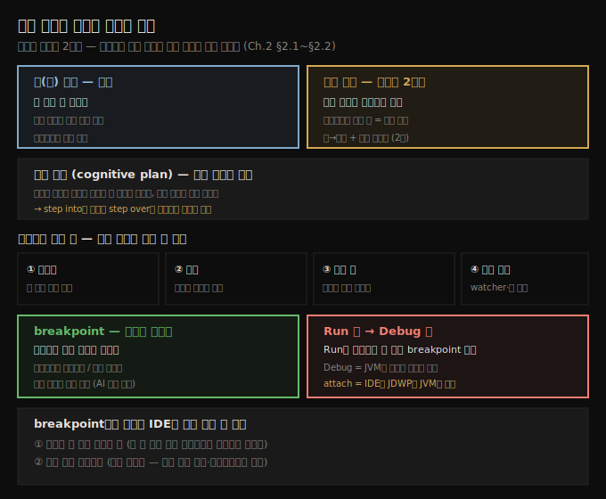

# 코드 읽기의 본질과 디버거 기초
---
> 코드 읽기는 시(詩) 읽기와 달리 비선형 2차원 활동이고, 명령마다 새 조사 평면(plan)이 열려 복잡해지므로, 디버거로 인지 부담을 덜며 *모르는 줄만* 멈춰 봅니다

이 노트는 『Troubleshooting Java』 2장의 전반부(§2.1~§2.2 도입)를 정리합니다. 디버거는 개발자가 코드를 이해하려 가장 먼저 배우는 도구이고, 모든 IDE에 기본 내장돼 있습니다(저자는 IntelliJ IDEA Community를 씁니다). 이 편에서는 *왜 읽기만으로는 부족한가*라는 인지적 배경을 먼저 잡고, 디버거의 기본 사용법(breakpoint·디버그 모드·attach)까지 익힙니다. 스택 트레이스와 step 조작은 다음 편(02-02)으로 이어집니다.




## 1. 코드 읽기는 시 읽기와 다르다 — 비선형 2차원
> 시는 한 줄씩 선형으로 읽지만 코드는 명령 안팎을 넘나드는 미로 읽기이며, 같은 코드는 누구에게나 같은 뜻이고 그 뜻이 조사의 목표입니다

모든 코드 조사는 코드를 읽는 데서 시작하지만, 코드 읽기는 시 읽기와 다릅니다. 시는 주어진 선형 순서대로 한 줄씩 따라가며 머릿속에서 의미를 조립하고, 같은 구절을 두 번 읽으면 다른 것을 이해할 수도 있습니다. 코드는 정반대입니다.

- 첫째, **코드는 선형이 아닙니다**. 한 줄씩 내려가는 게 아니라 명령 안팎을 넘나들며 데이터에 미치는 영향을 파악합니다. 곧은 길이 아니라 미로에 가까워서, 주의하지 않으면 어디서 시작했는지 잊고 길을 잃습니다.
- 둘째, **코드는 누구에게나 같은 뜻**입니다. 시와 달리 해석이 갈리지 않고, 그 객관적 의미를 밝혀내는 것이 조사의 목표입니다.

저자는 listing 2.1의 `decode` 메서드를 예로 듭니다. 위에서 아래로 읽으면, 일부 동작을 *추측*해야만 이해가 됩니다.

```java
// da-ch2-ex1 프로젝트
public class Decoder {
  public Integer decode(List<String> input) {
    int total = 0;
    
    for (String s : input) {
      var digits = new StringDigitExtractor(s).extractDigits();
      total += digits.stream().collect(Collectors.summingInt(i -> i));
    }
    return total;
  }
}
```

- 이 작은 코드에도 두 가지 불확실성이 있습니다. `StringDigitExtractor()` 생성자가 단지 객체만 만드는지 아니면 인자 값을 바꾸는지, 그리고 `extractDigits()`가 자릿수 리스트를 돌려주는지 아니면 객체 내부 인자까지 바꾸는지입니다. 
- 메서드 이름이 늘 충분히 시사적이지는 않아서, 이름에만 기댈 수 없고 실제 동작을 더 깊이 들여다봐야 합니다.


## 2. 인지 평면(cognitive plan) — 적게 열수록 단순해진다
> 명령 하나에 들어갈 때마다 새 조사 평면이 열려 인지 복잡도가 쌓이고, 평면을 적게 열수록 조사가 단순해지므로 들어갈지 건너뛸지를 선택해야 합니다

저자는 코드 읽기를 **2차원**으로 비유합니다. 한 차원은 코드를 위에서 아래로 읽는 것이고, 다른 차원은 특정 명령 *안으로* 들어가 상세를 이해하는 것입니다. 시는 경로가 하나뿐이지만, 코드 분석은 같은 로직을 지나는 여러 경로를 만들어 냅니다.

핵심 개념이 **조사 평면(investigation plan)**입니다. 메서드 안으로 들어갈 때마다 새 평면을 열고, 이전 평면은 뒤에 남겨 둡니다. 지금 보는 코드가 현재 평면이고, 거기 보이는 메서드는 자기만의 평면을 숨기고 있습니다. 메서드로 더 많이 뛰어들수록 더 많은 평면이 열립니다.

> **평면을 많이 열수록 디버깅이 복잡해지고, 적게 열수록 단순해집니다.** 그래서 어떤 명령을 건너뛰어 전체 조사를 단순하게 할지, 아니면 안으로 들어가 그 명령을 자세히 이해하되 복잡도를 높일지를 매번 선택해야 합니다.

이 "평면을 최소로 연다"는 원칙은 뒤에서 다룰 step over 우선 전략의 근거이기도 합니다. 조사를 빠르게 하는 요령은 가능한 한 적은 평면을 여는 것입니다.


## 3. AI로 코드 읽기 보조 — 가정을 드러내게 하라
> LLM은 코드 목적을 잘 직관하지만 제공받지 않은 부분은 가정으로 메우므로, 그 가정 목록을 받아 다음 평면 정보를 더해 가며 결론에 다가갑니다

코드 읽기는 ChatGPT 같은 LLM 도구로 크게 보조할 수 있습니다. `decode`를 단계별로 설명해 달라고 요청하면, LLM은 메서드 목적(리스트의 모든 문자열에서 자릿수를 추출해 합산)을 정확히 짚어 줍니다. 다만 `StringDigitExtractor`의 정의를 주지 않았으므로, LLM은 그 클래스가 문자열을 받아 자릿수 컬렉션을 돌려준다는 **가정(assumptions)**을 세우고, 그 가정 목록을 함께 제시합니다.

저자의 경험상 LLM은 가정을 세웠다면 거의 항상 그 목록을 함께 내놓습니다. 목록이 없는데 가정이 있었을 것 같으면, 어떤 가정을 했는지 되물으면 됩니다. 결과가 만족스럽지 않으면 *다음 인지 평면*의 정보를 더 제공하며 대화를 이어 결론에 다다릅니다.

> **팁**: 대부분의 LLM은 이미지에서 텍스트를 잘 추출합니다. 코드를 복사·붙여넣기 어렵지만 화면 캡처는 가능하다면, 이미지로 제공해도 같은 결과를 얻습니다.


## 4. 디버거가 하는 일 — 인지 부담을 덜어 주는 네 가지
> 디버거는 실행을 멈추고 한 줄씩 수동 실행하게 하며, 어디서 왔는지 지도처럼 보여 주고, 변수 값을 드러내고, watcher·식 평가로 즉석 실험을 허용합니다

디버거는 코드를 이해하는 인지적 노력을 줄여 주는 도구입니다. 인터페이스는 IDE마다 조금 다르지만 기능은 대체로 같습니다. 디버거가 조사를 단순하게 만드는 방식은 네 가지입니다.

- 특정 단계에서 실행을 **멈추고**, 각 명령을 자기 속도로 수동 실행하게 해 줍니다.
- 코드 읽기 경로에서 **지금 어디에 있고 어디서 왔는지**를 보여 줍니다(세부를 기억하는 대신 지도로 씀).
- 변수가 담은 **값**을 보여 줘 조사를 시각화하기 쉽게 합니다.
- watcher와 식(expression) 평가로 **즉석에서 실험**하게 해 줍니다.

디버거를 언제 쓰느냐의 전제 조건은 *무엇을 조사할지 아는 것*입니다. 첫 단계가 멈출 명령을 고르는 것이기 때문입니다. 어디를 조사할지 모를 때는 다른 기법(프로파일러 등, 후속 장)으로 먼저 그 지점을 찾아야 합니다. 2~3장은 디버거에만 집중하므로, 조사할 코드는 이미 찾았다고 가정합니다.


## 5. breakpoint — 모르는 줄에만 찍는다
> 이해되는 줄은 멈추지 말고, 이해되지 않거나 예외 직전인 줄에 breakpoint를 찍어 그 줄에 집중합니다

조사는 멈출 첫 줄을 고르는 데서 시작합니다. 저자는 먼저 디버거 없이 코드를 읽어 *이해되는 부분과 안 되는 부분*을 가르라고 권합니다. `decode` 예제에서, 리스트를 받아 각 항목을 처리해 정수를 계산한다는 큰 흐름은 디버거 없이도 알 수 있습니다. 어려운 줄은 자기 로직을 숨긴 줄입니다. `digits.stream().collect(Collectors.summingInt(i -> i))`는 Java 8부터의 Stream API라 알 만하지만, `new StringDigitExtractor(s).extractDigits()`는 조사 대상 코드베이스의 일부라 무엇이든 할 수 있습니다. 게다가 `var`로 타입을 추론하면 읽기가 더 어려워져 디버거가 더 필요해지기도 합니다.

저자가 관찰한 비효율은, 주니어가 코드 블록의 *첫 줄*부터 디버깅을 시작하는 습관입니다. 더 나은 방법은 먼저 디버거 없이 읽어 보고(AI 도움 가능), *어려워지는 지점부터* 디버깅을 시작하는 것입니다. 그러면 디버거가 필요 없다는 걸 알아채 시간을 아낄 수도 있습니다. 예외가 어느 줄에서 나는지 모를 땐 예외 직전에 breakpoint를 찍습니다. 원칙은 하나입니다 — **이해되는 명령은 멈추지 말고, 집중하려는 줄에만 breakpoint를 씁니다.**

> 한 가지 전략은 IDE 스코프에 표시되는 변수를 줄여 관련된 것만 보는 것입니다. LLM에게 디버깅에 관련된 변수를 식별해 불필요한 것을 빼도록 도움받을 수 있습니다.

이 예제에서는 11번 줄 `var digits = new StringDigitExtractor(s).extractDigits();`에 breakpoint를 찍습니다. 보통 줄 번호 근처를 클릭하거나 단축키(IntelliJ는 Ctrl-F8 / macOS는 Command-F8)로 추가하며, breakpoint는 원(circle)으로 표시됩니다. 표시 영역은 *거터(gutter)*라 부릅니다.


## 6. Run이 아니라 Debug — JDWP로 JVM에 붙는다
> breakpoint가 듣게 하려면 Run이 아닌 Debug로 실행해야 하며, 디버거를 붙인다는 것은 IDE가 JDWP로 JVM에 연결해 멈추고 들여다보는 것입니다

흔한 실수가 하나 있습니다.

> **주의**: 디버거가 동작하려면 반드시 **Debug** 옵션으로 앱을 실행해야 합니다. **Run** 옵션을 쓰면 IDE가 디버거를 실행 프로세스에 붙이지 않으므로 breakpoint가 무시됩니다. 일부 IDE는 기본으로 디버거를 붙이기도 하지만, IntelliJ나 Eclipse처럼 그렇지 않은 경우엔 멈추지 않습니다.

디버거를 붙인다(attach)는 것은 IDE가 실행 중인 Java 프로그램에 연결해 제어·검사한다는 뜻입니다. 

- 디버그 모드로 앱을 실행하면, JVM이 디버거 연결을 받아들이는 특별한 설정으로(로컬 포트를 통해) 시작합니다. IDE가 붙을 때 이 포트에 연결하고 **JDWP(Java Debug Wire Protocol)**로 통신합니다. 
- 이 구조 덕분에 프로그램을 멈추고, 코드를 단계 실행하고, 변수를 검사하고, breakpoint를 거는 일이 가능해집니다.

> 💬 **정의**: 디버거를 붙인다는 것은 IDE가 특별한 방식으로 JVM에 연결해, 코드가 어떻게 도는지 지켜보고 제어하게 하는 것입니다.

breakpoint에서 실행이 멈추면 IDE는 두 가지 핵심 정보를 보여 줍니다. **스코프 안 모든 변수의 값**과 **실행 스택 트레이스(execution stack trace)**입니다. 실행은 표시한 줄을 실행하기 *직전*에 멈추므로, 데이터 상태는 그대로 유지됩니다. 변수 값은 직관적으로 이해되지만, 스택 트레이스는 경험에 따라 낯설 수 있습니다. 다음 편에서 스택 트레이스가 무엇이고 왜 필수인지, 그리고 step over·into·out으로 코드를 어떻게 누비는지 다룹니다.


## 7. 면접 한 줄 정리
> 코드 읽기의 본질과 디버거 기초 개념을 한 문장으로 점검합니다

- **코드 읽기가 시 읽기와 다른 점은?** 시는 선형이지만 코드는 명령 안팎을 넘나드는 비선형 2차원 활동이고, 코드는 누구에게나 같은 뜻이라 그 객관적 의미를 밝히는 게 목표입니다.
- **인지 평면(plan)이란?** 메서드 안으로 들어갈 때마다 열리는 조사 단위로, 많이 열수록 복잡해집니다. 그래서 step into를 줄이고 step over를 우선하는 전략의 근거가 됩니다.
- **breakpoint는 어디에 찍나?** 이해되는 줄이 아니라, 이해되지 않거나 예외 직전인 줄에만 찍어 그 줄에 집중합니다. 블록 첫 줄부터 시작하는 건 비효율입니다.
- **Run과 Debug의 차이는?** Run은 디버거를 붙이지 않아 breakpoint가 무시되고, Debug는 JVM을 디버그 설정으로 띄워 IDE가 JDWP로 붙습니다.
- **디버거를 붙인다(attach)는?** IDE가 로컬 포트를 통해 JVM에 JDWP로 연결해, 멈추고·단계 실행하고·변수를 검사하는 것입니다.


## 관련 문서
- [이 책 인덱스 (Troubleshooting Java MOC)](./README.md) — 장별 정독 노트 진척
- [조사 기법의 네 시나리오와 AI 활용](./01-02.조사%20기법의%20네%20시나리오와%20AI%20활용.md) — 디버거가 첫 시나리오(단순 출력 문제)에서 쓰이는 맥락
- [실행 스택 트레이스와 코드 네비게이션](./02-02.실행%20스택%20트레이스와%20코드%20네비게이션.md) — stack trace로 숨은 로직 찾기 + step over/into/out
