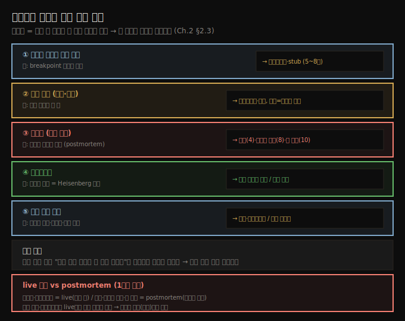

# 디버거가 부족한 다섯 가지 상황
---
> 디버거는 실행 중인 코드를 누비는 도구라, 시작점이 없거나·성능 문제·크래시·멀티스레드·시간 민감 연산에서는 통하지 않으므로, 헛심 쓰기 전에 다른 기법으로 갈아타야 합니다

이 노트는 『Troubleshooting Java』 2장의 마지막 절(§2.3)을 정리합니다. 디버거는 코드를 누비며 데이터와 어떻게 맞물리는지 이해하는 훌륭한 도구지만, 모든 코드를 디버거로 조사할 수는 없습니다. 디버거가 *불가능하거나 부족한* 다섯 상황을 미리 알아 두면, 안 되는 데 시간을 버리지 않고 적절한 기법으로 곧장 넘어갈 수 있습니다.

## 1. 시작점을 모르는 출력 문제 — 프로파일러·stub로 먼저 찾는다
> 잘못된 출력을 내는 코드 위치를 모르면 breakpoint를 어디 찍을지 모르므로, 프로파일링이나 stub로 조사 시작점부터 찾아야 합니다

디버깅을 시작하려면 *잘못된 출력을 만드는 코드 부분*부터 찾아야 합니다. 클래스 설계가 깔끔한 앱은 출력 담당 부분을 비교적 쉽게 찾지만, 설계가 부실한 앱은 어디서 무슨 일이 일어나는지, 따라서 어디에 디버거를 쓸지 찾기가 더 어렵습니다.

이럴 때는 디버거를 쓰기 *전에* 다른 기법으로 조사할 코드를 먼저 찾아야 합니다. 뒤 장에서 다룰 프로파일링이나 stub 같은 기법이 디버거로 조사를 시작할 지점을 짚어 줍니다. 즉 디버거는 시작점을 *아는* 상태를 전제로 하는 도구이고, 시작점 탐색은 디버거의 일이 아닙니다.

## 2. 성능 문제 — 프로파일링·로깅, 완전 멈춤엔 스레드 덤프
> 느리거나 멈추는 성능 문제는 디버거로 조사하기 어렵고, 프로파일링·로깅으로 풀며, 앱이 완전히 멈추면 스레드 덤프가 가장 직선적인 경로입니다

성능 문제는 디버거로 조사하기 어려운 부류입니다. 느린 앱이나 완전히 얼어붙는 앱이 흔한 성능 문제입니다. 대부분은 프로파일링과 로깅(4~8장)으로 트러블슈팅합니다.

앱이 *완전히 막힌(block)* 특정 상황에서는, 스레드 덤프를 떠서 분석하는 것이 가장 직선적인 경로입니다. 스레드 덤프 분석은 8장에서 다룹니다. 디버거는 한 줄씩 멈춰 보는 도구라, 어디가 느린지·왜 멈췄는지를 전체적으로 조망하는 데는 맞지 않습니다.

## 3. 크래시 — 실행이 멈추면 디버거는 무력하다
> 앱이 크래시해 실행이 멈추면 디버거는 관찰할 대상이 없으므로, 로그·스레드 덤프·힙 덤프 같은 사후 데이터로 거슬러 올라갑니다

앱이 문제를 만나 실행이 멈췄다면(크래시), 코드에 디버거를 쓸 수 없습니다. 디버거는 *실행 중인* 앱을 관찰하는 도구라, 앱이 더 이상 돌지 않으면 명백히 소용이 없습니다.

무슨 일이 있었는지에 따라 로그를 감사하거나(4장), 스레드 덤프(8장)나 힙 덤프(10장)를 조사해야 합니다. 이는 1장에서 다룬 postmortem investigation의 영역이고, 디버거(live 조사)와 성격이 갈리는 지점입니다.

## 4. 멀티스레드 — Heisenberg 효과와 복합 기법
> 디버거의 간섭이 멀티스레드 앱의 동작을 바꾸는 Heisenberg 효과 탓에, 스레드를 하나로 격리하거나 디버깅·모킹·프로파일링을 묶어 써야 합니다

대부분의 개발자가 멀티스레드 구현을 가장 조사하기 어려워합니다. 이런 구현은 디버거 같은 도구의 간섭에 쉽게 영향을 받기 때문입니다.

> 💬 **개념**: 이 간섭이 **Heisenberg 효과**(1장에서 다룸)를 만듭니다 — 디버거를 쓸 때의 앱 동작이 간섭하지 않을 때와 달라집니다.

때로는 조사를 한 스레드로 격리해 디버거를 쓸 수 있지만, 대부분의 가장 복잡한 시나리오에서는 디버깅·모킹/스터빙·프로파일링을 아우르는 *기법의 묶음*을 적용해야 동작을 이해할 수 있습니다. 단일 도구로 풀리지 않는다는 점이 멀티스레드 조사의 핵심입니다.

## 5. 시간 민감 연산 — 멈추면 상태가 만료된다
> 디버거로 멈춰 생각하는 동안 토큰·타이머·세션이 만료되어 동작이 달라질 수 있어, 로깅·시뮬레이션 같은 다른 전략이나 각별한 주의가 필요합니다

시간 민감(time-sensitive) 연산은 디버거로 조사하기 까다롭습니다. 코드가 도는 데 걸리는 시간에 따라 동작이 달라지는 실행을 말하며, 특히 디버거로 한 단계씩 밟을 때 문제가 됩니다. 예를 들면 이렇습니다.

- 일정 시간 뒤 만료되는 **액세스 토큰** — 디버거에서 너무 오래 머물면 조사를 마치기 전에 토큰이 만료됩니다.
- 정해진 간격 뒤 특정 케이스를 트리거하는 **타이머**.
- 너무 오래 멈추면 만료되는, 다른 앱·시스템과의 **짧은 수명 세션**.

디버깅은 본래 관찰한 것을 충분히 생각하며 시간을 들이고 싶은 활동입니다(멈추고 성찰하고, 새 가설마다 새로 시작하는). 그래서 시간 민감 연산은 전통적인 단계별 디버깅과 잘 맞지 않고, 로깅이나 시뮬레이션 같은 *다른 전략*을 쓰거나 멈출 때 각별히 주의해야 합니다.

## 6. 한눈에 보는 대안 매핑
> 다섯 상황과 그때 갈아탈 기법을 한 표로 정리합니다

| 디버거가 부족한 상황 | 왜 안 되나 | 대신 쓰는 기법 (장) |
|---------------------|-----------|--------------------|
| 시작점 모르는 출력 문제 | breakpoint 위치를 모름 | 프로파일링·stub (5~8장) |
| 성능 문제 (느림·멈춤) | 전체 조망이 안 됨 | 프로파일링·로깅 (4~8장), 완전 멈춤은 스레드 덤프 (8장) |
| 크래시 (실행 정지) | 관찰할 실행이 없음 | 로그(4장)·스레드 덤프(8장)·힙 덤프(10장) |
| 멀티스레드 | Heisenberg 간섭 | 단일 스레드 격리 또는 디버깅+모킹+프로파일링 묶음 |
| 시간 민감 연산 | 멈추면 상태 만료 | 로깅·시뮬레이션, 또는 멈춤 최소화 |

## 7. 면접 한 줄 정리
> 디버거의 한계와 대안을 한 문장으로 점검합니다

- **디버거를 쓰면 안 되는 대표 상황은?** 시작점 모르는 출력 문제, 성능 문제, 크래시, 멀티스레드, 시간 민감 연산입니다. 공통점은 *실행 중인 코드를 한 줄씩 누비는* 디버거의 전제가 깨진다는 점입니다.
- **크래시에 디버거가 무력한 이유는?** 디버거는 실행 중인 앱을 관찰하는 도구인데 크래시하면 관찰할 실행이 없습니다. 그래서 로그·스레드 덤프·힙 덤프 같은 사후 데이터로 거슬러 올라갑니다.
- **Heisenberg 효과란?** 디버거의 간섭으로 멀티스레드 앱의 동작이 간섭 전과 달라지는 현상입니다. 단일 스레드 격리나 복합 기법으로 우회합니다.
- **시간 민감 연산이 디버거와 안 맞는 이유는?** 멈춰 생각하는 동안 토큰·타이머·세션이 만료되어 동작 자체가 바뀌기 때문입니다. 로깅·시뮬레이션으로 대체합니다.

## 관련 문서
- [이 책 인덱스 (Troubleshooting Java MOC)](./README.md) — 장별 정독 노트 진척
- [실행 스택 트레이스와 코드 네비게이션](./02-02.실행%20스택%20트레이스와%20코드%20네비게이션.md) — 디버거가 통하는 영역의 핵심 기법
- [조사 기법의 네 시나리오와 AI 활용](./01-02.조사%20기법의%20네%20시나리오와%20AI%20활용.md) — 증상별 기법 선택의 큰 그림 (이 편의 대안 기법들이 어느 시나리오에 속하는지)
