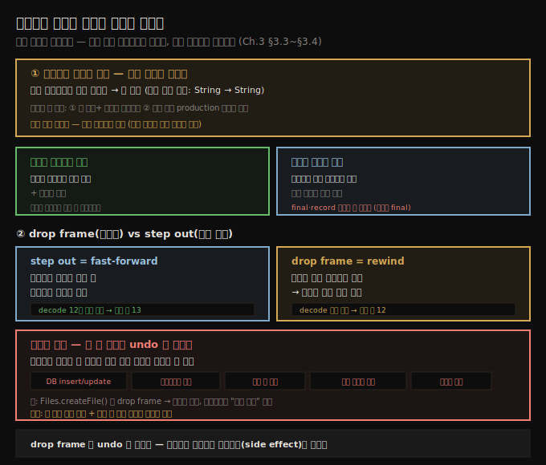

# 인메모리 데이터 변경과 프레임 되감기
---
> 디버거가 멈춘 자리에서 변수 값을 즉석에서 바꿔 원하는 시나리오를 만들고, 프레임을 떨궈(drop frame) 메서드 호출 직전으로 되감을 수 있지만, 앱 밖을 바꾼 변경은 되감아도 되돌릴 수 없습니다

이 노트는 『Troubleshooting Java』 3장의 후반부(§3.3~§3.4)를 정리합니다. 앞 편(03-01)이 *중단점을 어떻게 거느냐*였다면, 이 편은 *실행 흐름을 어떻게 움직이느냐* — 멈춘 상태에서 데이터를 바꿔 시나리오를 만들고, 실행을 뒤로 되감는 두 기법을 다룹니다. 되감기의 치명적 함정(외부 변경 되돌리기 불가)이 이 편의 핵심 경고입니다.




## 1. 인메모리 데이터 변경 — 없는 입력을 만들어 낸다
> 디버거가 멈춘 스코프에서 변수 값을 직접 바꾸면, 필요한 입력 데이터가 없어도 원하는 조사 시나리오를 즉석에서 만들 수 있습니다

디버거가 멈췄을 때 스코프 변수의 값을 바꾸면 조사가 쉬워집니다. IntelliJ에서 변수를 우클릭해(디버거가 스코프 값을 보여 주는 프레임에서) 새 값을 넣습니다. `da-ch3-ex1`에서 `s` 변수를 `"ab1c"`에서 `"abcd"`로 바꾸면, `extractDigits()`가 `"abcd"`를 받아 자릿수가 없으니 빈 리스트를 돌려줍니다. 입력 데이터가 없어도 다른 시나리오를 시험할 수 있는 셈입니다.

> **주의**: 반드시 변수의 *타입에 맞는* 값을 써야 합니다. `String` 변수를 바꾼다면 여전히 `String` 값이어야 하고, `long`이나 `Boolean`을 넣을 수 없습니다.

이 기법이 빛나는 두 시나리오가 있습니다.

- **장시간 프로세스** — 가끔 한 시간 넘게 걸리는 스케줄 프로세스에서, 특정 파라미터 값이 잘못된 출력을 낸다고 의심하고 이를 확인하려는 경우. 중단점(조건부든 아니든)으로 그 지점까지 실행을 기다리면 너무 오래 걸립니다.
- **재현 불가** — 코드는 빨리 끝나지만 내 환경에서 재현되지 않고, 보안 제약으로 접근할 수 없는 production에서만 나타나는 경우. 특정 파라미터 값에서 문제가 생긴다는 이론을 증명하려는 것입니다.


## 2. 조건부 중단점 vs 데이터 변경 — 무엇을 언제
> 데이터가 있고 실행이 짧으면 조건부 중단점, 데이터가 없거나 실행이 길면 변수 값 변경이며, 변경은 가설 확인용이고 두어 개까지가 적당합니다

두 기법은 첫 단계가 같습니다 — *어느 부분이 문제를 일으키는지에 대한 합리적 가설*이 필요합니다. 그다음 갈립니다.

| 상황 | 적합한 기법 |
|------|------------|
| 시나리오를 트리거할 데이터를 *이미 가짐* + 실행이 짧음 | 조건부 중단점 |
| 큰 리스트라 각 요소 처리에 수 초씩 걸려 조건 닿기가 느림 | 데이터 변경 (조건부는 조사를 크게 늦춤) |
| 시나리오를 만들 데이터가 *없음* | 데이터 변경 |
| 실행이 너무 오래 걸림 | 데이터 변경 |

그러면 "조건부 중단점은 왜 쓰나, 값을 바꿔 어떤 환경이든 만들면 되지 않나" 싶을 수 있습니다. 둘 다 장단이 있습니다. 

- 값 직접 변경은 *몇 개(저자 견해로는 최대 둘)만* 조정할 때 효과적이지만, 변경 범위가 커지면 시나리오 관리 복잡도가 급격히 오릅니다. 또 인메모리 변경은 보통 *문제에 대한 가설을 확인*하려는 것입니다. 
- 반대로 무엇이 잘못인지 전혀 모를 때는, 중단점으로 로직이 데이터를 어떻게 다루는지 *관찰*하는 편이 통찰을 줍니다.


## 3. 불변성의 벽 — final과 record는 못 바꾼다
> final 변수는 디버깅 중에도 값을 바꿀 수 없고, record의 속성은 암묵적으로 final이라 즉석 변경이 막힙니다

데이터 변경 기법에는 불변성(immutability)이라는 한계가 있습니다. IDE는 디버깅 중 `final` 변수의 값을 바꾸지 못합니다. 

Java record(Java 14 프리뷰, Java 16 정식)는 모델 계층의 불변성을 강화하는 좋은 수단이지만, 그 속성이 *암묵적으로 final*이라는 단점(이 맥락에서는)이 있습니다. 즉 디버깅 중 record 속성 값을 즉석에서 바꿀 수 없습니다. 불변을 위해 도입한 성질이 디버깅 시나리오 조작을 막는 셈입니다.


## 4. drop frame — 호출 직전으로 되감기
> 프레임을 떨구면 메서드 호출 *직전* 줄로 돌아가 그 호출을 다시 재생할 수 있으며, 이것이 step out과 갈리는 결정적 차이입니다

시간은 되돌릴 수 없지만 디버깅에서는 조사를 되감는 게 때로 가능합니다. 이를 **프레임 떨구기(dropping frames)**, 실행 프레임 떨구기, 프레임 종료라 부릅니다. 실행 프레임을 떨군다는 건 실행 스택에서 한 층 뒤로 가는 것입니다. 메서드 안으로 step into 했다가 돌아가고 싶을 때, 프레임을 떨궈 그 메서드가 호출된 자리로 돌아갑니다.

> 💬 **정의**: 프레임 떨구기란 콜 스택의 이전 지점으로 돌아가 그 지점부터 메서드를 다시 실행하는 것입니다. 전체를 재시작하지 않고 프로그램을 조금 되감아 코드 일부를 다시 돌려 볼 수 있게 합니다.

많은 개발자가 drop frame을 step out과 혼동합니다. 둘 다 현재 조사 평면을 닫고 호출 지점으로 돌아가는 것처럼 보이기 때문입니다. 하지만 큰 차이가 있습니다.

- **step out** = *빨리 감기(fast-forward)*. 현재 평면을 메서드가 *반환(또는 예외)할 때까지* 끝까지 실행한 뒤, 메서드가 빠져나온 *직후*에 멈춥니다. `extractDigits()`에서 step out 하면 `decode()`의 12번 줄(호출 자리)로 가지만, 다음 실행 줄은 **13번**입니다.
- **drop frame** = *되감기(rewind)*. 메서드가 호출되기 *전*의 이전 평면으로 돌아갑니다. `extractDigits()` 프레임을 떨구면 `decode()`로 돌아가되, 다음 실행 줄은 **12번**입니다. 즉 `extractDigits()` 실행 직전 줄로 되돌아가 호출을 다시 재생(step into나 step over로)할 수 있습니다.

IntelliJ에서는 실행 스택 트레이스의 메서드 층을 우클릭해 Drop Frame을 고릅니다. 같은 실행을 여러 번 반복하며 코드가 데이터를 어떻게 바꾸는지 되짚어 보면 이해에 도움이 됩니다.


## 5. 되감기의 함정 — 앱 밖 변경은 undo가 아니다
> 프레임을 떨궈도 DB·파일시스템·다른 앱·큐·이메일처럼 앱 메모리 밖을 바꾼 변경은 되돌릴 수 없으므로, 외부 변경이 없는지 확인하고 큰 코드 반복은 피합니다

drop frame을 쓸 때 각별히 주의해야 합니다. **앱 내부 메모리 밖의 값을 바꾸는 명령은 프레임을 떨궈도 되돌릴 수 없습니다.** 다음이 그런 경우입니다.

- 데이터베이스 데이터 변경 (insert·update·delete)
- 파일시스템 변경 (파일 생성·삭제·수정)
- 데이터를 바꾸는 다른 앱 호출
- 다른 앱이 읽는 큐에 메시지 추가
- 이메일 전송

트랜잭션을 커밋해 DB를 바꾼 뒤 프레임을 떨궈도 그 변경은 취소되지 않고, 다른 서비스에 무언가 POST한 엔드포인트 호출도, 보낸 이메일도 되돌릴 수 없습니다.

> **주의**: 프레임 떨구기는 undo(되돌리기)가 아닙니다.

listing 3.2가 이를 보여 줍니다.

```java
// da-ch3-ex2 프로젝트. 실행 시 앱 밖(파일시스템)을 바꾸는 메서드
public class FileManager {
  public boolean createFile(int i) {
    try {
      Files.createFile(Paths.get("File " + i));   // 파일시스템에 새 파일 생성
      return true;
    } catch (IOException e) {
      e.printStackTrace();
    }
    return false;
  }
}
```

- `Files.createFile()` 실행 후 프레임을 떨구면 호출 직전 줄로 돌아가지만, *생성된 파일은 파일시스템에 남습니다*. 
- 두 번째로 그 코드를 다시 실행하면 파일이 이미 있어 예외가 납니다. 가장 곤란한 점은 실무에서는 이게 이렇게 명백하지 않다는 것입니다. 
- 저자의 권고는 **큰 코드 덩어리의 반복 실행을 피하고, 이 기법을 쓰기 전에 그 로직이 외부 변경을 하지 않는지 확인하라**는 것입니다. 떨군 프레임을 다시 돌렸을 때 이상한 차이가 보이면, 코드가 외부를 바꿨기 때문일 수 있습니다. 큰 앱에서는 캐시나 interceptor(aspect)로 분리된 코드 때문에 이런 동작을 알아채기가 쉽지 않습니다.


## 6. 면접 한 줄 정리
> 데이터 변경과 프레임 되감기를 한 문장으로 점검합니다

- **인메모리 데이터 변경은 언제?**
- **왜 final·record는 못 바꾸나?**
- **drop frame과 step out의 차이는?**
- **drop frame의 치명적 함정은?**


## 정답 (자답 후 펼치기)

- **인메모리 데이터 변경은 언제?** 시나리오를 만들 데이터가 없거나 실행이 너무 길 때, 멈춘 스코프에서 변수 값을 직접 바꿔 시나리오를 만듭니다. 타입은 일치해야 하고, 보통 가설 확인용이며 두어 개까지가 적당합니다.
- **왜 final·record는 못 바꾸나?** IDE는 `final` 변수 값을 디버깅 중 바꾸지 못하고, record 속성은 암묵적 final이라 같은 제약을 받습니다.
- **drop frame과 step out의 차이는?** step out은 메서드를 끝까지 실행하고 빠져나온 직후에 멈추는 빨리 감기(다음 줄 13)이고, drop frame은 호출 *직전*으로 돌아가는 되감기(다음 줄 12)라 호출을 다시 재생할 수 있습니다.
- **drop frame의 치명적 함정은?** DB·파일·다른 앱·큐·이메일처럼 앱 밖을 바꾼 변경은 프레임을 떨궈도 되돌릴 수 없습니다. drop frame은 undo가 아닙니다.


## 실습 기록
> `da-ch3-ex2` — 저자 제공 앱(listing 3.2)으로 "외부 변경은 되돌릴 수 없다"를 직접 확인합니다

`Main`은 `createFile(0)`부터 `createFile(9)`까지 호출해 `File 0`~`File 9` 10개를 파일시스템에 만듭니다. drop frame이 메모리만 되감고 파일시스템은 못 되돌린다는 §5의 함정을, 앱을 두 번 실행해 재현했습니다.

**1차 실행**: 예외 없이 끝나고 `File 0`~`File 9` 10개가 생성됩니다.

**2차 실행**: 첫 호출 `createFile(0)`에서 곧바로 `java.nio.file.FileAlreadyExistsException: File 0`이 납니다. 1차에서 만든 파일이 그대로 남아 있기 때문입니다.

이 결과가 drop frame의 함정과 같은 원리입니다. drop frame으로 호출 직전 줄로 되감아도 이미 생성된 파일은 사라지지 않으므로, 같은 코드를 다시 재생하면 2차 실행과 똑같이 `FileAlreadyExistsException`을 만납니다. 디버거가 되돌릴 수 있는 것은 앱 메모리 안의 실행 상태뿐이고, 파일시스템 변경은 그 권한 밖입니다.


## 관련 문서
- [이 책 인덱스 (Troubleshooting Java MOC)](./README.md) — 장별 정독 노트 진척
- [조건부 중단점과 비중단 중단점](./03-01.조건부%20중단점과%20비중단%20중단점.md) — 3장 나머지 두 고급 기법
- [실행 스택 트레이스와 코드 네비게이션](./02-02.실행%20스택%20트레이스와%20코드%20네비게이션.md) — step out의 기본 동작(이 편은 drop frame과 대비)
