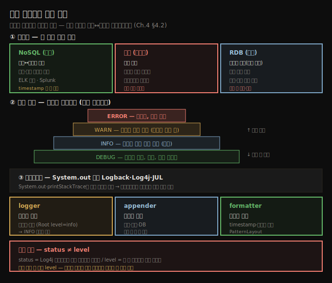

# 로그 영속화와 로깅 레벨
---
> 로그는 과거를 읽으려는 것이라 저장이 본질이고, 저장 방식(NoSQL·파일·RDB)은 성능과 일관성을 맞바꾸며, 심각도 레벨로 양을 줄여 ERROR부터 DEBUG까지 피라미드로 분류합니다

이 노트는 『Troubleshooting Java』 4장의 구현부 전반(§4.2.1~§4.2.2)을 정리합니다. 앞 편(04-01)이 로그로 *조사하는* 기법이었다면, 이 편은 로그를 *구현하는* 쪽입니다. 로그를 어디에 저장할지(영속화)와, 심각도로 어떻게 분류해 양을 다스릴지(로깅 레벨), 그리고 Log4j로 그것을 실제 구현하는 법을 다룹니다. 로그의 부작용(보안·성능·유지보수성)은 다음 편(04-03)으로 이어집니다.




## 1. 로그 영속화 — 과거를 읽으려면 저장해야 한다
> 로그는 현재보다 과거에 집중하므로 나중에 읽으려면 저장이 필수이고, 저장 방식이 로그의 쓸모와 앱 성능을 좌우합니다

영속성(persistence)은 로그 메시지의 핵심 성질입니다. 로깅이 다른 조사 기법과 다른 점은 현재보다 *과거*에 집중한다는 것이라, 지나간 일을 읽으려면 앱이 로그를 저장해야 합니다. 어떻게 저장하느냐가 로그의 사용성과 앱 성능에 영향을 줍니다. 저자가 본 세 가지 방식이 있습니다.


## 2. 세 가지 저장 방식 — 성능과 일관성의 트레이드오프
> NoSQL은 성능을 위해 일관성을 양보하고(ELK·Splunk), 파일은 느리고 검색이 어려워 권장하지 않으며, RDB는 일관성을 보장하되 성능을 희생해 금융·결제 규제에 씁니다

| 방식 | 성격 | 언제 |
|------|------|------|
| NoSQL (비관계형) | 성능↔일관성 타협. 로그를 놓치거나 정확한 시간 순서가 아닐 수 있음 | 가장 흔함. ELK 스택·Splunk 같은 엔진으로 저장·검색·분석 |
| 파일 | 과거 방식. 대체로 느리고 검색이 어려움 | 권장하지 않음 (튜토리얼엔 많지만 현대 앱은 피함) |
| RDB (관계형) | 일관성 보장(로그 유실 없음), 대신 성능 희생 | 드묾. 금융 앱·결제처럼 유실이 허용 안 되는 규제 대상 |

**NoSQL**은 성능을 위해 데이터베이스가 로그를 놓치거나 정확한 시간 순서를 안 지킬 여지를 줍니다. 그래서 로그 메시지에는 *저장 시각(timestamp)*이 (되도록 맨 앞에) 늘 있어야 합니다. 오늘날 가장 많이 쓰는 두 엔진은 ELK 스택과 Splunk입니다.

**파일** 저장은 과거 방식입니다. 옛 앱에서 여전히 보이지만, 느리고 검색이 어려워 현대 앱에서는 피해야 합니다.

**RDB**는 데이터 일관성을 보장해 로그가 유실되지 않지만, 그 대가로 성능을 양보합니다. 대부분의 앱은 로그 한 건을 잃어도 큰일이 아니라 일관성보다 성능을 택하지만, 예외가 있습니다 — 전 세계 정부가 금융 앱, 특히 결제 기능에 로그 규제를 두며, 이런 기능은 잃어선 안 되는 특정 로그를 가져야 하고 위반 시 제재·벌금을 받습니다.


## 3. 로깅 레벨 — 심각도 피라미드로 양을 다스린다
> 레벨은 메시지를 중요도로 분류해 저장량을 줄이는 장치로, 위로 갈수록 적고 중대하며 아래로 갈수록 많고 덜 중요해 DEBUG는 기본 비활성입니다

로깅 레벨(심각도)은 메시지를 조사 중요도로 분류하는 방법입니다. 앱은 실행 중 많은 로그를 쏟아 내지만, 모든 메시지의 모든 세부가 늘 필요하진 않습니다. 가장 흔한 네 레벨은 다음과 같습니다.

- **ERROR** — 치명적 문제. 항상 로그로 남깁니다. Java의 처리 안 된 예외가 보통 여기 해당합니다.
- **WARN** — 잠재적 오류이나 앱이 처리한 사건. 예를 들어 외부 시스템 연결이 처음엔 실패했다가 재시도로 성공하면 경고로 남깁니다.
- **INFO** — "평범한" 로그. 앱의 주요 실행 사건으로, 대부분 상황에서 동작을 이해하게 해 줍니다.
- **DEBUG** — INFO로 부족할 때만 켜는 세밀한 세부.

> 💬 **심각도 피라미드**: 위쪽에는 즉시 대응이 필요한 적은 수의 치명적 메시지가, 아래로 갈수록 더 많지만 덜 중요하고 조사에 드물게 필요한 메시지가 옵니다. 위에서 아래로 갈수록 양은 늘고 중요도는 줄어듭니다.

DEBUG 메시지는 수가 많아 조사를 오히려 어렵게 하므로 보통 기본 비활성이고, 세밀한 세부가 필요한 문제를 만났을 때만 켭니다. 심각도로 분류하면 저장하는 로그 수를 최소화할 수 있고, 정말 필요한 세부만 남기는 것이 좋은 습관입니다.


## 4. 로깅 프레임워크 — System.out 대신 Log4j
> System.out·printStackTrace는 설정 유연성이 없어, Logback·Log4j·JUL 같은 프레임워크로 재컴파일 없이 레벨을 바꿔 가며 로깅합니다

Java를 처음 배울 때 `System.out`·`System.err`로 콘솔에 찍고, `printStackTrace()`로 예외를 남기는 법을 배웁니다. 하지만 이런 방식은 설정 유연성이 부족해 실무에선 **로깅 프레임워크**를 권합니다. Java 생태계는 Logback, Log4j, Java Logging API(JUL) 등을 제공하며 사용법이 비슷합니다. Log4j 예제를 봅니다(da-ch4-ex2).

```xml
<!-- listing 4.3 — pom.xml에 Log4j 의존성 추가 -->
<dependency>
  <groupId>org.apache.logging.log4j</groupId>
  <artifactId>log4j-api</artifactId>
  <version>2.14.1</version>
</dependency>
<dependency>
  <groupId>org.apache.logging.log4j</groupId>
  <artifactId>log4j-core</artifactId>
  <version>2.14.1</version>
</dependency>
```

의존성을 넣으면 로그를 쓸 클래스에서 `Logger` 인스턴스를 선언합니다. 가장 간단한 방법은 `LogManager.getLogger()`이고, 사건의 심각도와 같은 이름의 메서드(`info()`·`debug()` 등)로 메시지를 남깁니다.

```java
// listing 4.4 — 심각도별 로그 작성
public class StringDigitExtractor {
  private static Logger log = LogManager.getLogger();   // 현재 클래스용 logger 선언

  public List<Integer> extractDigits() {
    log.info("Extracting digits for input {}", input);   // INFO 심각도
    List<Integer> list = new ArrayList<>();
    for (int i = 0; i < input.length(); i++) {
      log.debug("Parsing character {} of input {}",      // DEBUG 심각도
          input.charAt(i), input);
      if (input.charAt(i) >= '0' && input.charAt(i) <= '9') {
        list.add(Integer.parseInt(String.valueOf(input.charAt(i))));
      }
    }
    log.info("Extract digits result for input {} is {}", input, list);
    return list;
  }
}
```


## 5. logger·appender·formatter — Log4j 설정의 세 축
> logger는 무엇을 쓸지, appender는 어디에 쓸지, formatter는 어떻게 쓸지를 정하며, XML 설정으로 재컴파일 없이 레벨을 바꿉니다

`Logger`로 무엇을 쓸지 정한 뒤, *어떻게·어디에* 쓸지는 Log4j를 설정합니다. 클래스패스에 둘 `log4j2.xml`(Maven의 resources 폴더)에서 세 가지를 정의합니다.

- **logger** — 어떤 메시지를 어느 appender로 보낼지. 예제의 `Root`는 앱 어디서든 온 메시지를 받고, `level="info"`는 *INFO 이상* 심각도만 로그함을 뜻합니다. 특정 부분의 메시지만 남기도록 정할 수도 있어, 프레임워크 로그는 빼고 내 앱 로그만 남기는 데 유용합니다.
- **appender** — 어디에 쓸지. 콘솔·파일·DB 등 저장 방식을 구현합니다(§4.2.1). 실무에선 여러 appender를 둘 수 있습니다.
- **formatter** — 어떻게 쓸지. timestamp·심각도 같은 형식을 메시지에 입힙니다.

```xml
<!-- listing 4.5 — appender(콘솔)와 logger(Root, info) 정의 -->
<Configuration status="WARN">
  <Appenders>
    <Console name="Console" target="SYSTEM_OUT">
      <PatternLayout pattern="%d{yy-MM-dd HH:mm:ss.SSS} [%t] %-5level %logger{36} - %msg%n"/>
    </Console>
  </Appenders>
  <Loggers>
    <Root level="info">
      <AppenderRef ref="Console"/>
    </Root>
  </Loggers>
</Configuration>
```

이 설정으로 실행하면 DEBUG는 INFO보다 심각도가 낮아 찍히지 않습니다. `Root`의 `level`을 `debug`로 바꾸면(listing 4.6) DEBUG 메시지까지 나옵니다.

> **status ≠ level (혼동 주의)**: `<Configuration>`의 `status` 속성은 *Log4j 라이브러리 자체*가 겪는 문제(라이브러리 내부 이벤트)의 심각도이고, `level` 속성이 *내 앱 메시지*가 심각도에 따라 찍힐지를 정합니다. 대개 신경 쓸 것은 `level`입니다.

로깅 라이브러리의 큰 이점은 **재컴파일 없이** 설정만 바꿔 필요한 것만 로그할 수 있다는 점입니다. 조사에 필요한 최소한의 메시지만 남기는 것이 로그 가독성·앱 성능·유지보수성에 모두 좋습니다.


## 6. 면접 한 줄 정리
> 영속화와 로깅 레벨의 핵심을 한 문장으로 점검합니다

- **로그 저장 세 방식의 트레이드오프는?** NoSQL은 성능 위해 일관성 양보(ELK·Splunk), 파일은 느리고 검색 어려워 비권장, RDB는 일관성 보장하되 성능 희생(금융·결제 규제). 대부분은 성능>일관성이라 NoSQL입니다.
- **로깅 레벨은 왜 두나?** 중요도로 분류해 저장량을 줄이려는 것입니다. ERROR<WARN<INFO<DEBUG 순으로 위는 적고 중대, 아래는 많고 덜 중요해 DEBUG는 기본 비활성입니다.
- **왜 System.out 대신 프레임워크인가?** `System.out`·`printStackTrace`는 설정 유연성이 없지만, Log4j·Logback은 재컴파일 없이 레벨을 바꿀 수 있습니다.
- **logger·appender·formatter의 역할은?** logger는 무엇을(어떤 심각도·출처), appender는 어디에(콘솔·파일·DB), formatter는 어떻게(timestamp·심각도 형식) 쓸지를 정합니다.
- **status와 level의 차이는?** status는 Log4j 라이브러리 자체 이벤트의 심각도, level은 내 앱 메시지가 찍힐 심각도입니다. 보통 신경 쓸 것은 level입니다.


## 관련 문서
- [이 책 인덱스 (Troubleshooting Java MOC)](./README.md) — 장별 정독 노트 진척
- [로그로 조사하기](./04-01.로그로%20조사하기.md) — 로그로 예외·호출자·시간·멀티스레드를 조사하는 기법
- [로그가 일으키는 세 가지 문제](./04-03.로그가%20일으키는%20세%20가지%20문제.md) — 보안·성능·유지보수성 부작용과 회피법
