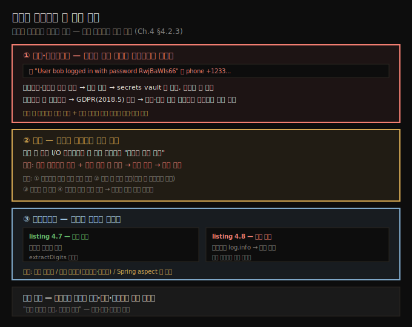

# 로그가 일으키는 세 가지 문제
---
> 로그는 필수지만 잘못 다루면 해가 됩니다 — 민감 정보를 노출하면 보안·프라이버시 문제, 너무 많이 쓰면 성능 문제, 코드를 어지럽히면 유지보수성 문제를 일으킵니다

이 노트는 『Troubleshooting Java』 4장의 마지막 절(§4.2.3)을 정리합니다. 로그는 앱이 어떻게 동작했는지 이해하려고 저장하는, 많은 경우 꼭 필요한 도구입니다. 그러나 잘못 다루면 악성이 될 수 있습니다. 개발자는 로깅을 기본적으로 무해하다고 여기기 쉽지만, 로깅도 다른 기능처럼 *데이터를 다루는* 일이라 잘못 구현하면 기능·유지보수성을 해칩니다. 저자가 짚는 세 가지 문제 — 보안·프라이버시, 성능, 유지보수성을 차례로 봅니다.




## 1. 보안·프라이버시 — 로그는 누구에게나 보인다
> 로그는 접근할 수 있는 누구에게나 세부를 드러내므로, 비밀번호·비밀키를 평문으로 남기면 보안 취약점이 되고 전화번호 같은 개인정보는 GDPR 규제를 위반합니다

뜻밖에도 로그가 취약점을 만들 때가 있고, 대개 개발자가 노출 세부에 주의하지 않아 생깁니다. 로그는 접근할 수 있는 누구에게나 특정 세부를 보이게 합니다. 그러니 로그에 남기는 데이터를 그 로그에 접근할 사람이 봐도 되는지 늘 따져야 합니다. 다음은 민감 정보를 노출해 취약점을 만드는 나쁜 로그 예입니다.

```text
Successful login. User bob logged in with password RwjBaWIs66
Failed authentication. The token should have a signature with IVL4KiKMfz.
A new notification was sent to the following phone number +1233...
```

앞 두 메시지는 **비밀 정보**를 노출합니다. 비밀번호나 토큰 서명용 비밀키는 절대 로그로 남기면 안 됩니다. 비밀번호는 소유자만 알아야 하므로 어떤 앱도 평문으로(로그든 DB든) 저장해선 안 됩니다. 비밀키 같은 비밀은 탈취를 막도록 **secrets vault**에 보관합니다. 누군가 이 값을 얻으면 앱이나 사용자를 사칭할 수 있습니다.

세 번째 메시지는 **전화번호**를 노출합니다. 전화번호는 개인정보이고 전 세계가 규제합니다. 예를 들어 EU의 **GDPR**(2018년 5월 시행)은 EU 회원국에 사용자가 있는 앱이 따라야 하며, 사용자가 자기 개인정보 전부의 조회·즉시 삭제를 요청할 수 있게 합니다. 전화번호를 로그에 두면 이런 개인정보가 노출되고, 조회·삭제도 더 어려워집니다.

> **주의**: 이런 노출은 트러블슈팅과 직접 관련이 없어도 조사 중 마주칠 수 있습니다. 만나면 중요하게 다뤄 즉시 보고하고, 이미 저장된 민감 데이터를 지우거나 가려야 하는지 판단합니다. 오늘날 로그는 큰 DB에 오래 남기 때문입니다.


## 2. 성능 — 모기를 코끼리로 만든 로그
> 로그 한 줄도 I/O를 타는 명령이라 시간이 들고, 느린 네트워크·대형 루프와 겹치면 작은 변경이 운영 정지를 부르므로 양과 조건을 통제해야 합니다

로그를 쓴다는 건 세부(보통 문자열)를 I/O 스트림으로 앱 밖에 내보내는 일입니다. 콘솔이든 파일이든 DB든, 로그 한 줄도 *시간이 드는 명령*이라 너무 많이 추가하면 성능이 급격히 떨어집니다.

저자의 사례가 이를 잘 보여 줍니다. 아시아의 한 공장 재고 앱에서 작은 문제가 났는데, 근본 원인을 찾기 어려워 로그를 더 추가한 패치를 배포했습니다. 그러자 시스템이 심하게 느려져 거의 응답하지 못하고 결국 생산이 멈춰, 급히 변경을 되돌려야 했습니다. *모기를 코끼리로 키운* 셈입니다. 원인은 둘이 겹친 것이었습니다 — 로그를 네트워크의 별도 서버로 보내 저장하는 설정인데 그 공장 네트워크가 극도로 느렸고, 게다가 그 로그가 많은 항목을 도는 *루프 안*에 들어가 있었습니다. 여기서 얻은 교훈은 다음과 같습니다.

- 앱이 로그를 *어떻게* 남기는지 이해합니다. 같은 앱이라도 배포마다 설정이 다를 수 있습니다.
- 너무 많이 남기지 않습니다. 특히 많은 요소를 도는 **루프 안에서 로그하지 않습니다**. 꼭 필요하면 조건으로 로그할 반복 수를 좁힙니다.
- 정말 필요할 때만 저장하도록 **로깅 레벨**로 양을 제한합니다.
- 서비스 재시작 없이 켜고 끌 수 있게 구현해, 필요할 때만 세밀한 레벨로 올렸다가 다시 낮춥니다.


## 3. 유지보수성 — 로그가 로직을 가린다
> 모든 명령마다 로그를 달면 메서드 로직이 읽기 어려워지므로, 핵심 세부만 남기고 메서드를 작게 유지하며 Spring aspect로 분리합니다

로그는 유지보수성도 해칩니다. 너무 자주 달면 로직을 이해하기 어렵게 만듭니다. 같은 로직을 listing 4.7과 4.8로 비교하면 차이가 분명합니다.

```java
// listing 4.7 — 로그 없는 단순 로직 (읽기 쉬움)
public List<Integer> extractDigits() {
  List<Integer> list = new ArrayList<>();
  for (int i = 0; i < input.length(); i++) {
    if (input.charAt(i) >= '0' && input.charAt(i) <= '9') {
      list.add(Integer.parseInt(String.valueOf(input.charAt(i))));
    }
  }
  return list;
}

// listing 4.8 — 같은 로직에 로그를 잔뜩 (읽기 어려움)
public List<Integer> extractDigits() {
  log.info("Creating a new list to store the result.");
  List<Integer> list = new ArrayList<>();
  log.info("Iterating through the input string " + input);
  for (int i = 0; i < input.length(); i++) {
    log.info("Processing character " + i + " of the string");
    if (input.charAt(i) >= '0' && input.charAt(i) <= '9') {
      log.info("Character " + i + " is digit. Character: " + input.charAt(i));
      log.info("Adding character" + input.charAt(i) + " to the list");
      list.add(Integer.parseInt(String.valueOf(input.charAt(i))));
    }
  }
  log.info("Returning the result " + list);
  return list;
}
```

둘은 같은 로직이지만, 로그가 잔뜩 든 4.8은 메서드 로직을 읽기가 훨씬 어렵습니다. 유지보수성을 지키는 방법은 다음과 같습니다.

- 모든 명령마다 로그를 달 필요는 없습니다. 가장 관련 있는 세부를 내는 명령만 고릅니다. 부족하면 나중에 더 추가하면 됩니다.
- 메서드를 충분히 작게 유지해, 파라미터 값과 반환 값만 로그하면 되게 합니다.
- 일부 프레임워크는 코드를 메서드에서 분리하게 해 줍니다. Spring에서는 **커스텀 aspect**로 메서드 실행 결과(파라미터 값·반환 값 포함)를 로그할 수 있습니다.


## 4. 세 문제 한눈에
> 보안·성능·유지보수성 세 부작용과 회피법을 한 표로 정리합니다

| 문제 | 원인 | 회피법 |
|------|------|--------|
| 보안·프라이버시 | 비밀번호·비밀키·개인정보 노출 | 비밀번호·키는 평문 금지(secrets vault), 개인정보는 GDPR 준수, 발견 시 즉시 보고·삭제 |
| 성능 | 로그 I/O 비용 + 느린 전송·대형 루프 | 루프 안 로그 금지, 레벨로 양 제한, 재시작 없이 켜고 끄기 |
| 유지보수성 | 명령마다 로그 → 로직 가림 | 핵심 세부만, 작은 메서드, Spring aspect로 분리 |


## 5. 면접 한 줄 정리
> 로그의 세 부작용을 한 문장으로 점검합니다

- **로그가 보안 문제를 일으키는 이유는?** 로그는 접근 가능한 누구에게나 보이므로, 비밀번호·비밀키를 평문으로 남기면 사칭에 쓰일 수 있습니다. 비밀은 secrets vault에 두고 로그엔 남기지 않습니다.
- **로그와 GDPR의 관계는?** 전화번호 같은 개인정보를 로그에 두면 GDPR 위반이 될 수 있습니다. 사용자의 조회·삭제 요청 대상이라 로그에 흩어져 있으면 처리가 어려워집니다.
- **작은 로그가 어떻게 운영을 멈추나?** 로그도 I/O 비용이 드는 명령이라, 느린 네트워크 전송과 대형 루프가 겹치면 앱이 응답 불가가 됩니다(모기→코끼리). 루프 안 로그를 피하고 레벨로 양을 제한합니다.
- **로그가 유지보수성을 해치는 이유는?** 명령마다 로그를 달면 로직이 가려져 읽기 어려워집니다. 핵심 세부만 남기고, 메서드를 작게 두고, Spring aspect로 분리합니다.


## 관련 문서
- [이 책 인덱스 (Troubleshooting Java MOC)](./README.md) — 장별 정독 노트 진척
- [로그 영속화와 로깅 레벨](./04-02.로그%20영속화와%20로깅%20레벨.md) — 레벨로 로그 양을 다스리는 법(성능 회피의 토대)
- [로그로 조사하기](./04-01.로그로%20조사하기.md) — 로그를 조사에 쓰는 기법(이 장 전반부)
