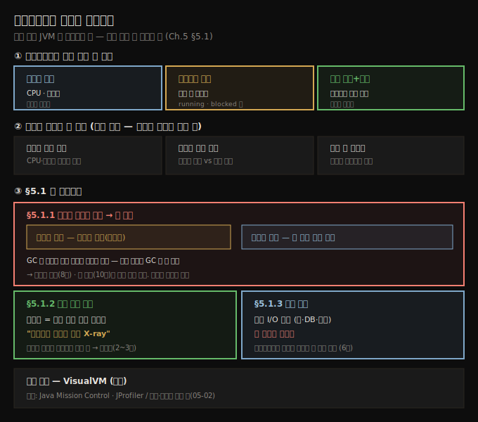

# 프로파일러는 어디에 유용한가
---
> 프로파일러는 실행 중인 JVM 프로세스를 가로채 CPU·메모리·스레드·메서드별 소요를 보여 주는 도구라, 리소스를 독식하는 코드·실제로 실행되는 코드·느린 지점을 찾는 세 상황에서 다른 불이 다 꺼졌을 때의 빛이 됩니다

이 노트는 『Troubleshooting Java』 5장의 도입부와 §5.1을 정리합니다. 5장은 책의 2부 첫 장으로, 디버거(2~3장)·로그(4장)에 이어 세 번째 조사 도구인 **프로파일러(profiler)**를 꺼냅니다. 저자는 5장을 여는 제사(題詞)로 갈라드리엘이 프로도에게 에아렌딜의 별빛을 건네는 장면을 인용합니다 — "다른 모든 빛이 꺼졌을 때 어둠 속에서 당신을 비추는 빛이 되기를." 프로파일러가 에아렌딜의 빛만큼 강력하진 않더라도, 다른 빛이 다 꺼진 막막한 상황에서 분명한 빛이 되어 준다는 비유입니다. 이 편에서는 프로파일러가 *무엇을 보여 주는지*와, 그것이 *어떤 세 상황*에서 하루를 구하는지를 봅니다. 실제 *설치·사용*은 다음 편(05-02)으로 이어집니다.

## 1. 프로파일러란 무엇인가 — JVM을 가로채 보여 주는 세 가지
> 프로파일러는 실행 중인 JVM 프로세스를 가로채 리소스 소비·스레드 상태·실행 코드와 그 소요를 드러내므로, 코드만 읽어서는 안 보이는 동작을 눈으로 확인하게 해 줍니다

프로파일러는 실행 중인 JVM 프로세스를 가로채(intercept) 다른 방법으로는 짚기 어려운 문제의 원인을 알려 주는 도구입니다. 저자는 프로파일러 사용법을 모든 개발자의 필수 역량으로 꼽습니다. 가망 없어 보이는 문제의 원인까지 안내해 주기 때문입니다. 프로파일러가 보여 주는 정보는 다음 세 가지입니다.

- 앱이 **CPU·메모리 같은 리소스를 어떻게 소비**하는지
- **실행 중인 스레드와 그 현재 상태**
- **실행 중인 코드와 그 코드가 쓴 리소스**(예: 각 메서드의 실행 시간)

이 책에서는 무료 프로파일러인 **VisualVM**을 예제 도구로 씁니다(저자가 여러 해 써 온 도구입니다). VisualVM만 있는 것은 아니고, 잘 알려진 다른 도구로 **Java Mission Control**과 **JProfiler**가 있습니다. 도구를 실제로 설치·설정하는 법은 다음 편에서 다룹니다.

## 2. 프로파일러가 하루를 구하는 세 상황
> 프로파일러는 리소스를 독식하는 코드 찾기·일하는 코드와 노는 코드 가려내기·느린 앱의 멈춘 지점 짚기라는 세 상황에서 쓰이며, 셋 모두 "코드만 읽어서는 모를 때"가 공통 전제입니다

§5.1은 프로파일러가 도움이 되는 상황을 세 갈래로 정리합니다.

- **리소스를 독식하는 코드 잡기(catching resource hogs)** — 앱이 이유 없이 느려질 때, 메모리나 CPU를 과하게 쓰는 부분을 찾아냅니다. 파티에서 간식을 혼자 다 먹어 치우는 손님 같은 코드입니다.
- **게으른 코드 찾기(finding lazy code)** — 어느 부분이 실제로 일하고 어느 부분이 그냥 놀고 있는지 모를 때, 어떤 조각이 실행되고 어떤 조각에 손이 필요한지 보여 줍니다.
- **느린 앱 고치기(fixing slow apps)** — 앱이 달리지 못하고 기어갈 때, 어디서 막혔는지 찾아 사용자가 불평하기 전에(혹은 운에 따라 불평한 뒤에) 속도를 올립니다.

세 상황의 공통점은 *코드만 읽어서는 답이 안 나온다*는 점입니다. 이어지는 §5.1.1~5.1.3이 각 상황을 구체적인 사례로 풀어 줍니다.

## 3. 비정상 리소스 사용 — 스레드 문제와 메모리 누수
> 앱의 리소스 소비를 관찰하면 동시성 결함에서 오는 스레드 문제와, 안 쓰는 참조를 못 버려 생기는 메모리 누수라는 두 범주로 좁혀지며, GC가 있어도 참조 제거는 개발자 책임입니다

프로파일러는 앱이 CPU·메모리를 어떻게 쓰는지 파악하는 데 흔히 쓰이고, 이것이 그런 문제를 조사하는 첫 단계입니다. 리소스 소비를 관찰하면 보통 두 범주의 문제로 이어집니다.

- **스레드 관련 문제** — 대개 동기화가 없거나 잘못되어 생기는 동시성(concurrency) 문제
- **메모리 누수(memory leak)** — 앱이 더는 필요 없는 데이터를 메모리에서 제거하지 못해, 실행이 느려지고 끝내 완전히 실패할 수 있는 상황

저자는 두 유형 모두 실무에서 원치 않을 만큼 자주 겪었다고 합니다. 그 영향은 다양해서, 어떤 경우엔 앱이 굼떠지는 데 그치지만 어떤 경우엔 앱이 통째로 죽습니다.

저자가 "가장 기억에 남는" 스레드 문제는 모바일 기기의 배터리 문제였습니다. 느려짐이 가장 큰 문제가 아니라, 사용자들이 이 Android 앱을 쓰면 기기 배터리가 비정상적으로 빨리 닳는다고 불평했습니다. 한참 관찰한 끝에, 앱이 쓰는 라이브러리 하나가 때때로 스레드를 만들어 놓고 아무 일도 안 하면서 시스템 리소스만 소비하게 두는 것을 발견했습니다. 모바일 앱에서 CPU 사용은 곧 배터리 소비로 나타납니다. 이런 문제를 발견하면 **스레드 덤프(8장)**로 더 파고들 수 있고, 근본 원인은 보통 스레드의 잘못된 동기화입니다.

메모리 누수도 가끔 마주칩니다. 대부분 누수의 최종 결과는 `OutOfMemoryError`이고, 이것이 앱 크래시로 이어집니다. 그래서 앱이 죽었다는 말을 들으면 저자는 으레 메모리 문제를 의심합니다.

> **GC가 있어도 참조 제거는 개발자 책임입니다.** JVM에는 더는 쓰지 않는 데이터를 메모리에서 자동으로 비우는 메커니즘인 **가비지 컬렉터(garbage collector, GC)**가 있지만, 불필요한 데이터에 대한 *모든 참조를 없애는 것*은 여전히 개발자의 몫입니다. 객체가 더는 필요 없는데도 참조를 붙들어 두면, GC는 그것이 안 쓰이는 줄 몰라 제거하지 않습니다. 이 상황이 메모리 누수입니다. 누수를 *식별*하는 법은 05-03(§5.2.3)에서, 근본 원인을 **힙 덤프(10장)**로 파헤치는 법은 뒤 장에서 다룹니다.

## 4. 실행 코드 찾기 — 스파게티 코드를 위한 X-ray
> 샘플링은 실행 중인 코드를 몰래 들여다봐 무엇이 돌아가는지 단서를 주므로, 클래스 설계가 없는 엉킨 레거시에서 어디서부터 봐야 할지 모를 때 시작점을 짚어 줍니다

저자는 컨설턴트로서 크고 복잡하고 지저분한 코드베이스와 씨름한 적이 많습니다. 특정 기능을 조사해야 하는데, 문제는 재현할 수 있어도 *어느 코드가 범인인지*는 짐작조차 안 가는 상황입니다.

한 기억에 남는 사례는, 중요한 프로세스를 돌리는 레거시 앱을 한 개발자에게 통째로 맡겼다가 그 사람이 문서 한 줄, 메모 한 장 없이 떠난 경우였습니다. 코드를 처음 본 순간은 당혹스러웠습니다. 클래스 설계라 할 것이 없었고, Java와 Scala가 뒤섞인 데다 Java 리플렉션까지 곁들여져 혼란을 한 겹 더했습니다. 옷장을 열었더니 온갖 언어와 프레임워크가 쏟아져 나오는 느낌이었습니다.

이럴 때 프로파일러가 돋보기를 든 탐정처럼 등장합니다. 프로파일러는 실행 중인 코드를 **샘플링(sampling)**할 수 있습니다 — 실제로 무엇이 실행되는지 몰래 엿보는 것입니다. 도구가 메서드를 가로채 뒤에서 무슨 일이 벌어지는지 시각적으로 보여 주어, 추적을 시작할 빵부스러기를 건넵니다. 실행 중인 코드를 짚고 나면 그제야 들어가 읽고, 끝내 큰 무기인 **디버거(2~3장)**를 부릅니다.

샘플링의 묘미는 산더미 같은 코드를 파헤치지 않고도 무엇이 도는지 드러낸다는 데 있습니다. 코드가 너무 엉키고 지저분해 어떤 함수가 호출되는지조차 모를 때 살아나는 기능이라, 저자는 이를 **"스파게티 코드를 위한 X-ray 투시"**라고 부릅니다.

## 5. 느림 식별 — I/O 의심에서 출발하되 단정하지 않는다
> 성능 문제의 핵심 질문은 무엇이 실행을 지연시키는가이고, 개발자는 흔히 I/O를 의심하지만 늘 그렇진 않아, 프로파일러가 각 부분의 리소스 사용을 재 병목을 짚어 줍니다

성능 문제를 다뤄야 하는 상황은 많고, 그때의 핵심 질문은 "무엇이 실행을 지연시키는가?"입니다. 개발자는 흔히 **I/O 연산**과 관련된 코드를 먼저 의심합니다. 웹 서비스 호출, 데이터베이스 연결, 파일 쓰기 같은 동작은 앱에서 지연의 흔한 원천입니다.

다만 I/O 연산이 *늘* 느림의 원인은 아닙니다. 설령 원인이라 해도, 코드베이스에 깊이 익숙하지 않으면(대개 그렇습니다) 정확한 문제를 짚기는 어렵습니다. 다행히 프로파일러가 이 일을 한결 쉽게 해 줍니다. 실행 중인 코드를 가로채 각 부분이 쓰는 리소스를 재서 성능 병목을 짚어 줍니다. 이 능력은 **6장**에서 자세히 다룹니다.

## 6. 면접 한 줄 정리
> 프로파일러가 어디에 유용한지 핵심을 한 문장으로 점검합니다

- **프로파일러란?** 실행 중인 JVM 프로세스를 가로채 ① CPU·메모리 소비 ② 스레드와 그 상태 ③ 실행 코드와 메서드별 소요를 보여 주는 도구입니다. 코드만 읽어서는 안 보이는 동작을 눈으로 확인하게 해 줍니다.
- **프로파일러가 쓰이는 세 상황은?** 리소스를 독식하는 코드 찾기, 일하는 코드와 노는 코드 가려내기, 느린 앱의 멈춘 지점 짚기 — 셋 다 "코드만 읽어서는 모를 때"가 전제입니다.
- **비정상 리소스 사용은 어느 두 범주로 좁혀지나?** 동시성 결함에서 오는 스레드 문제와, 안 쓰는 참조를 못 버려 생기는 메모리 누수입니다.
- **GC가 있는데 왜 메모리 누수가 나나?** GC는 *참조가 없는* 데이터만 회수합니다. 객체가 필요 없어졌는데도 참조를 붙들어 두면 GC가 못 치워 누수가 됩니다 — 참조 제거는 개발자 책임입니다.
- **샘플링은 무엇이고 언제 쓰나?** 실행 중인 코드를 몰래 들여다보는 기능으로, 클래스 설계가 없는 엉킨 코드에서 어디서부터 디버깅할지 모를 때 시작점을 짚어 줍니다("스파게티 코드를 위한 X-ray").
- **느림은 무엇부터 의심하나?** 흔히 I/O(웹 서비스·DB·파일)를 의심하지만 늘 원인은 아닙니다. 프로파일러로 각 부분의 리소스 사용을 재 병목을 가립니다.

## 관련 문서
- [이 책 인덱스 (Troubleshooting Java MOC)](./README.md) — 장별 정독 노트 진척
- [로그가 일으키는 세 가지 문제](./04-03.로그가%20일으키는%20세%20가지%20문제.md) — 4장 마지막 편. 로그 다음으로 프로파일러가 등장하는 맥락
- [VisualVM 설치와 CPU·스레드 관찰](./05-02.VisualVM%20설치와%20CPU·스레드%20관찰.md) — 이 프로파일러를 실제로 설치·사용해 리소스 소비를 보는 법
