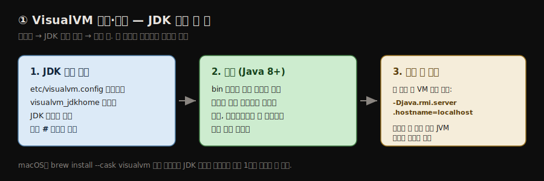
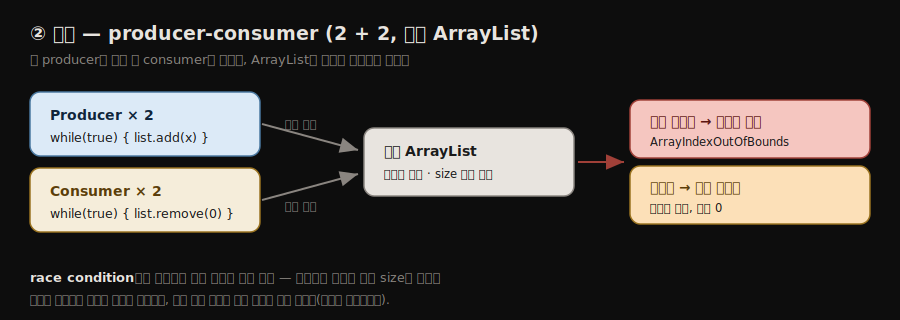
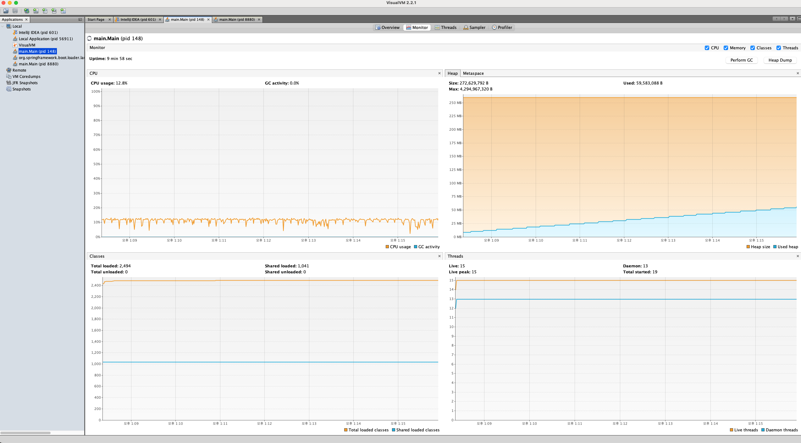
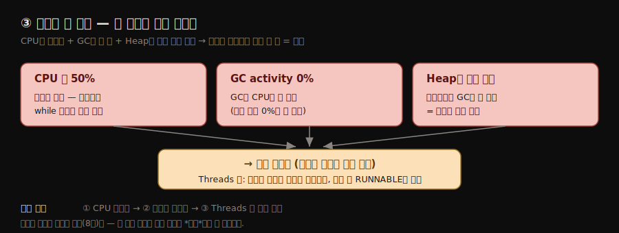
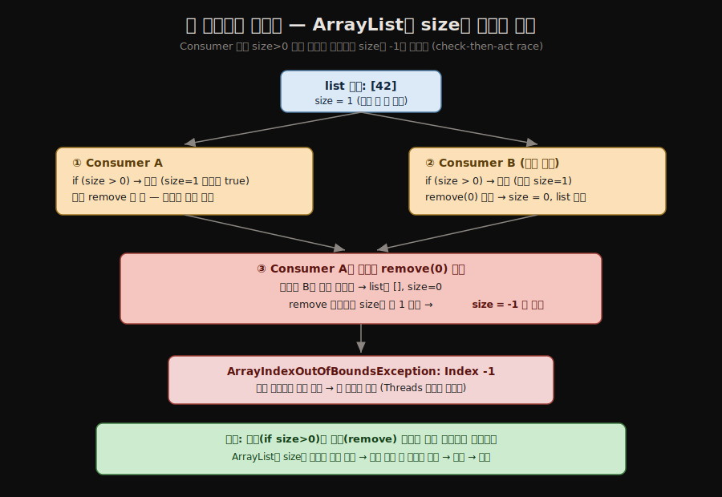
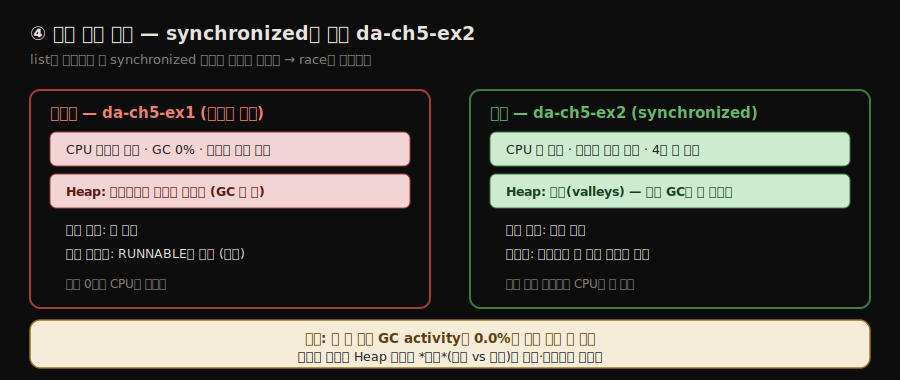
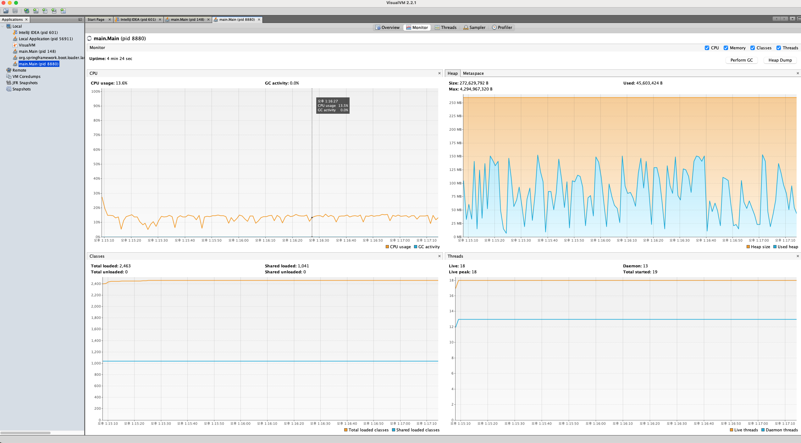

# VisualVM 설치와 CPU·스레드 관찰
---
> VisualVM은 JDK 경로만 잡아 주면 도는 무료 프로파일러이고, Monitor 탭의 CPU·메모리 위젯과 Threads 탭으로 정상 앱과 동시성 문제를 겪는 앱을 눈으로 가려냅니다.


## 1. VisualVM 설치와 설정 — JDK 경로 한 줄

> VisualVM은 OS별 배포본을 받아 설정 파일에서 JDK 경로를 잡고 주석을 풀면 바로 도는데, 로컬 프로세스에 못 붙으면 VM 인자로 호스트명을 명시해 해결합니다



> **macOS에서는 Homebrew로 간단히 설치합니다.** `brew install --cask visualvm` 한 줄이면 `/Applications/VisualVM.app`에 깔리고, `open -a VisualVM`으로 켭니다. 이 경우 JDK 경로는 보통 자동으로 잡혀 아래 `visualvm.config` 수정 없이도 로컬 프로세스가 바로 보입니다. 프로세스가 안 보일 때만 아래 설정·연결 트러블슈팅을 적용합니다.
>
> 관찰은 CLI 도구로 보조합니다. JDK의 `jps`로 실행 중 프로세스의 PID를 찾고, `jstack <PID>`로 스레드 상태를 텍스트 덤프로 봅니다 — VisualVM Threads 탭이 보여 주는 것을 글로 보는 셈이라, GUI와 교차검증할 때 유용합니다.

VisualVM 설치는 단순합니다. 공식 사이트(`https://visualvm.github.io/download.html`)에서 OS에 맞는 버전을 받은 뒤, VisualVM이 쓸 JDK 위치만 제대로 잡아 주면 됩니다. VisualVM 폴더의 `etc/visualvm.config`에서 `visualvm_jdkhome` 변수에 시스템의 JDK 경로를 지정하고, 그 줄 앞의 `#`을 지워 주석을 풉니다. VisualVM은 Java 8 이상에서 동작합니다.

```text
visualvm_jdkhome="C:\Program Files\Java\openjdk-17\jdk-17"
```

- JDK 위치를 설정한 뒤에는 설치 폴더의 `bin`에 있는 실행 파일로 VisualVM을 켭니다. 설정이 맞으면 앱이 뜨고, 환영 화면 왼쪽에 조사할 수 있는 로컬 프로세스 목록이 보입니다. 
- Java 앱(예: da-ch5-ex1)을 IDE나 콘솔에서 시작하면 VisualVM 왼쪽에 프로세스가 나타납니다 — 프로세스에 별도 이름을 주지 않았으면 보통 메인 클래스 이름으로 표시됩니다. 프로세스 이름을 더블클릭하면 그 프로세스 조사용 탭이 새로 열립니다.

> **연결이 안 될 때 — `-Djava.rmi.server.hostname=localhost`**: VisualVM이 여러 이유로 로컬 프로세스에 못 붙는 경우가 있습니다. 그럴 땐 먼저, 프로파일링할 앱을 시작할 때 VM 인자로 도메인 이름을 명시해 봅니다.

```text
-Djava.rmi.server.hostname=localhost
```

이 인자를 더해도 안 되면, 설정한 JVM 배포판이 VisualVM이 지원하는 목록(사이트의 download 섹션)에 드는지 확인합니다. 미지원 JVM 배포판도 같은 증상의 원인이 됩니다.


## 2. 예제 앱 — producer-consumer와 race condition
> 두 producer가 리스트에 값을 넣고 두 consumer가 빼는 구조인데, ArrayList가 동시성 컬렉션이 아니라 동기화 없이 동시에 접근하면 race condition에 빠집니다

이 노트 2절이 다루는 첫 예제 da-ch5-ex1은 단순합니다. 두 스레드가 리스트에 값을 계속 더하고(producer), 다른 두 스레드가 그 값을 계속 빼냅니다(consumer). 

이 구현을 흔히 **producer-consumer** 패턴이라 부르며, 멀티스레드 설계에서 자주 보입니다.

```java
// listing 5.1 — producer 스레드: 리스트에 값을 더한다
public class Producer extends Thread {

  private Logger log = Logger.getLogger(Producer.class.getName());

  @Override
  public void run() {
    Random r = new Random();
    while (true) {
      if (Main.list.size() < 100) {        // 리스트 최대 크기 제한
        int x = r.nextInt();
        Main.list.add(x);                   // 무작위 값을 리스트에 추가
        log.info("Producer " + Thread.currentThread().getName() +
                 " added value " + x);
      }
    }
  }

}
```

```java
// listing 5.2 — consumer 스레드: 리스트에서 값을 뺀다
public class Consumer extends Thread {

  private Logger log = Logger.getLogger(Consumer.class.getName());

  @Override
  public void run() {
    while (true) {
      if (Main.list.size() > 0) {          // 리스트에 값이 있는지 확인
        int x = Main.list.get(0);
        Main.list.remove(0);                // 값이 있으면 첫 값을 제거
        log.info("Consumer " + Thread.currentThread().getName() +
                 " removed value " + x);
      }
    }
  }
}
```

```java
// listing 5.3 — Main: producer 2개 + consumer 2개를 만들어 시작한다
public class Main {

  public static List<Integer> list = new ArrayList<>();   // 무작위 값을 담을 리스트

  public static void main(String[] args) {
    new Producer().start();    // producer·consumer 스레드 시작
    new Producer().start();
    new Consumer().start();
    new Consumer().start();
  }
}
```

- 이 앱은 멀티스레드 아키텍처를 *잘못* 구현했습니다. 여러 스레드가 `ArrayList` 타입 리스트에 동시에 접근하고 변경하는데, `ArrayList`는 Java의 동시성 컬렉션이 아니라 스레드 접근을 스스로 관리하지 않습니다. 
- 여러 스레드가 이 컬렉션에 접근하면 **race condition**에 빠질 수 있습니다. race condition은 여러 스레드가 같은 자원에 접근하려 경쟁하는 상황, 곧 같은 자원을 향해 *경주(race)*하는 상황입니다.



- da-ch5-ex1은 스레드 동기화가 없어, 실행하면 일부 스레드는 race condition이 일으킨 예외로 곧 멈추고, 나머지는 아무 일도 안 하면서 영원히 살아 있습니다(좀비 스레드). 
- 클래스가 셋뿐이라 코드만 읽어도 문제를 짚을 수 있지만, 이는 프로파일러에 집중하도록 단순화한 예제일 뿐입니다. 실제 앱은 더 복잡해 적절한 도구 없이는 문제를 짚기가 훨씬 어렵습니다.


## 3. 비정상 앱 진단 — CPU 50% + GC 0% + 메모리 0
> 앱이 멈춘 듯 보여도 VisualVM은 뒤에서 도는 활동을 드러내며, CPU를 많이 쓰는데 GC와 메모리가 거의 0이면 "일은 안 하면서 자원만 태우는" 좀비 스레드 신호입니다

앱이 멈춘 것처럼 보여도 VisualVM은 뒤에서 벌어지는 활동을 드러냅니다. 원인을 밝히는 순서는 세 단계입니다.

1. **프로세스 CPU 사용률 확인** — 숨은 루프나 비효율적 백그라운드 처리로 조용히 CPU를 태우는지 본다.
2. **프로세스 메모리 사용량 확인** — 메모리 누수나 과도한 할당이 느려짐·멈춤의 원인인지 본다.
3. **실행 중 스레드 시각 조사** — 멈췄거나 막혔거나 좀비가 된 스레드를 짚는다.

프로세스 이름을 더블클릭한 뒤 **Monitor 탭**을 열면 CPU 사용률 위젯이 보입니다. 

- da-ch5-ex1은 약 **50% CPU**를 쓰는데, 이 값에 **GC는 전혀 기여하지 않습니다**. 이 위젯은 가비지 컬렉터(GC)가 쓰는 CPU 양도 함께 보여 주는데, GC가 CPU를 많이 쓰면 메모리 할당에 문제(메모리 누수)가 있다는 신호일 수 있습니다. 그런데 이 경우 GC가 CPU를 전혀 안 씁니다.
- 이 역시 좋은 신호가 아닙니다. 즉 앱이 처리 능력을 많이 쓰면서도 아무것도 처리하지 않는다는 뜻이고, 보통 **좀비 스레드**를 가리킵니다.

다음으로 CPU 위젯 옆의 메모리 위젯을 봅니다. 자세한 내용은 다음 편에서 다루지만, 지금 주목할 점은 앱이 **메모리를 거의 안 쓴다**는 것입니다. 이 또한 "앱이 아무것도 안 한다"는 말과 같아 좋은 신호가 아닙니다. 이 두 위젯만으로 동시성 문제를 겪고 있을 가능성이 높다고 결론지을 수 있습니다.

> **세 신호의 해석(책 기준)**: CPU ~50%로 *살아는 있는데* + GC 0%(메모리 정리도 안 함) + 메모리 거의 0(아무것도 안 담음) → "자원은 태우면서 일은 안 한다" → 좀비 스레드(동시성 문제의 흔한 결과).

**다만 "GC 0%"와 "메모리 0"을 *절대 숫자*로 읽으면 실측과 어긋납니다.** 직접 돌려 보면 두 가지가 책 설명과 달랐습니다. 첫째, GC activity는 좀비(깨진 앱)든 정상(고친 앱)이든 *둘 다* 0.0%로 찍혀서, GC 숫자 하나로는 정상·비정상이 안 갈립니다. 둘째, 메모리도 "0"이 아니라 깨진 앱조차 Heap이 완만히 우상향했습니다(JIT·모니터링 인프라가 미미하게 할당하기 때문).

그래서 세 신호는 *절대값*이 아니라 **관계와 그래프 모양**으로 읽어야 합니다. 핵심은 **"Heap이 차오르는데도 GC가 깎아 내리지 않는다"**는 것입니다

- 정상 앱이라면 객체가 쌓일 때 GC가 주기적으로 청소해 Heap에 톱니(valley)가 생기는데, 좀비는 그 톱니가 없이 우상향이거나 평평합니다. 
- 즉 좀비의 진짜 표식은 "메모리를 안 쓴다"가 아니라 **"CPU는 태우는데, Heap에 GC가 깎은 흔적(톱니)이 없고, 앱 로그도 멈춰 있다"**입니다. 같은 GC 0%를 두 앱이 어떻게 다르게 보이는지는 4절에서 화면으로 나란히 비교합니다.

이 세 신호가 실제 VisualVM Monitor 화면에 그대로 찍힙니다. da-ch5-ex1을 띄우고 Monitor 탭을 연 모습입니다.



- 좌상단 CPU 위젯이 `CPU usage 12.8%`인데 `GC activity 0.0%`입니다(저자 환경의 50%와 절대값은 다르지만 "과한 CPU + GC 0%"는 같은 신호). 
- 우상단 Heap(`Used heap`, 파란 영역)은 한 방향으로 천천히 오르기만 하고(GC가 안 깎으니까), 우하단 Threads도 죽을 스레드가 다 죽은 뒤라 평평합니다. 아래 개념도는 이 세 신호가 좀비로 모이는 흐름을 정리한 것입니다.



**Monitor 탭 옆 Threads 탭**은 실행 중 스레드와 그 상태를 시각적으로 보여 줍니다. 

- 이 예에서는 앱이 시작한 네 스레드가 모두 running 상태로 실행 중입니다. Threads 탭은 JVM이 시작한 스레드까지 포함해 모든 프로세스 스레드를 보여 주므로, 주의 깊게 볼 스레드를 가려내고 나중에 스레드 덤프로 더 깊이 조사할 대상을 짚기 쉽습니다.

동시성 문제의 결과는 다양해서, 모든 스레드가 살아남는 것은 아닙니다. 때로는 동시 접근이 예외를 일으켜 일부 또는 전체 스레드를 중단시킵니다. 실행 중 다음과 같은 예외가 날 수 있습니다.

```Java
Exception in thread "Thread-1"
java.lang.ArrayIndexOutOfBoundsException:
Index -1 out of bounds for length 109
    at java.base/java.util.ArrayList.add(ArrayList.java:487)
    at java.base/java.util.ArrayList.add(ArrayList.java:499)
    at main.Producer.run(Producer.java:16)
```

- 이런 예외가 나면 일부 스레드가 멈추고 Threads 탭에 표시되지 않습니다. 동시 접근이 세 스레드에서 예외를 일으켜 멈추고 한 스레드만 살아남는 경우도 있습니다 
- 멀티스레드 앱의 동시성 문제는 이렇게 서로 다른 결과를 냅니다. 정확한 원인은 스레드 덤프(8장)로 밝히지만, 이 편의 초점은 *리소스 소비 문제를 발견*하는 데 있습니다.

### 3.1 코드 흐름으로 보는 좀비 — 왜 생기고 왜 안 죽나

좀비 스레드가 *어떻게* 생기는지는 Consumer·Producer 코드를 줄 단위로 따라가면 또렷해집니다. 핵심은 `ArrayList`가 내부에 `size` 변수 하나로 크기를 추적하는데, 여러 스레드가 동기화 없이 이 변수를 동시에 건드린다는 점입니다.

좀비가 생기는 과정은 세 국면으로 나뉩니다.

1. **정상 동작** — Producer가 `list.add(x)`로 값을 넣고 Consumer가 `list.remove(0)`로 빼며 잘 주고받습니다. 아직 두 스레드의 타이밍이 정확히 겹치지 않은 구간입니다.
2. **race로 인한 사망** — Consumer 두 개가 거의 동시에 `if (list.size() > 0)`를 통과한 뒤, 한쪽이 먼저 `remove(0)`로 마지막 원소를 빼 `size`를 0으로 만듭니다.
   - 그 직후 다른 쪽도 `remove(0)`를 실행하면 내부 `size`가 `-1`로 깨지고, 다음 접근에서 `Index -1 out of bounds` 예외가 터져 그 스레드가 죽습니다. 
   - Producer의 `add`도 같은 깨진 내부 상태에서 배열 인덱스가 어긋나 죽습니다. 이것이 *확인(check)과 실행(act) 사이*에 다른 스레드가 끼어드는 **check-then-act race**입니다.
3. **좀비 생존** — 운 좋게 예외를 피한 스레드 하나가 살아남습니다. 
   - 그런데 Producer가 모두 죽었다면 리스트에 더는 값이 들어오지 않으므로, 살아남은 Consumer의 `if (list.size() > 0)`은 영원히 false입니다. 
   - 그래도 `while (true)`는 멈추지 않으므로, 이 스레드는 **빈 리스트를 확인하는 한 줄(`Consumer.java:12`)만 초당 수백만 번 반복**합니다.

스레드가 *죽는* 결정적 순간은 다음 그림 한 장으로 압축됩니다. Consumer 둘이 `size > 0` 확인을 통과하는 *사이*에 서로 끼어들어, `ArrayList`의 내부 `size`를 음수로 만드는 흐름입니다.



이 과정을 실제 로그가 그대로 증언합니다. 정상 동작이 한 줄씩 이어지다, 마지막 순간 세 스레드가 거의 동시에 예외로 죽는 전환점이 찍힙니다(da-ch5-ex1을 약 3초 실행해 파일로 받은 로그).

```java
정보: Consumer Thread-2 removed value -597692578     ← 아직 정상
정보: Consumer Thread-3 removed value -1105126169    ← 아직 정상
정보: Producer Thread-1 added value -1105126169      ← 아직 정상
Exception in thread "Thread-2"                       ← 여기서 끊긴다
Exception in thread "Thread-1" java.lang.ArrayIndexOutOfBoundsException: Index -1 out of bounds for length 22
	at java.base/java.util.ArrayList.add(ArrayList.java:467)
	at main.Producer.run(Producer.java:16)            ← Producer는 add 에서 사망
java.lang.ArrayIndexOutOfBoundsException: Index -1 out of bounds for length 22
	at java.base/java.util.ArrayList.fastRemove(ArrayList.java:642)
	at main.Consumer.run(Consumer.java:14)            ← Consumer는 remove 에서 사망
```

- 스택이 정체를 확정해 줍니다 — `Thread-N`이라는 이름이 아니라 `at main.Producer.run` / `at main.Consumer.run` 줄이 누가 Producer이고 누가 Consumer인지 알려 줍니다. 
- 사망 위치도 다릅니다. Producer는 `Producer.java:16`(`list.add`)에서, Consumer는 `Consumer.java:14`(`list.remove(0)`)에서 같은 깨진 `size` 때문에 죽습니다.

**왜 하필 `Index -1`인가**가 핵심입니다. `ArrayList`는 내부에서 `size` 변수로 크기를 추적하는데, 두 스레드가 동기화 없이 거의 동시에 `remove`하면 한쪽이 size를 0으로 만든 직후 다른 쪽이 또 1을 빼 **size가 -1**이 됩니다. 그 음수로 배열에 접근하니 `Index -1 out of bounds`가 터지는 것입니다.

**그런데 왜 일부는 안 죽고 좀비가 되나.** 운 좋게 그 충돌 타이밍을 피한 스레드 하나는 예외를 안 만나 살아남습니다. 그런데 Producer가 모두 죽으면 리스트에 값이 영영 안 들어오므로, 살아남은 Consumer의 `if (size() > 0)`은 늘 false입니다. 그래도 `while (true)`는 멈추지 않아, 이 스레드는 **빈 리스트를 확인하는 한 줄(`Consumer.java:12`)만 초당 수백만 번 반복**합니다. 예외를 만나야 죽는데 만나지 않고, 스스로 끝나지도 않으니 영원히 남는 좀비입니다. 실측에서 이 좀비는 639초를 사는 동안 577초(약 90%)의 CPU를 태웠고, 그동안 로그는 한 줄도 더 찍지 않았습니다 — *바쁘게 아무것도 안 하는* 상태입니다.

### 3.2 실습으로 확인한 것 — VisualVM 화면의 함정 셋

이 예제를 VisualVM으로 직접 관찰하면 노트가 단순화한 지점 몇 군데를 보정하게 됩니다. 세 가지가 특히 중요합니다.

**(1) "메모리 0"이라는 숫자보다 "GC 0%"와 Heap 모양이 본질입니다.** 

- 노트는 좀비 앱이 메모리를 거의 안 쓴다고 설명하지만, 위 실측 화면의 Heap은 한 방향으로 완만히 우상향했습니다(예: 5MB → 59MB). 
- 좀비 코드가 객체를 만드는 게 아니라, JIT 컴파일러와 모니터링 인프라가 미미하게 할당하기 때문입니다. 
- 그러니 *메모리 절대량*에 속지 말고 두 가지를 봅니다 — **GC activity가 0%**(청소할 만큼 안 쌓임)이고, **Heap에 톱니가 없다**(GC가 깎질 않음)는 점입니다. 정상으로 일하는 앱이라면 이 Heap이 톱니로 오르내리는데, 그 대비는 4절에서 고친 앱과 나란히 봅니다.

**(2) 이 위젯들은 어떻게 측정될까 — JMX입니다.** 

- VisualVM은 그래프를 **JMX(Java Management Extensions)** 로 그립니다. JVM은 자기 내부 상태(힙 사용량·GC 횟수와 시간·스레드 목록·로드된 클래스 수)를 `MemoryMXBean`·`ThreadMXBean` 같은 표준 MXBean으로 항상 노출하는데, VisualVM이 실행 중 프로세스에 attach해 이 값을 주기적으로 폴링해 그래프로 그립니다. 
- 그래서 앱 코드를 한 줄도 안 고치고, 로그도 건드리지 않고 *밖에서* 관찰만 할 수 있습니다 — CPU·GC·메모리·스레드 위젯이 전부 JVM이 스스로 보고하는 계측값입니다.

**(3) 로그 폭주는 도구를 죽입니다 — 역할을 나눕니다.** 

- `while (true)`가 초당 수만 줄의 로그를 쏟으면(실측 6초에 약 2.3만 줄), 그 로그를 콘솔에 실시간 렌더링하는 IDE는 메모리 폭발로 강제 종료됩니다. 
- 해결은 **도구의 역할을 나누는** 것입니다.

| 보려는 것 | 쓰는 도구 | 이유 |
|-----------|----------|------|
| 로그(race 발생·사망 *과정*) | 터미널 + 파일 리다이렉트(`> race.log`) | 콘솔은 폭주로 죽음. 파일은 멈춰서 정독 가능 |
| CPU·GC·메모리·스레드(좀비 *결과*) | VisualVM | 실행 중 프로세스에 *밖에서 붙어* 관찰만 함 |

VisualVM은 앱을 실행하지 않고 *이미 도는 프로세스에 attach* 하므로, 로그는 앱을 띄운 터미널로 가고 VisualVM은 관찰만 합니다. 그래서 둘이 충돌하지 않습니다 — 좀비는 원래 로그도 안 찍으니, 진단에 필요한 건 로그가 아니라 CPU·스레드 신호입니다.

### 3.3 jstack으로 교차검증 — "몇 개 살고 몇 개 죽었나"

VisualVM Threads 탭은 *살아있는* 스레드만 보여 주고, 로그의 `Exception in thread`는 *죽은* 스레드를 기록합니다. 둘을 `jstack`으로 교차하면 정확한 생존·사망 수를 확정할 수 있습니다.

```bash
# 1) 실행 중 프로세스 PID 찾기
jps                                   # main.Main 의 PID 확인

# 2) 살아남은 우리 스레드만 — 이름·상태·어느 코드에서 도는지
jstack <PID> | grep -E -A3 '"Thread-[0-9]'

# 3) 죽은 스레드는 로그에서 (jstack에는 안 보임)
grep "Exception in thread" race.log
```

- 읽는 법은 **개수의 차**입니다. 시작은 Producer 2 + Consumer 2 = 4개인데, jstack에 `Thread-N`이 1개만 보이면 나머지 3개는 죽은 것입니다(죽은 스레드는 jstack 목록에서 사라집니다). 
- 각 스레드의 정체는 이름이 아니라 **스택의 `at main.Producer.run` / `at main.Consumer.run`** 으로 확정합니다 — `Thread-0`이라는 이름은 JVM이 생성 순서로 붙인 번호일 뿐입니다. 살아남은 스레드의 `cpu=...ms`와 `elapsed=...s`를 비교하면(예: 639초 중 577초) 좀비가 CPU를 얼마나 헛되이 태우는지 숫자로 드러납니다.


## 4. 정상 앱과 비교 — synchronized로 고친 da-ch5-ex2
> da-ch5-ex2는 리스트 인스턴스를 모니터로 삼아 접근을 동기화해 race condition을 없앴고, 정상 앱은 CPU가 낮고 메모리를 일부 쓰며 GC 활동(valleys)이 보입니다



da-ch5-ex2는 같은 앱의 수정본입니다. consumer·producer 양쪽에 `synchronized` 블록을 더해 동시 접근을 막고 race condition을 없앴습니다. 동기화 블록의 스레드 **모니터(monitor)**로는 `list` 인스턴스를 썼습니다.

```java
// listing 5.4 — consumer 접근 동기화
public class Consumer extends Thread {

  private Logger log = Logger.getLogger(Consumer.class.getName());

  public Consumer(String name) {
    super(name);
  }

  @Override
  public void run() {
    while (true) {
      synchronized (Main.list) {            // list 인스턴스를 모니터로 접근 동기화
        if (Main.list.size() > 0) {
          int x = Main.list.get(0);
          Main.list.remove(0);
          log.info("Consumer " +
              Thread.currentThread().getName() +
              " removed value " + x);
        }
      }
    }
  }
}
```

```java
// listing 5.5 — producer 접근 동기화
public class Producer extends Thread {

  private Logger log = Logger.getLogger(Producer.class.getName());

  public Producer(String name) {
    super(name);
  }

  @Override
  public void run() {
    Random r = new Random();
    while (true) {
      synchronized (Main.list) {            // list 인스턴스를 모니터로 접근 동기화
        if (Main.list.size() < 100) {
          int x = r.nextInt();
          Main.list.add(x);
          log.info("Producer " +
              Thread.currentThread().getName() +
              " added value " + x);
        }
      }
    }
  }

}
```

- 저자는 각 스레드에 **커스텀 이름**도 줬습니다. 앞 예제에서 JVM이 준 기본 이름 `Thread-0`·`Thread-1` 같은 것은 특정 스레드를 식별하기에 마땅치 않습니다. 
- 저자는 식별이 쉽도록 스레드에 직접 이름을 붙이길 권하고, 정렬이 쉽도록 이름을 밑줄(`_`)로 시작합니다. Consumer·Producer에 생성자를 정의해 `super()`로 이름을 넘기고(listing 5.4·5.5), Main에서 이름을 줍니다.

```java
// listing 5.6 — 스레드에 커스텀 이름 부여
public class Main {

  public static List<Integer> list = new ArrayList<>();

  public static void main(String[] args) {
    new Producer("_Producer 1").start();
    new Producer("_Producer 2").start();
    new Consumer("_Consumer 1").start();
    new Consumer("_Consumer 2").start();
  }
}
```

이 앱을 시작하면 da-ch5-ex1과 달리 콘솔에 로그가 *계속* 찍히고 멈추지 않습니다. VisualVM으로 보면 CPU 사용률 위젯은 앱이 CPU를 **덜** 쓰고, 메모리 위젯은 실행 중 할당된 메모리를 *일부 사용*함을 보여 줍니다. GC 활동도 관찰되는데, 메모리 그래프 오른쪽의 **골짜기(valleys)**가 GC 활동의 결과입니다(다음 편에서 자세히 다룹니다).

Threads 탭을 보면 모니터가 때때로 스레드를 막아, `synchronized` 블록을 한 번에 한 스레드만 통과시킵니다. 스레드가 연속해서 돌지 않으므로 앱이 CPU를 덜 씁니다. 이름이 밑줄로 시작하므로 이름순 정렬로 스레드를 묶어 볼 수 있습니다.

> **Note**: `synchronized` 블록을 더해도, 일부 실행 코드(`while` 조건)는 여전히 블록 *밖*에 있습니다. 이 때문에 스레드가 여전히 동시에 도는 것처럼 보일 수 있습니다.

| 관찰 지점 | 비정상 (da-ch5-ex1) | 정상 (da-ch5-ex2) |
|-----------|---------------------|-------------------|
| CPU | 약 50% (살아만 있음) | 더 낮음 |
| GC CPU | 0% (정리 안 함) | 활동 있음(valleys) |
| 메모리 | 거의 0 (아무것도 안 담음) | 일부 사용 |
| Threads | 4개 running 또는 일부 예외 사망 | 모니터가 교대로 통과시킴 |
| 콘솔 | 곧 멈춤(예외) | 로그 계속 출력 |

이 비교를 실제 VisualVM Monitor 화면으로 확인하면, 3절의 깨진 앱과 정반대 그림이 나옵니다. 고친 앱(da-ch5-ex2)을 띄운 모습입니다.



- Heap(`Used heap`, 파란 영역)이 50~150MB 사이를 **톱니로 오르내립니다** — 객체가 차면(상승) Young GC가 치우는(급락) 게 반복되는, 정상으로 일하는 앱의 모습입니다. 스레드도 18개가 살아 있어(우리 스레드 4개가 다 생존) 그래프가 깨진 앱보다 높습니다. 3절 깨진 앱 화면의 평평한 Heap과 나란히 두면 차이가 한눈에 보입니다.


### 4.1 같은 GC 0%인데 정상·비정상을 가리는 법

위 두 화면(깨진 앱·고친 앱)에 이 편에서 가장 미묘한 함정이 있습니다. **깨진 앱과 고친 앱이 둘 다 `GC activity 0.0%`로 같게 표시될 수 있습니다.** 이 숫자만 보면 구별이 안 됩니다.

| 구분 | GC activity | Heap 모양 | 의미 |
|------|------------|-----------|------|
| 깨진 앱(좀비) | 0.0% | 평평하거나 완만한 우상향 | GC가 *안 돎* — 일을 안 함 |
| 고친 앱(정상) | 0.0% | 톱니(valleys, 찼다 줄었다 반복) | Young GC가 *자주·빨리 돎* — 건강 |

- 고친 앱의 톱니는 Young GC가 너무 빨라 CPU %로는 0에 가깝게 잡힐 뿐, 실제로는 끊임없이 객체를 만들고 치우는 *살아 일하는 앱*의 심장박동입니다. 그래서 **숫자(GC %)가 아니라 Heap 그래프의 모양**이 정상·비정상을 가릅니다.

스레드 상태에서도 차이가 드러납니다. 고친 앱을 `jstack`으로 보면 네 스레드가 모두 살아 있되, 대부분이 `RUNNABLE`이 아니라 `waiting for monitor entry`(모니터 진입 대기) 상태입니다.

```text
"_Producer 1" ... waiting for monitor entry     ← 차례 대기 (CPU 안 씀)
"_Producer 2" ... waiting for monitor entry     ← 차례 대기
"_Consumer 1" ... runnable                       ← 단 하나만 블록 안에서 실행
"_Consumer 2" ... waiting for monitor entry     ← 차례 대기
```

`synchronized (Main.list)`가 한 번에 한 스레드만 블록을 통과시키므로, 나머지는 자물쇠(모니터) 차례를 기다리며 잠듭니다. 좀비의 `RUNNABLE`(CPU 태우며 헛돎)과 달리, 정상 앱의 `waiting for monitor entry`는 **차례를 기다리며 CPU를 쓰지 않습니다** — 같은 "살아 있음"이라도 질이 정반대입니다.


## 5. 면접 한 줄 정리
> VisualVM 설치와 CPU·스레드 관찰의 핵심을 한 문장으로 점검합니다

- **VisualVM 설치의 핵심 한 가지는?** `etc/visualvm.config`의 `visualvm_jdkhome`에 JDK 경로를 지정하고 `#` 주석을 푸는 것입니다(Java 8+).
- **로컬 프로세스에 연결이 안 되면?** 앱 시작 시 VM 인자 `-Djava.rmi.server.hostname=localhost`를 더하고, 그래도 안 되면 JVM 배포판이 VisualVM 지원 목록에 드는지 확인합니다.
- **왜 ArrayList에서 race condition이 나나?** `ArrayList`는 동시성 컬렉션이 아니라 스레드 접근을 스스로 관리하지 않아, 동기화 없이 여러 스레드가 접근·변경하면 같은 자원을 향해 경주하게 됩니다.
- **좀비 스레드의 VisualVM 신호는?** CPU는 쓰는데(살아는 있음) + GC가 깎은 흔적이 없음(Heap이 톱니 없이 우상향·평평) + 앱 로그도 멈춤 → 자원은 태우면서 일은 안 함 → 동시성 문제의 흔한 결과인 좀비 스레드입니다. (책은 "GC 0% + 메모리 0"으로 설명하지만, 실측에선 정상 앱도 GC 0%라 *Heap 모양*으로 가려야 합니다.)
- **GC CPU 사용량이 알려 주는 것은?** GC가 CPU를 많이 쓰면 메모리 누수·과도한 할당을 의심합니다. 다만 GC가 0%라고 곧장 "아무것도 안 함"은 아닙니다 — 정상 앱도 Young GC가 빨라 0%로 잡히므로, Heap에 깎인 톱니가 있는지로 구별합니다.
- **좀비 스레드는 왜 안 죽나?** 예외를 만나야 죽는데 좀비는 예외를 피했고, `while (true)`라 스스로 끝나지도 않습니다. Producer가 모두 죽어 리스트가 영원히 비면 Consumer의 `if (size() > 0)`은 늘 false라 할 일이 없는데도, 그 한 줄을 무한 반복하며 CPU만 태웁니다.
- **GC activity가 둘 다 0%면 정상·비정상을 어떻게 가리나?** 숫자만으로는 못 가립니다 — Heap 그래프 *모양*을 봅니다. 평평하거나 완만한 우상향이면 GC가 안 도는 좀비, 톱니(valleys)면 Young GC가 자주·빨리 돌아 CPU %로 0에 가깝게 잡힐 뿐 실제로는 일하는 정상 앱입니다.
- **로그를 콘솔로 보면 안 되는 이유는?** `while (true)`가 초당 수만 줄을 쏟으면 콘솔을 렌더링하는 IDE가 메모리 폭발로 죽습니다. 로그는 터미널에서 파일로 받고, CPU·스레드 진단은 프로세스에 attach하는 VisualVM으로 나눠 봅니다.
- **어떻게 고치나?** 공유 자원(`list`)을 모니터로 한 `synchronized` 블록으로 접근을 직렬화합니다. 다만 `while` 조건처럼 블록 밖 코드는 여전히 동시처럼 보일 수 있습니다.


## 관련 문서
- [이 책 인덱스 (Troubleshooting Java MOC)](./README.md) — 장별 정독 노트 진척
- [프로파일러는 어디에 유용한가](./05-01.프로파일러는%20어디에%20유용한가.md) — 프로파일러가 보여 주는 세 가지와 비정상 리소스 사용의 두 범주
- [메모리 누수와 metaspace, AI 활용](./05-03.메모리%20누수와%20metaspace,%20AI%20활용.md) — 메모리 위젯의 peaks/valleys로 누수를 식별하고 metaspace까지 보는 법
