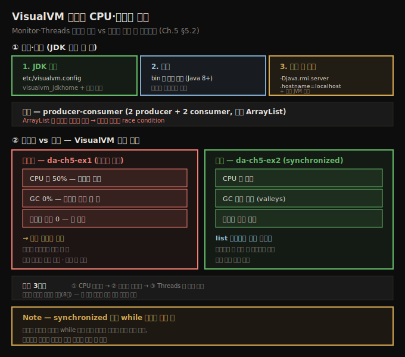
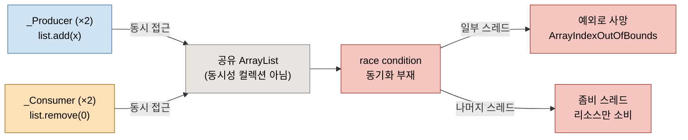
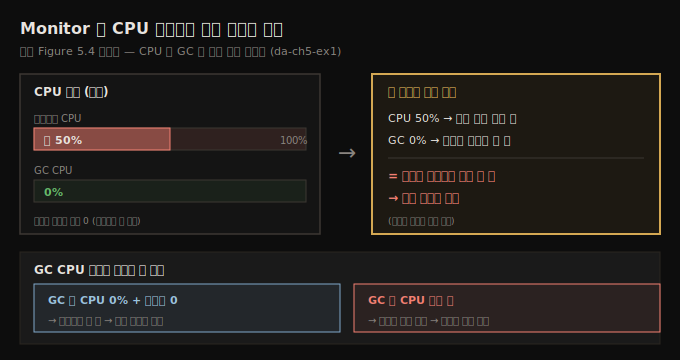

# VisualVM 설치와 CPU·스레드 관찰
---
> VisualVM은 JDK 경로만 잡아 주면 도는 무료 프로파일러이고, Monitor 탭의 CPU·메모리 위젯과 Threads 탭으로 정상 앱과 동시성 문제를 겪는 앱을 눈으로 가려냅니다 — CPU 50%인데 GC 0%·메모리 0이면 좀비 스레드 신호입니다

이 노트는 『Troubleshooting Java』 5장의 §5.2.1~§5.2.2를 정리합니다. 앞 편(05-01)이 프로파일러가 *왜·어디에* 유용한지였다면, 이 편은 VisualVM을 *실제로 설치하고 써서* 리소스 소비를 관찰하는 쪽입니다. 먼저 설치·설정을 거치고, producer-consumer 예제로 동시성 문제를 겪는 앱(da-ch5-ex1)과 그것을 고친 앱(da-ch5-ex2)을 VisualVM으로 나란히 관찰해, 비정상과 정상 동작의 신호를 구별하는 법을 익힙니다. 메모리 누수와 metaspace는 다음 편(05-03)으로 이어집니다.





## 1. VisualVM 설치와 설정 — JDK 경로 한 줄
> VisualVM은 OS별 배포본을 받아 설정 파일에서 JDK 경로를 잡고 주석을 풀면 바로 도는데, 로컬 프로세스에 못 붙으면 VM 인자로 호스트명을 명시해 해결합니다

VisualVM 설치는 단순합니다. 공식 사이트(`https://visualvm.github.io/download.html`)에서 OS에 맞는 버전을 받은 뒤, VisualVM이 쓸 JDK 위치만 제대로 잡아 주면 됩니다. VisualVM 폴더의 `etc/visualvm.config`에서 `visualvm_jdkhome` 변수에 시스템의 JDK 경로를 지정하고, 그 줄 앞의 `#`을 지워 주석을 풉니다. VisualVM은 Java 8 이상에서 동작합니다.

```text
visualvm_jdkhome="C:\Program Files\Java\openjdk-17\jdk-17"
```

JDK 위치를 설정한 뒤에는 설치 폴더의 `bin`에 있는 실행 파일로 VisualVM을 켭니다. 설정이 맞으면 앱이 뜨고, 환영 화면 왼쪽에 조사할 수 있는 로컬 프로세스 목록이 보입니다. Java 앱(예: da-ch5-ex1)을 IDE나 콘솔에서 시작하면 VisualVM 왼쪽에 프로세스가 나타납니다 — 프로세스에 별도 이름을 주지 않았으면 보통 메인 클래스 이름으로 표시됩니다. 프로세스 이름을 더블클릭하면 그 프로세스 조사용 탭이 새로 열립니다.

> **연결이 안 될 때 — `-Djava.rmi.server.hostname=localhost`**: VisualVM이 여러 이유로 로컬 프로세스에 못 붙는 경우가 있습니다. 그럴 땐 먼저, 프로파일링할 앱을 시작할 때 VM 인자로 도메인 이름을 명시해 봅니다.

```text
-Djava.rmi.server.hostname=localhost
```

이 인자를 더해도 안 되면, 설정한 JVM 배포판이 VisualVM이 지원하는 목록(사이트의 download 섹션)에 드는지 확인합니다. 미지원 JVM 배포판도 같은 증상의 원인이 됩니다.


## 2. 예제 앱 — producer-consumer와 race condition
> 두 producer가 리스트에 값을 넣고 두 consumer가 빼는 구조인데, ArrayList가 동시성 컬렉션이 아니라 동기화 없이 동시에 접근하면 race condition에 빠집니다

§5.2.2의 첫 예제 da-ch5-ex1은 단순합니다. 두 스레드가 리스트에 값을 계속 더하고(producer), 다른 두 스레드가 그 값을 계속 빼냅니다(consumer). 이 구현을 흔히 **producer-consumer** 패턴이라 부르며, 멀티스레드 설계에서 자주 보입니다.

```java
// listing 5.1 — producer 스레드: 리스트에 값을 더한다
public class Producer extends Thread {

  private Logger log = Logger.getLogger(Producer.class.getName());

  @Override
  public void run() {
    Random r = new Random();
    while (true) {
      if (Main.list.size() < 100) {        // 리스트 최대 크기 제한
        int x = r.nextInt();
        Main.list.add(x);                   // 무작위 값을 리스트에 추가
        log.info("Producer " + Thread.currentThread().getName() +
                 " added value " + x);
      }
    }
  }

}
```

```java
// listing 5.2 — consumer 스레드: 리스트에서 값을 뺀다
public class Consumer extends Thread {

  private Logger log = Logger.getLogger(Consumer.class.getName());

  @Override
  public void run() {
    while (true) {
      if (Main.list.size() > 0) {          // 리스트에 값이 있는지 확인
        int x = Main.list.get(0);
        Main.list.remove(0);                // 값이 있으면 첫 값을 제거
        log.info("Consumer " + Thread.currentThread().getName() +
                 " removed value " + x);
      }
    }
  }
}
```

```java
// listing 5.3 — Main: producer 2개 + consumer 2개를 만들어 시작한다
public class Main {

  public static List<Integer> list = new ArrayList<>();   // 무작위 값을 담을 리스트

  public static void main(String[] args) {
    new Producer().start();    // producer·consumer 스레드 시작
    new Producer().start();
    new Consumer().start();
    new Consumer().start();
  }
}
```

이 앱은 멀티스레드 아키텍처를 *잘못* 구현했습니다. 여러 스레드가 `ArrayList` 타입 리스트에 동시에 접근하고 변경하는데, `ArrayList`는 Java의 동시성 컬렉션이 아니라 스레드 접근을 스스로 관리하지 않습니다. 여러 스레드가 이 컬렉션에 접근하면 **race condition**에 빠질 수 있습니다. race condition은 여러 스레드가 같은 자원에 접근하려 경쟁하는 상황, 곧 같은 자원을 향해 *경주(race)*하는 상황입니다.



da-ch5-ex1은 스레드 동기화가 없어, 실행하면 일부 스레드는 race condition이 일으킨 예외로 곧 멈추고, 나머지는 아무 일도 안 하면서 영원히 살아 있습니다(좀비 스레드). 클래스가 셋뿐이라 코드만 읽어도 문제를 짚을 수 있지만, 이는 프로파일러에 집중하도록 단순화한 예제일 뿐입니다. 실제 앱은 더 복잡해 적절한 도구 없이는 문제를 짚기가 훨씬 어렵습니다.


## 3. 비정상 앱 진단 — CPU 50% + GC 0% + 메모리 0
> 앱이 멈춘 듯 보여도 VisualVM은 뒤에서 도는 활동을 드러내며, CPU를 많이 쓰는데 GC와 메모리가 거의 0이면 "일은 안 하면서 자원만 태우는" 좀비 스레드 신호입니다

앱이 멈춘 것처럼 보여도 VisualVM은 뒤에서 벌어지는 활동을 드러냅니다. 원인을 밝히는 순서는 세 단계입니다.

1. **프로세스 CPU 사용률 확인** — 숨은 루프나 비효율적 백그라운드 처리로 조용히 CPU를 태우는지 본다.
2. **프로세스 메모리 사용량 확인** — 메모리 누수나 과도한 할당이 느려짐·멈춤의 원인인지 본다.
3. **실행 중 스레드 시각 조사** — 멈췄거나 막혔거나 좀비가 된 스레드를 짚는다.

프로세스 이름을 더블클릭한 뒤 **Monitor 탭**을 열면 CPU 사용률 위젯이 보입니다. da-ch5-ex1은 약 **50% CPU**를 쓰는데, 이 값에 **GC는 전혀 기여하지 않습니다**. 이 위젯은 가비지 컬렉터(GC)가 쓰는 CPU 양도 함께 보여 주는데, GC가 CPU를 많이 쓰면 메모리 할당에 문제(메모리 누수)가 있다는 신호일 수 있습니다. 그런데 이 경우 GC가 CPU를 전혀 안 씁니다 — 이 역시 좋은 신호가 아닙니다. 즉 앱이 처리 능력을 많이 쓰면서도 아무것도 처리하지 않는다는 뜻이고, 보통 **좀비 스레드**를 가리킵니다.

다음으로 CPU 위젯 옆의 메모리 위젯을 봅니다. 자세한 내용은 다음 편에서 다루지만, 지금 주목할 점은 앱이 **메모리를 거의 안 쓴다**는 것입니다. 이 또한 "앱이 아무것도 안 한다"는 말과 같아 좋은 신호가 아닙니다. 이 두 위젯만으로 동시성 문제를 겪고 있을 가능성이 높다고 결론지을 수 있습니다.

> **세 신호의 해석**: CPU ~50%로 *살아는 있는데* + GC 0%(메모리 정리도 안 함) + 메모리 거의 0(아무것도 안 담음) → "자원은 태우면서 일은 안 한다" → 좀비 스레드(동시성 문제의 흔한 결과).



**Monitor 탭 옆 Threads 탭**은 실행 중 스레드와 그 상태를 시각적으로 보여 줍니다. 이 예에서는 앱이 시작한 네 스레드가 모두 running 상태로 실행 중입니다. Threads 탭은 JVM이 시작한 스레드까지 포함해 모든 프로세스 스레드를 보여 주므로, 주의 깊게 볼 스레드를 가려내고 나중에 스레드 덤프로 더 깊이 조사할 대상을 짚기 쉽습니다.

동시성 문제의 결과는 다양해서, 모든 스레드가 살아남는 것은 아닙니다. 때로는 동시 접근이 예외를 일으켜 일부 또는 전체 스레드를 중단시킵니다. 실행 중 다음과 같은 예외가 날 수 있습니다.

```text
Exception in thread "Thread-1"
java.lang.ArrayIndexOutOfBoundsException:
Index -1 out of bounds for length 109
    at java.base/java.util.ArrayList.add(ArrayList.java:487)
    at java.base/java.util.ArrayList.add(ArrayList.java:499)
    at main.Producer.run(Producer.java:16)
```

이런 예외가 나면 일부 스레드가 멈추고 Threads 탭에 표시되지 않습니다. 동시 접근이 세 스레드에서 예외를 일으켜 멈추고 한 스레드만 살아남는 경우도 있습니다 — 멀티스레드 앱의 동시성 문제는 이렇게 서로 다른 결과를 냅니다. 정확한 원인은 스레드 덤프(8장)로 밝히지만, 이 편의 초점은 *리소스 소비 문제를 발견*하는 데 있습니다.


## 4. 정상 앱과 비교 — synchronized로 고친 da-ch5-ex2
> da-ch5-ex2는 리스트 인스턴스를 모니터로 삼아 접근을 동기화해 race condition을 없앴고, 정상 앱은 CPU가 낮고 메모리를 일부 쓰며 GC 활동(valleys)이 보입니다

da-ch5-ex2는 같은 앱의 수정본입니다. consumer·producer 양쪽에 `synchronized` 블록을 더해 동시 접근을 막고 race condition을 없앴습니다. 동기화 블록의 스레드 **모니터(monitor)**로는 `list` 인스턴스를 썼습니다.

```java
// listing 5.4 — consumer 접근 동기화
public class Consumer extends Thread {

  private Logger log = Logger.getLogger(Consumer.class.getName());

  public Consumer(String name) {
    super(name);
  }

  @Override
  public void run() {
    while (true) {
      synchronized (Main.list) {            // list 인스턴스를 모니터로 접근 동기화
        if (Main.list.size() > 0) {
          int x = Main.list.get(0);
          Main.list.remove(0);
          log.info("Consumer " +
              Thread.currentThread().getName() +
              " removed value " + x);
        }
      }
    }
  }
}
```

```java
// listing 5.5 — producer 접근 동기화
public class Producer extends Thread {

  private Logger log = Logger.getLogger(Producer.class.getName());

  public Producer(String name) {
    super(name);
  }

  @Override
  public void run() {
    Random r = new Random();
    while (true) {
      synchronized (Main.list) {            // list 인스턴스를 모니터로 접근 동기화
        if (Main.list.size() < 100) {
          int x = r.nextInt();
          Main.list.add(x);
          log.info("Producer " +
              Thread.currentThread().getName() +
              " added value " + x);
        }
      }
    }
  }

}
```

저자는 각 스레드에 **커스텀 이름**도 줬습니다. 앞 예제에서 JVM이 준 기본 이름 `Thread-0`·`Thread-1` 같은 것은 특정 스레드를 식별하기에 마땅치 않습니다. 저자는 식별이 쉽도록 스레드에 직접 이름을 붙이길 권하고, 정렬이 쉽도록 이름을 밑줄(`_`)로 시작합니다. Consumer·Producer에 생성자를 정의해 `super()`로 이름을 넘기고(listing 5.4·5.5), Main에서 이름을 줍니다.

```java
// listing 5.6 — 스레드에 커스텀 이름 부여
public class Main {

  public static List<Integer> list = new ArrayList<>();

  public static void main(String[] args) {
    new Producer("_Producer 1").start();
    new Producer("_Producer 2").start();
    new Consumer("_Consumer 1").start();
    new Consumer("_Consumer 2").start();
  }
}
```

이 앱을 시작하면 da-ch5-ex1과 달리 콘솔에 로그가 *계속* 찍히고 멈추지 않습니다. VisualVM으로 보면 CPU 사용률 위젯은 앱이 CPU를 **덜** 쓰고, 메모리 위젯은 실행 중 할당된 메모리를 *일부 사용*함을 보여 줍니다. GC 활동도 관찰되는데, 메모리 그래프 오른쪽의 **골짜기(valleys)**가 GC 활동의 결과입니다(다음 편에서 자세히 다룹니다).

Threads 탭을 보면 모니터가 때때로 스레드를 막아, `synchronized` 블록을 한 번에 한 스레드만 통과시킵니다. 스레드가 연속해서 돌지 않으므로 앱이 CPU를 덜 씁니다. 이름이 밑줄로 시작하므로 이름순 정렬로 스레드를 묶어 볼 수 있습니다.

> **Note**: `synchronized` 블록을 더해도, 일부 실행 코드(`while` 조건)는 여전히 블록 *밖*에 있습니다. 이 때문에 스레드가 여전히 동시에 도는 것처럼 보일 수 있습니다.

| 관찰 지점 | 비정상 (da-ch5-ex1) | 정상 (da-ch5-ex2) |
|-----------|---------------------|-------------------|
| CPU | 약 50% (살아만 있음) | 더 낮음 |
| GC CPU | 0% (정리 안 함) | 활동 있음(valleys) |
| 메모리 | 거의 0 (아무것도 안 담음) | 일부 사용 |
| Threads | 4개 running 또는 일부 예외 사망 | 모니터가 교대로 통과시킴 |
| 콘솔 | 곧 멈춤(예외) | 로그 계속 출력 |


## 5. 면접 한 줄 정리
> VisualVM 설치와 CPU·스레드 관찰의 핵심을 한 문장으로 점검합니다

- **VisualVM 설치의 핵심 한 가지는?** `etc/visualvm.config`의 `visualvm_jdkhome`에 JDK 경로를 지정하고 `#` 주석을 푸는 것입니다(Java 8+).
- **로컬 프로세스에 연결이 안 되면?** 앱 시작 시 VM 인자 `-Djava.rmi.server.hostname=localhost`를 더하고, 그래도 안 되면 JVM 배포판이 VisualVM 지원 목록에 드는지 확인합니다.
- **왜 ArrayList에서 race condition이 나나?** `ArrayList`는 동시성 컬렉션이 아니라 스레드 접근을 스스로 관리하지 않아, 동기화 없이 여러 스레드가 접근·변경하면 같은 자원을 향해 경주하게 됩니다.
- **좀비 스레드의 VisualVM 신호는?** CPU ~50%로 살아는 있는데 + GC 0% + 메모리 거의 0 → 자원은 태우면서 일은 안 함 → 동시성 문제의 흔한 결과인 좀비 스레드입니다.
- **GC CPU 사용량이 알려 주는 것은?** GC가 CPU를 많이 쓰면 메모리 누수를, 전혀 안 쓰면(메모리도 0이면) "아무것도 안 함"을 시사합니다.
- **어떻게 고치나?** 공유 자원(`list`)을 모니터로 한 `synchronized` 블록으로 접근을 직렬화합니다. 다만 `while` 조건처럼 블록 밖 코드는 여전히 동시처럼 보일 수 있습니다.


## 관련 문서
- [이 책 인덱스 (Troubleshooting Java MOC)](./README.md) — 장별 정독 노트 진척
- [프로파일러는 어디에 유용한가](./05-01.프로파일러는%20어디에%20유용한가.md) — 프로파일러가 보여 주는 세 가지와 비정상 리소스 사용의 두 범주
- [메모리 누수와 metaspace, AI 활용](./05-03.메모리%20누수와%20metaspace,%20AI%20활용.md) — 메모리 위젯의 peaks/valleys로 누수를 식별하고 metaspace까지 보는 법
